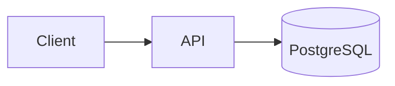
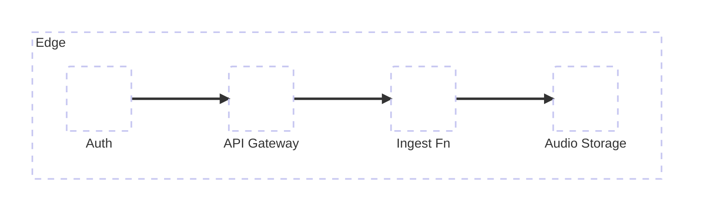

# Portfolio as Code

MkDocs Material template for a bilingual (EN/RU) systems-analyst, developer, and architect portfolio: case-study projects, assembled document packs, diagram-first architecture write-ups, and a GitHub Pages deploy.

The repository ships with a fictional demo persona and three demo projects, so a fresh clone builds into a complete, presentable site before you write a single word.

## Features

### Case studies as structured documents

* Each complex project is a folder of nine compact sections (`01`–`09`) plus `summary.md`, an `index.md` landing page, and an ADR subtree.
* `summary.md` is the single source of truth for status, role, stack, and value; every other page pulls it in via `mkdocs-include-markdown` rather than duplicating text.
* Four **assembled pages** are generated per project from the same sections, so one edit propagates everywhere:
  * `all-in-one.md` - the full case study on one page, for sequential reading or PDF export
  * `architecture-review.md` - goals, system model, architecture, operations, decisions
  * `srs-pack.md` - context through operations, in requirements-spec order
  * `demo-pack.md` - overview, role, architecture, decisions, roadmap
* Simple projects can stay a single markdown file (see `docs/en/projects/example-simple.md`).
* `scripts/portfolio.py assemblies --check` fails CI if a generated page drifts from its sources.

### Mermaid diagrams with enhanced visibility

* Diagrams are written as ordinary ` ```mermaid ` fences. `pymdownx.superfences` emits them as a custom fence instead of a highlighted code block, and `docs/javascripts/mermaid_icons.js` renders them client-side with Mermaid 11.
* Mermaid's default palette washes out against Material's content background, so `docs/css/extra.css` overrides connector strokes, arrowheads, node labels, edge labels, and `foreignObject` text to a neutral high-contrast gray, and thickens link strokes to `1.8px`.
* Rendered SVGs are centred, capped at `max-width: 100%`, and scale on narrow screens.
* A render failure produces a visible `.mermaid-error` block with the Mermaid message instead of silently collapsing to an empty space.

### AWS and vendor icon packs

Two [Iconify](https://iconify.design/)-format packs are vendored under `docs/assets/mermaid-icons/` and registered with `mermaid.registerIconPacks()` at startup for Mermaid `architecture-beta` diagrams. Vendoring keeps builds deterministic and offline for icon assets (no CDN/API fetch for the packs), works on restricted networks, and survives upstream key removal.

* **AWS** (`aws`) — AWS Architecture Icons (~867), used as `aws:lambda`, `aws:dynamodb`, `aws:api-gateway`, and so on. Iconify-compatible JSON from [awslabs/aws-icons-for-plantuml](https://github.com/awslabs/aws-icons-for-plantuml) (not published as a browsable set on [icon-sets.iconify.design](https://icon-sets.iconify.design/) because of AWS NoDerivatives licensing). Local slug catalogue: [reference/icons/aws.md](reference/icons/aws.md).
* **SVG Logos** (`logos`) — brand and tech logos (~2098), used as `logos:docker`, `logos:kubernetes`, and so on. Browse on Iconify: [SVG Logos](https://icon-sets.iconify.design/logos/). Local hub (letter indexes + sheets): [reference/icons/logos.md](reference/icons/logos.md).

`docs/en/projects/example-simple.md` is a worked Mermaid example. Packs load relative to `document.baseURI`, so the site works from a user page, a project subpath, or `mkdocs serve`.

Browseable catalogue overview: [reference/icons/README.md](reference/icons/README.md) — contact sheets under `reference/icons/sheets/` (51 SVGs, 80 icons per full sheet), Markdown indexes, and `manifest.json`. `aws` is chunked by sorted key; `logos` is grouped by initial letter then chunked. There is no one-file-per-icon output (~2965 files vs 51); byte volume is essentially unchanged because every body still appears once.

Regenerate / validate:

```bash
python scripts/portfolio.py icons generate
python scripts/portfolio.py icons check
```

The two packs are about 10 MB combined. If repository size matters more than coverage, trim `logos.json` to the icons you reference — the loader does not care how many entries the file holds.

### Bilingual by default (i18n)

* `mkdocs-static-i18n` in `docs_structure: folder` mode: English lives in `docs/en/`, Russian in `docs/ru/`, shared assets in `docs/assets/`.
* English is the default locale and builds at the site root; Russian builds under `/ru/`. A language switcher appears in the header automatically.
* `fallback_to_default: true` means a page missing a translation falls back to English rather than 404-ing, so you can translate incrementally.
* Each locale gets its own `site_name` and its own `nav` block in `mkdocs.yml`.
* Assembly generation is locale-aware: Cyrillic headings do not survive Python-Markdown's ASCII slugifier, so `scripts/assembly_toc.py` simulates the full assembled page to compute the `_2`, `_5`, … numeric anchor fallbacks that `mkdocs build --strict` expects.

### Light and dark mode

* Material's palette toggle is wired to `prefers-color-scheme`, so first-time visitors get their system preference and the manual toggle overrides it from there.
* Light uses the `default` scheme, dark uses `slate`, both on `primary: custom` / `accent: custom` so you can set brand colours in `docs/css/extra.css` without touching the theme.
* Mermaid diagrams follow the switch. A `MutationObserver` on `data-md-color-scheme` re-renders every diagram with Mermaid's matching `default` or `dark` theme, so diagrams do not stay light-themed on a dark page.

### Build and deploy

* Instant-loading navigation, sticky tabs, section indexes, anchor tracking, search highlighting and suggestions, and copy-to-clipboard on code blocks.
* `mkdocs-glightbox` turns images into a lightbox gallery; `mkdocs-minify-plugin` minifies the HTML output.
* `mkdocs build --strict` is the gate: broken internal links, bad nav entries, and missing anchors fail the build rather than shipping.
* GitHub Actions builds and publishes to Pages on every push to `main`/`master`.

## Stack

* **Python 3.10+** - the generator scripts use modern type-hint syntax.
* **[MkDocs](https://www.mkdocs.org/)** - static site generator.
* **[Material for MkDocs](https://squidfunk.github.io/mkdocs-material/)** - theme, palette toggle, navigation, search.
* **[Mermaid 11](https://mermaid.js.org/)** - diagrams, loaded from jsDelivr at runtime (not a Python dependency).
* **[Iconify](https://iconify.design/) `aws` + `logos` packs** - vendored icon sets for `architecture-beta` diagrams.

Python packages, pinned in [`requirements.txt`](requirements.txt):

* `mkdocs-material` - theme
* `mkdocs-static-i18n[material]` - EN/RU locales and the language switcher
* `mkdocs-include-markdown-plugin` - `summary.md` reuse and assembled pages
* `pymdown-extensions` - superfences, tabbed content, details, inline highlighting
* `mkdocs-glightbox` - image lightbox
* `mkdocs-minify-plugin` - HTML minification

## Repository layout

```text
docs/
  assets/            # shared across locales: demo wireframes, mermaid icon packs
  css/  javascripts/ # diagram styling and the Mermaid loader
  en/  ru/           # one folder per locale: index.md, services.md, projects/
reference/
  icons/             # generated icon catalogue (sheets, indexes, manifest)
scripts/
  portfolio.py       # init, new-project, assemblies, icons
  assembly_toc.py    # anchor-accurate contents generation
  icons.py           # contact-sheet / manifest / Markdown generator
templates/
  project-docs/      # blank EN/RU case-study skeleton copied by new-project
mkdocs.yml
```

## Quickstart

```bash
python -m venv .venv
# Windows: .venv\Scripts\activate
# macOS/Linux: source .venv/bin/activate
pip install -r requirements.txt
python scripts/portfolio.py init
```

`init` replaces the demo name, `site_url`, and `repo_url` in `mkdocs.yml` and the locale `index.md` files.

## Local preview

```bash
python scripts/portfolio.py assemblies
mkdocs serve
```

Open http://127.0.0.1:8000/. For a clean build:

```bash
python scripts/portfolio.py assemblies --check
python scripts/portfolio.py icons check
mkdocs build --strict
```

## Adding a project

Short entries can stay as a single page, e.g. `docs/en/projects/example-simple.md`.

For complex projects:

```bash
python scripts/portfolio.py new-project <slug>
```

This copies `templates/project-docs/{en,ru}` into `docs/{en,ru}/projects/<slug>/` and regenerates assemblies (`all-in-one.md`, `architecture-review.md`, `srs-pack.md`, `demo-pack.md`).

Then:

1. Fill `summary.md` and section files (`01`–`09`).
2. Register the project in both EN and RU nav blocks in `mkdocs.yml`.
3. Put demo wireframes under `docs/assets/demo/<slug>/` and link them with relative paths.

## Writing diagrams

Any fenced `mermaid` block is rendered:

````markdown

````
Result:


To use the vendored icon packs, use an `architecture-beta` diagram and prefix icon names with the pack:

````markdown

````
Result:


To add another pack, drop its Iconify JSON into `docs/assets/mermaid-icons/` and add an entry to the `registerIconPacks` call in `docs/javascripts/mermaid_icons.js`.

## Adding a locale

1. Add a language under the `i18n` plugin in `mkdocs.yml` (`docs_structure: folder`).
2. Mirror content under `docs/<locale>/` (at least `index.md`, `services.md`, and `projects/`).
3. Copy or translate `templates/project-docs/<locale>/` for new projects.
4. Rebuild assemblies and verify with `mkdocs build --strict`.

To go single-language instead, delete `docs/ru/`, drop the `i18n` plugin block from `mkdocs.yml`, and remove `mkdocs-static-i18n` from `requirements.txt`.

## Deploying to GitHub Pages

1. Push to `main` (or `master`).
2. In the repo: **Settings -> Pages -> Source: GitHub Actions**.
3. Workflow [`.github/workflows/pages.yml`](.github/workflows/pages.yml) runs the assembly and icon drift checks, `mkdocs build --strict`, and deploys the `site/` artifact. [`.github/workflows/checks.yml`](.github/workflows/checks.yml) runs the same checks plus `pytest` on pull requests and pushes.

Set `site_url` / `repo_url` in `mkdocs.yml` (or via `portfolio.py init`) to match your Pages URL, typically `https://<user>.github.io/<repo>/`.

## License

* **Code and site content in this repository** - MIT; see [LICENSE](LICENSE).
* **Third-party icon assets** (`docs/assets/mermaid-icons/`, generated sheets under `reference/icons/`) - separate upstream licenses (AWS icons: CC-BY-ND-2.0; logos: CC0-1.0). See [THIRD_PARTY_NOTICES.md](THIRD_PARTY_NOTICES.md). MIT does **not** cover those packs.
