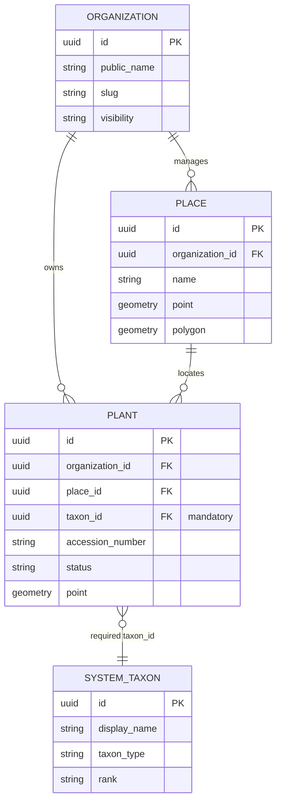

# System Model

This is the system model.

## Data Model

```mermaid
erDiagram
    ORGANIZATION ||--o{ PLANT : owns
    ORGANIZATION ||--o{ PLACE : manages
    PLANT }o--|| SYSTEM_TAXON : "required taxon_id"
    PLACE ||--o{ PLANT : locates

    ORGANIZATION {
        uuid id PK
        string public_name
        string slug
        string visibility
    }

    PLANT {
        uuid id PK
        uuid organization_id FK
        uuid place_id FK
        uuid taxon_id FK "mandatory"
        string accession_number
        string status
        geometry point
    }

    PLACE {
        uuid id PK
        uuid organization_id FK
        string name
        geometry point
        geometry polygon
    }

    SYSTEM_TAXON {
        uuid id PK
        string display_name
        string taxon_type
        string rank
    }
```
