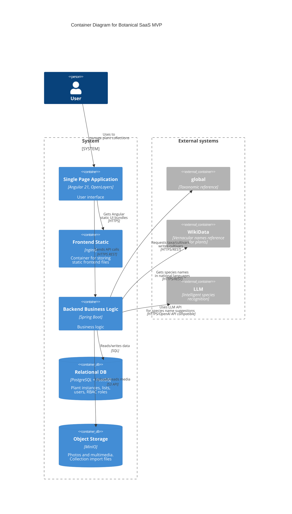

# Architecture and Integrations

This is architecture and integrations.

## Architecture

```mermaid
    C4Container
    title Container Diagram for Botanical SaaS MVP

    Person(user, "User")

    System_Boundary(sys, "System") {
      Container(spa, "Single Page Application", "Angular 21, OpenLayers", "User interface") 
      Container(static, "Frontend Static", "nginx", "Container for storing<br/> static frontend files")
      Container(backend, "Backend Business Logic", "Spring Boot", "Business logic")
      ContainerDb(reldb, "Relational DB", "PostgreSQL + PostGIS", "Plant instances, lists,<br/> users, RBAC roles")
      ContainerDb(objStore, "Object Storage", "MinIO", "Photos and multimedia.<br/> Collection import files")
    }

    Boundary(ext, "External systems", "") {
      Container_Ext(global, "global", "Taxonomic reference")
      Container_Ext(vernacular, "WikiData", "Vernacular names reference<br/> for plants")
      Container_Ext(llm, "LLM", "Intelligent species<br/> recognition")
    }

  Rel(user, spa, "Uses to<br/> manage plant collections")

  Rel(spa, static, "Gets Angular<br/> static UI bundles", "HTTPS")
  Rel(spa, backend, "Sends API calls", "HTTPS REST")

  Rel(backend, reldb, "Reads/writes data", "SQL")
  Rel(backend, objStore, "Uploads/reads media", "S3 API")

  Rel(backend, global, "Requests taxa/cultivars,<br/> writes cultivars", "HTTPS/REST")
  Rel(backend, vernacular, "Gets species names<br/> in national languages", "HTTPS/REST")
  Rel(backend, llm, "Uses LLM API<br/> for species name suggestions", "HTTPS/OpenAI API compatible")

  UpdateLayoutConfig($c4ShapeInRow="5", $c4BoundaryInRow="3")

```
