# Example Simple

*Industry: template example · short portfolio entry*

This is the example simple entry.

Example AWS architecture diagram

```mermaid
architecture-beta
    service dynamo(aws:dynamodb)[AWS DynamoDB]
    service lambda(aws:lambda)[AWS Lambda] 
    service api(aws:api-gateway)[AWS API Gateway]
    service static(aws:simple-storage-service)[Static website at Amazon S3]
    service storage(aws:simple-storage-service)[File storage at Amazon S3]
    service browser(logos:chrome)[Browser]
    service cognito(aws:cognito)[AWS Cognito]
    service ai(logos:webhooks)[Transcriber API]
    service front(aws:cloudfront)[AWS CloudFront]

    front:T --> B:static
    browser:T --> B:api
    browser:L --> R:front
    browser:B --> T:cognito

    api:R --> L:lambda
    api:T <-- B:ai
    lambda:T --> R:ai
    lambda:R --> L:dynamo
    lambda:B --> T:storage
    storage:L <-- R:browser
```

<figure markdown>

<figcaption>Demo UI screenshot</figcaption>
</figure>