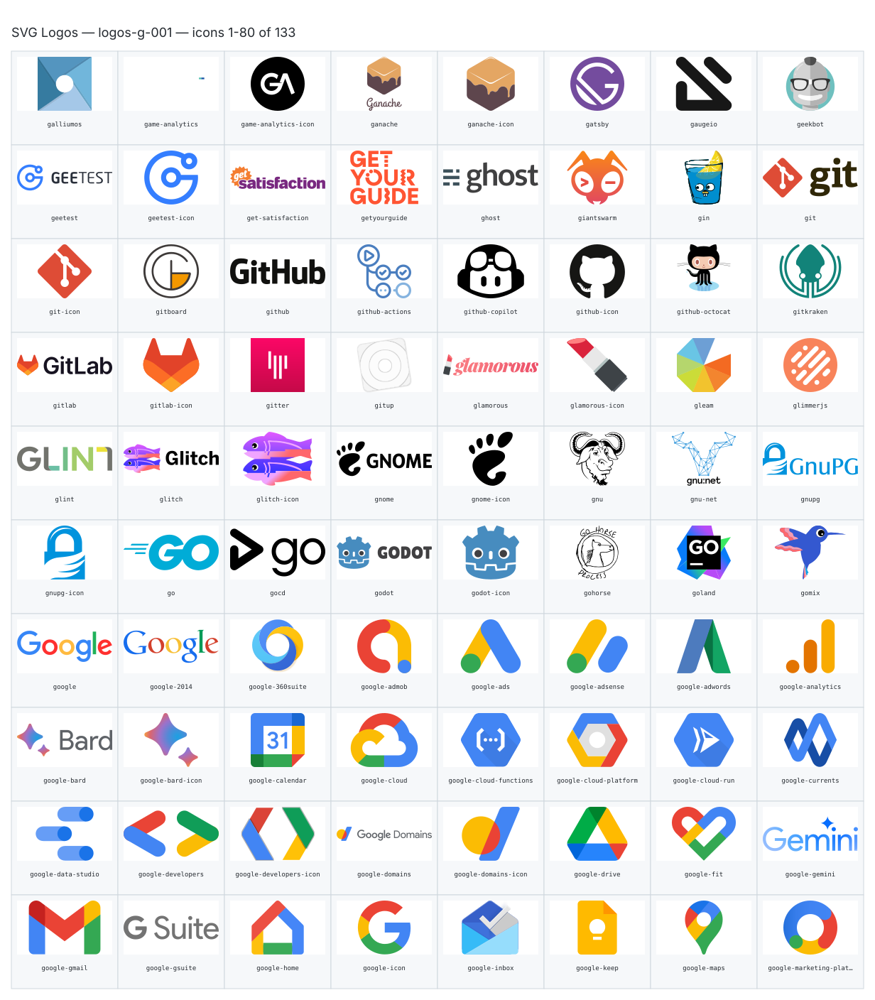
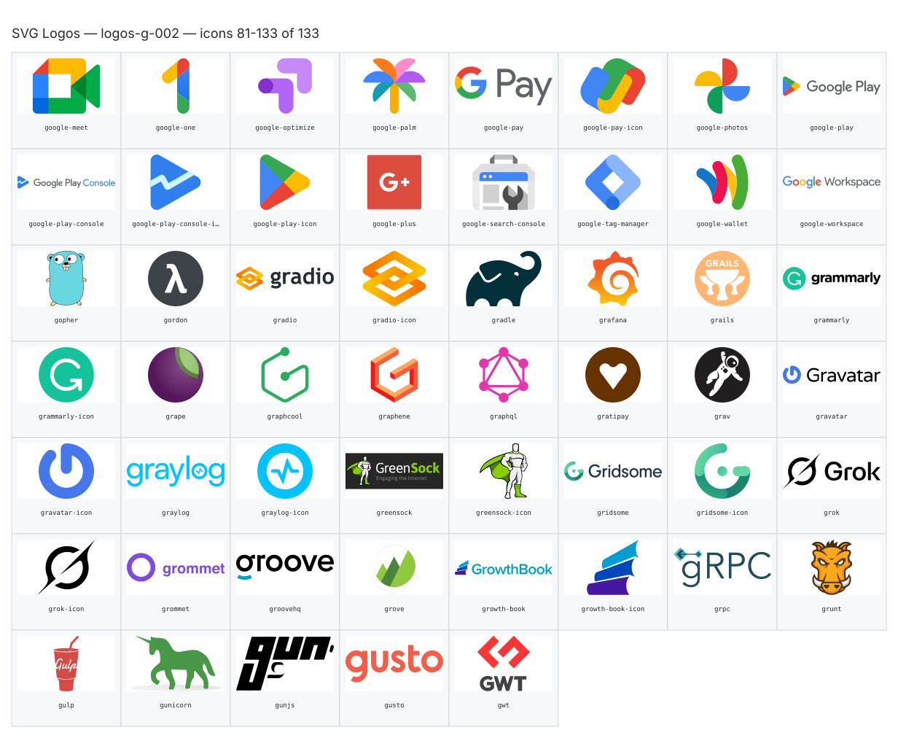
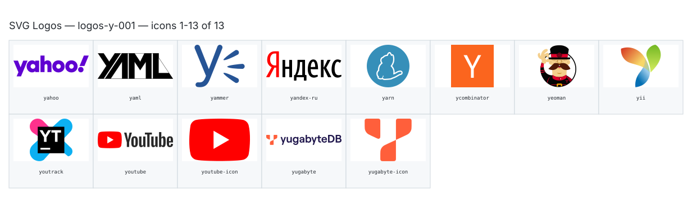

**Generated file — do not edit. Run `python scripts/portfolio.py icons generate`.**


# Icon reference

Browsable slug catalogue for Mermaid `architecture-beta` diagrams. This directory is repository-only documentation (outside `docs/`) and is **not** part of the MkDocs site.

Regenerate with `python scripts/portfolio.py icons generate`.

## Why these packs are vendored

The Iconify JSON files under `docs/assets/mermaid-icons/` are committed snapshots so site builds stay deterministic and offline for icon assets: no CDN or API fetch at build or browse time for the packs themselves, usable on restricted networks, and immune to upstream removal of a key. Refreshing a pack is an explicit maintainer action, not an automatic sync.

## Why contact sheets (not one file per icon)

Showing every icon without rasterising still needs the SVG bodies once. Per-icon previews meant ~2965 committed files; contact sheets keep the same visual coverage in **51** SVG files (80 icons per full sheet). Byte volume is essentially unchanged — that is inherent to shipping all bodies. History still holds deleted preview blobs.

## Collections

- [AWS Icons](aws.md) (`aws`) — 867 icons; upstream version `23.0`; snapshot `2026-01-30T00:00:00+00:00`; license [CC-BY-ND-2.0](https://github.com/awslabs/aws-icons-for-plantuml/blob/main/LICENSE)
- [SVG Logos](logos.md) (`logos`) — 2098 icons; upstream version not recorded; snapshot `2026-03-28T07:03:20+00:00`; license [CC0-1.0](https://raw.githubusercontent.com/gilbarbara/logos/master/LICENSE.txt)

## How sheets are grouped and chunked

- **`aws`:** all keys sorted, chunked into 80s → `sheets/aws-001.svg`, `aws-002.svg`, …
- **`logos`:** group by initial (`a`–`z`, else `0`), then chunk → `sheets/logos-<group>-<NNN>.svg`; letter indexes live under `logos/<group>.md`.

## How to read a cell coordinate

Each index bullet ends with a sheet link and a cell like `r5c1`: **0-based** `row` and `column` inside that sheet (`r0c0` is top-left). The full slug, display name, and Mermaid usage example are on the same line for `Ctrl+F` / GitHub code search.

## Sheet gallery

### AWS Icons (`aws`)

- [](sheets/aws-001.svg) — 80 icons (`activate` … `backup-recovery-point-objective`)
- [](sheets/aws-002.svg) — 80 icons (`backup-recovery-time-objective` … `cloudwatch-rule`)
- [](sheets/aws-003.svg) — 80 icons (`cloudwatch-rum` … `dynamodb-attributes`)
- [](sheets/aws-004.svg) — 80 icons (`dynamodb-global-secondary-index` … `elemental-mediastore`)
- [](sheets/aws-005.svg) — 80 icons (`elemental-mediatailor` … `healthomics`)
- [](sheets/aws-006.svg) — 80 icons (`healthscribe` … `iot-sitewise-asset-model`)
- [](sheets/aws-007.svg) — 80 icons (`iot-sitewise-asset-properties` … `managed-streaming-for-apache-kafka`)
- [](sheets/aws-008.svg) — 80 icons (`managed-workflows-for-apache-airflow` … `rds-optimized-writes`)
- [](sheets/aws-009.svg) — 80 icons (`rds-proxy-instance` … `simple-storage-service`)
- [](sheets/aws-010.svg) — 80 icons (`simple-storage-service-bucket` … `thinkbox-stoke`)
- [](sheets/aws-011.svg) — 67 icons (`thinkbox-xmesh` … `x-ray`)

### SVG Logos (`logos`)

- [](sheets/logos-0-001.svg) — 3 icons (`100tb` … `6px`)
- [](sheets/logos-a-001.svg) — 80 icons (`active-campaign` … `appbaseio-icon`)
- [](sheets/logos-a-002.svg) — 80 icons (`appcelerator` … `aws-cloudwatch`)
- [](sheets/logos-a-003.svg) — 52 icons (`aws-codebuild` … `azure-icon`)
- [](sheets/logos-b-001.svg) — 80 icons (`babel` … `builder-io`)
- [](sheets/logos-b-002.svg) — 7 icons (`builder-io-icon` … `bunny-net-icon`)
- [](sheets/logos-c-001.svg) — 80 icons (`c` … `codefactor`)
- [](sheets/logos-c-002.svg) — 80 icons (`codefactor-icon` … `cyclejs`)
- [](sheets/logos-c-003.svg) — 2 icons (`cypress` … `cypress-icon`)
- [](sheets/logos-d-001.svg) — 80 icons (`d3` … `dreamfactory`)
- [](sheets/logos-d-002.svg) — 20 icons (`dreamhost` … `dyndns`)
- [](sheets/logos-e-001.svg) — 68 icons (`eager` … `express`)
- [](sheets/logos-f-001.svg) — 71 icons (`fabric` … `fuchsia`)
- [](sheets/logos-g-001.svg) — 80 icons (`galliumos` … `google-marketing-platform`)
- [](sheets/logos-g-002.svg) — 53 icons (`google-meet` … `gwt`)
- [](sheets/logos-h-001.svg) — 73 icons (`hack` … `hyperapp`)
- [](sheets/logos-i-001.svg) — 40 icons (`ibm` … `itsalive-icon`)
- [](sheets/logos-j-001.svg) — 41 icons (`jade` … `jwt-icon`)
- [](sheets/logos-k-001.svg) — 47 icons (`kafka` … `kustomer`)
- [](sheets/logos-l-001.svg) — 58 icons (`languagetool` … `lynda`)
- [](sheets/logos-m-001.svg) — 80 icons (`macos` … `micro-python`)
- [](sheets/logos-m-002.svg) — 71 icons (`microcosm` … `myth`)
- [](sheets/logos-n-001.svg) — 61 icons (`naiveui` … `nx`)
- [](sheets/logos-o-001.svg) — 55 icons (`oauth` … `oxc-icon-dark`)
- [](sheets/logos-p-001.svg) — 80 icons (`p5js` … `postman-icon`)
- [](sheets/logos-p-002.svg) — 51 icons (`pouchdb` … `pyup`)
- [](sheets/logos-q-001.svg) — 16 icons (`q` … `qwik-icon`)
- [](sheets/logos-r-001.svg) — 80 icons (`r-lang` … `rome-icon`)
- [](sheets/logos-r-002.svg) — 15 icons (`ros` … `rxdb`)
- [](sheets/logos-s-001.svg) — 80 icons (`safari` … `snowflake-icon`)
- [](sheets/logos-s-002.svg) — 80 icons (`snowpack` … `streamlit`)
- [](sheets/logos-s-003.svg) — 43 icons (`strider` … `sysdig-icon`)
- [](sheets/logos-t-001.svg) — 80 icons (`t3` … `twilio`)
- [](sheets/logos-t-002.svg) — 13 icons (`twilio-icon` … `typo3-icon`)
- [](sheets/logos-u-001.svg) — 28 icons (`ubuntu` … `uwsgi`)
- [](sheets/logos-v-001.svg) — 46 icons (`v8` … `vwo`)
- [](sheets/logos-w-001.svg) — 69 icons (`w3c` … `wufoo`)
- [](sheets/logos-x-001.svg) — 16 icons (`x` … `xwiki-icon`)
- [](sheets/logos-y-001.svg) — 13 icons (`yahoo` … `yugabyte-icon`)
- [](sheets/logos-z-001.svg) — 26 icons (`zabbix` … `zwave`)

## Display names

Display names are a mechanical humanisation of the upstream key (split on `-`, capitalise tokens). They are approximate — acronyms and official product casing are often wrong (`Ec2`, `Cloudfront`). The slug and Mermaid usage example are authoritative.

## How to use a slug

Slug format is `<pack>:<icon-key>` (upstream key verbatim). Example:

````markdown

```mermaid
architecture-beta
    service api(aws:api-gateway)[API Gateway]
    service fn(aws:lambda)[Lambda]
    api:R --> L:fn
```

````

Find slugs in the per-collection / per-letter pages linked above, or search this folder for `aws:` / `logos:` plus a keyword.

## Licensing

Repository source is MIT; vendored icon collections and generated contact sheets are third-party works under their own terms. See [`THIRD_PARTY_NOTICES.md`](../../THIRD_PARTY_NOTICES.md).

## Deferred

Upstream sync automation, curated official display names, alias/deprecated-slug registry, fuzzy suggestions, interactive search UI, MkDocs nav integration, per-icon luminance backgrounds, and trimming packs to only referenced icons are out of scope for this iteration.
