**Generated file — do not edit. Run `python scripts/portfolio.py icons generate`.**

# AWS Icons

Collection prefix: `aws`. 867 icons across 11 contact sheets. Display names are approximate; copy the slug for Mermaid.

> **Nonstandard keys:** some upstream keys contain characters outside `[a-z0-9-]`. Slugs are reproduced verbatim and may need quoting or avoidance in Mermaid `architecture-beta` diagrams.

## aws-001

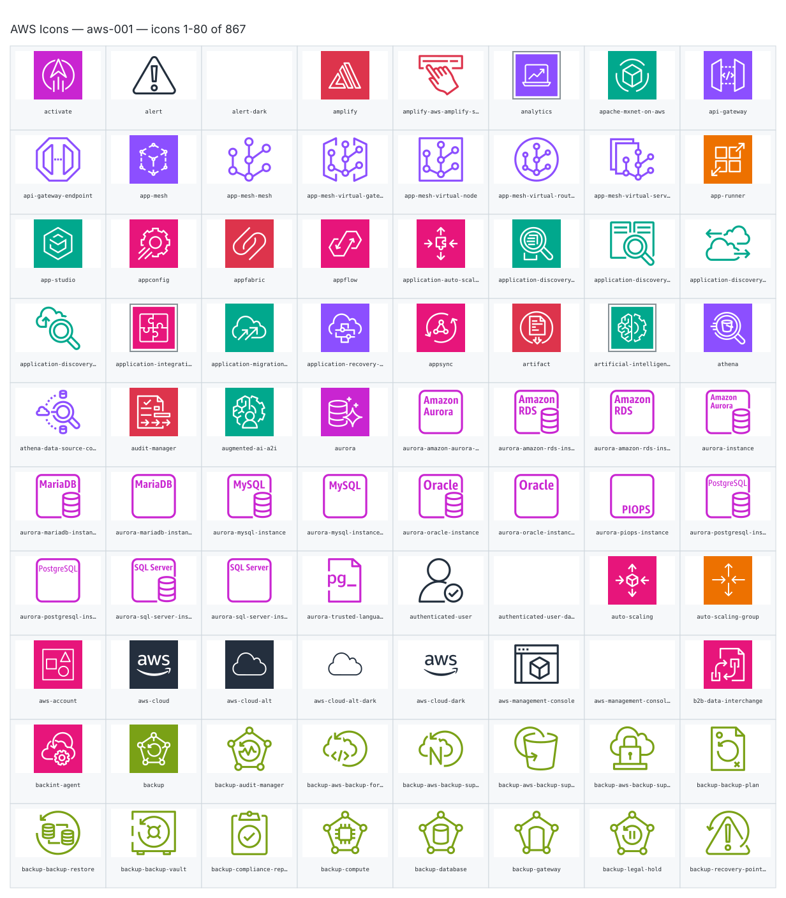

- `aws:activate` — Activate — [aws-001.svg](sheets/aws-001.svg) r0c0 — `service example(aws:activate)[Activate]`
- `aws:alert` — Alert — [aws-001.svg](sheets/aws-001.svg) r0c1 — `service example(aws:alert)[Alert]`
- `aws:alert-dark` — Alert Dark — [aws-001.svg](sheets/aws-001.svg) r0c2 — `service example(aws:alert-dark)[Alert Dark]`
- `aws:amplify` — Amplify — [aws-001.svg](sheets/aws-001.svg) r0c3 — `service example(aws:amplify)[Amplify]`
- `aws:amplify-aws-amplify-studio` — Amplify Aws Amplify Studio — [aws-001.svg](sheets/aws-001.svg) r0c4 — `service example(aws:amplify-aws-amplify-studio)[Amplify Aws Amplify Studio]`
- `aws:analytics` — Analytics — [aws-001.svg](sheets/aws-001.svg) r0c5 — `service example(aws:analytics)[Analytics]`
- `aws:apache-mxnet-on-aws` — Apache Mxnet On Aws — [aws-001.svg](sheets/aws-001.svg) r0c6 — `service example(aws:apache-mxnet-on-aws)[Apache Mxnet On Aws]`
- `aws:api-gateway` — Api Gateway — [aws-001.svg](sheets/aws-001.svg) r0c7 — `service example(aws:api-gateway)[Api Gateway]`
- `aws:api-gateway-endpoint` — Api Gateway Endpoint — [aws-001.svg](sheets/aws-001.svg) r1c0 — `service example(aws:api-gateway-endpoint)[Api Gateway Endpoint]`
- `aws:app-mesh` — App Mesh — [aws-001.svg](sheets/aws-001.svg) r1c1 — `service example(aws:app-mesh)[App Mesh]`
- `aws:app-mesh-mesh` — App Mesh Mesh — [aws-001.svg](sheets/aws-001.svg) r1c2 — `service example(aws:app-mesh-mesh)[App Mesh Mesh]`
- `aws:app-mesh-virtual-gateway` — App Mesh Virtual Gateway — [aws-001.svg](sheets/aws-001.svg) r1c3 — `service example(aws:app-mesh-virtual-gateway)[App Mesh Virtual Gateway]`
- `aws:app-mesh-virtual-node` — App Mesh Virtual Node — [aws-001.svg](sheets/aws-001.svg) r1c4 — `service example(aws:app-mesh-virtual-node)[App Mesh Virtual Node]`
- `aws:app-mesh-virtual-router` — App Mesh Virtual Router — [aws-001.svg](sheets/aws-001.svg) r1c5 — `service example(aws:app-mesh-virtual-router)[App Mesh Virtual Router]`
- `aws:app-mesh-virtual-service` — App Mesh Virtual Service — [aws-001.svg](sheets/aws-001.svg) r1c6 — `service example(aws:app-mesh-virtual-service)[App Mesh Virtual Service]`
- `aws:app-runner` — App Runner — [aws-001.svg](sheets/aws-001.svg) r1c7 — `service example(aws:app-runner)[App Runner]`
- `aws:app-studio` — App Studio — [aws-001.svg](sheets/aws-001.svg) r2c0 — `service example(aws:app-studio)[App Studio]`
- `aws:appconfig` — Appconfig — [aws-001.svg](sheets/aws-001.svg) r2c1 — `service example(aws:appconfig)[Appconfig]`
- `aws:appfabric` — Appfabric — [aws-001.svg](sheets/aws-001.svg) r2c2 — `service example(aws:appfabric)[Appfabric]`
- `aws:appflow` — Appflow — [aws-001.svg](sheets/aws-001.svg) r2c3 — `service example(aws:appflow)[Appflow]`
- `aws:application-auto-scaling2` — Application Auto Scaling2 — [aws-001.svg](sheets/aws-001.svg) r2c4 — `service example(aws:application-auto-scaling2)[Application Auto Scaling2]`
- `aws:application-discovery-service` — Application Discovery Service — [aws-001.svg](sheets/aws-001.svg) r2c5 — `service example(aws:application-discovery-service)[Application Discovery Service]`
- `aws:application-discovery-service-aws-agentless-collector` — Application Discovery Service Aws Agentless Collector — [aws-001.svg](sheets/aws-001.svg) r2c6 — `service example(aws:application-discovery-service-aws-agentless-collector)[Application Discovery Service Aws Agentless Collector]`
- `aws:application-discovery-service-aws-discovery-agent` — Application Discovery Service Aws Discovery Agent — [aws-001.svg](sheets/aws-001.svg) r2c7 — `service example(aws:application-discovery-service-aws-discovery-agent)[Application Discovery Service Aws Discovery Agent]`
- `aws:application-discovery-service-migration-evaluator-collector` — Application Discovery Service Migration Evaluator Collector — [aws-001.svg](sheets/aws-001.svg) r3c0 — `service example(aws:application-discovery-service-migration-evaluator-collector)[Application Discovery Service Migration Evaluator Collector]`
- `aws:application-integration` — Application Integration — [aws-001.svg](sheets/aws-001.svg) r3c1 — `service example(aws:application-integration)[Application Integration]`
- `aws:application-migration-service` — Application Migration Service — [aws-001.svg](sheets/aws-001.svg) r3c2 — `service example(aws:application-migration-service)[Application Migration Service]`
- `aws:application-recovery-controller` — Application Recovery Controller — [aws-001.svg](sheets/aws-001.svg) r3c3 — `service example(aws:application-recovery-controller)[Application Recovery Controller]`
- `aws:appsync` — Appsync — [aws-001.svg](sheets/aws-001.svg) r3c4 — `service example(aws:appsync)[Appsync]`
- `aws:artifact` — Artifact — [aws-001.svg](sheets/aws-001.svg) r3c5 — `service example(aws:artifact)[Artifact]`
- `aws:artificial-intelligence` — Artificial Intelligence — [aws-001.svg](sheets/aws-001.svg) r3c6 — `service example(aws:artificial-intelligence)[Artificial Intelligence]`
- `aws:athena` — Athena — [aws-001.svg](sheets/aws-001.svg) r3c7 — `service example(aws:athena)[Athena]`
- `aws:athena-data-source-connectors` — Athena Data Source Connectors — [aws-001.svg](sheets/aws-001.svg) r4c0 — `service example(aws:athena-data-source-connectors)[Athena Data Source Connectors]`
- `aws:audit-manager` — Audit Manager — [aws-001.svg](sheets/aws-001.svg) r4c1 — `service example(aws:audit-manager)[Audit Manager]`
- `aws:augmented-ai-a2i` — Augmented Ai A2i — [aws-001.svg](sheets/aws-001.svg) r4c2 — `service example(aws:augmented-ai-a2i)[Augmented Ai A2i]`
- `aws:aurora` — Aurora — [aws-001.svg](sheets/aws-001.svg) r4c3 — `service example(aws:aurora)[Aurora]`
- `aws:aurora-amazon-aurora-instance-alternate` — Aurora Amazon Aurora Instance Alternate — [aws-001.svg](sheets/aws-001.svg) r4c4 — `service example(aws:aurora-amazon-aurora-instance-alternate)[Aurora Amazon Aurora Instance Alternate]`
- `aws:aurora-amazon-rds-instance` — Aurora Amazon Rds Instance — [aws-001.svg](sheets/aws-001.svg) r4c5 — `service example(aws:aurora-amazon-rds-instance)[Aurora Amazon Rds Instance]`
- `aws:aurora-amazon-rds-instance-alternate` — Aurora Amazon Rds Instance Alternate — [aws-001.svg](sheets/aws-001.svg) r4c6 — `service example(aws:aurora-amazon-rds-instance-alternate)[Aurora Amazon Rds Instance Alternate]`
- `aws:aurora-instance` — Aurora Instance — [aws-001.svg](sheets/aws-001.svg) r4c7 — `service example(aws:aurora-instance)[Aurora Instance]`
- `aws:aurora-mariadb-instance` — Aurora Mariadb Instance — [aws-001.svg](sheets/aws-001.svg) r5c0 — `service example(aws:aurora-mariadb-instance)[Aurora Mariadb Instance]`
- `aws:aurora-mariadb-instance-alternate` — Aurora Mariadb Instance Alternate — [aws-001.svg](sheets/aws-001.svg) r5c1 — `service example(aws:aurora-mariadb-instance-alternate)[Aurora Mariadb Instance Alternate]`
- `aws:aurora-mysql-instance` — Aurora Mysql Instance — [aws-001.svg](sheets/aws-001.svg) r5c2 — `service example(aws:aurora-mysql-instance)[Aurora Mysql Instance]`
- `aws:aurora-mysql-instance-alternate` — Aurora Mysql Instance Alternate — [aws-001.svg](sheets/aws-001.svg) r5c3 — `service example(aws:aurora-mysql-instance-alternate)[Aurora Mysql Instance Alternate]`
- `aws:aurora-oracle-instance` — Aurora Oracle Instance — [aws-001.svg](sheets/aws-001.svg) r5c4 — `service example(aws:aurora-oracle-instance)[Aurora Oracle Instance]`
- `aws:aurora-oracle-instance-alternate` — Aurora Oracle Instance Alternate — [aws-001.svg](sheets/aws-001.svg) r5c5 — `service example(aws:aurora-oracle-instance-alternate)[Aurora Oracle Instance Alternate]`
- `aws:aurora-piops-instance` — Aurora Piops Instance — [aws-001.svg](sheets/aws-001.svg) r5c6 — `service example(aws:aurora-piops-instance)[Aurora Piops Instance]`
- `aws:aurora-postgresql-instance` — Aurora Postgresql Instance — [aws-001.svg](sheets/aws-001.svg) r5c7 — `service example(aws:aurora-postgresql-instance)[Aurora Postgresql Instance]`
- `aws:aurora-postgresql-instance-alternate` — Aurora Postgresql Instance Alternate — [aws-001.svg](sheets/aws-001.svg) r6c0 — `service example(aws:aurora-postgresql-instance-alternate)[Aurora Postgresql Instance Alternate]`
- `aws:aurora-sql-server-instance` — Aurora Sql Server Instance — [aws-001.svg](sheets/aws-001.svg) r6c1 — `service example(aws:aurora-sql-server-instance)[Aurora Sql Server Instance]`
- `aws:aurora-sql-server-instance-alternate` — Aurora Sql Server Instance Alternate — [aws-001.svg](sheets/aws-001.svg) r6c2 — `service example(aws:aurora-sql-server-instance-alternate)[Aurora Sql Server Instance Alternate]`
- `aws:aurora-trusted-language-extensions-for-postgresql` — Aurora Trusted Language Extensions For Postgresql — [aws-001.svg](sheets/aws-001.svg) r6c3 — `service example(aws:aurora-trusted-language-extensions-for-postgresql)[Aurora Trusted Language Extensions For Postgresql]`
- `aws:authenticated-user` — Authenticated User — [aws-001.svg](sheets/aws-001.svg) r6c4 — `service example(aws:authenticated-user)[Authenticated User]`
- `aws:authenticated-user-dark` — Authenticated User Dark — [aws-001.svg](sheets/aws-001.svg) r6c5 — `service example(aws:authenticated-user-dark)[Authenticated User Dark]`
- `aws:auto-scaling` — Auto Scaling — [aws-001.svg](sheets/aws-001.svg) r6c6 — `service example(aws:auto-scaling)[Auto Scaling]`
- `aws:auto-scaling-group` — Auto Scaling Group — [aws-001.svg](sheets/aws-001.svg) r6c7 — `service example(aws:auto-scaling-group)[Auto Scaling Group]`
- `aws:aws-account` — Aws Account — [aws-001.svg](sheets/aws-001.svg) r7c0 — `service example(aws:aws-account)[Aws Account]`
- `aws:aws-cloud` — Aws Cloud — [aws-001.svg](sheets/aws-001.svg) r7c1 — `service example(aws:aws-cloud)[Aws Cloud]`
- `aws:aws-cloud-alt` — Aws Cloud Alt — [aws-001.svg](sheets/aws-001.svg) r7c2 — `service example(aws:aws-cloud-alt)[Aws Cloud Alt]`
- `aws:aws-cloud-alt-dark` — Aws Cloud Alt Dark — [aws-001.svg](sheets/aws-001.svg) r7c3 — `service example(aws:aws-cloud-alt-dark)[Aws Cloud Alt Dark]`
- `aws:aws-cloud-dark` — Aws Cloud Dark — [aws-001.svg](sheets/aws-001.svg) r7c4 — `service example(aws:aws-cloud-dark)[Aws Cloud Dark]`
- `aws:aws-management-console` — Aws Management Console — [aws-001.svg](sheets/aws-001.svg) r7c5 — `service example(aws:aws-management-console)[Aws Management Console]`
- `aws:aws-management-console-dark` — Aws Management Console Dark — [aws-001.svg](sheets/aws-001.svg) r7c6 — `service example(aws:aws-management-console-dark)[Aws Management Console Dark]`
- `aws:b2b-data-interchange` — B2b Data Interchange — [aws-001.svg](sheets/aws-001.svg) r7c7 — `service example(aws:b2b-data-interchange)[B2b Data Interchange]`
- `aws:backint-agent` — Backint Agent — [aws-001.svg](sheets/aws-001.svg) r8c0 — `service example(aws:backint-agent)[Backint Agent]`
- `aws:backup` — Backup — [aws-001.svg](sheets/aws-001.svg) r8c1 — `service example(aws:backup)[Backup]`
- `aws:backup-audit-manager` — Backup Audit Manager — [aws-001.svg](sheets/aws-001.svg) r8c2 — `service example(aws:backup-audit-manager)[Backup Audit Manager]`
- `aws:backup-aws-backup-for-aws-cloudformation` — Backup Aws Backup For Aws Cloudformation — [aws-001.svg](sheets/aws-001.svg) r8c3 — `service example(aws:backup-aws-backup-for-aws-cloudformation)[Backup Aws Backup For Aws Cloudformation]`
- `aws:backup-aws-backup-support-for-amazon-fsx-for-netapp-ontap` — Backup Aws Backup Support For Amazon Fsx For Netapp Ontap — [aws-001.svg](sheets/aws-001.svg) r8c4 — `service example(aws:backup-aws-backup-support-for-amazon-fsx-for-netapp-ontap)[Backup Aws Backup Support For Amazon Fsx For Netapp Ontap]`
- `aws:backup-aws-backup-support-for-amazon-s3` — Backup Aws Backup Support For Amazon S3 — [aws-001.svg](sheets/aws-001.svg) r8c5 — `service example(aws:backup-aws-backup-support-for-amazon-s3)[Backup Aws Backup Support For Amazon S3]`
- `aws:backup-aws-backup-support-for-vmware-workloads` — Backup Aws Backup Support For Vmware Workloads — [aws-001.svg](sheets/aws-001.svg) r8c6 — `service example(aws:backup-aws-backup-support-for-vmware-workloads)[Backup Aws Backup Support For Vmware Workloads]`
- `aws:backup-backup-plan` — Backup Backup Plan — [aws-001.svg](sheets/aws-001.svg) r8c7 — `service example(aws:backup-backup-plan)[Backup Backup Plan]`
- `aws:backup-backup-restore` — Backup Backup Restore — [aws-001.svg](sheets/aws-001.svg) r9c0 — `service example(aws:backup-backup-restore)[Backup Backup Restore]`
- `aws:backup-backup-vault` — Backup Backup Vault — [aws-001.svg](sheets/aws-001.svg) r9c1 — `service example(aws:backup-backup-vault)[Backup Backup Vault]`
- `aws:backup-compliance-reporting` — Backup Compliance Reporting — [aws-001.svg](sheets/aws-001.svg) r9c2 — `service example(aws:backup-compliance-reporting)[Backup Compliance Reporting]`
- `aws:backup-compute` — Backup Compute — [aws-001.svg](sheets/aws-001.svg) r9c3 — `service example(aws:backup-compute)[Backup Compute]`
- `aws:backup-database` — Backup Database — [aws-001.svg](sheets/aws-001.svg) r9c4 — `service example(aws:backup-database)[Backup Database]`
- `aws:backup-gateway` — Backup Gateway — [aws-001.svg](sheets/aws-001.svg) r9c5 — `service example(aws:backup-gateway)[Backup Gateway]`
- `aws:backup-legal-hold` — Backup Legal Hold — [aws-001.svg](sheets/aws-001.svg) r9c6 — `service example(aws:backup-legal-hold)[Backup Legal Hold]`
- `aws:backup-recovery-point-objective` — Backup Recovery Point Objective — [aws-001.svg](sheets/aws-001.svg) r9c7 — `service example(aws:backup-recovery-point-objective)[Backup Recovery Point Objective]`

## aws-002

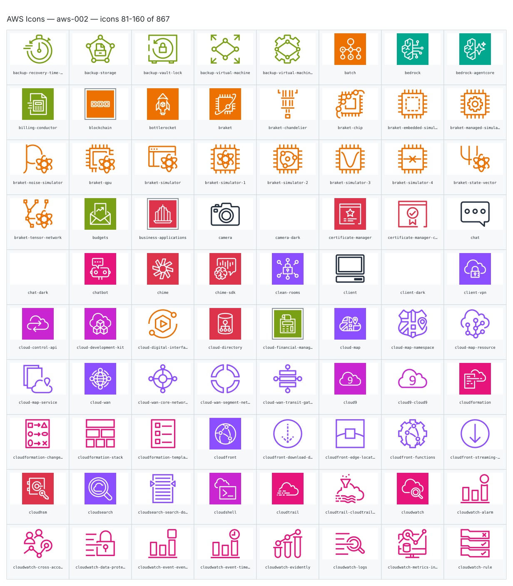

- `aws:backup-recovery-time-objective` — Backup Recovery Time Objective — [aws-002.svg](sheets/aws-002.svg) r0c0 — `service example(aws:backup-recovery-time-objective)[Backup Recovery Time Objective]`
- `aws:backup-storage` — Backup Storage — [aws-002.svg](sheets/aws-002.svg) r0c1 — `service example(aws:backup-storage)[Backup Storage]`
- `aws:backup-vault-lock` — Backup Vault Lock — [aws-002.svg](sheets/aws-002.svg) r0c2 — `service example(aws:backup-vault-lock)[Backup Vault Lock]`
- `aws:backup-virtual-machine` — Backup Virtual Machine — [aws-002.svg](sheets/aws-002.svg) r0c3 — `service example(aws:backup-virtual-machine)[Backup Virtual Machine]`
- `aws:backup-virtual-machine-monitor` — Backup Virtual Machine Monitor — [aws-002.svg](sheets/aws-002.svg) r0c4 — `service example(aws:backup-virtual-machine-monitor)[Backup Virtual Machine Monitor]`
- `aws:batch` — Batch — [aws-002.svg](sheets/aws-002.svg) r0c5 — `service example(aws:batch)[Batch]`
- `aws:bedrock` — Bedrock — [aws-002.svg](sheets/aws-002.svg) r0c6 — `service example(aws:bedrock)[Bedrock]`
- `aws:bedrock-agentcore` — Bedrock Agentcore — [aws-002.svg](sheets/aws-002.svg) r0c7 — `service example(aws:bedrock-agentcore)[Bedrock Agentcore]`
- `aws:billing-conductor` — Billing Conductor — [aws-002.svg](sheets/aws-002.svg) r1c0 — `service example(aws:billing-conductor)[Billing Conductor]`
- `aws:blockchain` — Blockchain — [aws-002.svg](sheets/aws-002.svg) r1c1 — `service example(aws:blockchain)[Blockchain]`
- `aws:bottlerocket` — Bottlerocket — [aws-002.svg](sheets/aws-002.svg) r1c2 — `service example(aws:bottlerocket)[Bottlerocket]`
- `aws:braket` — Braket — [aws-002.svg](sheets/aws-002.svg) r1c3 — `service example(aws:braket)[Braket]`
- `aws:braket-chandelier` — Braket Chandelier — [aws-002.svg](sheets/aws-002.svg) r1c4 — `service example(aws:braket-chandelier)[Braket Chandelier]`
- `aws:braket-chip` — Braket Chip — [aws-002.svg](sheets/aws-002.svg) r1c5 — `service example(aws:braket-chip)[Braket Chip]`
- `aws:braket-embedded-simulator` — Braket Embedded Simulator — [aws-002.svg](sheets/aws-002.svg) r1c6 — `service example(aws:braket-embedded-simulator)[Braket Embedded Simulator]`
- `aws:braket-managed-simulator` — Braket Managed Simulator — [aws-002.svg](sheets/aws-002.svg) r1c7 — `service example(aws:braket-managed-simulator)[Braket Managed Simulator]`
- `aws:braket-noise-simulator` — Braket Noise Simulator — [aws-002.svg](sheets/aws-002.svg) r2c0 — `service example(aws:braket-noise-simulator)[Braket Noise Simulator]`
- `aws:braket-qpu` — Braket Qpu — [aws-002.svg](sheets/aws-002.svg) r2c1 — `service example(aws:braket-qpu)[Braket Qpu]`
- `aws:braket-simulator` — Braket Simulator — [aws-002.svg](sheets/aws-002.svg) r2c2 — `service example(aws:braket-simulator)[Braket Simulator]`
- `aws:braket-simulator-1` — Braket Simulator 1 — [aws-002.svg](sheets/aws-002.svg) r2c3 — `service example(aws:braket-simulator-1)[Braket Simulator 1]`
- `aws:braket-simulator-2` — Braket Simulator 2 — [aws-002.svg](sheets/aws-002.svg) r2c4 — `service example(aws:braket-simulator-2)[Braket Simulator 2]`
- `aws:braket-simulator-3` — Braket Simulator 3 — [aws-002.svg](sheets/aws-002.svg) r2c5 — `service example(aws:braket-simulator-3)[Braket Simulator 3]`
- `aws:braket-simulator-4` — Braket Simulator 4 — [aws-002.svg](sheets/aws-002.svg) r2c6 — `service example(aws:braket-simulator-4)[Braket Simulator 4]`
- `aws:braket-state-vector` — Braket State Vector — [aws-002.svg](sheets/aws-002.svg) r2c7 — `service example(aws:braket-state-vector)[Braket State Vector]`
- `aws:braket-tensor-network` — Braket Tensor Network — [aws-002.svg](sheets/aws-002.svg) r3c0 — `service example(aws:braket-tensor-network)[Braket Tensor Network]`
- `aws:budgets` — Budgets — [aws-002.svg](sheets/aws-002.svg) r3c1 — `service example(aws:budgets)[Budgets]`
- `aws:business-applications` — Business Applications — [aws-002.svg](sheets/aws-002.svg) r3c2 — `service example(aws:business-applications)[Business Applications]`
- `aws:camera` — Camera — [aws-002.svg](sheets/aws-002.svg) r3c3 — `service example(aws:camera)[Camera]`
- `aws:camera-dark` — Camera Dark — [aws-002.svg](sheets/aws-002.svg) r3c4 — `service example(aws:camera-dark)[Camera Dark]`
- `aws:certificate-manager` — Certificate Manager — [aws-002.svg](sheets/aws-002.svg) r3c5 — `service example(aws:certificate-manager)[Certificate Manager]`
- `aws:certificate-manager-certificate-authority` — Certificate Manager Certificate Authority — [aws-002.svg](sheets/aws-002.svg) r3c6 — `service example(aws:certificate-manager-certificate-authority)[Certificate Manager Certificate Authority]`
- `aws:chat` — Chat — [aws-002.svg](sheets/aws-002.svg) r3c7 — `service example(aws:chat)[Chat]`
- `aws:chat-dark` — Chat Dark — [aws-002.svg](sheets/aws-002.svg) r4c0 — `service example(aws:chat-dark)[Chat Dark]`
- `aws:chatbot` — Chatbot — [aws-002.svg](sheets/aws-002.svg) r4c1 — `service example(aws:chatbot)[Chatbot]`
- `aws:chime` — Chime — [aws-002.svg](sheets/aws-002.svg) r4c2 — `service example(aws:chime)[Chime]`
- `aws:chime-sdk` — Chime Sdk — [aws-002.svg](sheets/aws-002.svg) r4c3 — `service example(aws:chime-sdk)[Chime Sdk]`
- `aws:clean-rooms` — Clean Rooms — [aws-002.svg](sheets/aws-002.svg) r4c4 — `service example(aws:clean-rooms)[Clean Rooms]`
- `aws:client` — Client — [aws-002.svg](sheets/aws-002.svg) r4c5 — `service example(aws:client)[Client]`
- `aws:client-dark` — Client Dark — [aws-002.svg](sheets/aws-002.svg) r4c6 — `service example(aws:client-dark)[Client Dark]`
- `aws:client-vpn` — Client Vpn — [aws-002.svg](sheets/aws-002.svg) r4c7 — `service example(aws:client-vpn)[Client Vpn]`
- `aws:cloud-control-api` — Cloud Control Api — [aws-002.svg](sheets/aws-002.svg) r5c0 — `service example(aws:cloud-control-api)[Cloud Control Api]`
- `aws:cloud-development-kit` — Cloud Development Kit — [aws-002.svg](sheets/aws-002.svg) r5c1 — `service example(aws:cloud-development-kit)[Cloud Development Kit]`
- `aws:cloud-digital-interface` — Cloud Digital Interface — [aws-002.svg](sheets/aws-002.svg) r5c2 — `service example(aws:cloud-digital-interface)[Cloud Digital Interface]`
- `aws:cloud-directory` — Cloud Directory — [aws-002.svg](sheets/aws-002.svg) r5c3 — `service example(aws:cloud-directory)[Cloud Directory]`
- `aws:cloud-financial-management` — Cloud Financial Management — [aws-002.svg](sheets/aws-002.svg) r5c4 — `service example(aws:cloud-financial-management)[Cloud Financial Management]`
- `aws:cloud-map` — Cloud Map — [aws-002.svg](sheets/aws-002.svg) r5c5 — `service example(aws:cloud-map)[Cloud Map]`
- `aws:cloud-map-namespace` — Cloud Map Namespace — [aws-002.svg](sheets/aws-002.svg) r5c6 — `service example(aws:cloud-map-namespace)[Cloud Map Namespace]`
- `aws:cloud-map-resource` — Cloud Map Resource — [aws-002.svg](sheets/aws-002.svg) r5c7 — `service example(aws:cloud-map-resource)[Cloud Map Resource]`
- `aws:cloud-map-service` — Cloud Map Service — [aws-002.svg](sheets/aws-002.svg) r6c0 — `service example(aws:cloud-map-service)[Cloud Map Service]`
- `aws:cloud-wan` — Cloud Wan — [aws-002.svg](sheets/aws-002.svg) r6c1 — `service example(aws:cloud-wan)[Cloud Wan]`
- `aws:cloud-wan-core-network-edge` — Cloud Wan Core Network Edge — [aws-002.svg](sheets/aws-002.svg) r6c2 — `service example(aws:cloud-wan-core-network-edge)[Cloud Wan Core Network Edge]`
- `aws:cloud-wan-segment-network` — Cloud Wan Segment Network — [aws-002.svg](sheets/aws-002.svg) r6c3 — `service example(aws:cloud-wan-segment-network)[Cloud Wan Segment Network]`
- `aws:cloud-wan-transit-gateway-route-table-attachment` — Cloud Wan Transit Gateway Route Table Attachment — [aws-002.svg](sheets/aws-002.svg) r6c4 — `service example(aws:cloud-wan-transit-gateway-route-table-attachment)[Cloud Wan Transit Gateway Route Table Attachment]`
- `aws:cloud9` — Cloud9 — [aws-002.svg](sheets/aws-002.svg) r6c5 — `service example(aws:cloud9)[Cloud9]`
- `aws:cloud9-cloud9` — Cloud9 Cloud9 — [aws-002.svg](sheets/aws-002.svg) r6c6 — `service example(aws:cloud9-cloud9)[Cloud9 Cloud9]`
- `aws:cloudformation` — Cloudformation — [aws-002.svg](sheets/aws-002.svg) r6c7 — `service example(aws:cloudformation)[Cloudformation]`
- `aws:cloudformation-change-set` — Cloudformation Change Set — [aws-002.svg](sheets/aws-002.svg) r7c0 — `service example(aws:cloudformation-change-set)[Cloudformation Change Set]`
- `aws:cloudformation-stack` — Cloudformation Stack — [aws-002.svg](sheets/aws-002.svg) r7c1 — `service example(aws:cloudformation-stack)[Cloudformation Stack]`
- `aws:cloudformation-template` — Cloudformation Template — [aws-002.svg](sheets/aws-002.svg) r7c2 — `service example(aws:cloudformation-template)[Cloudformation Template]`
- `aws:cloudfront` — Cloudfront — [aws-002.svg](sheets/aws-002.svg) r7c3 — `service example(aws:cloudfront)[Cloudfront]`
- `aws:cloudfront-download-distribution` — Cloudfront Download Distribution — [aws-002.svg](sheets/aws-002.svg) r7c4 — `service example(aws:cloudfront-download-distribution)[Cloudfront Download Distribution]`
- `aws:cloudfront-edge-location` — Cloudfront Edge Location — [aws-002.svg](sheets/aws-002.svg) r7c5 — `service example(aws:cloudfront-edge-location)[Cloudfront Edge Location]`
- `aws:cloudfront-functions` — Cloudfront Functions — [aws-002.svg](sheets/aws-002.svg) r7c6 — `service example(aws:cloudfront-functions)[Cloudfront Functions]`
- `aws:cloudfront-streaming-distribution` — Cloudfront Streaming Distribution — [aws-002.svg](sheets/aws-002.svg) r7c7 — `service example(aws:cloudfront-streaming-distribution)[Cloudfront Streaming Distribution]`
- `aws:cloudhsm` — Cloudhsm — [aws-002.svg](sheets/aws-002.svg) r8c0 — `service example(aws:cloudhsm)[Cloudhsm]`
- `aws:cloudsearch` — Cloudsearch — [aws-002.svg](sheets/aws-002.svg) r8c1 — `service example(aws:cloudsearch)[Cloudsearch]`
- `aws:cloudsearch-search-documents` — Cloudsearch Search Documents — [aws-002.svg](sheets/aws-002.svg) r8c2 — `service example(aws:cloudsearch-search-documents)[Cloudsearch Search Documents]`
- `aws:cloudshell` — Cloudshell — [aws-002.svg](sheets/aws-002.svg) r8c3 — `service example(aws:cloudshell)[Cloudshell]`
- `aws:cloudtrail` — Cloudtrail — [aws-002.svg](sheets/aws-002.svg) r8c4 — `service example(aws:cloudtrail)[Cloudtrail]`
- `aws:cloudtrail-cloudtrail-lake` — Cloudtrail Cloudtrail Lake — [aws-002.svg](sheets/aws-002.svg) r8c5 — `service example(aws:cloudtrail-cloudtrail-lake)[Cloudtrail Cloudtrail Lake]`
- `aws:cloudwatch` — Cloudwatch — [aws-002.svg](sheets/aws-002.svg) r8c6 — `service example(aws:cloudwatch)[Cloudwatch]`
- `aws:cloudwatch-alarm` — Cloudwatch Alarm — [aws-002.svg](sheets/aws-002.svg) r8c7 — `service example(aws:cloudwatch-alarm)[Cloudwatch Alarm]`
- `aws:cloudwatch-cross-account-observability` — Cloudwatch Cross Account Observability — [aws-002.svg](sheets/aws-002.svg) r9c0 — `service example(aws:cloudwatch-cross-account-observability)[Cloudwatch Cross Account Observability]`
- `aws:cloudwatch-data-protection` — Cloudwatch Data Protection — [aws-002.svg](sheets/aws-002.svg) r9c1 — `service example(aws:cloudwatch-data-protection)[Cloudwatch Data Protection]`
- `aws:cloudwatch-event-event-based` — Cloudwatch Event Event Based — [aws-002.svg](sheets/aws-002.svg) r9c2 — `service example(aws:cloudwatch-event-event-based)[Cloudwatch Event Event Based]`
- `aws:cloudwatch-event-time-based` — Cloudwatch Event Time Based — [aws-002.svg](sheets/aws-002.svg) r9c3 — `service example(aws:cloudwatch-event-time-based)[Cloudwatch Event Time Based]`
- `aws:cloudwatch-evidently` — Cloudwatch Evidently — [aws-002.svg](sheets/aws-002.svg) r9c4 — `service example(aws:cloudwatch-evidently)[Cloudwatch Evidently]`
- `aws:cloudwatch-logs` — Cloudwatch Logs — [aws-002.svg](sheets/aws-002.svg) r9c5 — `service example(aws:cloudwatch-logs)[Cloudwatch Logs]`
- `aws:cloudwatch-metrics-insights` — Cloudwatch Metrics Insights — [aws-002.svg](sheets/aws-002.svg) r9c6 — `service example(aws:cloudwatch-metrics-insights)[Cloudwatch Metrics Insights]`
- `aws:cloudwatch-rule` — Cloudwatch Rule — [aws-002.svg](sheets/aws-002.svg) r9c7 — `service example(aws:cloudwatch-rule)[Cloudwatch Rule]`

## aws-003

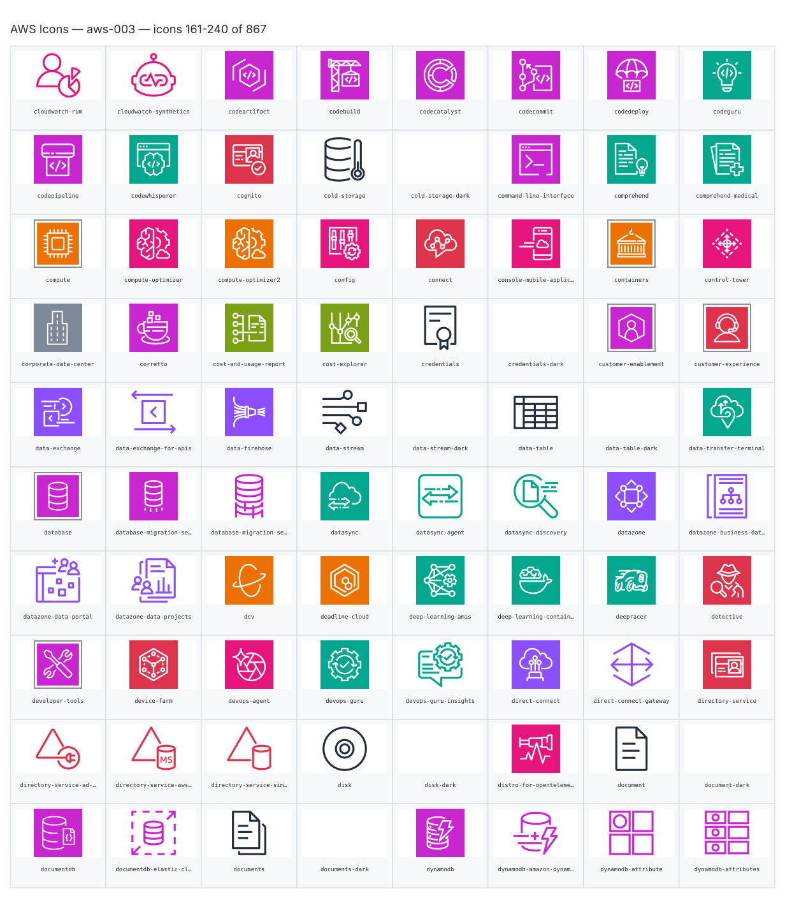

- `aws:cloudwatch-rum` — Cloudwatch Rum — [aws-003.svg](sheets/aws-003.svg) r0c0 — `service example(aws:cloudwatch-rum)[Cloudwatch Rum]`
- `aws:cloudwatch-synthetics` — Cloudwatch Synthetics — [aws-003.svg](sheets/aws-003.svg) r0c1 — `service example(aws:cloudwatch-synthetics)[Cloudwatch Synthetics]`
- `aws:codeartifact` — Codeartifact — [aws-003.svg](sheets/aws-003.svg) r0c2 — `service example(aws:codeartifact)[Codeartifact]`
- `aws:codebuild` — Codebuild — [aws-003.svg](sheets/aws-003.svg) r0c3 — `service example(aws:codebuild)[Codebuild]`
- `aws:codecatalyst` — Codecatalyst — [aws-003.svg](sheets/aws-003.svg) r0c4 — `service example(aws:codecatalyst)[Codecatalyst]`
- `aws:codecommit` — Codecommit — [aws-003.svg](sheets/aws-003.svg) r0c5 — `service example(aws:codecommit)[Codecommit]`
- `aws:codedeploy` — Codedeploy — [aws-003.svg](sheets/aws-003.svg) r0c6 — `service example(aws:codedeploy)[Codedeploy]`
- `aws:codeguru` — Codeguru — [aws-003.svg](sheets/aws-003.svg) r0c7 — `service example(aws:codeguru)[Codeguru]`
- `aws:codepipeline` — Codepipeline — [aws-003.svg](sheets/aws-003.svg) r1c0 — `service example(aws:codepipeline)[Codepipeline]`
- `aws:codewhisperer` — Codewhisperer — [aws-003.svg](sheets/aws-003.svg) r1c1 — `service example(aws:codewhisperer)[Codewhisperer]`
- `aws:cognito` — Cognito — [aws-003.svg](sheets/aws-003.svg) r1c2 — `service example(aws:cognito)[Cognito]`
- `aws:cold-storage` — Cold Storage — [aws-003.svg](sheets/aws-003.svg) r1c3 — `service example(aws:cold-storage)[Cold Storage]`
- `aws:cold-storage-dark` — Cold Storage Dark — [aws-003.svg](sheets/aws-003.svg) r1c4 — `service example(aws:cold-storage-dark)[Cold Storage Dark]`
- `aws:command-line-interface` — Command Line Interface — [aws-003.svg](sheets/aws-003.svg) r1c5 — `service example(aws:command-line-interface)[Command Line Interface]`
- `aws:comprehend` — Comprehend — [aws-003.svg](sheets/aws-003.svg) r1c6 — `service example(aws:comprehend)[Comprehend]`
- `aws:comprehend-medical` — Comprehend Medical — [aws-003.svg](sheets/aws-003.svg) r1c7 — `service example(aws:comprehend-medical)[Comprehend Medical]`
- `aws:compute` — Compute — [aws-003.svg](sheets/aws-003.svg) r2c0 — `service example(aws:compute)[Compute]`
- `aws:compute-optimizer` — Compute Optimizer — [aws-003.svg](sheets/aws-003.svg) r2c1 — `service example(aws:compute-optimizer)[Compute Optimizer]`
- `aws:compute-optimizer2` — Compute Optimizer2 — [aws-003.svg](sheets/aws-003.svg) r2c2 — `service example(aws:compute-optimizer2)[Compute Optimizer2]`
- `aws:config` — Config — [aws-003.svg](sheets/aws-003.svg) r2c3 — `service example(aws:config)[Config]`
- `aws:connect` — Connect — [aws-003.svg](sheets/aws-003.svg) r2c4 — `service example(aws:connect)[Connect]`
- `aws:console-mobile-application` — Console Mobile Application — [aws-003.svg](sheets/aws-003.svg) r2c5 — `service example(aws:console-mobile-application)[Console Mobile Application]`
- `aws:containers` — Containers — [aws-003.svg](sheets/aws-003.svg) r2c6 — `service example(aws:containers)[Containers]`
- `aws:control-tower` — Control Tower — [aws-003.svg](sheets/aws-003.svg) r2c7 — `service example(aws:control-tower)[Control Tower]`
- `aws:corporate-data-center` — Corporate Data Center — [aws-003.svg](sheets/aws-003.svg) r3c0 — `service example(aws:corporate-data-center)[Corporate Data Center]`
- `aws:corretto` — Corretto — [aws-003.svg](sheets/aws-003.svg) r3c1 — `service example(aws:corretto)[Corretto]`
- `aws:cost-and-usage-report` — Cost And Usage Report — [aws-003.svg](sheets/aws-003.svg) r3c2 — `service example(aws:cost-and-usage-report)[Cost And Usage Report]`
- `aws:cost-explorer` — Cost Explorer — [aws-003.svg](sheets/aws-003.svg) r3c3 — `service example(aws:cost-explorer)[Cost Explorer]`
- `aws:credentials` — Credentials — [aws-003.svg](sheets/aws-003.svg) r3c4 — `service example(aws:credentials)[Credentials]`
- `aws:credentials-dark` — Credentials Dark — [aws-003.svg](sheets/aws-003.svg) r3c5 — `service example(aws:credentials-dark)[Credentials Dark]`
- `aws:customer-enablement` — Customer Enablement — [aws-003.svg](sheets/aws-003.svg) r3c6 — `service example(aws:customer-enablement)[Customer Enablement]`
- `aws:customer-experience` — Customer Experience — [aws-003.svg](sheets/aws-003.svg) r3c7 — `service example(aws:customer-experience)[Customer Experience]`
- `aws:data-exchange` — Data Exchange — [aws-003.svg](sheets/aws-003.svg) r4c0 — `service example(aws:data-exchange)[Data Exchange]`
- `aws:data-exchange-for-apis` — Data Exchange For Apis — [aws-003.svg](sheets/aws-003.svg) r4c1 — `service example(aws:data-exchange-for-apis)[Data Exchange For Apis]`
- `aws:data-firehose` — Data Firehose — [aws-003.svg](sheets/aws-003.svg) r4c2 — `service example(aws:data-firehose)[Data Firehose]`
- `aws:data-stream` — Data Stream — [aws-003.svg](sheets/aws-003.svg) r4c3 — `service example(aws:data-stream)[Data Stream]`
- `aws:data-stream-dark` — Data Stream Dark — [aws-003.svg](sheets/aws-003.svg) r4c4 — `service example(aws:data-stream-dark)[Data Stream Dark]`
- `aws:data-table` — Data Table — [aws-003.svg](sheets/aws-003.svg) r4c5 — `service example(aws:data-table)[Data Table]`
- `aws:data-table-dark` — Data Table Dark — [aws-003.svg](sheets/aws-003.svg) r4c6 — `service example(aws:data-table-dark)[Data Table Dark]`
- `aws:data-transfer-terminal` — Data Transfer Terminal — [aws-003.svg](sheets/aws-003.svg) r4c7 — `service example(aws:data-transfer-terminal)[Data Transfer Terminal]`
- `aws:database` — Database — [aws-003.svg](sheets/aws-003.svg) r5c0 — `service example(aws:database)[Database]`
- `aws:database-migration-service` — Database Migration Service — [aws-003.svg](sheets/aws-003.svg) r5c1 — `service example(aws:database-migration-service)[Database Migration Service]`
- `aws:database-migration-service-database-migration-workflow-job` — Database Migration Service Database Migration Workflow Job — [aws-003.svg](sheets/aws-003.svg) r5c2 — `service example(aws:database-migration-service-database-migration-workflow-job)[Database Migration Service Database Migration Workflow Job]`
- `aws:datasync` — Datasync — [aws-003.svg](sheets/aws-003.svg) r5c3 — `service example(aws:datasync)[Datasync]`
- `aws:datasync-agent` — Datasync Agent — [aws-003.svg](sheets/aws-003.svg) r5c4 — `service example(aws:datasync-agent)[Datasync Agent]`
- `aws:datasync-discovery` — Datasync Discovery — [aws-003.svg](sheets/aws-003.svg) r5c5 — `service example(aws:datasync-discovery)[Datasync Discovery]`
- `aws:datazone` — Datazone — [aws-003.svg](sheets/aws-003.svg) r5c6 — `service example(aws:datazone)[Datazone]`
- `aws:datazone-business-data-catalog` — Datazone Business Data Catalog — [aws-003.svg](sheets/aws-003.svg) r5c7 — `service example(aws:datazone-business-data-catalog)[Datazone Business Data Catalog]`
- `aws:datazone-data-portal` — Datazone Data Portal — [aws-003.svg](sheets/aws-003.svg) r6c0 — `service example(aws:datazone-data-portal)[Datazone Data Portal]`
- `aws:datazone-data-projects` — Datazone Data Projects — [aws-003.svg](sheets/aws-003.svg) r6c1 — `service example(aws:datazone-data-projects)[Datazone Data Projects]`
- `aws:dcv` — Dcv — [aws-003.svg](sheets/aws-003.svg) r6c2 — `service example(aws:dcv)[Dcv]`
- `aws:deadline-cloud` — Deadline Cloud — [aws-003.svg](sheets/aws-003.svg) r6c3 — `service example(aws:deadline-cloud)[Deadline Cloud]`
- `aws:deep-learning-amis` — Deep Learning Amis — [aws-003.svg](sheets/aws-003.svg) r6c4 — `service example(aws:deep-learning-amis)[Deep Learning Amis]`
- `aws:deep-learning-containers` — Deep Learning Containers — [aws-003.svg](sheets/aws-003.svg) r6c5 — `service example(aws:deep-learning-containers)[Deep Learning Containers]`
- `aws:deepracer` — Deepracer — [aws-003.svg](sheets/aws-003.svg) r6c6 — `service example(aws:deepracer)[Deepracer]`
- `aws:detective` — Detective — [aws-003.svg](sheets/aws-003.svg) r6c7 — `service example(aws:detective)[Detective]`
- `aws:developer-tools` — Developer Tools — [aws-003.svg](sheets/aws-003.svg) r7c0 — `service example(aws:developer-tools)[Developer Tools]`
- `aws:device-farm` — Device Farm — [aws-003.svg](sheets/aws-003.svg) r7c1 — `service example(aws:device-farm)[Device Farm]`
- `aws:devops-agent` — Devops Agent — [aws-003.svg](sheets/aws-003.svg) r7c2 — `service example(aws:devops-agent)[Devops Agent]`
- `aws:devops-guru` — Devops Guru — [aws-003.svg](sheets/aws-003.svg) r7c3 — `service example(aws:devops-guru)[Devops Guru]`
- `aws:devops-guru-insights` — Devops Guru Insights — [aws-003.svg](sheets/aws-003.svg) r7c4 — `service example(aws:devops-guru-insights)[Devops Guru Insights]`
- `aws:direct-connect` — Direct Connect — [aws-003.svg](sheets/aws-003.svg) r7c5 — `service example(aws:direct-connect)[Direct Connect]`
- `aws:direct-connect-gateway` — Direct Connect Gateway — [aws-003.svg](sheets/aws-003.svg) r7c6 — `service example(aws:direct-connect-gateway)[Direct Connect Gateway]`
- `aws:directory-service` — Directory Service — [aws-003.svg](sheets/aws-003.svg) r7c7 — `service example(aws:directory-service)[Directory Service]`
- `aws:directory-service-ad-connector` — Directory Service Ad Connector — [aws-003.svg](sheets/aws-003.svg) r8c0 — `service example(aws:directory-service-ad-connector)[Directory Service Ad Connector]`
- `aws:directory-service-aws-managed-microsoft-ad` — Directory Service Aws Managed Microsoft Ad — [aws-003.svg](sheets/aws-003.svg) r8c1 — `service example(aws:directory-service-aws-managed-microsoft-ad)[Directory Service Aws Managed Microsoft Ad]`
- `aws:directory-service-simple-ad` — Directory Service Simple Ad — [aws-003.svg](sheets/aws-003.svg) r8c2 — `service example(aws:directory-service-simple-ad)[Directory Service Simple Ad]`
- `aws:disk` — Disk — [aws-003.svg](sheets/aws-003.svg) r8c3 — `service example(aws:disk)[Disk]`
- `aws:disk-dark` — Disk Dark — [aws-003.svg](sheets/aws-003.svg) r8c4 — `service example(aws:disk-dark)[Disk Dark]`
- `aws:distro-for-opentelemetry` — Distro For Opentelemetry — [aws-003.svg](sheets/aws-003.svg) r8c5 — `service example(aws:distro-for-opentelemetry)[Distro For Opentelemetry]`
- `aws:document` — Document — [aws-003.svg](sheets/aws-003.svg) r8c6 — `service example(aws:document)[Document]`
- `aws:document-dark` — Document Dark — [aws-003.svg](sheets/aws-003.svg) r8c7 — `service example(aws:document-dark)[Document Dark]`
- `aws:documentdb` — Documentdb — [aws-003.svg](sheets/aws-003.svg) r9c0 — `service example(aws:documentdb)[Documentdb]`
- `aws:documentdb-elastic-clusters` — Documentdb Elastic Clusters — [aws-003.svg](sheets/aws-003.svg) r9c1 — `service example(aws:documentdb-elastic-clusters)[Documentdb Elastic Clusters]`
- `aws:documents` — Documents — [aws-003.svg](sheets/aws-003.svg) r9c2 — `service example(aws:documents)[Documents]`
- `aws:documents-dark` — Documents Dark — [aws-003.svg](sheets/aws-003.svg) r9c3 — `service example(aws:documents-dark)[Documents Dark]`
- `aws:dynamodb` — Dynamodb — [aws-003.svg](sheets/aws-003.svg) r9c4 — `service example(aws:dynamodb)[Dynamodb]`
- `aws:dynamodb-amazon-dynamodb-accelerator` — Dynamodb Amazon Dynamodb Accelerator — [aws-003.svg](sheets/aws-003.svg) r9c5 — `service example(aws:dynamodb-amazon-dynamodb-accelerator)[Dynamodb Amazon Dynamodb Accelerator]`
- `aws:dynamodb-attribute` — Dynamodb Attribute — [aws-003.svg](sheets/aws-003.svg) r9c6 — `service example(aws:dynamodb-attribute)[Dynamodb Attribute]`
- `aws:dynamodb-attributes` — Dynamodb Attributes — [aws-003.svg](sheets/aws-003.svg) r9c7 — `service example(aws:dynamodb-attributes)[Dynamodb Attributes]`

## aws-004

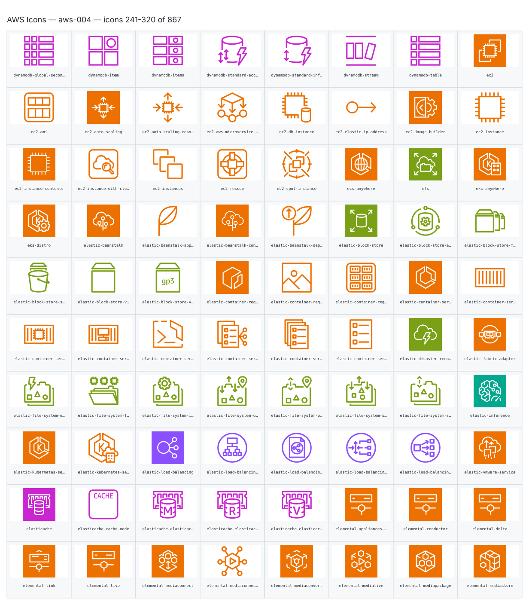

- `aws:dynamodb-global-secondary-index` — Dynamodb Global Secondary Index — [aws-004.svg](sheets/aws-004.svg) r0c0 — `service example(aws:dynamodb-global-secondary-index)[Dynamodb Global Secondary Index]`
- `aws:dynamodb-item` — Dynamodb Item — [aws-004.svg](sheets/aws-004.svg) r0c1 — `service example(aws:dynamodb-item)[Dynamodb Item]`
- `aws:dynamodb-items` — Dynamodb Items — [aws-004.svg](sheets/aws-004.svg) r0c2 — `service example(aws:dynamodb-items)[Dynamodb Items]`
- `aws:dynamodb-standard-access-table-class` — Dynamodb Standard Access Table Class — [aws-004.svg](sheets/aws-004.svg) r0c3 — `service example(aws:dynamodb-standard-access-table-class)[Dynamodb Standard Access Table Class]`
- `aws:dynamodb-standard-infrequent-access-table-class` — Dynamodb Standard Infrequent Access Table Class — [aws-004.svg](sheets/aws-004.svg) r0c4 — `service example(aws:dynamodb-standard-infrequent-access-table-class)[Dynamodb Standard Infrequent Access Table Class]`
- `aws:dynamodb-stream` — Dynamodb Stream — [aws-004.svg](sheets/aws-004.svg) r0c5 — `service example(aws:dynamodb-stream)[Dynamodb Stream]`
- `aws:dynamodb-table` — Dynamodb Table — [aws-004.svg](sheets/aws-004.svg) r0c6 — `service example(aws:dynamodb-table)[Dynamodb Table]`
- `aws:ec2` — Ec2 — [aws-004.svg](sheets/aws-004.svg) r0c7 — `service example(aws:ec2)[Ec2]`
- `aws:ec2-ami` — Ec2 Ami — [aws-004.svg](sheets/aws-004.svg) r1c0 — `service example(aws:ec2-ami)[Ec2 Ami]`
- `aws:ec2-auto-scaling` — Ec2 Auto Scaling — [aws-004.svg](sheets/aws-004.svg) r1c1 — `service example(aws:ec2-auto-scaling)[Ec2 Auto Scaling]`
- `aws:ec2-auto-scaling-resource` — Ec2 Auto Scaling Resource — [aws-004.svg](sheets/aws-004.svg) r1c2 — `service example(aws:ec2-auto-scaling-resource)[Ec2 Auto Scaling Resource]`
- `aws:ec2-aws-microservice-extractor-for-.net` — Ec2 Aws Microservice Extractor For .Net — [aws-004.svg](sheets/aws-004.svg) r1c3 — `service example(aws:ec2-aws-microservice-extractor-for-.net)[Ec2 Aws Microservice Extractor For .Net]`
- `aws:ec2-db-instance` — Ec2 Db Instance — [aws-004.svg](sheets/aws-004.svg) r1c4 — `service example(aws:ec2-db-instance)[Ec2 Db Instance]`
- `aws:ec2-elastic-ip-address` — Ec2 Elastic Ip Address — [aws-004.svg](sheets/aws-004.svg) r1c5 — `service example(aws:ec2-elastic-ip-address)[Ec2 Elastic Ip Address]`
- `aws:ec2-image-builder` — Ec2 Image Builder — [aws-004.svg](sheets/aws-004.svg) r1c6 — `service example(aws:ec2-image-builder)[Ec2 Image Builder]`
- `aws:ec2-instance` — Ec2 Instance — [aws-004.svg](sheets/aws-004.svg) r1c7 — `service example(aws:ec2-instance)[Ec2 Instance]`
- `aws:ec2-instance-contents` — Ec2 Instance Contents — [aws-004.svg](sheets/aws-004.svg) r2c0 — `service example(aws:ec2-instance-contents)[Ec2 Instance Contents]`
- `aws:ec2-instance-with-cloudwatch` — Ec2 Instance With Cloudwatch — [aws-004.svg](sheets/aws-004.svg) r2c1 — `service example(aws:ec2-instance-with-cloudwatch)[Ec2 Instance With Cloudwatch]`
- `aws:ec2-instances` — Ec2 Instances — [aws-004.svg](sheets/aws-004.svg) r2c2 — `service example(aws:ec2-instances)[Ec2 Instances]`
- `aws:ec2-rescue` — Ec2 Rescue — [aws-004.svg](sheets/aws-004.svg) r2c3 — `service example(aws:ec2-rescue)[Ec2 Rescue]`
- `aws:ec2-spot-instance` — Ec2 Spot Instance — [aws-004.svg](sheets/aws-004.svg) r2c4 — `service example(aws:ec2-spot-instance)[Ec2 Spot Instance]`
- `aws:ecs-anywhere` — Ecs Anywhere — [aws-004.svg](sheets/aws-004.svg) r2c5 — `service example(aws:ecs-anywhere)[Ecs Anywhere]`
- `aws:efs` — Efs — [aws-004.svg](sheets/aws-004.svg) r2c6 — `service example(aws:efs)[Efs]`
- `aws:eks-anywhere` — Eks Anywhere — [aws-004.svg](sheets/aws-004.svg) r2c7 — `service example(aws:eks-anywhere)[Eks Anywhere]`
- `aws:eks-distro` — Eks Distro — [aws-004.svg](sheets/aws-004.svg) r3c0 — `service example(aws:eks-distro)[Eks Distro]`
- `aws:elastic-beanstalk` — Elastic Beanstalk — [aws-004.svg](sheets/aws-004.svg) r3c1 — `service example(aws:elastic-beanstalk)[Elastic Beanstalk]`
- `aws:elastic-beanstalk-application` — Elastic Beanstalk Application — [aws-004.svg](sheets/aws-004.svg) r3c2 — `service example(aws:elastic-beanstalk-application)[Elastic Beanstalk Application]`
- `aws:elastic-beanstalk-container` — Elastic Beanstalk Container — [aws-004.svg](sheets/aws-004.svg) r3c3 — `service example(aws:elastic-beanstalk-container)[Elastic Beanstalk Container]`
- `aws:elastic-beanstalk-deployment` — Elastic Beanstalk Deployment — [aws-004.svg](sheets/aws-004.svg) r3c4 — `service example(aws:elastic-beanstalk-deployment)[Elastic Beanstalk Deployment]`
- `aws:elastic-block-store` — Elastic Block Store — [aws-004.svg](sheets/aws-004.svg) r3c5 — `service example(aws:elastic-block-store)[Elastic Block Store]`
- `aws:elastic-block-store-amazon-data-lifecycle-manager` — Elastic Block Store Amazon Data Lifecycle Manager — [aws-004.svg](sheets/aws-004.svg) r3c6 — `service example(aws:elastic-block-store-amazon-data-lifecycle-manager)[Elastic Block Store Amazon Data Lifecycle Manager]`
- `aws:elastic-block-store-multiple-volumes` — Elastic Block Store Multiple Volumes — [aws-004.svg](sheets/aws-004.svg) r3c7 — `service example(aws:elastic-block-store-multiple-volumes)[Elastic Block Store Multiple Volumes]`
- `aws:elastic-block-store-snapshot` — Elastic Block Store Snapshot — [aws-004.svg](sheets/aws-004.svg) r4c0 — `service example(aws:elastic-block-store-snapshot)[Elastic Block Store Snapshot]`
- `aws:elastic-block-store-volume` — Elastic Block Store Volume — [aws-004.svg](sheets/aws-004.svg) r4c1 — `service example(aws:elastic-block-store-volume)[Elastic Block Store Volume]`
- `aws:elastic-block-store-volume-gp3` — Elastic Block Store Volume Gp3 — [aws-004.svg](sheets/aws-004.svg) r4c2 — `service example(aws:elastic-block-store-volume-gp3)[Elastic Block Store Volume Gp3]`
- `aws:elastic-container-registry` — Elastic Container Registry — [aws-004.svg](sheets/aws-004.svg) r4c3 — `service example(aws:elastic-container-registry)[Elastic Container Registry]`
- `aws:elastic-container-registry-image` — Elastic Container Registry Image — [aws-004.svg](sheets/aws-004.svg) r4c4 — `service example(aws:elastic-container-registry-image)[Elastic Container Registry Image]`
- `aws:elastic-container-registry-registry` — Elastic Container Registry Registry — [aws-004.svg](sheets/aws-004.svg) r4c5 — `service example(aws:elastic-container-registry-registry)[Elastic Container Registry Registry]`
- `aws:elastic-container-service` — Elastic Container Service — [aws-004.svg](sheets/aws-004.svg) r4c6 — `service example(aws:elastic-container-service)[Elastic Container Service]`
- `aws:elastic-container-service-container-1` — Elastic Container Service Container 1 — [aws-004.svg](sheets/aws-004.svg) r4c7 — `service example(aws:elastic-container-service-container-1)[Elastic Container Service Container 1]`
- `aws:elastic-container-service-container-2` — Elastic Container Service Container 2 — [aws-004.svg](sheets/aws-004.svg) r5c0 — `service example(aws:elastic-container-service-container-2)[Elastic Container Service Container 2]`
- `aws:elastic-container-service-container-3` — Elastic Container Service Container 3 — [aws-004.svg](sheets/aws-004.svg) r5c1 — `service example(aws:elastic-container-service-container-3)[Elastic Container Service Container 3]`
- `aws:elastic-container-service-copilot-cli` — Elastic Container Service Copilot Cli — [aws-004.svg](sheets/aws-004.svg) r5c2 — `service example(aws:elastic-container-service-copilot-cli)[Elastic Container Service Copilot Cli]`
- `aws:elastic-container-service-ecs-service-connect` — Elastic Container Service Ecs Service Connect — [aws-004.svg](sheets/aws-004.svg) r5c3 — `service example(aws:elastic-container-service-ecs-service-connect)[Elastic Container Service Ecs Service Connect]`
- `aws:elastic-container-service-service` — Elastic Container Service Service — [aws-004.svg](sheets/aws-004.svg) r5c4 — `service example(aws:elastic-container-service-service)[Elastic Container Service Service]`
- `aws:elastic-container-service-task` — Elastic Container Service Task — [aws-004.svg](sheets/aws-004.svg) r5c5 — `service example(aws:elastic-container-service-task)[Elastic Container Service Task]`
- `aws:elastic-disaster-recovery` — Elastic Disaster Recovery — [aws-004.svg](sheets/aws-004.svg) r5c6 — `service example(aws:elastic-disaster-recovery)[Elastic Disaster Recovery]`
- `aws:elastic-fabric-adapter` — Elastic Fabric Adapter — [aws-004.svg](sheets/aws-004.svg) r5c7 — `service example(aws:elastic-fabric-adapter)[Elastic Fabric Adapter]`
- `aws:elastic-file-system-elastic-throughput` — Elastic File System Elastic Throughput — [aws-004.svg](sheets/aws-004.svg) r6c0 — `service example(aws:elastic-file-system-elastic-throughput)[Elastic File System Elastic Throughput]`
- `aws:elastic-file-system-file-system` — Elastic File System File System — [aws-004.svg](sheets/aws-004.svg) r6c1 — `service example(aws:elastic-file-system-file-system)[Elastic File System File System]`
- `aws:elastic-file-system-intelligent-tiering` — Elastic File System Intelligent Tiering — [aws-004.svg](sheets/aws-004.svg) r6c2 — `service example(aws:elastic-file-system-intelligent-tiering)[Elastic File System Intelligent Tiering]`
- `aws:elastic-file-system-one-zone` — Elastic File System One Zone — [aws-004.svg](sheets/aws-004.svg) r6c3 — `service example(aws:elastic-file-system-one-zone)[Elastic File System One Zone]`
- `aws:elastic-file-system-one-zone-infrequent-access` — Elastic File System One Zone Infrequent Access — [aws-004.svg](sheets/aws-004.svg) r6c4 — `service example(aws:elastic-file-system-one-zone-infrequent-access)[Elastic File System One Zone Infrequent Access]`
- `aws:elastic-file-system-standard` — Elastic File System Standard — [aws-004.svg](sheets/aws-004.svg) r6c5 — `service example(aws:elastic-file-system-standard)[Elastic File System Standard]`
- `aws:elastic-file-system-standard-infrequent-access` — Elastic File System Standard Infrequent Access — [aws-004.svg](sheets/aws-004.svg) r6c6 — `service example(aws:elastic-file-system-standard-infrequent-access)[Elastic File System Standard Infrequent Access]`
- `aws:elastic-inference` — Elastic Inference — [aws-004.svg](sheets/aws-004.svg) r6c7 — `service example(aws:elastic-inference)[Elastic Inference]`
- `aws:elastic-kubernetes-service` — Elastic Kubernetes Service — [aws-004.svg](sheets/aws-004.svg) r7c0 — `service example(aws:elastic-kubernetes-service)[Elastic Kubernetes Service]`
- `aws:elastic-kubernetes-service-eks-on-outposts` — Elastic Kubernetes Service Eks On Outposts — [aws-004.svg](sheets/aws-004.svg) r7c1 — `service example(aws:elastic-kubernetes-service-eks-on-outposts)[Elastic Kubernetes Service Eks On Outposts]`
- `aws:elastic-load-balancing` — Elastic Load Balancing — [aws-004.svg](sheets/aws-004.svg) r7c2 — `service example(aws:elastic-load-balancing)[Elastic Load Balancing]`
- `aws:elastic-load-balancing-application-load-balancer` — Elastic Load Balancing Application Load Balancer — [aws-004.svg](sheets/aws-004.svg) r7c3 — `service example(aws:elastic-load-balancing-application-load-balancer)[Elastic Load Balancing Application Load Balancer]`
- `aws:elastic-load-balancing-classic-load-balancer` — Elastic Load Balancing Classic Load Balancer — [aws-004.svg](sheets/aws-004.svg) r7c4 — `service example(aws:elastic-load-balancing-classic-load-balancer)[Elastic Load Balancing Classic Load Balancer]`
- `aws:elastic-load-balancing-gateway-load-balancer` — Elastic Load Balancing Gateway Load Balancer — [aws-004.svg](sheets/aws-004.svg) r7c5 — `service example(aws:elastic-load-balancing-gateway-load-balancer)[Elastic Load Balancing Gateway Load Balancer]`
- `aws:elastic-load-balancing-network-load-balancer` — Elastic Load Balancing Network Load Balancer — [aws-004.svg](sheets/aws-004.svg) r7c6 — `service example(aws:elastic-load-balancing-network-load-balancer)[Elastic Load Balancing Network Load Balancer]`
- `aws:elastic-vmware-service` — Elastic Vmware Service — [aws-004.svg](sheets/aws-004.svg) r7c7 — `service example(aws:elastic-vmware-service)[Elastic Vmware Service]`
- `aws:elasticache` — Elasticache — [aws-004.svg](sheets/aws-004.svg) r8c0 — `service example(aws:elasticache)[Elasticache]`
- `aws:elasticache-cache-node` — Elasticache Cache Node — [aws-004.svg](sheets/aws-004.svg) r8c1 — `service example(aws:elasticache-cache-node)[Elasticache Cache Node]`
- `aws:elasticache-elasticache-for-memcached` — Elasticache Elasticache For Memcached — [aws-004.svg](sheets/aws-004.svg) r8c2 — `service example(aws:elasticache-elasticache-for-memcached)[Elasticache Elasticache For Memcached]`
- `aws:elasticache-elasticache-for-redis` — Elasticache Elasticache For Redis — [aws-004.svg](sheets/aws-004.svg) r8c3 — `service example(aws:elasticache-elasticache-for-redis)[Elasticache Elasticache For Redis]`
- `aws:elasticache-elasticache-for-valkey` — Elasticache Elasticache For Valkey — [aws-004.svg](sheets/aws-004.svg) r8c4 — `service example(aws:elasticache-elasticache-for-valkey)[Elasticache Elasticache For Valkey]`
- `aws:elemental-appliances-&-software` — Elemental Appliances & Software — [aws-004.svg](sheets/aws-004.svg) r8c5 — `service example(aws:elemental-appliances-&-software)[Elemental Appliances & Software]`
- `aws:elemental-conductor` — Elemental Conductor — [aws-004.svg](sheets/aws-004.svg) r8c6 — `service example(aws:elemental-conductor)[Elemental Conductor]`
- `aws:elemental-delta` — Elemental Delta — [aws-004.svg](sheets/aws-004.svg) r8c7 — `service example(aws:elemental-delta)[Elemental Delta]`
- `aws:elemental-link` — Elemental Link — [aws-004.svg](sheets/aws-004.svg) r9c0 — `service example(aws:elemental-link)[Elemental Link]`
- `aws:elemental-live` — Elemental Live — [aws-004.svg](sheets/aws-004.svg) r9c1 — `service example(aws:elemental-live)[Elemental Live]`
- `aws:elemental-mediaconnect` — Elemental Mediaconnect — [aws-004.svg](sheets/aws-004.svg) r9c2 — `service example(aws:elemental-mediaconnect)[Elemental Mediaconnect]`
- `aws:elemental-mediaconnect-mediaconnect-gateway` — Elemental Mediaconnect Mediaconnect Gateway — [aws-004.svg](sheets/aws-004.svg) r9c3 — `service example(aws:elemental-mediaconnect-mediaconnect-gateway)[Elemental Mediaconnect Mediaconnect Gateway]`
- `aws:elemental-mediaconvert` — Elemental Mediaconvert — [aws-004.svg](sheets/aws-004.svg) r9c4 — `service example(aws:elemental-mediaconvert)[Elemental Mediaconvert]`
- `aws:elemental-medialive` — Elemental Medialive — [aws-004.svg](sheets/aws-004.svg) r9c5 — `service example(aws:elemental-medialive)[Elemental Medialive]`
- `aws:elemental-mediapackage` — Elemental Mediapackage — [aws-004.svg](sheets/aws-004.svg) r9c6 — `service example(aws:elemental-mediapackage)[Elemental Mediapackage]`
- `aws:elemental-mediastore` — Elemental Mediastore — [aws-004.svg](sheets/aws-004.svg) r9c7 — `service example(aws:elemental-mediastore)[Elemental Mediastore]`

## aws-005

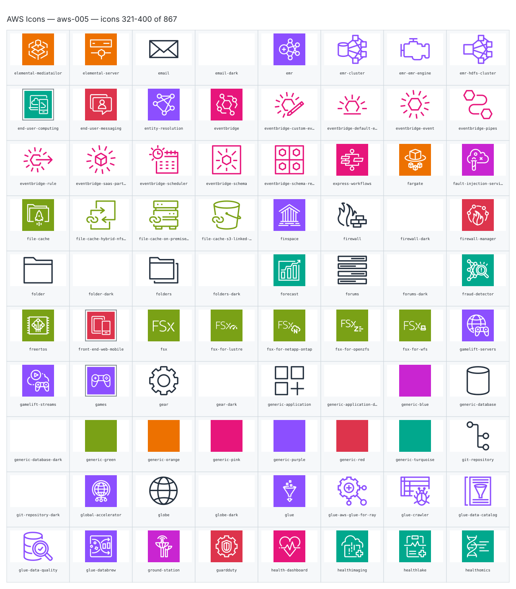

- `aws:elemental-mediatailor` — Elemental Mediatailor — [aws-005.svg](sheets/aws-005.svg) r0c0 — `service example(aws:elemental-mediatailor)[Elemental Mediatailor]`
- `aws:elemental-server` — Elemental Server — [aws-005.svg](sheets/aws-005.svg) r0c1 — `service example(aws:elemental-server)[Elemental Server]`
- `aws:email` — Email — [aws-005.svg](sheets/aws-005.svg) r0c2 — `service example(aws:email)[Email]`
- `aws:email-dark` — Email Dark — [aws-005.svg](sheets/aws-005.svg) r0c3 — `service example(aws:email-dark)[Email Dark]`
- `aws:emr` — Emr — [aws-005.svg](sheets/aws-005.svg) r0c4 — `service example(aws:emr)[Emr]`
- `aws:emr-cluster` — Emr Cluster — [aws-005.svg](sheets/aws-005.svg) r0c5 — `service example(aws:emr-cluster)[Emr Cluster]`
- `aws:emr-emr-engine` — Emr Emr Engine — [aws-005.svg](sheets/aws-005.svg) r0c6 — `service example(aws:emr-emr-engine)[Emr Emr Engine]`
- `aws:emr-hdfs-cluster` — Emr Hdfs Cluster — [aws-005.svg](sheets/aws-005.svg) r0c7 — `service example(aws:emr-hdfs-cluster)[Emr Hdfs Cluster]`
- `aws:end-user-computing` — End User Computing — [aws-005.svg](sheets/aws-005.svg) r1c0 — `service example(aws:end-user-computing)[End User Computing]`
- `aws:end-user-messaging` — End User Messaging — [aws-005.svg](sheets/aws-005.svg) r1c1 — `service example(aws:end-user-messaging)[End User Messaging]`
- `aws:entity-resolution` — Entity Resolution — [aws-005.svg](sheets/aws-005.svg) r1c2 — `service example(aws:entity-resolution)[Entity Resolution]`
- `aws:eventbridge` — Eventbridge — [aws-005.svg](sheets/aws-005.svg) r1c3 — `service example(aws:eventbridge)[Eventbridge]`
- `aws:eventbridge-custom-event-bus` — Eventbridge Custom Event Bus — [aws-005.svg](sheets/aws-005.svg) r1c4 — `service example(aws:eventbridge-custom-event-bus)[Eventbridge Custom Event Bus]`
- `aws:eventbridge-default-event-bus` — Eventbridge Default Event Bus — [aws-005.svg](sheets/aws-005.svg) r1c5 — `service example(aws:eventbridge-default-event-bus)[Eventbridge Default Event Bus]`
- `aws:eventbridge-event` — Eventbridge Event — [aws-005.svg](sheets/aws-005.svg) r1c6 — `service example(aws:eventbridge-event)[Eventbridge Event]`
- `aws:eventbridge-pipes` — Eventbridge Pipes — [aws-005.svg](sheets/aws-005.svg) r1c7 — `service example(aws:eventbridge-pipes)[Eventbridge Pipes]`
- `aws:eventbridge-rule` — Eventbridge Rule — [aws-005.svg](sheets/aws-005.svg) r2c0 — `service example(aws:eventbridge-rule)[Eventbridge Rule]`
- `aws:eventbridge-saas-partner-event` — Eventbridge Saas Partner Event — [aws-005.svg](sheets/aws-005.svg) r2c1 — `service example(aws:eventbridge-saas-partner-event)[Eventbridge Saas Partner Event]`
- `aws:eventbridge-scheduler` — Eventbridge Scheduler — [aws-005.svg](sheets/aws-005.svg) r2c2 — `service example(aws:eventbridge-scheduler)[Eventbridge Scheduler]`
- `aws:eventbridge-schema` — Eventbridge Schema — [aws-005.svg](sheets/aws-005.svg) r2c3 — `service example(aws:eventbridge-schema)[Eventbridge Schema]`
- `aws:eventbridge-schema-registry` — Eventbridge Schema Registry — [aws-005.svg](sheets/aws-005.svg) r2c4 — `service example(aws:eventbridge-schema-registry)[Eventbridge Schema Registry]`
- `aws:express-workflows` — Express Workflows — [aws-005.svg](sheets/aws-005.svg) r2c5 — `service example(aws:express-workflows)[Express Workflows]`
- `aws:fargate` — Fargate — [aws-005.svg](sheets/aws-005.svg) r2c6 — `service example(aws:fargate)[Fargate]`
- `aws:fault-injection-service` — Fault Injection Service — [aws-005.svg](sheets/aws-005.svg) r2c7 — `service example(aws:fault-injection-service)[Fault Injection Service]`
- `aws:file-cache` — File Cache — [aws-005.svg](sheets/aws-005.svg) r3c0 — `service example(aws:file-cache)[File Cache]`
- `aws:file-cache-hybrid-nfs-linked-datasets` — File Cache Hybrid Nfs Linked Datasets — [aws-005.svg](sheets/aws-005.svg) r3c1 — `service example(aws:file-cache-hybrid-nfs-linked-datasets)[File Cache Hybrid Nfs Linked Datasets]`
- `aws:file-cache-on-premises-nfs-linked-datasets` — File Cache On Premises Nfs Linked Datasets — [aws-005.svg](sheets/aws-005.svg) r3c2 — `service example(aws:file-cache-on-premises-nfs-linked-datasets)[File Cache On Premises Nfs Linked Datasets]`
- `aws:file-cache-s3-linked-datasets` — File Cache S3 Linked Datasets — [aws-005.svg](sheets/aws-005.svg) r3c3 — `service example(aws:file-cache-s3-linked-datasets)[File Cache S3 Linked Datasets]`
- `aws:finspace` — Finspace — [aws-005.svg](sheets/aws-005.svg) r3c4 — `service example(aws:finspace)[Finspace]`
- `aws:firewall` — Firewall — [aws-005.svg](sheets/aws-005.svg) r3c5 — `service example(aws:firewall)[Firewall]`
- `aws:firewall-dark` — Firewall Dark — [aws-005.svg](sheets/aws-005.svg) r3c6 — `service example(aws:firewall-dark)[Firewall Dark]`
- `aws:firewall-manager` — Firewall Manager — [aws-005.svg](sheets/aws-005.svg) r3c7 — `service example(aws:firewall-manager)[Firewall Manager]`
- `aws:folder` — Folder — [aws-005.svg](sheets/aws-005.svg) r4c0 — `service example(aws:folder)[Folder]`
- `aws:folder-dark` — Folder Dark — [aws-005.svg](sheets/aws-005.svg) r4c1 — `service example(aws:folder-dark)[Folder Dark]`
- `aws:folders` — Folders — [aws-005.svg](sheets/aws-005.svg) r4c2 — `service example(aws:folders)[Folders]`
- `aws:folders-dark` — Folders Dark — [aws-005.svg](sheets/aws-005.svg) r4c3 — `service example(aws:folders-dark)[Folders Dark]`
- `aws:forecast` — Forecast — [aws-005.svg](sheets/aws-005.svg) r4c4 — `service example(aws:forecast)[Forecast]`
- `aws:forums` — Forums — [aws-005.svg](sheets/aws-005.svg) r4c5 — `service example(aws:forums)[Forums]`
- `aws:forums-dark` — Forums Dark — [aws-005.svg](sheets/aws-005.svg) r4c6 — `service example(aws:forums-dark)[Forums Dark]`
- `aws:fraud-detector` — Fraud Detector — [aws-005.svg](sheets/aws-005.svg) r4c7 — `service example(aws:fraud-detector)[Fraud Detector]`
- `aws:freertos` — Freertos — [aws-005.svg](sheets/aws-005.svg) r5c0 — `service example(aws:freertos)[Freertos]`
- `aws:front-end-web-mobile` — Front End Web Mobile — [aws-005.svg](sheets/aws-005.svg) r5c1 — `service example(aws:front-end-web-mobile)[Front End Web Mobile]`
- `aws:fsx` — Fsx — [aws-005.svg](sheets/aws-005.svg) r5c2 — `service example(aws:fsx)[Fsx]`
- `aws:fsx-for-lustre` — Fsx For Lustre — [aws-005.svg](sheets/aws-005.svg) r5c3 — `service example(aws:fsx-for-lustre)[Fsx For Lustre]`
- `aws:fsx-for-netapp-ontap` — Fsx For Netapp Ontap — [aws-005.svg](sheets/aws-005.svg) r5c4 — `service example(aws:fsx-for-netapp-ontap)[Fsx For Netapp Ontap]`
- `aws:fsx-for-openzfs` — Fsx For Openzfs — [aws-005.svg](sheets/aws-005.svg) r5c5 — `service example(aws:fsx-for-openzfs)[Fsx For Openzfs]`
- `aws:fsx-for-wfs` — Fsx For Wfs — [aws-005.svg](sheets/aws-005.svg) r5c6 — `service example(aws:fsx-for-wfs)[Fsx For Wfs]`
- `aws:gamelift-servers` — Gamelift Servers — [aws-005.svg](sheets/aws-005.svg) r5c7 — `service example(aws:gamelift-servers)[Gamelift Servers]`
- `aws:gamelift-streams` — Gamelift Streams — [aws-005.svg](sheets/aws-005.svg) r6c0 — `service example(aws:gamelift-streams)[Gamelift Streams]`
- `aws:games` — Games — [aws-005.svg](sheets/aws-005.svg) r6c1 — `service example(aws:games)[Games]`
- `aws:gear` — Gear — [aws-005.svg](sheets/aws-005.svg) r6c2 — `service example(aws:gear)[Gear]`
- `aws:gear-dark` — Gear Dark — [aws-005.svg](sheets/aws-005.svg) r6c3 — `service example(aws:gear-dark)[Gear Dark]`
- `aws:generic-application` — Generic Application — [aws-005.svg](sheets/aws-005.svg) r6c4 — `service example(aws:generic-application)[Generic Application]`
- `aws:generic-application-dark` — Generic Application Dark — [aws-005.svg](sheets/aws-005.svg) r6c5 — `service example(aws:generic-application-dark)[Generic Application Dark]`
- `aws:generic-blue` — Generic Blue — [aws-005.svg](sheets/aws-005.svg) r6c6 — `service example(aws:generic-blue)[Generic Blue]`
- `aws:generic-database` — Generic Database — [aws-005.svg](sheets/aws-005.svg) r6c7 — `service example(aws:generic-database)[Generic Database]`
- `aws:generic-database-dark` — Generic Database Dark — [aws-005.svg](sheets/aws-005.svg) r7c0 — `service example(aws:generic-database-dark)[Generic Database Dark]`
- `aws:generic-green` — Generic Green — [aws-005.svg](sheets/aws-005.svg) r7c1 — `service example(aws:generic-green)[Generic Green]`
- `aws:generic-orange` — Generic Orange — [aws-005.svg](sheets/aws-005.svg) r7c2 — `service example(aws:generic-orange)[Generic Orange]`
- `aws:generic-pink` — Generic Pink — [aws-005.svg](sheets/aws-005.svg) r7c3 — `service example(aws:generic-pink)[Generic Pink]`
- `aws:generic-purple` — Generic Purple — [aws-005.svg](sheets/aws-005.svg) r7c4 — `service example(aws:generic-purple)[Generic Purple]`
- `aws:generic-red` — Generic Red — [aws-005.svg](sheets/aws-005.svg) r7c5 — `service example(aws:generic-red)[Generic Red]`
- `aws:generic-turquoise` — Generic Turquoise — [aws-005.svg](sheets/aws-005.svg) r7c6 — `service example(aws:generic-turquoise)[Generic Turquoise]`
- `aws:git-repository` — Git Repository — [aws-005.svg](sheets/aws-005.svg) r7c7 — `service example(aws:git-repository)[Git Repository]`
- `aws:git-repository-dark` — Git Repository Dark — [aws-005.svg](sheets/aws-005.svg) r8c0 — `service example(aws:git-repository-dark)[Git Repository Dark]`
- `aws:global-accelerator` — Global Accelerator — [aws-005.svg](sheets/aws-005.svg) r8c1 — `service example(aws:global-accelerator)[Global Accelerator]`
- `aws:globe` — Globe — [aws-005.svg](sheets/aws-005.svg) r8c2 — `service example(aws:globe)[Globe]`
- `aws:globe-dark` — Globe Dark — [aws-005.svg](sheets/aws-005.svg) r8c3 — `service example(aws:globe-dark)[Globe Dark]`
- `aws:glue` — Glue — [aws-005.svg](sheets/aws-005.svg) r8c4 — `service example(aws:glue)[Glue]`
- `aws:glue-aws-glue-for-ray` — Glue Aws Glue For Ray — [aws-005.svg](sheets/aws-005.svg) r8c5 — `service example(aws:glue-aws-glue-for-ray)[Glue Aws Glue For Ray]`
- `aws:glue-crawler` — Glue Crawler — [aws-005.svg](sheets/aws-005.svg) r8c6 — `service example(aws:glue-crawler)[Glue Crawler]`
- `aws:glue-data-catalog` — Glue Data Catalog — [aws-005.svg](sheets/aws-005.svg) r8c7 — `service example(aws:glue-data-catalog)[Glue Data Catalog]`
- `aws:glue-data-quality` — Glue Data Quality — [aws-005.svg](sheets/aws-005.svg) r9c0 — `service example(aws:glue-data-quality)[Glue Data Quality]`
- `aws:glue-databrew` — Glue Databrew — [aws-005.svg](sheets/aws-005.svg) r9c1 — `service example(aws:glue-databrew)[Glue Databrew]`
- `aws:ground-station` — Ground Station — [aws-005.svg](sheets/aws-005.svg) r9c2 — `service example(aws:ground-station)[Ground Station]`
- `aws:guardduty` — Guardduty — [aws-005.svg](sheets/aws-005.svg) r9c3 — `service example(aws:guardduty)[Guardduty]`
- `aws:health-dashboard` — Health Dashboard — [aws-005.svg](sheets/aws-005.svg) r9c4 — `service example(aws:health-dashboard)[Health Dashboard]`
- `aws:healthimaging` — Healthimaging — [aws-005.svg](sheets/aws-005.svg) r9c5 — `service example(aws:healthimaging)[Healthimaging]`
- `aws:healthlake` — Healthlake — [aws-005.svg](sheets/aws-005.svg) r9c6 — `service example(aws:healthlake)[Healthlake]`
- `aws:healthomics` — Healthomics — [aws-005.svg](sheets/aws-005.svg) r9c7 — `service example(aws:healthomics)[Healthomics]`

## aws-006

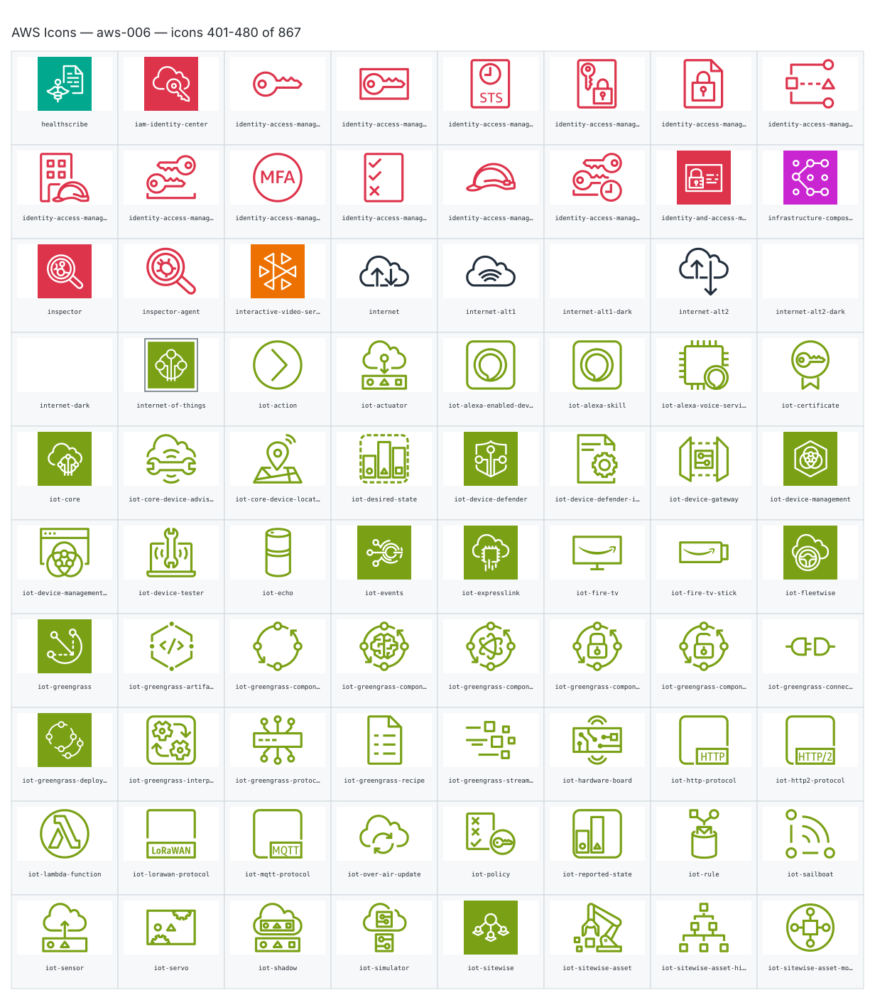

- `aws:healthscribe` — Healthscribe — [aws-006.svg](sheets/aws-006.svg) r0c0 — `service example(aws:healthscribe)[Healthscribe]`
- `aws:iam-identity-center` — Iam Identity Center — [aws-006.svg](sheets/aws-006.svg) r0c1 — `service example(aws:iam-identity-center)[Iam Identity Center]`
- `aws:identity-access-management-add-on` — Identity Access Management Add On — [aws-006.svg](sheets/aws-006.svg) r0c2 — `service example(aws:identity-access-management-add-on)[Identity Access Management Add On]`
- `aws:identity-access-management-aws-sts` — Identity Access Management Aws Sts — [aws-006.svg](sheets/aws-006.svg) r0c3 — `service example(aws:identity-access-management-aws-sts)[Identity Access Management Aws Sts]`
- `aws:identity-access-management-aws-sts-alternate` — Identity Access Management Aws Sts Alternate — [aws-006.svg](sheets/aws-006.svg) r0c4 — `service example(aws:identity-access-management-aws-sts-alternate)[Identity Access Management Aws Sts Alternate]`
- `aws:identity-access-management-data-encryption-key` — Identity Access Management Data Encryption Key — [aws-006.svg](sheets/aws-006.svg) r0c5 — `service example(aws:identity-access-management-data-encryption-key)[Identity Access Management Data Encryption Key]`
- `aws:identity-access-management-encrypted-data` — Identity Access Management Encrypted Data — [aws-006.svg](sheets/aws-006.svg) r0c6 — `service example(aws:identity-access-management-encrypted-data)[Identity Access Management Encrypted Data]`
- `aws:identity-access-management-iam-access-analyzer` — Identity Access Management Iam Access Analyzer — [aws-006.svg](sheets/aws-006.svg) r0c7 — `service example(aws:identity-access-management-iam-access-analyzer)[Identity Access Management Iam Access Analyzer]`
- `aws:identity-access-management-iam-roles-anywhere` — Identity Access Management Iam Roles Anywhere — [aws-006.svg](sheets/aws-006.svg) r1c0 — `service example(aws:identity-access-management-iam-roles-anywhere)[Identity Access Management Iam Roles Anywhere]`
- `aws:identity-access-management-long-term-security-credential` — Identity Access Management Long Term Security Credential — [aws-006.svg](sheets/aws-006.svg) r1c1 — `service example(aws:identity-access-management-long-term-security-credential)[Identity Access Management Long Term Security Credential]`
- `aws:identity-access-management-mfa-token` — Identity Access Management Mfa Token — [aws-006.svg](sheets/aws-006.svg) r1c2 — `service example(aws:identity-access-management-mfa-token)[Identity Access Management Mfa Token]`
- `aws:identity-access-management-permissions` — Identity Access Management Permissions — [aws-006.svg](sheets/aws-006.svg) r1c3 — `service example(aws:identity-access-management-permissions)[Identity Access Management Permissions]`
- `aws:identity-access-management-role` — Identity Access Management Role — [aws-006.svg](sheets/aws-006.svg) r1c4 — `service example(aws:identity-access-management-role)[Identity Access Management Role]`
- `aws:identity-access-management-temporary-security-credential` — Identity Access Management Temporary Security Credential — [aws-006.svg](sheets/aws-006.svg) r1c5 — `service example(aws:identity-access-management-temporary-security-credential)[Identity Access Management Temporary Security Credential]`
- `aws:identity-and-access-management` — Identity And Access Management — [aws-006.svg](sheets/aws-006.svg) r1c6 — `service example(aws:identity-and-access-management)[Identity And Access Management]`
- `aws:infrastructure-composer` — Infrastructure Composer — [aws-006.svg](sheets/aws-006.svg) r1c7 — `service example(aws:infrastructure-composer)[Infrastructure Composer]`
- `aws:inspector` — Inspector — [aws-006.svg](sheets/aws-006.svg) r2c0 — `service example(aws:inspector)[Inspector]`
- `aws:inspector-agent` — Inspector Agent — [aws-006.svg](sheets/aws-006.svg) r2c1 — `service example(aws:inspector-agent)[Inspector Agent]`
- `aws:interactive-video-service` — Interactive Video Service — [aws-006.svg](sheets/aws-006.svg) r2c2 — `service example(aws:interactive-video-service)[Interactive Video Service]`
- `aws:internet` — Internet — [aws-006.svg](sheets/aws-006.svg) r2c3 — `service example(aws:internet)[Internet]`
- `aws:internet-alt1` — Internet Alt1 — [aws-006.svg](sheets/aws-006.svg) r2c4 — `service example(aws:internet-alt1)[Internet Alt1]`
- `aws:internet-alt1-dark` — Internet Alt1 Dark — [aws-006.svg](sheets/aws-006.svg) r2c5 — `service example(aws:internet-alt1-dark)[Internet Alt1 Dark]`
- `aws:internet-alt2` — Internet Alt2 — [aws-006.svg](sheets/aws-006.svg) r2c6 — `service example(aws:internet-alt2)[Internet Alt2]`
- `aws:internet-alt2-dark` — Internet Alt2 Dark — [aws-006.svg](sheets/aws-006.svg) r2c7 — `service example(aws:internet-alt2-dark)[Internet Alt2 Dark]`
- `aws:internet-dark` — Internet Dark — [aws-006.svg](sheets/aws-006.svg) r3c0 — `service example(aws:internet-dark)[Internet Dark]`
- `aws:internet-of-things` — Internet Of Things — [aws-006.svg](sheets/aws-006.svg) r3c1 — `service example(aws:internet-of-things)[Internet Of Things]`
- `aws:iot-action` — Iot Action — [aws-006.svg](sheets/aws-006.svg) r3c2 — `service example(aws:iot-action)[Iot Action]`
- `aws:iot-actuator` — Iot Actuator — [aws-006.svg](sheets/aws-006.svg) r3c3 — `service example(aws:iot-actuator)[Iot Actuator]`
- `aws:iot-alexa-enabled-device` — Iot Alexa Enabled Device — [aws-006.svg](sheets/aws-006.svg) r3c4 — `service example(aws:iot-alexa-enabled-device)[Iot Alexa Enabled Device]`
- `aws:iot-alexa-skill` — Iot Alexa Skill — [aws-006.svg](sheets/aws-006.svg) r3c5 — `service example(aws:iot-alexa-skill)[Iot Alexa Skill]`
- `aws:iot-alexa-voice-service` — Iot Alexa Voice Service — [aws-006.svg](sheets/aws-006.svg) r3c6 — `service example(aws:iot-alexa-voice-service)[Iot Alexa Voice Service]`
- `aws:iot-certificate` — Iot Certificate — [aws-006.svg](sheets/aws-006.svg) r3c7 — `service example(aws:iot-certificate)[Iot Certificate]`
- `aws:iot-core` — Iot Core — [aws-006.svg](sheets/aws-006.svg) r4c0 — `service example(aws:iot-core)[Iot Core]`
- `aws:iot-core-device-advisor` — Iot Core Device Advisor — [aws-006.svg](sheets/aws-006.svg) r4c1 — `service example(aws:iot-core-device-advisor)[Iot Core Device Advisor]`
- `aws:iot-core-device-location` — Iot Core Device Location — [aws-006.svg](sheets/aws-006.svg) r4c2 — `service example(aws:iot-core-device-location)[Iot Core Device Location]`
- `aws:iot-desired-state` — Iot Desired State — [aws-006.svg](sheets/aws-006.svg) r4c3 — `service example(aws:iot-desired-state)[Iot Desired State]`
- `aws:iot-device-defender` — Iot Device Defender — [aws-006.svg](sheets/aws-006.svg) r4c4 — `service example(aws:iot-device-defender)[Iot Device Defender]`
- `aws:iot-device-defender-iot-device-jobs` — Iot Device Defender Iot Device Jobs — [aws-006.svg](sheets/aws-006.svg) r4c5 — `service example(aws:iot-device-defender-iot-device-jobs)[Iot Device Defender Iot Device Jobs]`
- `aws:iot-device-gateway` — Iot Device Gateway — [aws-006.svg](sheets/aws-006.svg) r4c6 — `service example(aws:iot-device-gateway)[Iot Device Gateway]`
- `aws:iot-device-management` — Iot Device Management — [aws-006.svg](sheets/aws-006.svg) r4c7 — `service example(aws:iot-device-management)[Iot Device Management]`
- `aws:iot-device-management-fleet-hub` — Iot Device Management Fleet Hub — [aws-006.svg](sheets/aws-006.svg) r5c0 — `service example(aws:iot-device-management-fleet-hub)[Iot Device Management Fleet Hub]`
- `aws:iot-device-tester` — Iot Device Tester — [aws-006.svg](sheets/aws-006.svg) r5c1 — `service example(aws:iot-device-tester)[Iot Device Tester]`
- `aws:iot-echo` — Iot Echo — [aws-006.svg](sheets/aws-006.svg) r5c2 — `service example(aws:iot-echo)[Iot Echo]`
- `aws:iot-events` — Iot Events — [aws-006.svg](sheets/aws-006.svg) r5c3 — `service example(aws:iot-events)[Iot Events]`
- `aws:iot-expresslink` — Iot Expresslink — [aws-006.svg](sheets/aws-006.svg) r5c4 — `service example(aws:iot-expresslink)[Iot Expresslink]`
- `aws:iot-fire-tv` — Iot Fire Tv — [aws-006.svg](sheets/aws-006.svg) r5c5 — `service example(aws:iot-fire-tv)[Iot Fire Tv]`
- `aws:iot-fire-tv-stick` — Iot Fire Tv Stick — [aws-006.svg](sheets/aws-006.svg) r5c6 — `service example(aws:iot-fire-tv-stick)[Iot Fire Tv Stick]`
- `aws:iot-fleetwise` — Iot Fleetwise — [aws-006.svg](sheets/aws-006.svg) r5c7 — `service example(aws:iot-fleetwise)[Iot Fleetwise]`
- `aws:iot-greengrass` — Iot Greengrass — [aws-006.svg](sheets/aws-006.svg) r6c0 — `service example(aws:iot-greengrass)[Iot Greengrass]`
- `aws:iot-greengrass-artifact` — Iot Greengrass Artifact — [aws-006.svg](sheets/aws-006.svg) r6c1 — `service example(aws:iot-greengrass-artifact)[Iot Greengrass Artifact]`
- `aws:iot-greengrass-component` — Iot Greengrass Component — [aws-006.svg](sheets/aws-006.svg) r6c2 — `service example(aws:iot-greengrass-component)[Iot Greengrass Component]`
- `aws:iot-greengrass-component-machine-learning` — Iot Greengrass Component Machine Learning — [aws-006.svg](sheets/aws-006.svg) r6c3 — `service example(aws:iot-greengrass-component-machine-learning)[Iot Greengrass Component Machine Learning]`
- `aws:iot-greengrass-component-nucleus` — Iot Greengrass Component Nucleus — [aws-006.svg](sheets/aws-006.svg) r6c4 — `service example(aws:iot-greengrass-component-nucleus)[Iot Greengrass Component Nucleus]`
- `aws:iot-greengrass-component-private` — Iot Greengrass Component Private — [aws-006.svg](sheets/aws-006.svg) r6c5 — `service example(aws:iot-greengrass-component-private)[Iot Greengrass Component Private]`
- `aws:iot-greengrass-component-public` — Iot Greengrass Component Public — [aws-006.svg](sheets/aws-006.svg) r6c6 — `service example(aws:iot-greengrass-component-public)[Iot Greengrass Component Public]`
- `aws:iot-greengrass-connector` — Iot Greengrass Connector — [aws-006.svg](sheets/aws-006.svg) r6c7 — `service example(aws:iot-greengrass-connector)[Iot Greengrass Connector]`
- `aws:iot-greengrass-deployment` — Iot Greengrass Deployment — [aws-006.svg](sheets/aws-006.svg) r7c0 — `service example(aws:iot-greengrass-deployment)[Iot Greengrass Deployment]`
- `aws:iot-greengrass-interprocess-communication` — Iot Greengrass Interprocess Communication — [aws-006.svg](sheets/aws-006.svg) r7c1 — `service example(aws:iot-greengrass-interprocess-communication)[Iot Greengrass Interprocess Communication]`
- `aws:iot-greengrass-protocol` — Iot Greengrass Protocol — [aws-006.svg](sheets/aws-006.svg) r7c2 — `service example(aws:iot-greengrass-protocol)[Iot Greengrass Protocol]`
- `aws:iot-greengrass-recipe` — Iot Greengrass Recipe — [aws-006.svg](sheets/aws-006.svg) r7c3 — `service example(aws:iot-greengrass-recipe)[Iot Greengrass Recipe]`
- `aws:iot-greengrass-stream-manager` — Iot Greengrass Stream Manager — [aws-006.svg](sheets/aws-006.svg) r7c4 — `service example(aws:iot-greengrass-stream-manager)[Iot Greengrass Stream Manager]`
- `aws:iot-hardware-board` — Iot Hardware Board — [aws-006.svg](sheets/aws-006.svg) r7c5 — `service example(aws:iot-hardware-board)[Iot Hardware Board]`
- `aws:iot-http-protocol` — Iot Http Protocol — [aws-006.svg](sheets/aws-006.svg) r7c6 — `service example(aws:iot-http-protocol)[Iot Http Protocol]`
- `aws:iot-http2-protocol` — Iot Http2 Protocol — [aws-006.svg](sheets/aws-006.svg) r7c7 — `service example(aws:iot-http2-protocol)[Iot Http2 Protocol]`
- `aws:iot-lambda-function` — Iot Lambda Function — [aws-006.svg](sheets/aws-006.svg) r8c0 — `service example(aws:iot-lambda-function)[Iot Lambda Function]`
- `aws:iot-lorawan-protocol` — Iot Lorawan Protocol — [aws-006.svg](sheets/aws-006.svg) r8c1 — `service example(aws:iot-lorawan-protocol)[Iot Lorawan Protocol]`
- `aws:iot-mqtt-protocol` — Iot Mqtt Protocol — [aws-006.svg](sheets/aws-006.svg) r8c2 — `service example(aws:iot-mqtt-protocol)[Iot Mqtt Protocol]`
- `aws:iot-over-air-update` — Iot Over Air Update — [aws-006.svg](sheets/aws-006.svg) r8c3 — `service example(aws:iot-over-air-update)[Iot Over Air Update]`
- `aws:iot-policy` — Iot Policy — [aws-006.svg](sheets/aws-006.svg) r8c4 — `service example(aws:iot-policy)[Iot Policy]`
- `aws:iot-reported-state` — Iot Reported State — [aws-006.svg](sheets/aws-006.svg) r8c5 — `service example(aws:iot-reported-state)[Iot Reported State]`
- `aws:iot-rule` — Iot Rule — [aws-006.svg](sheets/aws-006.svg) r8c6 — `service example(aws:iot-rule)[Iot Rule]`
- `aws:iot-sailboat` — Iot Sailboat — [aws-006.svg](sheets/aws-006.svg) r8c7 — `service example(aws:iot-sailboat)[Iot Sailboat]`
- `aws:iot-sensor` — Iot Sensor — [aws-006.svg](sheets/aws-006.svg) r9c0 — `service example(aws:iot-sensor)[Iot Sensor]`
- `aws:iot-servo` — Iot Servo — [aws-006.svg](sheets/aws-006.svg) r9c1 — `service example(aws:iot-servo)[Iot Servo]`
- `aws:iot-shadow` — Iot Shadow — [aws-006.svg](sheets/aws-006.svg) r9c2 — `service example(aws:iot-shadow)[Iot Shadow]`
- `aws:iot-simulator` — Iot Simulator — [aws-006.svg](sheets/aws-006.svg) r9c3 — `service example(aws:iot-simulator)[Iot Simulator]`
- `aws:iot-sitewise` — Iot Sitewise — [aws-006.svg](sheets/aws-006.svg) r9c4 — `service example(aws:iot-sitewise)[Iot Sitewise]`
- `aws:iot-sitewise-asset` — Iot Sitewise Asset — [aws-006.svg](sheets/aws-006.svg) r9c5 — `service example(aws:iot-sitewise-asset)[Iot Sitewise Asset]`
- `aws:iot-sitewise-asset-hierarchy` — Iot Sitewise Asset Hierarchy — [aws-006.svg](sheets/aws-006.svg) r9c6 — `service example(aws:iot-sitewise-asset-hierarchy)[Iot Sitewise Asset Hierarchy]`
- `aws:iot-sitewise-asset-model` — Iot Sitewise Asset Model — [aws-006.svg](sheets/aws-006.svg) r9c7 — `service example(aws:iot-sitewise-asset-model)[Iot Sitewise Asset Model]`

## aws-007

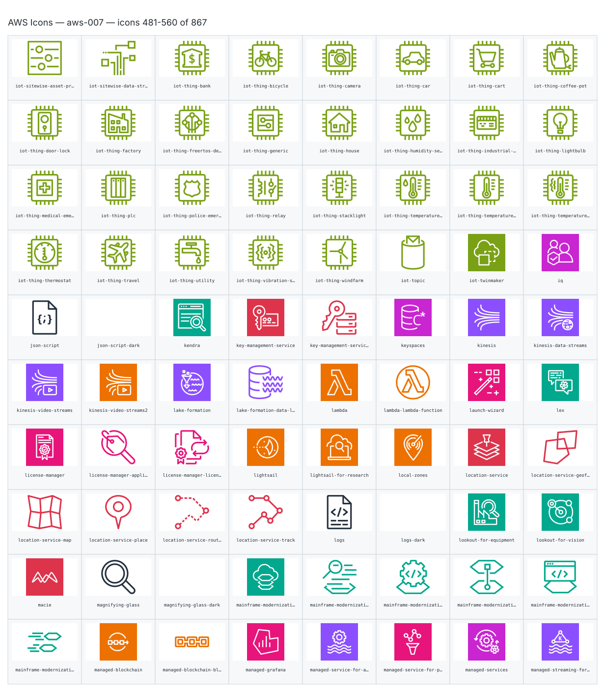

- `aws:iot-sitewise-asset-properties` — Iot Sitewise Asset Properties — [aws-007.svg](sheets/aws-007.svg) r0c0 — `service example(aws:iot-sitewise-asset-properties)[Iot Sitewise Asset Properties]`
- `aws:iot-sitewise-data-streams` — Iot Sitewise Data Streams — [aws-007.svg](sheets/aws-007.svg) r0c1 — `service example(aws:iot-sitewise-data-streams)[Iot Sitewise Data Streams]`
- `aws:iot-thing-bank` — Iot Thing Bank — [aws-007.svg](sheets/aws-007.svg) r0c2 — `service example(aws:iot-thing-bank)[Iot Thing Bank]`
- `aws:iot-thing-bicycle` — Iot Thing Bicycle — [aws-007.svg](sheets/aws-007.svg) r0c3 — `service example(aws:iot-thing-bicycle)[Iot Thing Bicycle]`
- `aws:iot-thing-camera` — Iot Thing Camera — [aws-007.svg](sheets/aws-007.svg) r0c4 — `service example(aws:iot-thing-camera)[Iot Thing Camera]`
- `aws:iot-thing-car` — Iot Thing Car — [aws-007.svg](sheets/aws-007.svg) r0c5 — `service example(aws:iot-thing-car)[Iot Thing Car]`
- `aws:iot-thing-cart` — Iot Thing Cart — [aws-007.svg](sheets/aws-007.svg) r0c6 — `service example(aws:iot-thing-cart)[Iot Thing Cart]`
- `aws:iot-thing-coffee-pot` — Iot Thing Coffee Pot — [aws-007.svg](sheets/aws-007.svg) r0c7 — `service example(aws:iot-thing-coffee-pot)[Iot Thing Coffee Pot]`
- `aws:iot-thing-door-lock` — Iot Thing Door Lock — [aws-007.svg](sheets/aws-007.svg) r1c0 — `service example(aws:iot-thing-door-lock)[Iot Thing Door Lock]`
- `aws:iot-thing-factory` — Iot Thing Factory — [aws-007.svg](sheets/aws-007.svg) r1c1 — `service example(aws:iot-thing-factory)[Iot Thing Factory]`
- `aws:iot-thing-freertos-device` — Iot Thing Freertos Device — [aws-007.svg](sheets/aws-007.svg) r1c2 — `service example(aws:iot-thing-freertos-device)[Iot Thing Freertos Device]`
- `aws:iot-thing-generic` — Iot Thing Generic — [aws-007.svg](sheets/aws-007.svg) r1c3 — `service example(aws:iot-thing-generic)[Iot Thing Generic]`
- `aws:iot-thing-house` — Iot Thing House — [aws-007.svg](sheets/aws-007.svg) r1c4 — `service example(aws:iot-thing-house)[Iot Thing House]`
- `aws:iot-thing-humidity-sensor` — Iot Thing Humidity Sensor — [aws-007.svg](sheets/aws-007.svg) r1c5 — `service example(aws:iot-thing-humidity-sensor)[Iot Thing Humidity Sensor]`
- `aws:iot-thing-industrial-pc` — Iot Thing Industrial Pc — [aws-007.svg](sheets/aws-007.svg) r1c6 — `service example(aws:iot-thing-industrial-pc)[Iot Thing Industrial Pc]`
- `aws:iot-thing-lightbulb` — Iot Thing Lightbulb — [aws-007.svg](sheets/aws-007.svg) r1c7 — `service example(aws:iot-thing-lightbulb)[Iot Thing Lightbulb]`
- `aws:iot-thing-medical-emergency` — Iot Thing Medical Emergency — [aws-007.svg](sheets/aws-007.svg) r2c0 — `service example(aws:iot-thing-medical-emergency)[Iot Thing Medical Emergency]`
- `aws:iot-thing-plc` — Iot Thing Plc — [aws-007.svg](sheets/aws-007.svg) r2c1 — `service example(aws:iot-thing-plc)[Iot Thing Plc]`
- `aws:iot-thing-police-emergency` — Iot Thing Police Emergency — [aws-007.svg](sheets/aws-007.svg) r2c2 — `service example(aws:iot-thing-police-emergency)[Iot Thing Police Emergency]`
- `aws:iot-thing-relay` — Iot Thing Relay — [aws-007.svg](sheets/aws-007.svg) r2c3 — `service example(aws:iot-thing-relay)[Iot Thing Relay]`
- `aws:iot-thing-stacklight` — Iot Thing Stacklight — [aws-007.svg](sheets/aws-007.svg) r2c4 — `service example(aws:iot-thing-stacklight)[Iot Thing Stacklight]`
- `aws:iot-thing-temperature-humidity-sensor` — Iot Thing Temperature Humidity Sensor — [aws-007.svg](sheets/aws-007.svg) r2c5 — `service example(aws:iot-thing-temperature-humidity-sensor)[Iot Thing Temperature Humidity Sensor]`
- `aws:iot-thing-temperature-sensor` — Iot Thing Temperature Sensor — [aws-007.svg](sheets/aws-007.svg) r2c6 — `service example(aws:iot-thing-temperature-sensor)[Iot Thing Temperature Sensor]`
- `aws:iot-thing-temperature-vibration-sensor` — Iot Thing Temperature Vibration Sensor — [aws-007.svg](sheets/aws-007.svg) r2c7 — `service example(aws:iot-thing-temperature-vibration-sensor)[Iot Thing Temperature Vibration Sensor]`
- `aws:iot-thing-thermostat` — Iot Thing Thermostat — [aws-007.svg](sheets/aws-007.svg) r3c0 — `service example(aws:iot-thing-thermostat)[Iot Thing Thermostat]`
- `aws:iot-thing-travel` — Iot Thing Travel — [aws-007.svg](sheets/aws-007.svg) r3c1 — `service example(aws:iot-thing-travel)[Iot Thing Travel]`
- `aws:iot-thing-utility` — Iot Thing Utility — [aws-007.svg](sheets/aws-007.svg) r3c2 — `service example(aws:iot-thing-utility)[Iot Thing Utility]`
- `aws:iot-thing-vibration-sensor` — Iot Thing Vibration Sensor — [aws-007.svg](sheets/aws-007.svg) r3c3 — `service example(aws:iot-thing-vibration-sensor)[Iot Thing Vibration Sensor]`
- `aws:iot-thing-windfarm` — Iot Thing Windfarm — [aws-007.svg](sheets/aws-007.svg) r3c4 — `service example(aws:iot-thing-windfarm)[Iot Thing Windfarm]`
- `aws:iot-topic` — Iot Topic — [aws-007.svg](sheets/aws-007.svg) r3c5 — `service example(aws:iot-topic)[Iot Topic]`
- `aws:iot-twinmaker` — Iot Twinmaker — [aws-007.svg](sheets/aws-007.svg) r3c6 — `service example(aws:iot-twinmaker)[Iot Twinmaker]`
- `aws:iq` — Iq — [aws-007.svg](sheets/aws-007.svg) r3c7 — `service example(aws:iq)[Iq]`
- `aws:json-script` — Json Script — [aws-007.svg](sheets/aws-007.svg) r4c0 — `service example(aws:json-script)[Json Script]`
- `aws:json-script-dark` — Json Script Dark — [aws-007.svg](sheets/aws-007.svg) r4c1 — `service example(aws:json-script-dark)[Json Script Dark]`
- `aws:kendra` — Kendra — [aws-007.svg](sheets/aws-007.svg) r4c2 — `service example(aws:kendra)[Kendra]`
- `aws:key-management-service` — Key Management Service — [aws-007.svg](sheets/aws-007.svg) r4c3 — `service example(aws:key-management-service)[Key Management Service]`
- `aws:key-management-service-external-key-store` — Key Management Service External Key Store — [aws-007.svg](sheets/aws-007.svg) r4c4 — `service example(aws:key-management-service-external-key-store)[Key Management Service External Key Store]`
- `aws:keyspaces` — Keyspaces — [aws-007.svg](sheets/aws-007.svg) r4c5 — `service example(aws:keyspaces)[Keyspaces]`
- `aws:kinesis` — Kinesis — [aws-007.svg](sheets/aws-007.svg) r4c6 — `service example(aws:kinesis)[Kinesis]`
- `aws:kinesis-data-streams` — Kinesis Data Streams — [aws-007.svg](sheets/aws-007.svg) r4c7 — `service example(aws:kinesis-data-streams)[Kinesis Data Streams]`
- `aws:kinesis-video-streams` — Kinesis Video Streams — [aws-007.svg](sheets/aws-007.svg) r5c0 — `service example(aws:kinesis-video-streams)[Kinesis Video Streams]`
- `aws:kinesis-video-streams2` — Kinesis Video Streams2 — [aws-007.svg](sheets/aws-007.svg) r5c1 — `service example(aws:kinesis-video-streams2)[Kinesis Video Streams2]`
- `aws:lake-formation` — Lake Formation — [aws-007.svg](sheets/aws-007.svg) r5c2 — `service example(aws:lake-formation)[Lake Formation]`
- `aws:lake-formation-data-lake` — Lake Formation Data Lake — [aws-007.svg](sheets/aws-007.svg) r5c3 — `service example(aws:lake-formation-data-lake)[Lake Formation Data Lake]`
- `aws:lambda` — Lambda — [aws-007.svg](sheets/aws-007.svg) r5c4 — `service example(aws:lambda)[Lambda]`
- `aws:lambda-lambda-function` — Lambda Lambda Function — [aws-007.svg](sheets/aws-007.svg) r5c5 — `service example(aws:lambda-lambda-function)[Lambda Lambda Function]`
- `aws:launch-wizard` — Launch Wizard — [aws-007.svg](sheets/aws-007.svg) r5c6 — `service example(aws:launch-wizard)[Launch Wizard]`
- `aws:lex` — Lex — [aws-007.svg](sheets/aws-007.svg) r5c7 — `service example(aws:lex)[Lex]`
- `aws:license-manager` — License Manager — [aws-007.svg](sheets/aws-007.svg) r6c0 — `service example(aws:license-manager)[License Manager]`
- `aws:license-manager-application-discovery` — License Manager Application Discovery — [aws-007.svg](sheets/aws-007.svg) r6c1 — `service example(aws:license-manager-application-discovery)[License Manager Application Discovery]`
- `aws:license-manager-license-blending` — License Manager License Blending — [aws-007.svg](sheets/aws-007.svg) r6c2 — `service example(aws:license-manager-license-blending)[License Manager License Blending]`
- `aws:lightsail` — Lightsail — [aws-007.svg](sheets/aws-007.svg) r6c3 — `service example(aws:lightsail)[Lightsail]`
- `aws:lightsail-for-research` — Lightsail For Research — [aws-007.svg](sheets/aws-007.svg) r6c4 — `service example(aws:lightsail-for-research)[Lightsail For Research]`
- `aws:local-zones` — Local Zones — [aws-007.svg](sheets/aws-007.svg) r6c5 — `service example(aws:local-zones)[Local Zones]`
- `aws:location-service` — Location Service — [aws-007.svg](sheets/aws-007.svg) r6c6 — `service example(aws:location-service)[Location Service]`
- `aws:location-service-geofence` — Location Service Geofence — [aws-007.svg](sheets/aws-007.svg) r6c7 — `service example(aws:location-service-geofence)[Location Service Geofence]`
- `aws:location-service-map` — Location Service Map — [aws-007.svg](sheets/aws-007.svg) r7c0 — `service example(aws:location-service-map)[Location Service Map]`
- `aws:location-service-place` — Location Service Place — [aws-007.svg](sheets/aws-007.svg) r7c1 — `service example(aws:location-service-place)[Location Service Place]`
- `aws:location-service-routes` — Location Service Routes — [aws-007.svg](sheets/aws-007.svg) r7c2 — `service example(aws:location-service-routes)[Location Service Routes]`
- `aws:location-service-track` — Location Service Track — [aws-007.svg](sheets/aws-007.svg) r7c3 — `service example(aws:location-service-track)[Location Service Track]`
- `aws:logs` — Logs — [aws-007.svg](sheets/aws-007.svg) r7c4 — `service example(aws:logs)[Logs]`
- `aws:logs-dark` — Logs Dark — [aws-007.svg](sheets/aws-007.svg) r7c5 — `service example(aws:logs-dark)[Logs Dark]`
- `aws:lookout-for-equipment` — Lookout For Equipment — [aws-007.svg](sheets/aws-007.svg) r7c6 — `service example(aws:lookout-for-equipment)[Lookout For Equipment]`
- `aws:lookout-for-vision` — Lookout For Vision — [aws-007.svg](sheets/aws-007.svg) r7c7 — `service example(aws:lookout-for-vision)[Lookout For Vision]`
- `aws:macie` — Macie — [aws-007.svg](sheets/aws-007.svg) r8c0 — `service example(aws:macie)[Macie]`
- `aws:magnifying-glass` — Magnifying Glass — [aws-007.svg](sheets/aws-007.svg) r8c1 — `service example(aws:magnifying-glass)[Magnifying Glass]`
- `aws:magnifying-glass-dark` — Magnifying Glass Dark — [aws-007.svg](sheets/aws-007.svg) r8c2 — `service example(aws:magnifying-glass-dark)[Magnifying Glass Dark]`
- `aws:mainframe-modernization` — Mainframe Modernization — [aws-007.svg](sheets/aws-007.svg) r8c3 — `service example(aws:mainframe-modernization)[Mainframe Modernization]`
- `aws:mainframe-modernization-analyzer` — Mainframe Modernization Analyzer — [aws-007.svg](sheets/aws-007.svg) r8c4 — `service example(aws:mainframe-modernization-analyzer)[Mainframe Modernization Analyzer]`
- `aws:mainframe-modernization-compiler` — Mainframe Modernization Compiler — [aws-007.svg](sheets/aws-007.svg) r8c5 — `service example(aws:mainframe-modernization-compiler)[Mainframe Modernization Compiler]`
- `aws:mainframe-modernization-converter` — Mainframe Modernization Converter — [aws-007.svg](sheets/aws-007.svg) r8c6 — `service example(aws:mainframe-modernization-converter)[Mainframe Modernization Converter]`
- `aws:mainframe-modernization-developer` — Mainframe Modernization Developer — [aws-007.svg](sheets/aws-007.svg) r8c7 — `service example(aws:mainframe-modernization-developer)[Mainframe Modernization Developer]`
- `aws:mainframe-modernization-runtime` — Mainframe Modernization Runtime — [aws-007.svg](sheets/aws-007.svg) r9c0 — `service example(aws:mainframe-modernization-runtime)[Mainframe Modernization Runtime]`
- `aws:managed-blockchain` — Managed Blockchain — [aws-007.svg](sheets/aws-007.svg) r9c1 — `service example(aws:managed-blockchain)[Managed Blockchain]`
- `aws:managed-blockchain-blockchain` — Managed Blockchain Blockchain — [aws-007.svg](sheets/aws-007.svg) r9c2 — `service example(aws:managed-blockchain-blockchain)[Managed Blockchain Blockchain]`
- `aws:managed-grafana` — Managed Grafana — [aws-007.svg](sheets/aws-007.svg) r9c3 — `service example(aws:managed-grafana)[Managed Grafana]`
- `aws:managed-service-for-apache-flink` — Managed Service For Apache Flink — [aws-007.svg](sheets/aws-007.svg) r9c4 — `service example(aws:managed-service-for-apache-flink)[Managed Service For Apache Flink]`
- `aws:managed-service-for-prometheus` — Managed Service For Prometheus — [aws-007.svg](sheets/aws-007.svg) r9c5 — `service example(aws:managed-service-for-prometheus)[Managed Service For Prometheus]`
- `aws:managed-services` — Managed Services — [aws-007.svg](sheets/aws-007.svg) r9c6 — `service example(aws:managed-services)[Managed Services]`
- `aws:managed-streaming-for-apache-kafka` — Managed Streaming For Apache Kafka — [aws-007.svg](sheets/aws-007.svg) r9c7 — `service example(aws:managed-streaming-for-apache-kafka)[Managed Streaming For Apache Kafka]`

## aws-008

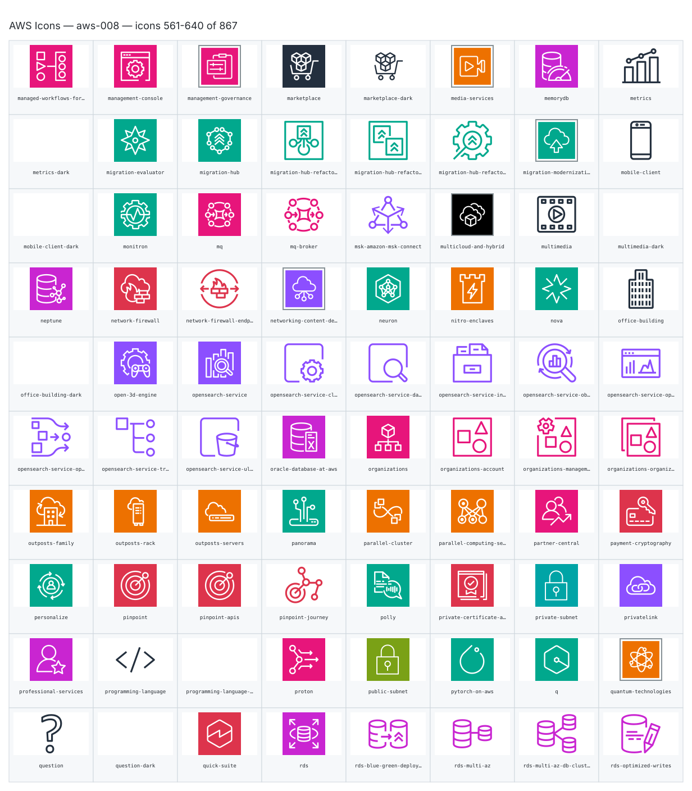

- `aws:managed-workflows-for-apache-airflow` — Managed Workflows For Apache Airflow — [aws-008.svg](sheets/aws-008.svg) r0c0 — `service example(aws:managed-workflows-for-apache-airflow)[Managed Workflows For Apache Airflow]`
- `aws:management-console` — Management Console — [aws-008.svg](sheets/aws-008.svg) r0c1 — `service example(aws:management-console)[Management Console]`
- `aws:management-governance` — Management Governance — [aws-008.svg](sheets/aws-008.svg) r0c2 — `service example(aws:management-governance)[Management Governance]`
- `aws:marketplace` — Marketplace — [aws-008.svg](sheets/aws-008.svg) r0c3 — `service example(aws:marketplace)[Marketplace]`
- `aws:marketplace-dark` — Marketplace Dark — [aws-008.svg](sheets/aws-008.svg) r0c4 — `service example(aws:marketplace-dark)[Marketplace Dark]`
- `aws:media-services` — Media Services — [aws-008.svg](sheets/aws-008.svg) r0c5 — `service example(aws:media-services)[Media Services]`
- `aws:memorydb` — Memorydb — [aws-008.svg](sheets/aws-008.svg) r0c6 — `service example(aws:memorydb)[Memorydb]`
- `aws:metrics` — Metrics — [aws-008.svg](sheets/aws-008.svg) r0c7 — `service example(aws:metrics)[Metrics]`
- `aws:metrics-dark` — Metrics Dark — [aws-008.svg](sheets/aws-008.svg) r1c0 — `service example(aws:metrics-dark)[Metrics Dark]`
- `aws:migration-evaluator` — Migration Evaluator — [aws-008.svg](sheets/aws-008.svg) r1c1 — `service example(aws:migration-evaluator)[Migration Evaluator]`
- `aws:migration-hub` — Migration Hub — [aws-008.svg](sheets/aws-008.svg) r1c2 — `service example(aws:migration-hub)[Migration Hub]`
- `aws:migration-hub-refactor-spaces-applications` — Migration Hub Refactor Spaces Applications — [aws-008.svg](sheets/aws-008.svg) r1c3 — `service example(aws:migration-hub-refactor-spaces-applications)[Migration Hub Refactor Spaces Applications]`
- `aws:migration-hub-refactor-spaces-environments` — Migration Hub Refactor Spaces Environments — [aws-008.svg](sheets/aws-008.svg) r1c4 — `service example(aws:migration-hub-refactor-spaces-environments)[Migration Hub Refactor Spaces Environments]`
- `aws:migration-hub-refactor-spaces-services` — Migration Hub Refactor Spaces Services — [aws-008.svg](sheets/aws-008.svg) r1c5 — `service example(aws:migration-hub-refactor-spaces-services)[Migration Hub Refactor Spaces Services]`
- `aws:migration-modernization` — Migration Modernization — [aws-008.svg](sheets/aws-008.svg) r1c6 — `service example(aws:migration-modernization)[Migration Modernization]`
- `aws:mobile-client` — Mobile Client — [aws-008.svg](sheets/aws-008.svg) r1c7 — `service example(aws:mobile-client)[Mobile Client]`
- `aws:mobile-client-dark` — Mobile Client Dark — [aws-008.svg](sheets/aws-008.svg) r2c0 — `service example(aws:mobile-client-dark)[Mobile Client Dark]`
- `aws:monitron` — Monitron — [aws-008.svg](sheets/aws-008.svg) r2c1 — `service example(aws:monitron)[Monitron]`
- `aws:mq` — Mq — [aws-008.svg](sheets/aws-008.svg) r2c2 — `service example(aws:mq)[Mq]`
- `aws:mq-broker` — Mq Broker — [aws-008.svg](sheets/aws-008.svg) r2c3 — `service example(aws:mq-broker)[Mq Broker]`
- `aws:msk-amazon-msk-connect` — Msk Amazon Msk Connect — [aws-008.svg](sheets/aws-008.svg) r2c4 — `service example(aws:msk-amazon-msk-connect)[Msk Amazon Msk Connect]`
- `aws:multicloud-and-hybrid` — Multicloud And Hybrid — [aws-008.svg](sheets/aws-008.svg) r2c5 — `service example(aws:multicloud-and-hybrid)[Multicloud And Hybrid]`
- `aws:multimedia` — Multimedia — [aws-008.svg](sheets/aws-008.svg) r2c6 — `service example(aws:multimedia)[Multimedia]`
- `aws:multimedia-dark` — Multimedia Dark — [aws-008.svg](sheets/aws-008.svg) r2c7 — `service example(aws:multimedia-dark)[Multimedia Dark]`
- `aws:neptune` — Neptune — [aws-008.svg](sheets/aws-008.svg) r3c0 — `service example(aws:neptune)[Neptune]`
- `aws:network-firewall` — Network Firewall — [aws-008.svg](sheets/aws-008.svg) r3c1 — `service example(aws:network-firewall)[Network Firewall]`
- `aws:network-firewall-endpoints` — Network Firewall Endpoints — [aws-008.svg](sheets/aws-008.svg) r3c2 — `service example(aws:network-firewall-endpoints)[Network Firewall Endpoints]`
- `aws:networking-content-delivery` — Networking Content Delivery — [aws-008.svg](sheets/aws-008.svg) r3c3 — `service example(aws:networking-content-delivery)[Networking Content Delivery]`
- `aws:neuron` — Neuron — [aws-008.svg](sheets/aws-008.svg) r3c4 — `service example(aws:neuron)[Neuron]`
- `aws:nitro-enclaves` — Nitro Enclaves — [aws-008.svg](sheets/aws-008.svg) r3c5 — `service example(aws:nitro-enclaves)[Nitro Enclaves]`
- `aws:nova` — Nova — [aws-008.svg](sheets/aws-008.svg) r3c6 — `service example(aws:nova)[Nova]`
- `aws:office-building` — Office Building — [aws-008.svg](sheets/aws-008.svg) r3c7 — `service example(aws:office-building)[Office Building]`
- `aws:office-building-dark` — Office Building Dark — [aws-008.svg](sheets/aws-008.svg) r4c0 — `service example(aws:office-building-dark)[Office Building Dark]`
- `aws:open-3d-engine` — Open 3D Engine — [aws-008.svg](sheets/aws-008.svg) r4c1 — `service example(aws:open-3d-engine)[Open 3D Engine]`
- `aws:opensearch-service` — Opensearch Service — [aws-008.svg](sheets/aws-008.svg) r4c2 — `service example(aws:opensearch-service)[Opensearch Service]`
- `aws:opensearch-service-cluster-administrator-node` — Opensearch Service Cluster Administrator Node — [aws-008.svg](sheets/aws-008.svg) r4c3 — `service example(aws:opensearch-service-cluster-administrator-node)[Opensearch Service Cluster Administrator Node]`
- `aws:opensearch-service-data-node` — Opensearch Service Data Node — [aws-008.svg](sheets/aws-008.svg) r4c4 — `service example(aws:opensearch-service-data-node)[Opensearch Service Data Node]`
- `aws:opensearch-service-index` — Opensearch Service Index — [aws-008.svg](sheets/aws-008.svg) r4c5 — `service example(aws:opensearch-service-index)[Opensearch Service Index]`
- `aws:opensearch-service-observability` — Opensearch Service Observability — [aws-008.svg](sheets/aws-008.svg) r4c6 — `service example(aws:opensearch-service-observability)[Opensearch Service Observability]`
- `aws:opensearch-service-opensearch-dashboards` — Opensearch Service Opensearch Dashboards — [aws-008.svg](sheets/aws-008.svg) r4c7 — `service example(aws:opensearch-service-opensearch-dashboards)[Opensearch Service Opensearch Dashboards]`
- `aws:opensearch-service-opensearch-ingestion` — Opensearch Service Opensearch Ingestion — [aws-008.svg](sheets/aws-008.svg) r5c0 — `service example(aws:opensearch-service-opensearch-ingestion)[Opensearch Service Opensearch Ingestion]`
- `aws:opensearch-service-traces` — Opensearch Service Traces — [aws-008.svg](sheets/aws-008.svg) r5c1 — `service example(aws:opensearch-service-traces)[Opensearch Service Traces]`
- `aws:opensearch-service-ultrawarm-node` — Opensearch Service Ultrawarm Node — [aws-008.svg](sheets/aws-008.svg) r5c2 — `service example(aws:opensearch-service-ultrawarm-node)[Opensearch Service Ultrawarm Node]`
- `aws:oracle-database-at-aws` — Oracle Database At Aws — [aws-008.svg](sheets/aws-008.svg) r5c3 — `service example(aws:oracle-database-at-aws)[Oracle Database At Aws]`
- `aws:organizations` — Organizations — [aws-008.svg](sheets/aws-008.svg) r5c4 — `service example(aws:organizations)[Organizations]`
- `aws:organizations-account` — Organizations Account — [aws-008.svg](sheets/aws-008.svg) r5c5 — `service example(aws:organizations-account)[Organizations Account]`
- `aws:organizations-management-account` — Organizations Management Account — [aws-008.svg](sheets/aws-008.svg) r5c6 — `service example(aws:organizations-management-account)[Organizations Management Account]`
- `aws:organizations-organizational-unit` — Organizations Organizational Unit — [aws-008.svg](sheets/aws-008.svg) r5c7 — `service example(aws:organizations-organizational-unit)[Organizations Organizational Unit]`
- `aws:outposts-family` — Outposts Family — [aws-008.svg](sheets/aws-008.svg) r6c0 — `service example(aws:outposts-family)[Outposts Family]`
- `aws:outposts-rack` — Outposts Rack — [aws-008.svg](sheets/aws-008.svg) r6c1 — `service example(aws:outposts-rack)[Outposts Rack]`
- `aws:outposts-servers` — Outposts Servers — [aws-008.svg](sheets/aws-008.svg) r6c2 — `service example(aws:outposts-servers)[Outposts Servers]`
- `aws:panorama` — Panorama — [aws-008.svg](sheets/aws-008.svg) r6c3 — `service example(aws:panorama)[Panorama]`
- `aws:parallel-cluster` — Parallel Cluster — [aws-008.svg](sheets/aws-008.svg) r6c4 — `service example(aws:parallel-cluster)[Parallel Cluster]`
- `aws:parallel-computing-service` — Parallel Computing Service — [aws-008.svg](sheets/aws-008.svg) r6c5 — `service example(aws:parallel-computing-service)[Parallel Computing Service]`
- `aws:partner-central` — Partner Central — [aws-008.svg](sheets/aws-008.svg) r6c6 — `service example(aws:partner-central)[Partner Central]`
- `aws:payment-cryptography` — Payment Cryptography — [aws-008.svg](sheets/aws-008.svg) r6c7 — `service example(aws:payment-cryptography)[Payment Cryptography]`
- `aws:personalize` — Personalize — [aws-008.svg](sheets/aws-008.svg) r7c0 — `service example(aws:personalize)[Personalize]`
- `aws:pinpoint` — Pinpoint — [aws-008.svg](sheets/aws-008.svg) r7c1 — `service example(aws:pinpoint)[Pinpoint]`
- `aws:pinpoint-apis` — Pinpoint Apis — [aws-008.svg](sheets/aws-008.svg) r7c2 — `service example(aws:pinpoint-apis)[Pinpoint Apis]`
- `aws:pinpoint-journey` — Pinpoint Journey — [aws-008.svg](sheets/aws-008.svg) r7c3 — `service example(aws:pinpoint-journey)[Pinpoint Journey]`
- `aws:polly` — Polly — [aws-008.svg](sheets/aws-008.svg) r7c4 — `service example(aws:polly)[Polly]`
- `aws:private-certificate-authority` — Private Certificate Authority — [aws-008.svg](sheets/aws-008.svg) r7c5 — `service example(aws:private-certificate-authority)[Private Certificate Authority]`
- `aws:private-subnet` — Private Subnet — [aws-008.svg](sheets/aws-008.svg) r7c6 — `service example(aws:private-subnet)[Private Subnet]`
- `aws:privatelink` — Privatelink — [aws-008.svg](sheets/aws-008.svg) r7c7 — `service example(aws:privatelink)[Privatelink]`
- `aws:professional-services` — Professional Services — [aws-008.svg](sheets/aws-008.svg) r8c0 — `service example(aws:professional-services)[Professional Services]`
- `aws:programming-language` — Programming Language — [aws-008.svg](sheets/aws-008.svg) r8c1 — `service example(aws:programming-language)[Programming Language]`
- `aws:programming-language-dark` — Programming Language Dark — [aws-008.svg](sheets/aws-008.svg) r8c2 — `service example(aws:programming-language-dark)[Programming Language Dark]`
- `aws:proton` — Proton — [aws-008.svg](sheets/aws-008.svg) r8c3 — `service example(aws:proton)[Proton]`
- `aws:public-subnet` — Public Subnet — [aws-008.svg](sheets/aws-008.svg) r8c4 — `service example(aws:public-subnet)[Public Subnet]`
- `aws:pytorch-on-aws` — Pytorch On Aws — [aws-008.svg](sheets/aws-008.svg) r8c5 — `service example(aws:pytorch-on-aws)[Pytorch On Aws]`
- `aws:q` — Q — [aws-008.svg](sheets/aws-008.svg) r8c6 — `service example(aws:q)[Q]`
- `aws:quantum-technologies` — Quantum Technologies — [aws-008.svg](sheets/aws-008.svg) r8c7 — `service example(aws:quantum-technologies)[Quantum Technologies]`
- `aws:question` — Question — [aws-008.svg](sheets/aws-008.svg) r9c0 — `service example(aws:question)[Question]`
- `aws:question-dark` — Question Dark — [aws-008.svg](sheets/aws-008.svg) r9c1 — `service example(aws:question-dark)[Question Dark]`
- `aws:quick-suite` — Quick Suite — [aws-008.svg](sheets/aws-008.svg) r9c2 — `service example(aws:quick-suite)[Quick Suite]`
- `aws:rds` — Rds — [aws-008.svg](sheets/aws-008.svg) r9c3 — `service example(aws:rds)[Rds]`
- `aws:rds-blue-green-deployments` — Rds Blue Green Deployments — [aws-008.svg](sheets/aws-008.svg) r9c4 — `service example(aws:rds-blue-green-deployments)[Rds Blue Green Deployments]`
- `aws:rds-multi-az` — Rds Multi Az — [aws-008.svg](sheets/aws-008.svg) r9c5 — `service example(aws:rds-multi-az)[Rds Multi Az]`
- `aws:rds-multi-az-db-cluster` — Rds Multi Az Db Cluster — [aws-008.svg](sheets/aws-008.svg) r9c6 — `service example(aws:rds-multi-az-db-cluster)[Rds Multi Az Db Cluster]`
- `aws:rds-optimized-writes` — Rds Optimized Writes — [aws-008.svg](sheets/aws-008.svg) r9c7 — `service example(aws:rds-optimized-writes)[Rds Optimized Writes]`

## aws-009

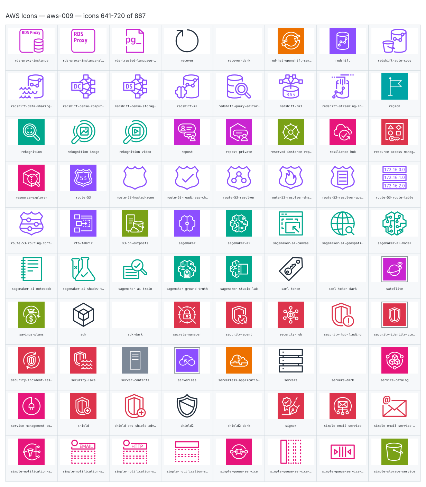

- `aws:rds-proxy-instance` — Rds Proxy Instance — [aws-009.svg](sheets/aws-009.svg) r0c0 — `service example(aws:rds-proxy-instance)[Rds Proxy Instance]`
- `aws:rds-proxy-instance-alternate` — Rds Proxy Instance Alternate — [aws-009.svg](sheets/aws-009.svg) r0c1 — `service example(aws:rds-proxy-instance-alternate)[Rds Proxy Instance Alternate]`
- `aws:rds-trusted-language-extensions-for-postgresql` — Rds Trusted Language Extensions For Postgresql — [aws-009.svg](sheets/aws-009.svg) r0c2 — `service example(aws:rds-trusted-language-extensions-for-postgresql)[Rds Trusted Language Extensions For Postgresql]`
- `aws:recover` — Recover — [aws-009.svg](sheets/aws-009.svg) r0c3 — `service example(aws:recover)[Recover]`
- `aws:recover-dark` — Recover Dark — [aws-009.svg](sheets/aws-009.svg) r0c4 — `service example(aws:recover-dark)[Recover Dark]`
- `aws:red-hat-openshift-service-on-aws` — Red Hat Openshift Service On Aws — [aws-009.svg](sheets/aws-009.svg) r0c5 — `service example(aws:red-hat-openshift-service-on-aws)[Red Hat Openshift Service On Aws]`
- `aws:redshift` — Redshift — [aws-009.svg](sheets/aws-009.svg) r0c6 — `service example(aws:redshift)[Redshift]`
- `aws:redshift-auto-copy` — Redshift Auto Copy — [aws-009.svg](sheets/aws-009.svg) r0c7 — `service example(aws:redshift-auto-copy)[Redshift Auto Copy]`
- `aws:redshift-data-sharing-governance` — Redshift Data Sharing Governance — [aws-009.svg](sheets/aws-009.svg) r1c0 — `service example(aws:redshift-data-sharing-governance)[Redshift Data Sharing Governance]`
- `aws:redshift-dense-compute-node` — Redshift Dense Compute Node — [aws-009.svg](sheets/aws-009.svg) r1c1 — `service example(aws:redshift-dense-compute-node)[Redshift Dense Compute Node]`
- `aws:redshift-dense-storage-node` — Redshift Dense Storage Node — [aws-009.svg](sheets/aws-009.svg) r1c2 — `service example(aws:redshift-dense-storage-node)[Redshift Dense Storage Node]`
- `aws:redshift-ml` — Redshift Ml — [aws-009.svg](sheets/aws-009.svg) r1c3 — `service example(aws:redshift-ml)[Redshift Ml]`
- `aws:redshift-query-editor-v2.0` — Redshift Query Editor V2.0 — [aws-009.svg](sheets/aws-009.svg) r1c4 — `service example(aws:redshift-query-editor-v2.0)[Redshift Query Editor V2.0]`
- `aws:redshift-ra3` — Redshift Ra3 — [aws-009.svg](sheets/aws-009.svg) r1c5 — `service example(aws:redshift-ra3)[Redshift Ra3]`
- `aws:redshift-streaming-ingestion` — Redshift Streaming Ingestion — [aws-009.svg](sheets/aws-009.svg) r1c6 — `service example(aws:redshift-streaming-ingestion)[Redshift Streaming Ingestion]`
- `aws:region` — Region — [aws-009.svg](sheets/aws-009.svg) r1c7 — `service example(aws:region)[Region]`
- `aws:rekognition` — Rekognition — [aws-009.svg](sheets/aws-009.svg) r2c0 — `service example(aws:rekognition)[Rekognition]`
- `aws:rekognition-image` — Rekognition Image — [aws-009.svg](sheets/aws-009.svg) r2c1 — `service example(aws:rekognition-image)[Rekognition Image]`
- `aws:rekognition-video` — Rekognition Video — [aws-009.svg](sheets/aws-009.svg) r2c2 — `service example(aws:rekognition-video)[Rekognition Video]`
- `aws:repost` — Repost — [aws-009.svg](sheets/aws-009.svg) r2c3 — `service example(aws:repost)[Repost]`
- `aws:repost-private` — Repost Private — [aws-009.svg](sheets/aws-009.svg) r2c4 — `service example(aws:repost-private)[Repost Private]`
- `aws:reserved-instance-reporting` — Reserved Instance Reporting — [aws-009.svg](sheets/aws-009.svg) r2c5 — `service example(aws:reserved-instance-reporting)[Reserved Instance Reporting]`
- `aws:resilience-hub` — Resilience Hub — [aws-009.svg](sheets/aws-009.svg) r2c6 — `service example(aws:resilience-hub)[Resilience Hub]`
- `aws:resource-access-manager` — Resource Access Manager — [aws-009.svg](sheets/aws-009.svg) r2c7 — `service example(aws:resource-access-manager)[Resource Access Manager]`
- `aws:resource-explorer` — Resource Explorer — [aws-009.svg](sheets/aws-009.svg) r3c0 — `service example(aws:resource-explorer)[Resource Explorer]`
- `aws:route-53` — Route 53 — [aws-009.svg](sheets/aws-009.svg) r3c1 — `service example(aws:route-53)[Route 53]`
- `aws:route-53-hosted-zone` — Route 53 Hosted Zone — [aws-009.svg](sheets/aws-009.svg) r3c2 — `service example(aws:route-53-hosted-zone)[Route 53 Hosted Zone]`
- `aws:route-53-readiness-checks` — Route 53 Readiness Checks — [aws-009.svg](sheets/aws-009.svg) r3c3 — `service example(aws:route-53-readiness-checks)[Route 53 Readiness Checks]`
- `aws:route-53-resolver` — Route 53 Resolver — [aws-009.svg](sheets/aws-009.svg) r3c4 — `service example(aws:route-53-resolver)[Route 53 Resolver]`
- `aws:route-53-resolver-dns-firewall` — Route 53 Resolver Dns Firewall — [aws-009.svg](sheets/aws-009.svg) r3c5 — `service example(aws:route-53-resolver-dns-firewall)[Route 53 Resolver Dns Firewall]`
- `aws:route-53-resolver-query-logging` — Route 53 Resolver Query Logging — [aws-009.svg](sheets/aws-009.svg) r3c6 — `service example(aws:route-53-resolver-query-logging)[Route 53 Resolver Query Logging]`
- `aws:route-53-route-table` — Route 53 Route Table — [aws-009.svg](sheets/aws-009.svg) r3c7 — `service example(aws:route-53-route-table)[Route 53 Route Table]`
- `aws:route-53-routing-controls` — Route 53 Routing Controls — [aws-009.svg](sheets/aws-009.svg) r4c0 — `service example(aws:route-53-routing-controls)[Route 53 Routing Controls]`
- `aws:rtb-fabric` — Rtb Fabric — [aws-009.svg](sheets/aws-009.svg) r4c1 — `service example(aws:rtb-fabric)[Rtb Fabric]`
- `aws:s3-on-outposts` — S3 On Outposts — [aws-009.svg](sheets/aws-009.svg) r4c2 — `service example(aws:s3-on-outposts)[S3 On Outposts]`
- `aws:sagemaker` — Sagemaker — [aws-009.svg](sheets/aws-009.svg) r4c3 — `service example(aws:sagemaker)[Sagemaker]`
- `aws:sagemaker-ai` — Sagemaker Ai — [aws-009.svg](sheets/aws-009.svg) r4c4 — `service example(aws:sagemaker-ai)[Sagemaker Ai]`
- `aws:sagemaker-ai-canvas` — Sagemaker Ai Canvas — [aws-009.svg](sheets/aws-009.svg) r4c5 — `service example(aws:sagemaker-ai-canvas)[Sagemaker Ai Canvas]`
- `aws:sagemaker-ai-geospatial-ml` — Sagemaker Ai Geospatial Ml — [aws-009.svg](sheets/aws-009.svg) r4c6 — `service example(aws:sagemaker-ai-geospatial-ml)[Sagemaker Ai Geospatial Ml]`
- `aws:sagemaker-ai-model` — Sagemaker Ai Model — [aws-009.svg](sheets/aws-009.svg) r4c7 — `service example(aws:sagemaker-ai-model)[Sagemaker Ai Model]`
- `aws:sagemaker-ai-notebook` — Sagemaker Ai Notebook — [aws-009.svg](sheets/aws-009.svg) r5c0 — `service example(aws:sagemaker-ai-notebook)[Sagemaker Ai Notebook]`
- `aws:sagemaker-ai-shadow-testing` — Sagemaker Ai Shadow Testing — [aws-009.svg](sheets/aws-009.svg) r5c1 — `service example(aws:sagemaker-ai-shadow-testing)[Sagemaker Ai Shadow Testing]`
- `aws:sagemaker-ai-train` — Sagemaker Ai Train — [aws-009.svg](sheets/aws-009.svg) r5c2 — `service example(aws:sagemaker-ai-train)[Sagemaker Ai Train]`
- `aws:sagemaker-ground-truth` — Sagemaker Ground Truth — [aws-009.svg](sheets/aws-009.svg) r5c3 — `service example(aws:sagemaker-ground-truth)[Sagemaker Ground Truth]`
- `aws:sagemaker-studio-lab` — Sagemaker Studio Lab — [aws-009.svg](sheets/aws-009.svg) r5c4 — `service example(aws:sagemaker-studio-lab)[Sagemaker Studio Lab]`
- `aws:saml-token` — Saml Token — [aws-009.svg](sheets/aws-009.svg) r5c5 — `service example(aws:saml-token)[Saml Token]`
- `aws:saml-token-dark` — Saml Token Dark — [aws-009.svg](sheets/aws-009.svg) r5c6 — `service example(aws:saml-token-dark)[Saml Token Dark]`
- `aws:satellite` — Satellite — [aws-009.svg](sheets/aws-009.svg) r5c7 — `service example(aws:satellite)[Satellite]`
- `aws:savings-plans` — Savings Plans — [aws-009.svg](sheets/aws-009.svg) r6c0 — `service example(aws:savings-plans)[Savings Plans]`
- `aws:sdk` — Sdk — [aws-009.svg](sheets/aws-009.svg) r6c1 — `service example(aws:sdk)[Sdk]`
- `aws:sdk-dark` — Sdk Dark — [aws-009.svg](sheets/aws-009.svg) r6c2 — `service example(aws:sdk-dark)[Sdk Dark]`
- `aws:secrets-manager` — Secrets Manager — [aws-009.svg](sheets/aws-009.svg) r6c3 — `service example(aws:secrets-manager)[Secrets Manager]`
- `aws:security-agent` — Security Agent — [aws-009.svg](sheets/aws-009.svg) r6c4 — `service example(aws:security-agent)[Security Agent]`
- `aws:security-hub` — Security Hub — [aws-009.svg](sheets/aws-009.svg) r6c5 — `service example(aws:security-hub)[Security Hub]`
- `aws:security-hub-finding` — Security Hub Finding — [aws-009.svg](sheets/aws-009.svg) r6c6 — `service example(aws:security-hub-finding)[Security Hub Finding]`
- `aws:security-identity-compliance` — Security Identity Compliance — [aws-009.svg](sheets/aws-009.svg) r6c7 — `service example(aws:security-identity-compliance)[Security Identity Compliance]`
- `aws:security-incident-response` — Security Incident Response — [aws-009.svg](sheets/aws-009.svg) r7c0 — `service example(aws:security-incident-response)[Security Incident Response]`
- `aws:security-lake` — Security Lake — [aws-009.svg](sheets/aws-009.svg) r7c1 — `service example(aws:security-lake)[Security Lake]`
- `aws:server-contents` — Server Contents — [aws-009.svg](sheets/aws-009.svg) r7c2 — `service example(aws:server-contents)[Server Contents]`
- `aws:serverless` — Serverless — [aws-009.svg](sheets/aws-009.svg) r7c3 — `service example(aws:serverless)[Serverless]`
- `aws:serverless-application-repository` — Serverless Application Repository — [aws-009.svg](sheets/aws-009.svg) r7c4 — `service example(aws:serverless-application-repository)[Serverless Application Repository]`
- `aws:servers` — Servers — [aws-009.svg](sheets/aws-009.svg) r7c5 — `service example(aws:servers)[Servers]`
- `aws:servers-dark` — Servers Dark — [aws-009.svg](sheets/aws-009.svg) r7c6 — `service example(aws:servers-dark)[Servers Dark]`
- `aws:service-catalog` — Service Catalog — [aws-009.svg](sheets/aws-009.svg) r7c7 — `service example(aws:service-catalog)[Service Catalog]`
- `aws:service-management-connector` — Service Management Connector — [aws-009.svg](sheets/aws-009.svg) r8c0 — `service example(aws:service-management-connector)[Service Management Connector]`
- `aws:shield` — Shield — [aws-009.svg](sheets/aws-009.svg) r8c1 — `service example(aws:shield)[Shield]`
- `aws:shield-aws-shield-advanced` — Shield Aws Shield Advanced — [aws-009.svg](sheets/aws-009.svg) r8c2 — `service example(aws:shield-aws-shield-advanced)[Shield Aws Shield Advanced]`
- `aws:shield2` — Shield2 — [aws-009.svg](sheets/aws-009.svg) r8c3 — `service example(aws:shield2)[Shield2]`
- `aws:shield2-dark` — Shield2 Dark — [aws-009.svg](sheets/aws-009.svg) r8c4 — `service example(aws:shield2-dark)[Shield2 Dark]`
- `aws:signer` — Signer — [aws-009.svg](sheets/aws-009.svg) r8c5 — `service example(aws:signer)[Signer]`
- `aws:simple-email-service` — Simple Email Service — [aws-009.svg](sheets/aws-009.svg) r8c6 — `service example(aws:simple-email-service)[Simple Email Service]`
- `aws:simple-email-service-email` — Simple Email Service Email — [aws-009.svg](sheets/aws-009.svg) r8c7 — `service example(aws:simple-email-service-email)[Simple Email Service Email]`
- `aws:simple-notification-service` — Simple Notification Service — [aws-009.svg](sheets/aws-009.svg) r9c0 — `service example(aws:simple-notification-service)[Simple Notification Service]`
- `aws:simple-notification-service-email-notification` — Simple Notification Service Email Notification — [aws-009.svg](sheets/aws-009.svg) r9c1 — `service example(aws:simple-notification-service-email-notification)[Simple Notification Service Email Notification]`
- `aws:simple-notification-service-http-notification` — Simple Notification Service Http Notification — [aws-009.svg](sheets/aws-009.svg) r9c2 — `service example(aws:simple-notification-service-http-notification)[Simple Notification Service Http Notification]`
- `aws:simple-notification-service-topic` — Simple Notification Service Topic — [aws-009.svg](sheets/aws-009.svg) r9c3 — `service example(aws:simple-notification-service-topic)[Simple Notification Service Topic]`
- `aws:simple-queue-service` — Simple Queue Service — [aws-009.svg](sheets/aws-009.svg) r9c4 — `service example(aws:simple-queue-service)[Simple Queue Service]`
- `aws:simple-queue-service-message` — Simple Queue Service Message — [aws-009.svg](sheets/aws-009.svg) r9c5 — `service example(aws:simple-queue-service-message)[Simple Queue Service Message]`
- `aws:simple-queue-service-queue` — Simple Queue Service Queue — [aws-009.svg](sheets/aws-009.svg) r9c6 — `service example(aws:simple-queue-service-queue)[Simple Queue Service Queue]`
- `aws:simple-storage-service` — Simple Storage Service — [aws-009.svg](sheets/aws-009.svg) r9c7 — `service example(aws:simple-storage-service)[Simple Storage Service]`

## aws-010

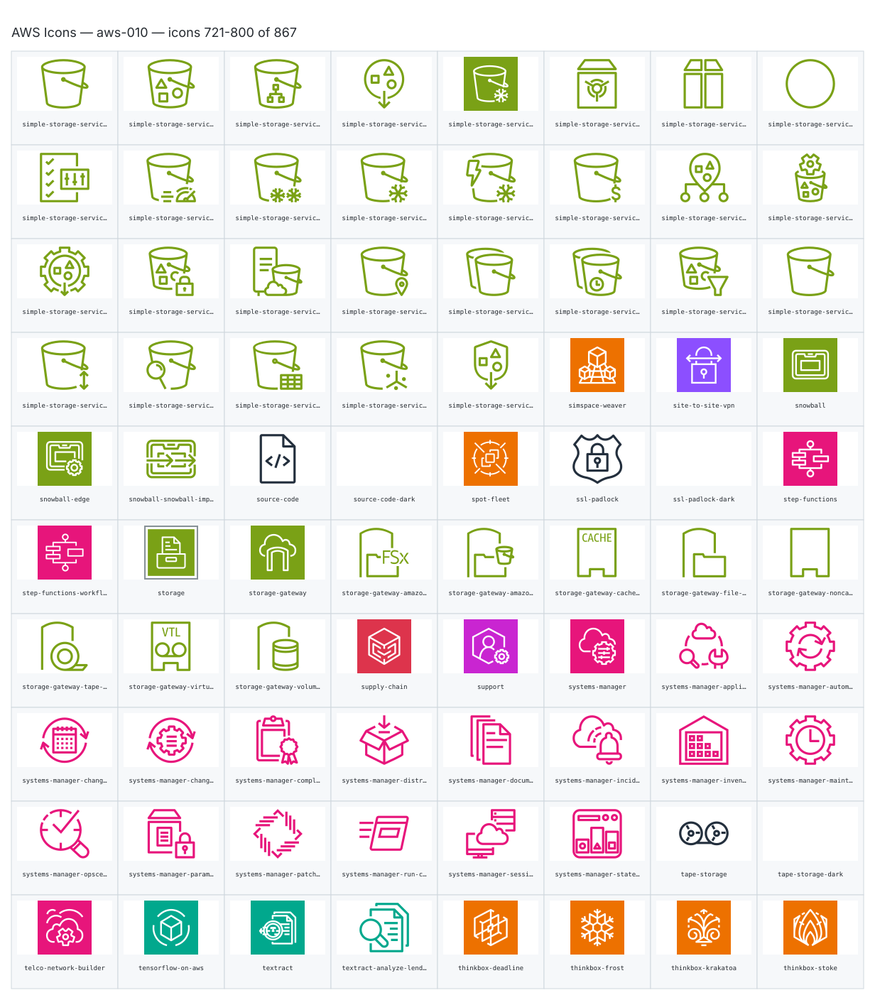

- `aws:simple-storage-service-bucket` — Simple Storage Service Bucket — [aws-010.svg](sheets/aws-010.svg) r0c0 — `service example(aws:simple-storage-service-bucket)[Simple Storage Service Bucket]`
- `aws:simple-storage-service-bucket-with-objects` — Simple Storage Service Bucket With Objects — [aws-010.svg](sheets/aws-010.svg) r0c1 — `service example(aws:simple-storage-service-bucket-with-objects)[Simple Storage Service Bucket With Objects]`
- `aws:simple-storage-service-directory-bucket` — Simple Storage Service Directory Bucket — [aws-010.svg](sheets/aws-010.svg) r0c2 — `service example(aws:simple-storage-service-directory-bucket)[Simple Storage Service Directory Bucket]`
- `aws:simple-storage-service-general-access-points` — Simple Storage Service General Access Points — [aws-010.svg](sheets/aws-010.svg) r0c3 — `service example(aws:simple-storage-service-general-access-points)[Simple Storage Service General Access Points]`
- `aws:simple-storage-service-glacier` — Simple Storage Service Glacier — [aws-010.svg](sheets/aws-010.svg) r0c4 — `service example(aws:simple-storage-service-glacier)[Simple Storage Service Glacier]`
- `aws:simple-storage-service-glacier-archive` — Simple Storage Service Glacier Archive — [aws-010.svg](sheets/aws-010.svg) r0c5 — `service example(aws:simple-storage-service-glacier-archive)[Simple Storage Service Glacier Archive]`
- `aws:simple-storage-service-glacier-vault` — Simple Storage Service Glacier Vault — [aws-010.svg](sheets/aws-010.svg) r0c6 — `service example(aws:simple-storage-service-glacier-vault)[Simple Storage Service Glacier Vault]`
- `aws:simple-storage-service-object` — Simple Storage Service Object — [aws-010.svg](sheets/aws-010.svg) r0c7 — `service example(aws:simple-storage-service-object)[Simple Storage Service Object]`
- `aws:simple-storage-service-s3-batch-operations` — Simple Storage Service S3 Batch Operations — [aws-010.svg](sheets/aws-010.svg) r1c0 — `service example(aws:simple-storage-service-s3-batch-operations)[Simple Storage Service S3 Batch Operations]`
- `aws:simple-storage-service-s3-express-one-zone` — Simple Storage Service S3 Express One Zone — [aws-010.svg](sheets/aws-010.svg) r1c1 — `service example(aws:simple-storage-service-s3-express-one-zone)[Simple Storage Service S3 Express One Zone]`
- `aws:simple-storage-service-s3-glacier-deep-archive` — Simple Storage Service S3 Glacier Deep Archive — [aws-010.svg](sheets/aws-010.svg) r1c2 — `service example(aws:simple-storage-service-s3-glacier-deep-archive)[Simple Storage Service S3 Glacier Deep Archive]`
- `aws:simple-storage-service-s3-glacier-flexible-retrieval` — Simple Storage Service S3 Glacier Flexible Retrieval — [aws-010.svg](sheets/aws-010.svg) r1c3 — `service example(aws:simple-storage-service-s3-glacier-flexible-retrieval)[Simple Storage Service S3 Glacier Flexible Retrieval]`
- `aws:simple-storage-service-s3-glacier-instant-retrieval` — Simple Storage Service S3 Glacier Instant Retrieval — [aws-010.svg](sheets/aws-010.svg) r1c4 — `service example(aws:simple-storage-service-s3-glacier-instant-retrieval)[Simple Storage Service S3 Glacier Instant Retrieval]`
- `aws:simple-storage-service-s3-intelligent-tiering` — Simple Storage Service S3 Intelligent Tiering — [aws-010.svg](sheets/aws-010.svg) r1c5 — `service example(aws:simple-storage-service-s3-intelligent-tiering)[Simple Storage Service S3 Intelligent Tiering]`
- `aws:simple-storage-service-s3-multi-region-access-points` — Simple Storage Service S3 Multi Region Access Points — [aws-010.svg](sheets/aws-010.svg) r1c6 — `service example(aws:simple-storage-service-s3-multi-region-access-points)[Simple Storage Service S3 Multi Region Access Points]`
- `aws:simple-storage-service-s3-object-lambda` — Simple Storage Service S3 Object Lambda — [aws-010.svg](sheets/aws-010.svg) r1c7 — `service example(aws:simple-storage-service-s3-object-lambda)[Simple Storage Service S3 Object Lambda]`
- `aws:simple-storage-service-s3-object-lambda-access-points` — Simple Storage Service S3 Object Lambda Access Points — [aws-010.svg](sheets/aws-010.svg) r2c0 — `service example(aws:simple-storage-service-s3-object-lambda-access-points)[Simple Storage Service S3 Object Lambda Access Points]`
- `aws:simple-storage-service-s3-object-lock` — Simple Storage Service S3 Object Lock — [aws-010.svg](sheets/aws-010.svg) r2c1 — `service example(aws:simple-storage-service-s3-object-lock)[Simple Storage Service S3 Object Lock]`
- `aws:simple-storage-service-s3-on-outposts` — Simple Storage Service S3 On Outposts — [aws-010.svg](sheets/aws-010.svg) r2c2 — `service example(aws:simple-storage-service-s3-on-outposts)[Simple Storage Service S3 On Outposts]`
- `aws:simple-storage-service-s3-one-zone-ia` — Simple Storage Service S3 One Zone Ia — [aws-010.svg](sheets/aws-010.svg) r2c3 — `service example(aws:simple-storage-service-s3-one-zone-ia)[Simple Storage Service S3 One Zone Ia]`
- `aws:simple-storage-service-s3-replication` — Simple Storage Service S3 Replication — [aws-010.svg](sheets/aws-010.svg) r2c4 — `service example(aws:simple-storage-service-s3-replication)[Simple Storage Service S3 Replication]`
- `aws:simple-storage-service-s3-replication-time-control` — Simple Storage Service S3 Replication Time Control — [aws-010.svg](sheets/aws-010.svg) r2c5 — `service example(aws:simple-storage-service-s3-replication-time-control)[Simple Storage Service S3 Replication Time Control]`
- `aws:simple-storage-service-s3-select` — Simple Storage Service S3 Select — [aws-010.svg](sheets/aws-010.svg) r2c6 — `service example(aws:simple-storage-service-s3-select)[Simple Storage Service S3 Select]`
- `aws:simple-storage-service-s3-standard` — Simple Storage Service S3 Standard — [aws-010.svg](sheets/aws-010.svg) r2c7 — `service example(aws:simple-storage-service-s3-standard)[Simple Storage Service S3 Standard]`
- `aws:simple-storage-service-s3-standard-ia` — Simple Storage Service S3 Standard Ia — [aws-010.svg](sheets/aws-010.svg) r3c0 — `service example(aws:simple-storage-service-s3-standard-ia)[Simple Storage Service S3 Standard Ia]`
- `aws:simple-storage-service-s3-storage-lens` — Simple Storage Service S3 Storage Lens — [aws-010.svg](sheets/aws-010.svg) r3c1 — `service example(aws:simple-storage-service-s3-storage-lens)[Simple Storage Service S3 Storage Lens]`
- `aws:simple-storage-service-s3-tables` — Simple Storage Service S3 Tables — [aws-010.svg](sheets/aws-010.svg) r3c2 — `service example(aws:simple-storage-service-s3-tables)[Simple Storage Service S3 Tables]`
- `aws:simple-storage-service-s3-vectors` — Simple Storage Service S3 Vectors — [aws-010.svg](sheets/aws-010.svg) r3c3 — `service example(aws:simple-storage-service-s3-vectors)[Simple Storage Service S3 Vectors]`
- `aws:simple-storage-service-vpc-access-points` — Simple Storage Service Vpc Access Points — [aws-010.svg](sheets/aws-010.svg) r3c4 — `service example(aws:simple-storage-service-vpc-access-points)[Simple Storage Service Vpc Access Points]`
- `aws:simspace-weaver` — Simspace Weaver — [aws-010.svg](sheets/aws-010.svg) r3c5 — `service example(aws:simspace-weaver)[Simspace Weaver]`
- `aws:site-to-site-vpn` — Site To Site Vpn — [aws-010.svg](sheets/aws-010.svg) r3c6 — `service example(aws:site-to-site-vpn)[Site To Site Vpn]`
- `aws:snowball` — Snowball — [aws-010.svg](sheets/aws-010.svg) r3c7 — `service example(aws:snowball)[Snowball]`
- `aws:snowball-edge` — Snowball Edge — [aws-010.svg](sheets/aws-010.svg) r4c0 — `service example(aws:snowball-edge)[Snowball Edge]`
- `aws:snowball-snowball-import-export` — Snowball Snowball Import Export — [aws-010.svg](sheets/aws-010.svg) r4c1 — `service example(aws:snowball-snowball-import-export)[Snowball Snowball Import Export]`
- `aws:source-code` — Source Code — [aws-010.svg](sheets/aws-010.svg) r4c2 — `service example(aws:source-code)[Source Code]`
- `aws:source-code-dark` — Source Code Dark — [aws-010.svg](sheets/aws-010.svg) r4c3 — `service example(aws:source-code-dark)[Source Code Dark]`
- `aws:spot-fleet` — Spot Fleet — [aws-010.svg](sheets/aws-010.svg) r4c4 — `service example(aws:spot-fleet)[Spot Fleet]`
- `aws:ssl-padlock` — Ssl Padlock — [aws-010.svg](sheets/aws-010.svg) r4c5 — `service example(aws:ssl-padlock)[Ssl Padlock]`
- `aws:ssl-padlock-dark` — Ssl Padlock Dark — [aws-010.svg](sheets/aws-010.svg) r4c6 — `service example(aws:ssl-padlock-dark)[Ssl Padlock Dark]`
- `aws:step-functions` — Step Functions — [aws-010.svg](sheets/aws-010.svg) r4c7 — `service example(aws:step-functions)[Step Functions]`
- `aws:step-functions-workflow` — Step Functions Workflow — [aws-010.svg](sheets/aws-010.svg) r5c0 — `service example(aws:step-functions-workflow)[Step Functions Workflow]`
- `aws:storage` — Storage — [aws-010.svg](sheets/aws-010.svg) r5c1 — `service example(aws:storage)[Storage]`
- `aws:storage-gateway` — Storage Gateway — [aws-010.svg](sheets/aws-010.svg) r5c2 — `service example(aws:storage-gateway)[Storage Gateway]`
- `aws:storage-gateway-amazon-fsx-file-gateway` — Storage Gateway Amazon Fsx File Gateway — [aws-010.svg](sheets/aws-010.svg) r5c3 — `service example(aws:storage-gateway-amazon-fsx-file-gateway)[Storage Gateway Amazon Fsx File Gateway]`
- `aws:storage-gateway-amazon-s3-file-gateway` — Storage Gateway Amazon S3 File Gateway — [aws-010.svg](sheets/aws-010.svg) r5c4 — `service example(aws:storage-gateway-amazon-s3-file-gateway)[Storage Gateway Amazon S3 File Gateway]`
- `aws:storage-gateway-cached-volume` — Storage Gateway Cached Volume — [aws-010.svg](sheets/aws-010.svg) r5c5 — `service example(aws:storage-gateway-cached-volume)[Storage Gateway Cached Volume]`
- `aws:storage-gateway-file-gateway` — Storage Gateway File Gateway — [aws-010.svg](sheets/aws-010.svg) r5c6 — `service example(aws:storage-gateway-file-gateway)[Storage Gateway File Gateway]`
- `aws:storage-gateway-noncached-volume` — Storage Gateway Noncached Volume — [aws-010.svg](sheets/aws-010.svg) r5c7 — `service example(aws:storage-gateway-noncached-volume)[Storage Gateway Noncached Volume]`
- `aws:storage-gateway-tape-gateway` — Storage Gateway Tape Gateway — [aws-010.svg](sheets/aws-010.svg) r6c0 — `service example(aws:storage-gateway-tape-gateway)[Storage Gateway Tape Gateway]`
- `aws:storage-gateway-virtual-tape-library` — Storage Gateway Virtual Tape Library — [aws-010.svg](sheets/aws-010.svg) r6c1 — `service example(aws:storage-gateway-virtual-tape-library)[Storage Gateway Virtual Tape Library]`
- `aws:storage-gateway-volume-gateway` — Storage Gateway Volume Gateway — [aws-010.svg](sheets/aws-010.svg) r6c2 — `service example(aws:storage-gateway-volume-gateway)[Storage Gateway Volume Gateway]`
- `aws:supply-chain` — Supply Chain — [aws-010.svg](sheets/aws-010.svg) r6c3 — `service example(aws:supply-chain)[Supply Chain]`
- `aws:support` — Support — [aws-010.svg](sheets/aws-010.svg) r6c4 — `service example(aws:support)[Support]`
- `aws:systems-manager` — Systems Manager — [aws-010.svg](sheets/aws-010.svg) r6c5 — `service example(aws:systems-manager)[Systems Manager]`
- `aws:systems-manager-application-manager` — Systems Manager Application Manager — [aws-010.svg](sheets/aws-010.svg) r6c6 — `service example(aws:systems-manager-application-manager)[Systems Manager Application Manager]`
- `aws:systems-manager-automation` — Systems Manager Automation — [aws-010.svg](sheets/aws-010.svg) r6c7 — `service example(aws:systems-manager-automation)[Systems Manager Automation]`
- `aws:systems-manager-change-calendar` — Systems Manager Change Calendar — [aws-010.svg](sheets/aws-010.svg) r7c0 — `service example(aws:systems-manager-change-calendar)[Systems Manager Change Calendar]`
- `aws:systems-manager-change-manager` — Systems Manager Change Manager — [aws-010.svg](sheets/aws-010.svg) r7c1 — `service example(aws:systems-manager-change-manager)[Systems Manager Change Manager]`
- `aws:systems-manager-compliance` — Systems Manager Compliance — [aws-010.svg](sheets/aws-010.svg) r7c2 — `service example(aws:systems-manager-compliance)[Systems Manager Compliance]`
- `aws:systems-manager-distributor` — Systems Manager Distributor — [aws-010.svg](sheets/aws-010.svg) r7c3 — `service example(aws:systems-manager-distributor)[Systems Manager Distributor]`
- `aws:systems-manager-documents` — Systems Manager Documents — [aws-010.svg](sheets/aws-010.svg) r7c4 — `service example(aws:systems-manager-documents)[Systems Manager Documents]`
- `aws:systems-manager-incident-manager` — Systems Manager Incident Manager — [aws-010.svg](sheets/aws-010.svg) r7c5 — `service example(aws:systems-manager-incident-manager)[Systems Manager Incident Manager]`
- `aws:systems-manager-inventory` — Systems Manager Inventory — [aws-010.svg](sheets/aws-010.svg) r7c6 — `service example(aws:systems-manager-inventory)[Systems Manager Inventory]`
- `aws:systems-manager-maintenance-windows` — Systems Manager Maintenance Windows — [aws-010.svg](sheets/aws-010.svg) r7c7 — `service example(aws:systems-manager-maintenance-windows)[Systems Manager Maintenance Windows]`
- `aws:systems-manager-opscenter` — Systems Manager Opscenter — [aws-010.svg](sheets/aws-010.svg) r8c0 — `service example(aws:systems-manager-opscenter)[Systems Manager Opscenter]`
- `aws:systems-manager-parameter-store` — Systems Manager Parameter Store — [aws-010.svg](sheets/aws-010.svg) r8c1 — `service example(aws:systems-manager-parameter-store)[Systems Manager Parameter Store]`
- `aws:systems-manager-patch-manager` — Systems Manager Patch Manager — [aws-010.svg](sheets/aws-010.svg) r8c2 — `service example(aws:systems-manager-patch-manager)[Systems Manager Patch Manager]`
- `aws:systems-manager-run-command` — Systems Manager Run Command — [aws-010.svg](sheets/aws-010.svg) r8c3 — `service example(aws:systems-manager-run-command)[Systems Manager Run Command]`
- `aws:systems-manager-session-manager` — Systems Manager Session Manager — [aws-010.svg](sheets/aws-010.svg) r8c4 — `service example(aws:systems-manager-session-manager)[Systems Manager Session Manager]`
- `aws:systems-manager-state-manager` — Systems Manager State Manager — [aws-010.svg](sheets/aws-010.svg) r8c5 — `service example(aws:systems-manager-state-manager)[Systems Manager State Manager]`
- `aws:tape-storage` — Tape Storage — [aws-010.svg](sheets/aws-010.svg) r8c6 — `service example(aws:tape-storage)[Tape Storage]`
- `aws:tape-storage-dark` — Tape Storage Dark — [aws-010.svg](sheets/aws-010.svg) r8c7 — `service example(aws:tape-storage-dark)[Tape Storage Dark]`
- `aws:telco-network-builder` — Telco Network Builder — [aws-010.svg](sheets/aws-010.svg) r9c0 — `service example(aws:telco-network-builder)[Telco Network Builder]`
- `aws:tensorflow-on-aws` — Tensorflow On Aws — [aws-010.svg](sheets/aws-010.svg) r9c1 — `service example(aws:tensorflow-on-aws)[Tensorflow On Aws]`
- `aws:textract` — Textract — [aws-010.svg](sheets/aws-010.svg) r9c2 — `service example(aws:textract)[Textract]`
- `aws:textract-analyze-lending` — Textract Analyze Lending — [aws-010.svg](sheets/aws-010.svg) r9c3 — `service example(aws:textract-analyze-lending)[Textract Analyze Lending]`
- `aws:thinkbox-deadline` — Thinkbox Deadline — [aws-010.svg](sheets/aws-010.svg) r9c4 — `service example(aws:thinkbox-deadline)[Thinkbox Deadline]`
- `aws:thinkbox-frost` — Thinkbox Frost — [aws-010.svg](sheets/aws-010.svg) r9c5 — `service example(aws:thinkbox-frost)[Thinkbox Frost]`
- `aws:thinkbox-krakatoa` — Thinkbox Krakatoa — [aws-010.svg](sheets/aws-010.svg) r9c6 — `service example(aws:thinkbox-krakatoa)[Thinkbox Krakatoa]`
- `aws:thinkbox-stoke` — Thinkbox Stoke — [aws-010.svg](sheets/aws-010.svg) r9c7 — `service example(aws:thinkbox-stoke)[Thinkbox Stoke]`

## aws-011

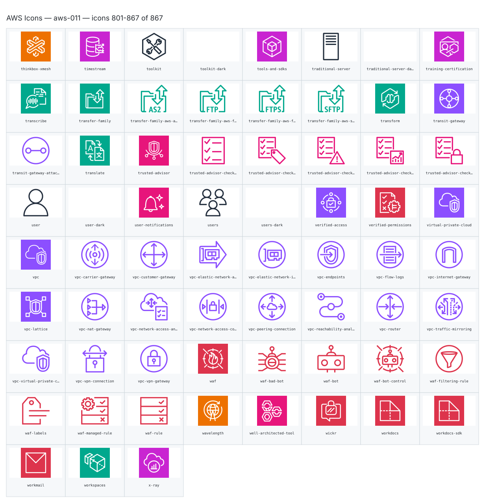

- `aws:thinkbox-xmesh` — Thinkbox Xmesh — [aws-011.svg](sheets/aws-011.svg) r0c0 — `service example(aws:thinkbox-xmesh)[Thinkbox Xmesh]`
- `aws:timestream` — Timestream — [aws-011.svg](sheets/aws-011.svg) r0c1 — `service example(aws:timestream)[Timestream]`
- `aws:toolkit` — Toolkit — [aws-011.svg](sheets/aws-011.svg) r0c2 — `service example(aws:toolkit)[Toolkit]`
- `aws:toolkit-dark` — Toolkit Dark — [aws-011.svg](sheets/aws-011.svg) r0c3 — `service example(aws:toolkit-dark)[Toolkit Dark]`
- `aws:tools-and-sdks` — Tools And Sdks — [aws-011.svg](sheets/aws-011.svg) r0c4 — `service example(aws:tools-and-sdks)[Tools And Sdks]`
- `aws:traditional-server` — Traditional Server — [aws-011.svg](sheets/aws-011.svg) r0c5 — `service example(aws:traditional-server)[Traditional Server]`
- `aws:traditional-server-dark` — Traditional Server Dark — [aws-011.svg](sheets/aws-011.svg) r0c6 — `service example(aws:traditional-server-dark)[Traditional Server Dark]`
- `aws:training-certification` — Training Certification — [aws-011.svg](sheets/aws-011.svg) r0c7 — `service example(aws:training-certification)[Training Certification]`
- `aws:transcribe` — Transcribe — [aws-011.svg](sheets/aws-011.svg) r1c0 — `service example(aws:transcribe)[Transcribe]`
- `aws:transfer-family` — Transfer Family — [aws-011.svg](sheets/aws-011.svg) r1c1 — `service example(aws:transfer-family)[Transfer Family]`
- `aws:transfer-family-aws-as2` — Transfer Family Aws As2 — [aws-011.svg](sheets/aws-011.svg) r1c2 — `service example(aws:transfer-family-aws-as2)[Transfer Family Aws As2]`
- `aws:transfer-family-aws-ftp` — Transfer Family Aws Ftp — [aws-011.svg](sheets/aws-011.svg) r1c3 — `service example(aws:transfer-family-aws-ftp)[Transfer Family Aws Ftp]`
- `aws:transfer-family-aws-ftps` — Transfer Family Aws Ftps — [aws-011.svg](sheets/aws-011.svg) r1c4 — `service example(aws:transfer-family-aws-ftps)[Transfer Family Aws Ftps]`
- `aws:transfer-family-aws-sftp` — Transfer Family Aws Sftp — [aws-011.svg](sheets/aws-011.svg) r1c5 — `service example(aws:transfer-family-aws-sftp)[Transfer Family Aws Sftp]`
- `aws:transform` — Transform — [aws-011.svg](sheets/aws-011.svg) r1c6 — `service example(aws:transform)[Transform]`
- `aws:transit-gateway` — Transit Gateway — [aws-011.svg](sheets/aws-011.svg) r1c7 — `service example(aws:transit-gateway)[Transit Gateway]`
- `aws:transit-gateway-attachment` — Transit Gateway Attachment — [aws-011.svg](sheets/aws-011.svg) r2c0 — `service example(aws:transit-gateway-attachment)[Transit Gateway Attachment]`
- `aws:translate` — Translate — [aws-011.svg](sheets/aws-011.svg) r2c1 — `service example(aws:translate)[Translate]`
- `aws:trusted-advisor` — Trusted Advisor — [aws-011.svg](sheets/aws-011.svg) r2c2 — `service example(aws:trusted-advisor)[Trusted Advisor]`
- `aws:trusted-advisor-checklist` — Trusted Advisor Checklist — [aws-011.svg](sheets/aws-011.svg) r2c3 — `service example(aws:trusted-advisor-checklist)[Trusted Advisor Checklist]`
- `aws:trusted-advisor-checklist-cost` — Trusted Advisor Checklist Cost — [aws-011.svg](sheets/aws-011.svg) r2c4 — `service example(aws:trusted-advisor-checklist-cost)[Trusted Advisor Checklist Cost]`
- `aws:trusted-advisor-checklist-fault-tolerant` — Trusted Advisor Checklist Fault Tolerant — [aws-011.svg](sheets/aws-011.svg) r2c5 — `service example(aws:trusted-advisor-checklist-fault-tolerant)[Trusted Advisor Checklist Fault Tolerant]`
- `aws:trusted-advisor-checklist-performance` — Trusted Advisor Checklist Performance — [aws-011.svg](sheets/aws-011.svg) r2c6 — `service example(aws:trusted-advisor-checklist-performance)[Trusted Advisor Checklist Performance]`
- `aws:trusted-advisor-checklist-security` — Trusted Advisor Checklist Security — [aws-011.svg](sheets/aws-011.svg) r2c7 — `service example(aws:trusted-advisor-checklist-security)[Trusted Advisor Checklist Security]`
- `aws:user` — User — [aws-011.svg](sheets/aws-011.svg) r3c0 — `service example(aws:user)[User]`
- `aws:user-dark` — User Dark — [aws-011.svg](sheets/aws-011.svg) r3c1 — `service example(aws:user-dark)[User Dark]`
- `aws:user-notifications` — User Notifications — [aws-011.svg](sheets/aws-011.svg) r3c2 — `service example(aws:user-notifications)[User Notifications]`
- `aws:users` — Users — [aws-011.svg](sheets/aws-011.svg) r3c3 — `service example(aws:users)[Users]`
- `aws:users-dark` — Users Dark — [aws-011.svg](sheets/aws-011.svg) r3c4 — `service example(aws:users-dark)[Users Dark]`
- `aws:verified-access` — Verified Access — [aws-011.svg](sheets/aws-011.svg) r3c5 — `service example(aws:verified-access)[Verified Access]`
- `aws:verified-permissions` — Verified Permissions — [aws-011.svg](sheets/aws-011.svg) r3c6 — `service example(aws:verified-permissions)[Verified Permissions]`
- `aws:virtual-private-cloud` — Virtual Private Cloud — [aws-011.svg](sheets/aws-011.svg) r3c7 — `service example(aws:virtual-private-cloud)[Virtual Private Cloud]`
- `aws:vpc` — Vpc — [aws-011.svg](sheets/aws-011.svg) r4c0 — `service example(aws:vpc)[Vpc]`
- `aws:vpc-carrier-gateway` — Vpc Carrier Gateway — [aws-011.svg](sheets/aws-011.svg) r4c1 — `service example(aws:vpc-carrier-gateway)[Vpc Carrier Gateway]`
- `aws:vpc-customer-gateway` — Vpc Customer Gateway — [aws-011.svg](sheets/aws-011.svg) r4c2 — `service example(aws:vpc-customer-gateway)[Vpc Customer Gateway]`
- `aws:vpc-elastic-network-adapter` — Vpc Elastic Network Adapter — [aws-011.svg](sheets/aws-011.svg) r4c3 — `service example(aws:vpc-elastic-network-adapter)[Vpc Elastic Network Adapter]`
- `aws:vpc-elastic-network-interface` — Vpc Elastic Network Interface — [aws-011.svg](sheets/aws-011.svg) r4c4 — `service example(aws:vpc-elastic-network-interface)[Vpc Elastic Network Interface]`
- `aws:vpc-endpoints` — Vpc Endpoints — [aws-011.svg](sheets/aws-011.svg) r4c5 — `service example(aws:vpc-endpoints)[Vpc Endpoints]`
- `aws:vpc-flow-logs` — Vpc Flow Logs — [aws-011.svg](sheets/aws-011.svg) r4c6 — `service example(aws:vpc-flow-logs)[Vpc Flow Logs]`
- `aws:vpc-internet-gateway` — Vpc Internet Gateway — [aws-011.svg](sheets/aws-011.svg) r4c7 — `service example(aws:vpc-internet-gateway)[Vpc Internet Gateway]`
- `aws:vpc-lattice` — Vpc Lattice — [aws-011.svg](sheets/aws-011.svg) r5c0 — `service example(aws:vpc-lattice)[Vpc Lattice]`
- `aws:vpc-nat-gateway` — Vpc Nat Gateway — [aws-011.svg](sheets/aws-011.svg) r5c1 — `service example(aws:vpc-nat-gateway)[Vpc Nat Gateway]`
- `aws:vpc-network-access-analyzer` — Vpc Network Access Analyzer — [aws-011.svg](sheets/aws-011.svg) r5c2 — `service example(aws:vpc-network-access-analyzer)[Vpc Network Access Analyzer]`
- `aws:vpc-network-access-control-list` — Vpc Network Access Control List — [aws-011.svg](sheets/aws-011.svg) r5c3 — `service example(aws:vpc-network-access-control-list)[Vpc Network Access Control List]`
- `aws:vpc-peering-connection` — Vpc Peering Connection — [aws-011.svg](sheets/aws-011.svg) r5c4 — `service example(aws:vpc-peering-connection)[Vpc Peering Connection]`
- `aws:vpc-reachability-analyzer` — Vpc Reachability Analyzer — [aws-011.svg](sheets/aws-011.svg) r5c5 — `service example(aws:vpc-reachability-analyzer)[Vpc Reachability Analyzer]`
- `aws:vpc-router` — Vpc Router — [aws-011.svg](sheets/aws-011.svg) r5c6 — `service example(aws:vpc-router)[Vpc Router]`
- `aws:vpc-traffic-mirroring` — Vpc Traffic Mirroring — [aws-011.svg](sheets/aws-011.svg) r5c7 — `service example(aws:vpc-traffic-mirroring)[Vpc Traffic Mirroring]`
- `aws:vpc-virtual-private-cloud-vpc` — Vpc Virtual Private Cloud Vpc — [aws-011.svg](sheets/aws-011.svg) r6c0 — `service example(aws:vpc-virtual-private-cloud-vpc)[Vpc Virtual Private Cloud Vpc]`
- `aws:vpc-vpn-connection` — Vpc Vpn Connection — [aws-011.svg](sheets/aws-011.svg) r6c1 — `service example(aws:vpc-vpn-connection)[Vpc Vpn Connection]`
- `aws:vpc-vpn-gateway` — Vpc Vpn Gateway — [aws-011.svg](sheets/aws-011.svg) r6c2 — `service example(aws:vpc-vpn-gateway)[Vpc Vpn Gateway]`
- `aws:waf` — Waf — [aws-011.svg](sheets/aws-011.svg) r6c3 — `service example(aws:waf)[Waf]`
- `aws:waf-bad-bot` — Waf Bad Bot — [aws-011.svg](sheets/aws-011.svg) r6c4 — `service example(aws:waf-bad-bot)[Waf Bad Bot]`
- `aws:waf-bot` — Waf Bot — [aws-011.svg](sheets/aws-011.svg) r6c5 — `service example(aws:waf-bot)[Waf Bot]`
- `aws:waf-bot-control` — Waf Bot Control — [aws-011.svg](sheets/aws-011.svg) r6c6 — `service example(aws:waf-bot-control)[Waf Bot Control]`
- `aws:waf-filtering-rule` — Waf Filtering Rule — [aws-011.svg](sheets/aws-011.svg) r6c7 — `service example(aws:waf-filtering-rule)[Waf Filtering Rule]`
- `aws:waf-labels` — Waf Labels — [aws-011.svg](sheets/aws-011.svg) r7c0 — `service example(aws:waf-labels)[Waf Labels]`
- `aws:waf-managed-rule` — Waf Managed Rule — [aws-011.svg](sheets/aws-011.svg) r7c1 — `service example(aws:waf-managed-rule)[Waf Managed Rule]`
- `aws:waf-rule` — Waf Rule — [aws-011.svg](sheets/aws-011.svg) r7c2 — `service example(aws:waf-rule)[Waf Rule]`
- `aws:wavelength` — Wavelength — [aws-011.svg](sheets/aws-011.svg) r7c3 — `service example(aws:wavelength)[Wavelength]`
- `aws:well-architected-tool` — Well Architected Tool — [aws-011.svg](sheets/aws-011.svg) r7c4 — `service example(aws:well-architected-tool)[Well Architected Tool]`
- `aws:wickr` — Wickr — [aws-011.svg](sheets/aws-011.svg) r7c5 — `service example(aws:wickr)[Wickr]`
- `aws:workdocs` — Workdocs — [aws-011.svg](sheets/aws-011.svg) r7c6 — `service example(aws:workdocs)[Workdocs]`
- `aws:workdocs-sdk` — Workdocs Sdk — [aws-011.svg](sheets/aws-011.svg) r7c7 — `service example(aws:workdocs-sdk)[Workdocs Sdk]`
- `aws:workmail` — Workmail — [aws-011.svg](sheets/aws-011.svg) r8c0 — `service example(aws:workmail)[Workmail]`
- `aws:workspaces` — Workspaces — [aws-011.svg](sheets/aws-011.svg) r8c1 — `service example(aws:workspaces)[Workspaces]`
- `aws:x-ray` — X Ray — [aws-011.svg](sheets/aws-011.svg) r8c2 — `service example(aws:x-ray)[X Ray]`
