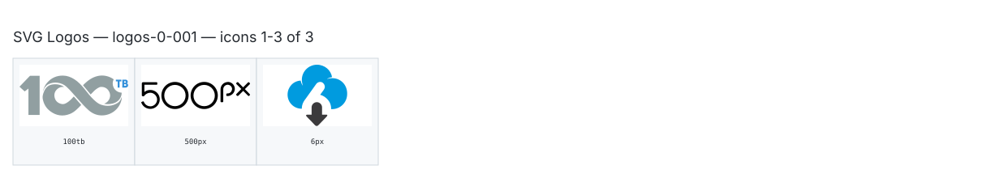

**Generated file — do not edit. Run `python scripts/portfolio.py icons generate`.**

# SVG Logos — `0`

[SVG Logos hub](../logos.md). 3 icons in group `0` across 1 sheet. Display names are approximate; copy the slug for Mermaid.

## logos-0-001

- `logos:100tb` — 100Tb — [logos-0-001.svg](../sheets/logos-0-001.svg) r0c0 — `service example(logos:100tb)[100Tb]`
- `logos:500px` — 500Px — [logos-0-001.svg](../sheets/logos-0-001.svg) r0c1 — `service example(logos:500px)[500Px]`
- `logos:6px` — 6Px — [logos-0-001.svg](../sheets/logos-0-001.svg) r0c2 — `service example(logos:6px)[6Px]`
