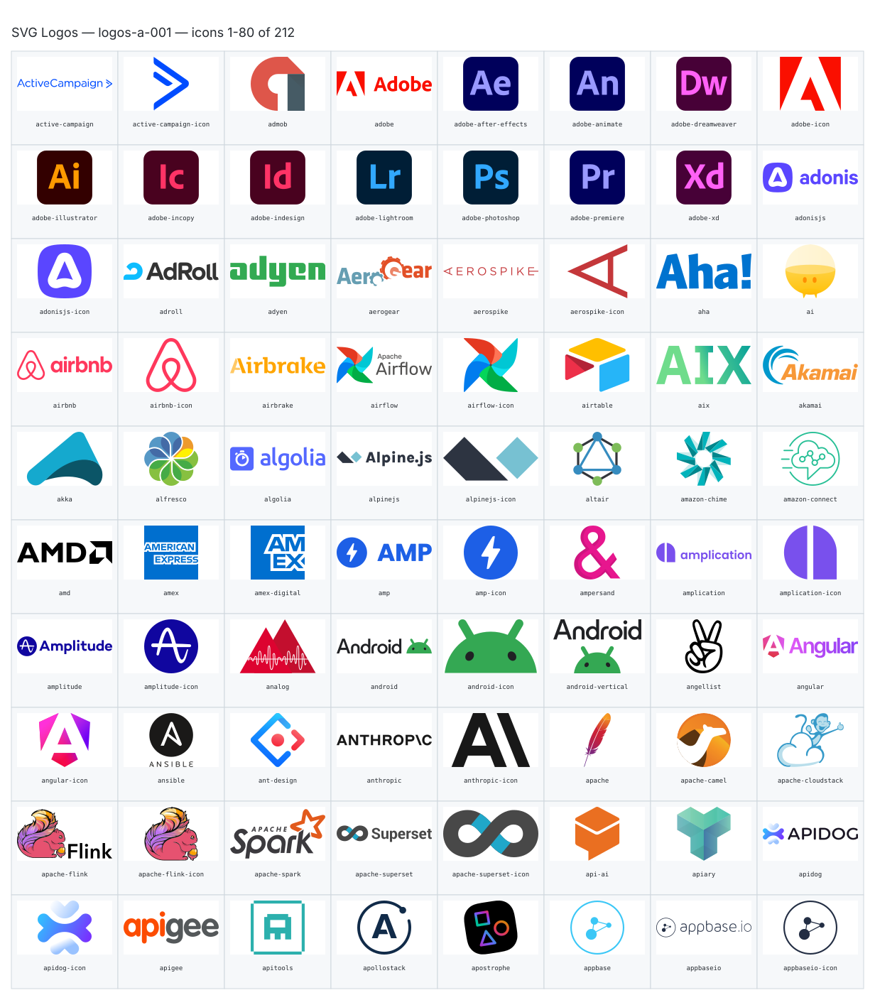
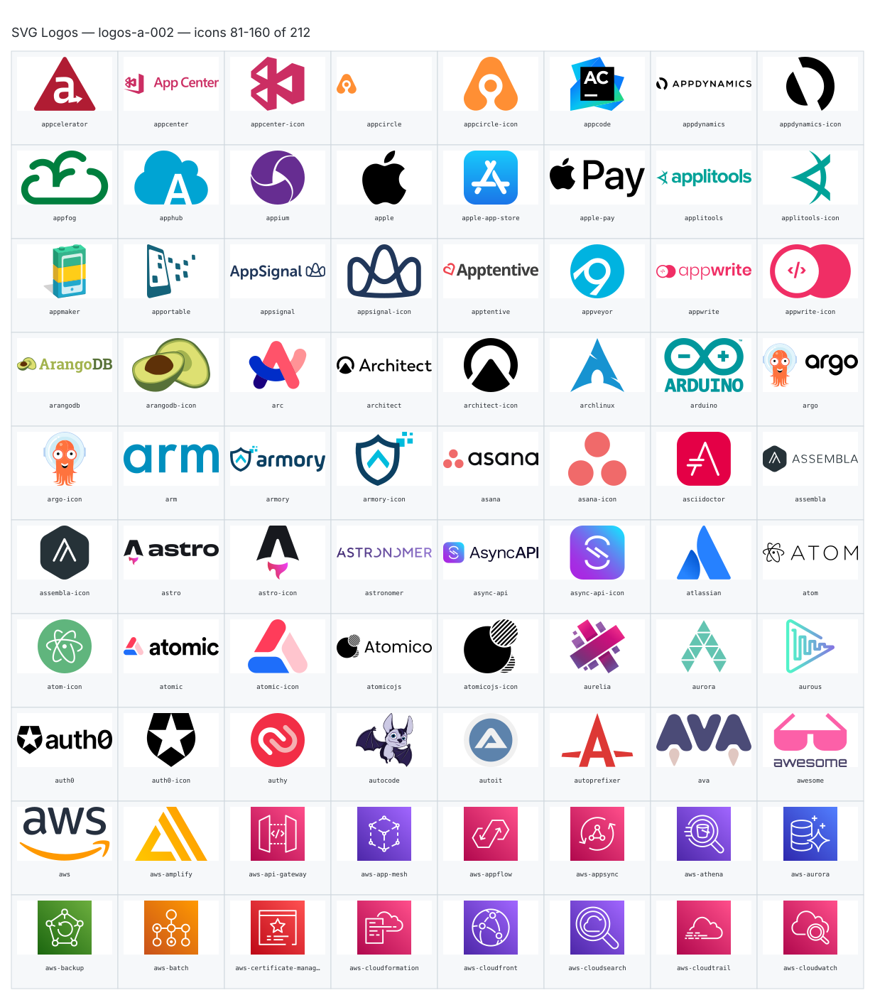
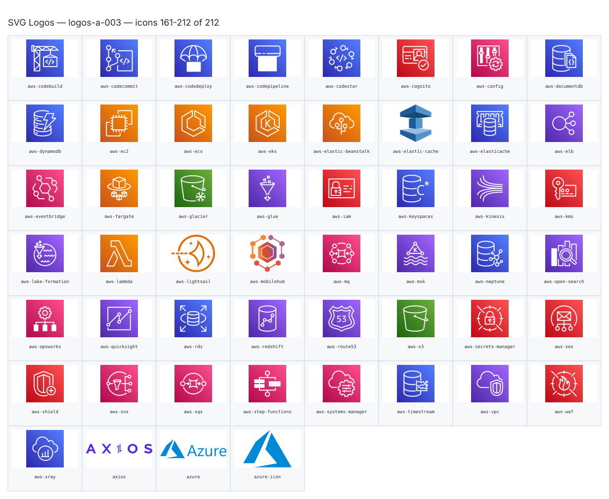

**Generated file — do not edit. Run `python scripts/portfolio.py icons generate`.**

# SVG Logos — `a`

[SVG Logos hub](../logos.md). 212 icons in group `a` across 3 sheets. Display names are approximate; copy the slug for Mermaid.

## logos-a-001

- `logos:active-campaign` — Active Campaign — [logos-a-001.svg](../sheets/logos-a-001.svg) r0c0 — `service example(logos:active-campaign)[Active Campaign]`
- `logos:active-campaign-icon` — Active Campaign Icon — [logos-a-001.svg](../sheets/logos-a-001.svg) r0c1 — `service example(logos:active-campaign-icon)[Active Campaign Icon]`
- `logos:admob` — Admob — [logos-a-001.svg](../sheets/logos-a-001.svg) r0c2 — `service example(logos:admob)[Admob]`
- `logos:adobe` — Adobe — [logos-a-001.svg](../sheets/logos-a-001.svg) r0c3 — `service example(logos:adobe)[Adobe]`
- `logos:adobe-after-effects` — Adobe After Effects — [logos-a-001.svg](../sheets/logos-a-001.svg) r0c4 — `service example(logos:adobe-after-effects)[Adobe After Effects]`
- `logos:adobe-animate` — Adobe Animate — [logos-a-001.svg](../sheets/logos-a-001.svg) r0c5 — `service example(logos:adobe-animate)[Adobe Animate]`
- `logos:adobe-dreamweaver` — Adobe Dreamweaver — [logos-a-001.svg](../sheets/logos-a-001.svg) r0c6 — `service example(logos:adobe-dreamweaver)[Adobe Dreamweaver]`
- `logos:adobe-icon` — Adobe Icon — [logos-a-001.svg](../sheets/logos-a-001.svg) r0c7 — `service example(logos:adobe-icon)[Adobe Icon]`
- `logos:adobe-illustrator` — Adobe Illustrator — [logos-a-001.svg](../sheets/logos-a-001.svg) r1c0 — `service example(logos:adobe-illustrator)[Adobe Illustrator]`
- `logos:adobe-incopy` — Adobe Incopy — [logos-a-001.svg](../sheets/logos-a-001.svg) r1c1 — `service example(logos:adobe-incopy)[Adobe Incopy]`
- `logos:adobe-indesign` — Adobe Indesign — [logos-a-001.svg](../sheets/logos-a-001.svg) r1c2 — `service example(logos:adobe-indesign)[Adobe Indesign]`
- `logos:adobe-lightroom` — Adobe Lightroom — [logos-a-001.svg](../sheets/logos-a-001.svg) r1c3 — `service example(logos:adobe-lightroom)[Adobe Lightroom]`
- `logos:adobe-photoshop` — Adobe Photoshop — [logos-a-001.svg](../sheets/logos-a-001.svg) r1c4 — `service example(logos:adobe-photoshop)[Adobe Photoshop]`
- `logos:adobe-premiere` — Adobe Premiere — [logos-a-001.svg](../sheets/logos-a-001.svg) r1c5 — `service example(logos:adobe-premiere)[Adobe Premiere]`
- `logos:adobe-xd` — Adobe Xd — [logos-a-001.svg](../sheets/logos-a-001.svg) r1c6 — `service example(logos:adobe-xd)[Adobe Xd]`
- `logos:adonisjs` — Adonisjs — [logos-a-001.svg](../sheets/logos-a-001.svg) r1c7 — `service example(logos:adonisjs)[Adonisjs]`
- `logos:adonisjs-icon` — Adonisjs Icon — [logos-a-001.svg](../sheets/logos-a-001.svg) r2c0 — `service example(logos:adonisjs-icon)[Adonisjs Icon]`
- `logos:adroll` — Adroll — [logos-a-001.svg](../sheets/logos-a-001.svg) r2c1 — `service example(logos:adroll)[Adroll]`
- `logos:adyen` — Adyen — [logos-a-001.svg](../sheets/logos-a-001.svg) r2c2 — `service example(logos:adyen)[Adyen]`
- `logos:aerogear` — Aerogear — [logos-a-001.svg](../sheets/logos-a-001.svg) r2c3 — `service example(logos:aerogear)[Aerogear]`
- `logos:aerospike` — Aerospike — [logos-a-001.svg](../sheets/logos-a-001.svg) r2c4 — `service example(logos:aerospike)[Aerospike]`
- `logos:aerospike-icon` — Aerospike Icon — [logos-a-001.svg](../sheets/logos-a-001.svg) r2c5 — `service example(logos:aerospike-icon)[Aerospike Icon]`
- `logos:aha` — Aha — [logos-a-001.svg](../sheets/logos-a-001.svg) r2c6 — `service example(logos:aha)[Aha]`
- `logos:ai` — Ai — [logos-a-001.svg](../sheets/logos-a-001.svg) r2c7 — `service example(logos:ai)[Ai]`
- `logos:airbnb` — Airbnb — [logos-a-001.svg](../sheets/logos-a-001.svg) r3c0 — `service example(logos:airbnb)[Airbnb]`
- `logos:airbnb-icon` — Airbnb Icon — [logos-a-001.svg](../sheets/logos-a-001.svg) r3c1 — `service example(logos:airbnb-icon)[Airbnb Icon]`
- `logos:airbrake` — Airbrake — [logos-a-001.svg](../sheets/logos-a-001.svg) r3c2 — `service example(logos:airbrake)[Airbrake]`
- `logos:airflow` — Airflow — [logos-a-001.svg](../sheets/logos-a-001.svg) r3c3 — `service example(logos:airflow)[Airflow]`
- `logos:airflow-icon` — Airflow Icon — [logos-a-001.svg](../sheets/logos-a-001.svg) r3c4 — `service example(logos:airflow-icon)[Airflow Icon]`
- `logos:airtable` — Airtable — [logos-a-001.svg](../sheets/logos-a-001.svg) r3c5 — `service example(logos:airtable)[Airtable]`
- `logos:aix` — Aix — [logos-a-001.svg](../sheets/logos-a-001.svg) r3c6 — `service example(logos:aix)[Aix]`
- `logos:akamai` — Akamai — [logos-a-001.svg](../sheets/logos-a-001.svg) r3c7 — `service example(logos:akamai)[Akamai]`
- `logos:akka` — Akka — [logos-a-001.svg](../sheets/logos-a-001.svg) r4c0 — `service example(logos:akka)[Akka]`
- `logos:alfresco` — Alfresco — [logos-a-001.svg](../sheets/logos-a-001.svg) r4c1 — `service example(logos:alfresco)[Alfresco]`
- `logos:algolia` — Algolia — [logos-a-001.svg](../sheets/logos-a-001.svg) r4c2 — `service example(logos:algolia)[Algolia]`
- `logos:alpinejs` — Alpinejs — [logos-a-001.svg](../sheets/logos-a-001.svg) r4c3 — `service example(logos:alpinejs)[Alpinejs]`
- `logos:alpinejs-icon` — Alpinejs Icon — [logos-a-001.svg](../sheets/logos-a-001.svg) r4c4 — `service example(logos:alpinejs-icon)[Alpinejs Icon]`
- `logos:altair` — Altair — [logos-a-001.svg](../sheets/logos-a-001.svg) r4c5 — `service example(logos:altair)[Altair]`
- `logos:amazon-chime` — Amazon Chime — [logos-a-001.svg](../sheets/logos-a-001.svg) r4c6 — `service example(logos:amazon-chime)[Amazon Chime]`
- `logos:amazon-connect` — Amazon Connect — [logos-a-001.svg](../sheets/logos-a-001.svg) r4c7 — `service example(logos:amazon-connect)[Amazon Connect]`
- `logos:amd` — Amd — [logos-a-001.svg](../sheets/logos-a-001.svg) r5c0 — `service example(logos:amd)[Amd]`
- `logos:amex` — Amex — [logos-a-001.svg](../sheets/logos-a-001.svg) r5c1 — `service example(logos:amex)[Amex]`
- `logos:amex-digital` — Amex Digital — [logos-a-001.svg](../sheets/logos-a-001.svg) r5c2 — `service example(logos:amex-digital)[Amex Digital]`
- `logos:amp` — Amp — [logos-a-001.svg](../sheets/logos-a-001.svg) r5c3 — `service example(logos:amp)[Amp]`
- `logos:amp-icon` — Amp Icon — [logos-a-001.svg](../sheets/logos-a-001.svg) r5c4 — `service example(logos:amp-icon)[Amp Icon]`
- `logos:ampersand` — Ampersand — [logos-a-001.svg](../sheets/logos-a-001.svg) r5c5 — `service example(logos:ampersand)[Ampersand]`
- `logos:amplication` — Amplication — [logos-a-001.svg](../sheets/logos-a-001.svg) r5c6 — `service example(logos:amplication)[Amplication]`
- `logos:amplication-icon` — Amplication Icon — [logos-a-001.svg](../sheets/logos-a-001.svg) r5c7 — `service example(logos:amplication-icon)[Amplication Icon]`
- `logos:amplitude` — Amplitude — [logos-a-001.svg](../sheets/logos-a-001.svg) r6c0 — `service example(logos:amplitude)[Amplitude]`
- `logos:amplitude-icon` — Amplitude Icon — [logos-a-001.svg](../sheets/logos-a-001.svg) r6c1 — `service example(logos:amplitude-icon)[Amplitude Icon]`
- `logos:analog` — Analog — [logos-a-001.svg](../sheets/logos-a-001.svg) r6c2 — `service example(logos:analog)[Analog]`
- `logos:android` — Android — [logos-a-001.svg](../sheets/logos-a-001.svg) r6c3 — `service example(logos:android)[Android]`
- `logos:android-icon` — Android Icon — [logos-a-001.svg](../sheets/logos-a-001.svg) r6c4 — `service example(logos:android-icon)[Android Icon]`
- `logos:android-vertical` — Android Vertical — [logos-a-001.svg](../sheets/logos-a-001.svg) r6c5 — `service example(logos:android-vertical)[Android Vertical]`
- `logos:angellist` — Angellist — [logos-a-001.svg](../sheets/logos-a-001.svg) r6c6 — `service example(logos:angellist)[Angellist]`
- `logos:angular` — Angular — [logos-a-001.svg](../sheets/logos-a-001.svg) r6c7 — `service example(logos:angular)[Angular]`
- `logos:angular-icon` — Angular Icon — [logos-a-001.svg](../sheets/logos-a-001.svg) r7c0 — `service example(logos:angular-icon)[Angular Icon]`
- `logos:ansible` — Ansible — [logos-a-001.svg](../sheets/logos-a-001.svg) r7c1 — `service example(logos:ansible)[Ansible]`
- `logos:ant-design` — Ant Design — [logos-a-001.svg](../sheets/logos-a-001.svg) r7c2 — `service example(logos:ant-design)[Ant Design]`
- `logos:anthropic` — Anthropic — [logos-a-001.svg](../sheets/logos-a-001.svg) r7c3 — `service example(logos:anthropic)[Anthropic]`
- `logos:anthropic-icon` — Anthropic Icon — [logos-a-001.svg](../sheets/logos-a-001.svg) r7c4 — `service example(logos:anthropic-icon)[Anthropic Icon]`
- `logos:apache` — Apache — [logos-a-001.svg](../sheets/logos-a-001.svg) r7c5 — `service example(logos:apache)[Apache]`
- `logos:apache-camel` — Apache Camel — [logos-a-001.svg](../sheets/logos-a-001.svg) r7c6 — `service example(logos:apache-camel)[Apache Camel]`
- `logos:apache-cloudstack` — Apache Cloudstack — [logos-a-001.svg](../sheets/logos-a-001.svg) r7c7 — `service example(logos:apache-cloudstack)[Apache Cloudstack]`
- `logos:apache-flink` — Apache Flink — [logos-a-001.svg](../sheets/logos-a-001.svg) r8c0 — `service example(logos:apache-flink)[Apache Flink]`
- `logos:apache-flink-icon` — Apache Flink Icon — [logos-a-001.svg](../sheets/logos-a-001.svg) r8c1 — `service example(logos:apache-flink-icon)[Apache Flink Icon]`
- `logos:apache-spark` — Apache Spark — [logos-a-001.svg](../sheets/logos-a-001.svg) r8c2 — `service example(logos:apache-spark)[Apache Spark]`
- `logos:apache-superset` — Apache Superset — [logos-a-001.svg](../sheets/logos-a-001.svg) r8c3 — `service example(logos:apache-superset)[Apache Superset]`
- `logos:apache-superset-icon` — Apache Superset Icon — [logos-a-001.svg](../sheets/logos-a-001.svg) r8c4 — `service example(logos:apache-superset-icon)[Apache Superset Icon]`
- `logos:api-ai` — Api Ai — [logos-a-001.svg](../sheets/logos-a-001.svg) r8c5 — `service example(logos:api-ai)[Api Ai]`
- `logos:apiary` — Apiary — [logos-a-001.svg](../sheets/logos-a-001.svg) r8c6 — `service example(logos:apiary)[Apiary]`
- `logos:apidog` — Apidog — [logos-a-001.svg](../sheets/logos-a-001.svg) r8c7 — `service example(logos:apidog)[Apidog]`
- `logos:apidog-icon` — Apidog Icon — [logos-a-001.svg](../sheets/logos-a-001.svg) r9c0 — `service example(logos:apidog-icon)[Apidog Icon]`
- `logos:apigee` — Apigee — [logos-a-001.svg](../sheets/logos-a-001.svg) r9c1 — `service example(logos:apigee)[Apigee]`
- `logos:apitools` — Apitools — [logos-a-001.svg](../sheets/logos-a-001.svg) r9c2 — `service example(logos:apitools)[Apitools]`
- `logos:apollostack` — Apollostack — [logos-a-001.svg](../sheets/logos-a-001.svg) r9c3 — `service example(logos:apollostack)[Apollostack]`
- `logos:apostrophe` — Apostrophe — [logos-a-001.svg](../sheets/logos-a-001.svg) r9c4 — `service example(logos:apostrophe)[Apostrophe]`
- `logos:appbase` — Appbase — [logos-a-001.svg](../sheets/logos-a-001.svg) r9c5 — `service example(logos:appbase)[Appbase]`
- `logos:appbaseio` — Appbaseio — [logos-a-001.svg](../sheets/logos-a-001.svg) r9c6 — `service example(logos:appbaseio)[Appbaseio]`
- `logos:appbaseio-icon` — Appbaseio Icon — [logos-a-001.svg](../sheets/logos-a-001.svg) r9c7 — `service example(logos:appbaseio-icon)[Appbaseio Icon]`

## logos-a-002

- `logos:appcelerator` — Appcelerator — [logos-a-002.svg](../sheets/logos-a-002.svg) r0c0 — `service example(logos:appcelerator)[Appcelerator]`
- `logos:appcenter` — Appcenter — [logos-a-002.svg](../sheets/logos-a-002.svg) r0c1 — `service example(logos:appcenter)[Appcenter]`
- `logos:appcenter-icon` — Appcenter Icon — [logos-a-002.svg](../sheets/logos-a-002.svg) r0c2 — `service example(logos:appcenter-icon)[Appcenter Icon]`
- `logos:appcircle` — Appcircle — [logos-a-002.svg](../sheets/logos-a-002.svg) r0c3 — `service example(logos:appcircle)[Appcircle]`
- `logos:appcircle-icon` — Appcircle Icon — [logos-a-002.svg](../sheets/logos-a-002.svg) r0c4 — `service example(logos:appcircle-icon)[Appcircle Icon]`
- `logos:appcode` — Appcode — [logos-a-002.svg](../sheets/logos-a-002.svg) r0c5 — `service example(logos:appcode)[Appcode]`
- `logos:appdynamics` — Appdynamics — [logos-a-002.svg](../sheets/logos-a-002.svg) r0c6 — `service example(logos:appdynamics)[Appdynamics]`
- `logos:appdynamics-icon` — Appdynamics Icon — [logos-a-002.svg](../sheets/logos-a-002.svg) r0c7 — `service example(logos:appdynamics-icon)[Appdynamics Icon]`
- `logos:appfog` — Appfog — [logos-a-002.svg](../sheets/logos-a-002.svg) r1c0 — `service example(logos:appfog)[Appfog]`
- `logos:apphub` — Apphub — [logos-a-002.svg](../sheets/logos-a-002.svg) r1c1 — `service example(logos:apphub)[Apphub]`
- `logos:appium` — Appium — [logos-a-002.svg](../sheets/logos-a-002.svg) r1c2 — `service example(logos:appium)[Appium]`
- `logos:apple` — Apple — [logos-a-002.svg](../sheets/logos-a-002.svg) r1c3 — `service example(logos:apple)[Apple]`
- `logos:apple-app-store` — Apple App Store — [logos-a-002.svg](../sheets/logos-a-002.svg) r1c4 — `service example(logos:apple-app-store)[Apple App Store]`
- `logos:apple-pay` — Apple Pay — [logos-a-002.svg](../sheets/logos-a-002.svg) r1c5 — `service example(logos:apple-pay)[Apple Pay]`
- `logos:applitools` — Applitools — [logos-a-002.svg](../sheets/logos-a-002.svg) r1c6 — `service example(logos:applitools)[Applitools]`
- `logos:applitools-icon` — Applitools Icon — [logos-a-002.svg](../sheets/logos-a-002.svg) r1c7 — `service example(logos:applitools-icon)[Applitools Icon]`
- `logos:appmaker` — Appmaker — [logos-a-002.svg](../sheets/logos-a-002.svg) r2c0 — `service example(logos:appmaker)[Appmaker]`
- `logos:apportable` — Apportable — [logos-a-002.svg](../sheets/logos-a-002.svg) r2c1 — `service example(logos:apportable)[Apportable]`
- `logos:appsignal` — Appsignal — [logos-a-002.svg](../sheets/logos-a-002.svg) r2c2 — `service example(logos:appsignal)[Appsignal]`
- `logos:appsignal-icon` — Appsignal Icon — [logos-a-002.svg](../sheets/logos-a-002.svg) r2c3 — `service example(logos:appsignal-icon)[Appsignal Icon]`
- `logos:apptentive` — Apptentive — [logos-a-002.svg](../sheets/logos-a-002.svg) r2c4 — `service example(logos:apptentive)[Apptentive]`
- `logos:appveyor` — Appveyor — [logos-a-002.svg](../sheets/logos-a-002.svg) r2c5 — `service example(logos:appveyor)[Appveyor]`
- `logos:appwrite` — Appwrite — [logos-a-002.svg](../sheets/logos-a-002.svg) r2c6 — `service example(logos:appwrite)[Appwrite]`
- `logos:appwrite-icon` — Appwrite Icon — [logos-a-002.svg](../sheets/logos-a-002.svg) r2c7 — `service example(logos:appwrite-icon)[Appwrite Icon]`
- `logos:arangodb` — Arangodb — [logos-a-002.svg](../sheets/logos-a-002.svg) r3c0 — `service example(logos:arangodb)[Arangodb]`
- `logos:arangodb-icon` — Arangodb Icon — [logos-a-002.svg](../sheets/logos-a-002.svg) r3c1 — `service example(logos:arangodb-icon)[Arangodb Icon]`
- `logos:arc` — Arc — [logos-a-002.svg](../sheets/logos-a-002.svg) r3c2 — `service example(logos:arc)[Arc]`
- `logos:architect` — Architect — [logos-a-002.svg](../sheets/logos-a-002.svg) r3c3 — `service example(logos:architect)[Architect]`
- `logos:architect-icon` — Architect Icon — [logos-a-002.svg](../sheets/logos-a-002.svg) r3c4 — `service example(logos:architect-icon)[Architect Icon]`
- `logos:archlinux` — Archlinux — [logos-a-002.svg](../sheets/logos-a-002.svg) r3c5 — `service example(logos:archlinux)[Archlinux]`
- `logos:arduino` — Arduino — [logos-a-002.svg](../sheets/logos-a-002.svg) r3c6 — `service example(logos:arduino)[Arduino]`
- `logos:argo` — Argo — [logos-a-002.svg](../sheets/logos-a-002.svg) r3c7 — `service example(logos:argo)[Argo]`
- `logos:argo-icon` — Argo Icon — [logos-a-002.svg](../sheets/logos-a-002.svg) r4c0 — `service example(logos:argo-icon)[Argo Icon]`
- `logos:arm` — Arm — [logos-a-002.svg](../sheets/logos-a-002.svg) r4c1 — `service example(logos:arm)[Arm]`
- `logos:armory` — Armory — [logos-a-002.svg](../sheets/logos-a-002.svg) r4c2 — `service example(logos:armory)[Armory]`
- `logos:armory-icon` — Armory Icon — [logos-a-002.svg](../sheets/logos-a-002.svg) r4c3 — `service example(logos:armory-icon)[Armory Icon]`
- `logos:asana` — Asana — [logos-a-002.svg](../sheets/logos-a-002.svg) r4c4 — `service example(logos:asana)[Asana]`
- `logos:asana-icon` — Asana Icon — [logos-a-002.svg](../sheets/logos-a-002.svg) r4c5 — `service example(logos:asana-icon)[Asana Icon]`
- `logos:asciidoctor` — Asciidoctor — [logos-a-002.svg](../sheets/logos-a-002.svg) r4c6 — `service example(logos:asciidoctor)[Asciidoctor]`
- `logos:assembla` — Assembla — [logos-a-002.svg](../sheets/logos-a-002.svg) r4c7 — `service example(logos:assembla)[Assembla]`
- `logos:assembla-icon` — Assembla Icon — [logos-a-002.svg](../sheets/logos-a-002.svg) r5c0 — `service example(logos:assembla-icon)[Assembla Icon]`
- `logos:astro` — Astro — [logos-a-002.svg](../sheets/logos-a-002.svg) r5c1 — `service example(logos:astro)[Astro]`
- `logos:astro-icon` — Astro Icon — [logos-a-002.svg](../sheets/logos-a-002.svg) r5c2 — `service example(logos:astro-icon)[Astro Icon]`
- `logos:astronomer` — Astronomer — [logos-a-002.svg](../sheets/logos-a-002.svg) r5c3 — `service example(logos:astronomer)[Astronomer]`
- `logos:async-api` — Async Api — [logos-a-002.svg](../sheets/logos-a-002.svg) r5c4 — `service example(logos:async-api)[Async Api]`
- `logos:async-api-icon` — Async Api Icon — [logos-a-002.svg](../sheets/logos-a-002.svg) r5c5 — `service example(logos:async-api-icon)[Async Api Icon]`
- `logos:atlassian` — Atlassian — [logos-a-002.svg](../sheets/logos-a-002.svg) r5c6 — `service example(logos:atlassian)[Atlassian]`
- `logos:atom` — Atom — [logos-a-002.svg](../sheets/logos-a-002.svg) r5c7 — `service example(logos:atom)[Atom]`
- `logos:atom-icon` — Atom Icon — [logos-a-002.svg](../sheets/logos-a-002.svg) r6c0 — `service example(logos:atom-icon)[Atom Icon]`
- `logos:atomic` — Atomic — [logos-a-002.svg](../sheets/logos-a-002.svg) r6c1 — `service example(logos:atomic)[Atomic]`
- `logos:atomic-icon` — Atomic Icon — [logos-a-002.svg](../sheets/logos-a-002.svg) r6c2 — `service example(logos:atomic-icon)[Atomic Icon]`
- `logos:atomicojs` — Atomicojs — [logos-a-002.svg](../sheets/logos-a-002.svg) r6c3 — `service example(logos:atomicojs)[Atomicojs]`
- `logos:atomicojs-icon` — Atomicojs Icon — [logos-a-002.svg](../sheets/logos-a-002.svg) r6c4 — `service example(logos:atomicojs-icon)[Atomicojs Icon]`
- `logos:aurelia` — Aurelia — [logos-a-002.svg](../sheets/logos-a-002.svg) r6c5 — `service example(logos:aurelia)[Aurelia]`
- `logos:aurora` — Aurora — [logos-a-002.svg](../sheets/logos-a-002.svg) r6c6 — `service example(logos:aurora)[Aurora]`
- `logos:aurous` — Aurous — [logos-a-002.svg](../sheets/logos-a-002.svg) r6c7 — `service example(logos:aurous)[Aurous]`
- `logos:auth0` — Auth0 — [logos-a-002.svg](../sheets/logos-a-002.svg) r7c0 — `service example(logos:auth0)[Auth0]`
- `logos:auth0-icon` — Auth0 Icon — [logos-a-002.svg](../sheets/logos-a-002.svg) r7c1 — `service example(logos:auth0-icon)[Auth0 Icon]`
- `logos:authy` — Authy — [logos-a-002.svg](../sheets/logos-a-002.svg) r7c2 — `service example(logos:authy)[Authy]`
- `logos:autocode` — Autocode — [logos-a-002.svg](../sheets/logos-a-002.svg) r7c3 — `service example(logos:autocode)[Autocode]`
- `logos:autoit` — Autoit — [logos-a-002.svg](../sheets/logos-a-002.svg) r7c4 — `service example(logos:autoit)[Autoit]`
- `logos:autoprefixer` — Autoprefixer — [logos-a-002.svg](../sheets/logos-a-002.svg) r7c5 — `service example(logos:autoprefixer)[Autoprefixer]`
- `logos:ava` — Ava — [logos-a-002.svg](../sheets/logos-a-002.svg) r7c6 — `service example(logos:ava)[Ava]`
- `logos:awesome` — Awesome — [logos-a-002.svg](../sheets/logos-a-002.svg) r7c7 — `service example(logos:awesome)[Awesome]`
- `logos:aws` — Aws — [logos-a-002.svg](../sheets/logos-a-002.svg) r8c0 — `service example(logos:aws)[Aws]`
- `logos:aws-amplify` — Aws Amplify — [logos-a-002.svg](../sheets/logos-a-002.svg) r8c1 — `service example(logos:aws-amplify)[Aws Amplify]`
- `logos:aws-api-gateway` — Aws Api Gateway — [logos-a-002.svg](../sheets/logos-a-002.svg) r8c2 — `service example(logos:aws-api-gateway)[Aws Api Gateway]`
- `logos:aws-app-mesh` — Aws App Mesh — [logos-a-002.svg](../sheets/logos-a-002.svg) r8c3 — `service example(logos:aws-app-mesh)[Aws App Mesh]`
- `logos:aws-appflow` — Aws Appflow — [logos-a-002.svg](../sheets/logos-a-002.svg) r8c4 — `service example(logos:aws-appflow)[Aws Appflow]`
- `logos:aws-appsync` — Aws Appsync — [logos-a-002.svg](../sheets/logos-a-002.svg) r8c5 — `service example(logos:aws-appsync)[Aws Appsync]`
- `logos:aws-athena` — Aws Athena — [logos-a-002.svg](../sheets/logos-a-002.svg) r8c6 — `service example(logos:aws-athena)[Aws Athena]`
- `logos:aws-aurora` — Aws Aurora — [logos-a-002.svg](../sheets/logos-a-002.svg) r8c7 — `service example(logos:aws-aurora)[Aws Aurora]`
- `logos:aws-backup` — Aws Backup — [logos-a-002.svg](../sheets/logos-a-002.svg) r9c0 — `service example(logos:aws-backup)[Aws Backup]`
- `logos:aws-batch` — Aws Batch — [logos-a-002.svg](../sheets/logos-a-002.svg) r9c1 — `service example(logos:aws-batch)[Aws Batch]`
- `logos:aws-certificate-manager` — Aws Certificate Manager — [logos-a-002.svg](../sheets/logos-a-002.svg) r9c2 — `service example(logos:aws-certificate-manager)[Aws Certificate Manager]`
- `logos:aws-cloudformation` — Aws Cloudformation — [logos-a-002.svg](../sheets/logos-a-002.svg) r9c3 — `service example(logos:aws-cloudformation)[Aws Cloudformation]`
- `logos:aws-cloudfront` — Aws Cloudfront — [logos-a-002.svg](../sheets/logos-a-002.svg) r9c4 — `service example(logos:aws-cloudfront)[Aws Cloudfront]`
- `logos:aws-cloudsearch` — Aws Cloudsearch — [logos-a-002.svg](../sheets/logos-a-002.svg) r9c5 — `service example(logos:aws-cloudsearch)[Aws Cloudsearch]`
- `logos:aws-cloudtrail` — Aws Cloudtrail — [logos-a-002.svg](../sheets/logos-a-002.svg) r9c6 — `service example(logos:aws-cloudtrail)[Aws Cloudtrail]`
- `logos:aws-cloudwatch` — Aws Cloudwatch — [logos-a-002.svg](../sheets/logos-a-002.svg) r9c7 — `service example(logos:aws-cloudwatch)[Aws Cloudwatch]`

## logos-a-003

- `logos:aws-codebuild` — Aws Codebuild — [logos-a-003.svg](../sheets/logos-a-003.svg) r0c0 — `service example(logos:aws-codebuild)[Aws Codebuild]`
- `logos:aws-codecommit` — Aws Codecommit — [logos-a-003.svg](../sheets/logos-a-003.svg) r0c1 — `service example(logos:aws-codecommit)[Aws Codecommit]`
- `logos:aws-codedeploy` — Aws Codedeploy — [logos-a-003.svg](../sheets/logos-a-003.svg) r0c2 — `service example(logos:aws-codedeploy)[Aws Codedeploy]`
- `logos:aws-codepipeline` — Aws Codepipeline — [logos-a-003.svg](../sheets/logos-a-003.svg) r0c3 — `service example(logos:aws-codepipeline)[Aws Codepipeline]`
- `logos:aws-codestar` — Aws Codestar — [logos-a-003.svg](../sheets/logos-a-003.svg) r0c4 — `service example(logos:aws-codestar)[Aws Codestar]`
- `logos:aws-cognito` — Aws Cognito — [logos-a-003.svg](../sheets/logos-a-003.svg) r0c5 — `service example(logos:aws-cognito)[Aws Cognito]`
- `logos:aws-config` — Aws Config — [logos-a-003.svg](../sheets/logos-a-003.svg) r0c6 — `service example(logos:aws-config)[Aws Config]`
- `logos:aws-documentdb` — Aws Documentdb — [logos-a-003.svg](../sheets/logos-a-003.svg) r0c7 — `service example(logos:aws-documentdb)[Aws Documentdb]`
- `logos:aws-dynamodb` — Aws Dynamodb — [logos-a-003.svg](../sheets/logos-a-003.svg) r1c0 — `service example(logos:aws-dynamodb)[Aws Dynamodb]`
- `logos:aws-ec2` — Aws Ec2 — [logos-a-003.svg](../sheets/logos-a-003.svg) r1c1 — `service example(logos:aws-ec2)[Aws Ec2]`
- `logos:aws-ecs` — Aws Ecs — [logos-a-003.svg](../sheets/logos-a-003.svg) r1c2 — `service example(logos:aws-ecs)[Aws Ecs]`
- `logos:aws-eks` — Aws Eks — [logos-a-003.svg](../sheets/logos-a-003.svg) r1c3 — `service example(logos:aws-eks)[Aws Eks]`
- `logos:aws-elastic-beanstalk` — Aws Elastic Beanstalk — [logos-a-003.svg](../sheets/logos-a-003.svg) r1c4 — `service example(logos:aws-elastic-beanstalk)[Aws Elastic Beanstalk]`
- `logos:aws-elastic-cache` — Aws Elastic Cache — [logos-a-003.svg](../sheets/logos-a-003.svg) r1c5 — `service example(logos:aws-elastic-cache)[Aws Elastic Cache]`
- `logos:aws-elasticache` — Aws Elasticache — [logos-a-003.svg](../sheets/logos-a-003.svg) r1c6 — `service example(logos:aws-elasticache)[Aws Elasticache]`
- `logos:aws-elb` — Aws Elb — [logos-a-003.svg](../sheets/logos-a-003.svg) r1c7 — `service example(logos:aws-elb)[Aws Elb]`
- `logos:aws-eventbridge` — Aws Eventbridge — [logos-a-003.svg](../sheets/logos-a-003.svg) r2c0 — `service example(logos:aws-eventbridge)[Aws Eventbridge]`
- `logos:aws-fargate` — Aws Fargate — [logos-a-003.svg](../sheets/logos-a-003.svg) r2c1 — `service example(logos:aws-fargate)[Aws Fargate]`
- `logos:aws-glacier` — Aws Glacier — [logos-a-003.svg](../sheets/logos-a-003.svg) r2c2 — `service example(logos:aws-glacier)[Aws Glacier]`
- `logos:aws-glue` — Aws Glue — [logos-a-003.svg](../sheets/logos-a-003.svg) r2c3 — `service example(logos:aws-glue)[Aws Glue]`
- `logos:aws-iam` — Aws Iam — [logos-a-003.svg](../sheets/logos-a-003.svg) r2c4 — `service example(logos:aws-iam)[Aws Iam]`
- `logos:aws-keyspaces` — Aws Keyspaces — [logos-a-003.svg](../sheets/logos-a-003.svg) r2c5 — `service example(logos:aws-keyspaces)[Aws Keyspaces]`
- `logos:aws-kinesis` — Aws Kinesis — [logos-a-003.svg](../sheets/logos-a-003.svg) r2c6 — `service example(logos:aws-kinesis)[Aws Kinesis]`
- `logos:aws-kms` — Aws Kms — [logos-a-003.svg](../sheets/logos-a-003.svg) r2c7 — `service example(logos:aws-kms)[Aws Kms]`
- `logos:aws-lake-formation` — Aws Lake Formation — [logos-a-003.svg](../sheets/logos-a-003.svg) r3c0 — `service example(logos:aws-lake-formation)[Aws Lake Formation]`
- `logos:aws-lambda` — Aws Lambda — [logos-a-003.svg](../sheets/logos-a-003.svg) r3c1 — `service example(logos:aws-lambda)[Aws Lambda]`
- `logos:aws-lightsail` — Aws Lightsail — [logos-a-003.svg](../sheets/logos-a-003.svg) r3c2 — `service example(logos:aws-lightsail)[Aws Lightsail]`
- `logos:aws-mobilehub` — Aws Mobilehub — [logos-a-003.svg](../sheets/logos-a-003.svg) r3c3 — `service example(logos:aws-mobilehub)[Aws Mobilehub]`
- `logos:aws-mq` — Aws Mq — [logos-a-003.svg](../sheets/logos-a-003.svg) r3c4 — `service example(logos:aws-mq)[Aws Mq]`
- `logos:aws-msk` — Aws Msk — [logos-a-003.svg](../sheets/logos-a-003.svg) r3c5 — `service example(logos:aws-msk)[Aws Msk]`
- `logos:aws-neptune` — Aws Neptune — [logos-a-003.svg](../sheets/logos-a-003.svg) r3c6 — `service example(logos:aws-neptune)[Aws Neptune]`
- `logos:aws-open-search` — Aws Open Search — [logos-a-003.svg](../sheets/logos-a-003.svg) r3c7 — `service example(logos:aws-open-search)[Aws Open Search]`
- `logos:aws-opsworks` — Aws Opsworks — [logos-a-003.svg](../sheets/logos-a-003.svg) r4c0 — `service example(logos:aws-opsworks)[Aws Opsworks]`
- `logos:aws-quicksight` — Aws Quicksight — [logos-a-003.svg](../sheets/logos-a-003.svg) r4c1 — `service example(logos:aws-quicksight)[Aws Quicksight]`
- `logos:aws-rds` — Aws Rds — [logos-a-003.svg](../sheets/logos-a-003.svg) r4c2 — `service example(logos:aws-rds)[Aws Rds]`
- `logos:aws-redshift` — Aws Redshift — [logos-a-003.svg](../sheets/logos-a-003.svg) r4c3 — `service example(logos:aws-redshift)[Aws Redshift]`
- `logos:aws-route53` — Aws Route53 — [logos-a-003.svg](../sheets/logos-a-003.svg) r4c4 — `service example(logos:aws-route53)[Aws Route53]`
- `logos:aws-s3` — Aws S3 — [logos-a-003.svg](../sheets/logos-a-003.svg) r4c5 — `service example(logos:aws-s3)[Aws S3]`
- `logos:aws-secrets-manager` — Aws Secrets Manager — [logos-a-003.svg](../sheets/logos-a-003.svg) r4c6 — `service example(logos:aws-secrets-manager)[Aws Secrets Manager]`
- `logos:aws-ses` — Aws Ses — [logos-a-003.svg](../sheets/logos-a-003.svg) r4c7 — `service example(logos:aws-ses)[Aws Ses]`
- `logos:aws-shield` — Aws Shield — [logos-a-003.svg](../sheets/logos-a-003.svg) r5c0 — `service example(logos:aws-shield)[Aws Shield]`
- `logos:aws-sns` — Aws Sns — [logos-a-003.svg](../sheets/logos-a-003.svg) r5c1 — `service example(logos:aws-sns)[Aws Sns]`
- `logos:aws-sqs` — Aws Sqs — [logos-a-003.svg](../sheets/logos-a-003.svg) r5c2 — `service example(logos:aws-sqs)[Aws Sqs]`
- `logos:aws-step-functions` — Aws Step Functions — [logos-a-003.svg](../sheets/logos-a-003.svg) r5c3 — `service example(logos:aws-step-functions)[Aws Step Functions]`
- `logos:aws-systems-manager` — Aws Systems Manager — [logos-a-003.svg](../sheets/logos-a-003.svg) r5c4 — `service example(logos:aws-systems-manager)[Aws Systems Manager]`
- `logos:aws-timestream` — Aws Timestream — [logos-a-003.svg](../sheets/logos-a-003.svg) r5c5 — `service example(logos:aws-timestream)[Aws Timestream]`
- `logos:aws-vpc` — Aws Vpc — [logos-a-003.svg](../sheets/logos-a-003.svg) r5c6 — `service example(logos:aws-vpc)[Aws Vpc]`
- `logos:aws-waf` — Aws Waf — [logos-a-003.svg](../sheets/logos-a-003.svg) r5c7 — `service example(logos:aws-waf)[Aws Waf]`
- `logos:aws-xray` — Aws Xray — [logos-a-003.svg](../sheets/logos-a-003.svg) r6c0 — `service example(logos:aws-xray)[Aws Xray]`
- `logos:axios` — Axios — [logos-a-003.svg](../sheets/logos-a-003.svg) r6c1 — `service example(logos:axios)[Axios]`
- `logos:azure` — Azure — [logos-a-003.svg](../sheets/logos-a-003.svg) r6c2 — `service example(logos:azure)[Azure]`
- `logos:azure-icon` — Azure Icon — [logos-a-003.svg](../sheets/logos-a-003.svg) r6c3 — `service example(logos:azure-icon)[Azure Icon]`
