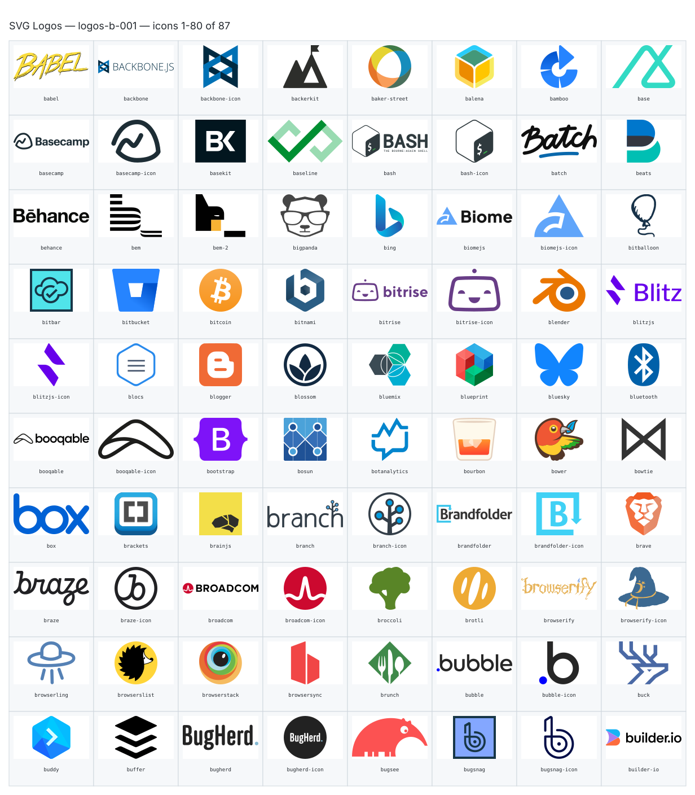
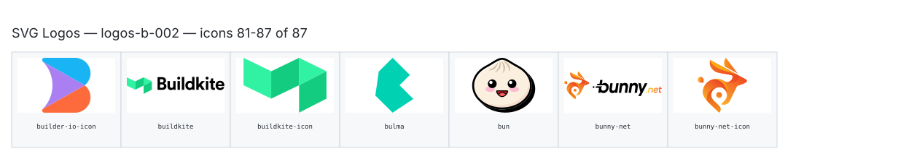

**Generated file — do not edit. Run `python scripts/portfolio.py icons generate`.**

# SVG Logos — `b`

[SVG Logos hub](../logos.md). 87 icons in group `b` across 2 sheets. Display names are approximate; copy the slug for Mermaid.

## logos-b-001

- `logos:babel` — Babel — [logos-b-001.svg](../sheets/logos-b-001.svg) r0c0 — `service example(logos:babel)[Babel]`
- `logos:backbone` — Backbone — [logos-b-001.svg](../sheets/logos-b-001.svg) r0c1 — `service example(logos:backbone)[Backbone]`
- `logos:backbone-icon` — Backbone Icon — [logos-b-001.svg](../sheets/logos-b-001.svg) r0c2 — `service example(logos:backbone-icon)[Backbone Icon]`
- `logos:backerkit` — Backerkit — [logos-b-001.svg](../sheets/logos-b-001.svg) r0c3 — `service example(logos:backerkit)[Backerkit]`
- `logos:baker-street` — Baker Street — [logos-b-001.svg](../sheets/logos-b-001.svg) r0c4 — `service example(logos:baker-street)[Baker Street]`
- `logos:balena` — Balena — [logos-b-001.svg](../sheets/logos-b-001.svg) r0c5 — `service example(logos:balena)[Balena]`
- `logos:bamboo` — Bamboo — [logos-b-001.svg](../sheets/logos-b-001.svg) r0c6 — `service example(logos:bamboo)[Bamboo]`
- `logos:base` — Base — [logos-b-001.svg](../sheets/logos-b-001.svg) r0c7 — `service example(logos:base)[Base]`
- `logos:basecamp` — Basecamp — [logos-b-001.svg](../sheets/logos-b-001.svg) r1c0 — `service example(logos:basecamp)[Basecamp]`
- `logos:basecamp-icon` — Basecamp Icon — [logos-b-001.svg](../sheets/logos-b-001.svg) r1c1 — `service example(logos:basecamp-icon)[Basecamp Icon]`
- `logos:basekit` — Basekit — [logos-b-001.svg](../sheets/logos-b-001.svg) r1c2 — `service example(logos:basekit)[Basekit]`
- `logos:baseline` — Baseline — [logos-b-001.svg](../sheets/logos-b-001.svg) r1c3 — `service example(logos:baseline)[Baseline]`
- `logos:bash` — Bash — [logos-b-001.svg](../sheets/logos-b-001.svg) r1c4 — `service example(logos:bash)[Bash]`
- `logos:bash-icon` — Bash Icon — [logos-b-001.svg](../sheets/logos-b-001.svg) r1c5 — `service example(logos:bash-icon)[Bash Icon]`
- `logos:batch` — Batch — [logos-b-001.svg](../sheets/logos-b-001.svg) r1c6 — `service example(logos:batch)[Batch]`
- `logos:beats` — Beats — [logos-b-001.svg](../sheets/logos-b-001.svg) r1c7 — `service example(logos:beats)[Beats]`
- `logos:behance` — Behance — [logos-b-001.svg](../sheets/logos-b-001.svg) r2c0 — `service example(logos:behance)[Behance]`
- `logos:bem` — Bem — [logos-b-001.svg](../sheets/logos-b-001.svg) r2c1 — `service example(logos:bem)[Bem]`
- `logos:bem-2` — Bem 2 — [logos-b-001.svg](../sheets/logos-b-001.svg) r2c2 — `service example(logos:bem-2)[Bem 2]`
- `logos:bigpanda` — Bigpanda — [logos-b-001.svg](../sheets/logos-b-001.svg) r2c3 — `service example(logos:bigpanda)[Bigpanda]`
- `logos:bing` — Bing — [logos-b-001.svg](../sheets/logos-b-001.svg) r2c4 — `service example(logos:bing)[Bing]`
- `logos:biomejs` — Biomejs — [logos-b-001.svg](../sheets/logos-b-001.svg) r2c5 — `service example(logos:biomejs)[Biomejs]`
- `logos:biomejs-icon` — Biomejs Icon — [logos-b-001.svg](../sheets/logos-b-001.svg) r2c6 — `service example(logos:biomejs-icon)[Biomejs Icon]`
- `logos:bitballoon` — Bitballoon — [logos-b-001.svg](../sheets/logos-b-001.svg) r2c7 — `service example(logos:bitballoon)[Bitballoon]`
- `logos:bitbar` — Bitbar — [logos-b-001.svg](../sheets/logos-b-001.svg) r3c0 — `service example(logos:bitbar)[Bitbar]`
- `logos:bitbucket` — Bitbucket — [logos-b-001.svg](../sheets/logos-b-001.svg) r3c1 — `service example(logos:bitbucket)[Bitbucket]`
- `logos:bitcoin` — Bitcoin — [logos-b-001.svg](../sheets/logos-b-001.svg) r3c2 — `service example(logos:bitcoin)[Bitcoin]`
- `logos:bitnami` — Bitnami — [logos-b-001.svg](../sheets/logos-b-001.svg) r3c3 — `service example(logos:bitnami)[Bitnami]`
- `logos:bitrise` — Bitrise — [logos-b-001.svg](../sheets/logos-b-001.svg) r3c4 — `service example(logos:bitrise)[Bitrise]`
- `logos:bitrise-icon` — Bitrise Icon — [logos-b-001.svg](../sheets/logos-b-001.svg) r3c5 — `service example(logos:bitrise-icon)[Bitrise Icon]`
- `logos:blender` — Blender — [logos-b-001.svg](../sheets/logos-b-001.svg) r3c6 — `service example(logos:blender)[Blender]`
- `logos:blitzjs` — Blitzjs — [logos-b-001.svg](../sheets/logos-b-001.svg) r3c7 — `service example(logos:blitzjs)[Blitzjs]`
- `logos:blitzjs-icon` — Blitzjs Icon — [logos-b-001.svg](../sheets/logos-b-001.svg) r4c0 — `service example(logos:blitzjs-icon)[Blitzjs Icon]`
- `logos:blocs` — Blocs — [logos-b-001.svg](../sheets/logos-b-001.svg) r4c1 — `service example(logos:blocs)[Blocs]`
- `logos:blogger` — Blogger — [logos-b-001.svg](../sheets/logos-b-001.svg) r4c2 — `service example(logos:blogger)[Blogger]`
- `logos:blossom` — Blossom — [logos-b-001.svg](../sheets/logos-b-001.svg) r4c3 — `service example(logos:blossom)[Blossom]`
- `logos:bluemix` — Bluemix — [logos-b-001.svg](../sheets/logos-b-001.svg) r4c4 — `service example(logos:bluemix)[Bluemix]`
- `logos:blueprint` — Blueprint — [logos-b-001.svg](../sheets/logos-b-001.svg) r4c5 — `service example(logos:blueprint)[Blueprint]`
- `logos:bluesky` — Bluesky — [logos-b-001.svg](../sheets/logos-b-001.svg) r4c6 — `service example(logos:bluesky)[Bluesky]`
- `logos:bluetooth` — Bluetooth — [logos-b-001.svg](../sheets/logos-b-001.svg) r4c7 — `service example(logos:bluetooth)[Bluetooth]`
- `logos:booqable` — Booqable — [logos-b-001.svg](../sheets/logos-b-001.svg) r5c0 — `service example(logos:booqable)[Booqable]`
- `logos:booqable-icon` — Booqable Icon — [logos-b-001.svg](../sheets/logos-b-001.svg) r5c1 — `service example(logos:booqable-icon)[Booqable Icon]`
- `logos:bootstrap` — Bootstrap — [logos-b-001.svg](../sheets/logos-b-001.svg) r5c2 — `service example(logos:bootstrap)[Bootstrap]`
- `logos:bosun` — Bosun — [logos-b-001.svg](../sheets/logos-b-001.svg) r5c3 — `service example(logos:bosun)[Bosun]`
- `logos:botanalytics` — Botanalytics — [logos-b-001.svg](../sheets/logos-b-001.svg) r5c4 — `service example(logos:botanalytics)[Botanalytics]`
- `logos:bourbon` — Bourbon — [logos-b-001.svg](../sheets/logos-b-001.svg) r5c5 — `service example(logos:bourbon)[Bourbon]`
- `logos:bower` — Bower — [logos-b-001.svg](../sheets/logos-b-001.svg) r5c6 — `service example(logos:bower)[Bower]`
- `logos:bowtie` — Bowtie — [logos-b-001.svg](../sheets/logos-b-001.svg) r5c7 — `service example(logos:bowtie)[Bowtie]`
- `logos:box` — Box — [logos-b-001.svg](../sheets/logos-b-001.svg) r6c0 — `service example(logos:box)[Box]`
- `logos:brackets` — Brackets — [logos-b-001.svg](../sheets/logos-b-001.svg) r6c1 — `service example(logos:brackets)[Brackets]`
- `logos:brainjs` — Brainjs — [logos-b-001.svg](../sheets/logos-b-001.svg) r6c2 — `service example(logos:brainjs)[Brainjs]`
- `logos:branch` — Branch — [logos-b-001.svg](../sheets/logos-b-001.svg) r6c3 — `service example(logos:branch)[Branch]`
- `logos:branch-icon` — Branch Icon — [logos-b-001.svg](../sheets/logos-b-001.svg) r6c4 — `service example(logos:branch-icon)[Branch Icon]`
- `logos:brandfolder` — Brandfolder — [logos-b-001.svg](../sheets/logos-b-001.svg) r6c5 — `service example(logos:brandfolder)[Brandfolder]`
- `logos:brandfolder-icon` — Brandfolder Icon — [logos-b-001.svg](../sheets/logos-b-001.svg) r6c6 — `service example(logos:brandfolder-icon)[Brandfolder Icon]`
- `logos:brave` — Brave — [logos-b-001.svg](../sheets/logos-b-001.svg) r6c7 — `service example(logos:brave)[Brave]`
- `logos:braze` — Braze — [logos-b-001.svg](../sheets/logos-b-001.svg) r7c0 — `service example(logos:braze)[Braze]`
- `logos:braze-icon` — Braze Icon — [logos-b-001.svg](../sheets/logos-b-001.svg) r7c1 — `service example(logos:braze-icon)[Braze Icon]`
- `logos:broadcom` — Broadcom — [logos-b-001.svg](../sheets/logos-b-001.svg) r7c2 — `service example(logos:broadcom)[Broadcom]`
- `logos:broadcom-icon` — Broadcom Icon — [logos-b-001.svg](../sheets/logos-b-001.svg) r7c3 — `service example(logos:broadcom-icon)[Broadcom Icon]`
- `logos:broccoli` — Broccoli — [logos-b-001.svg](../sheets/logos-b-001.svg) r7c4 — `service example(logos:broccoli)[Broccoli]`
- `logos:brotli` — Brotli — [logos-b-001.svg](../sheets/logos-b-001.svg) r7c5 — `service example(logos:brotli)[Brotli]`
- `logos:browserify` — Browserify — [logos-b-001.svg](../sheets/logos-b-001.svg) r7c6 — `service example(logos:browserify)[Browserify]`
- `logos:browserify-icon` — Browserify Icon — [logos-b-001.svg](../sheets/logos-b-001.svg) r7c7 — `service example(logos:browserify-icon)[Browserify Icon]`
- `logos:browserling` — Browserling — [logos-b-001.svg](../sheets/logos-b-001.svg) r8c0 — `service example(logos:browserling)[Browserling]`
- `logos:browserslist` — Browserslist — [logos-b-001.svg](../sheets/logos-b-001.svg) r8c1 — `service example(logos:browserslist)[Browserslist]`
- `logos:browserstack` — Browserstack — [logos-b-001.svg](../sheets/logos-b-001.svg) r8c2 — `service example(logos:browserstack)[Browserstack]`
- `logos:browsersync` — Browsersync — [logos-b-001.svg](../sheets/logos-b-001.svg) r8c3 — `service example(logos:browsersync)[Browsersync]`
- `logos:brunch` — Brunch — [logos-b-001.svg](../sheets/logos-b-001.svg) r8c4 — `service example(logos:brunch)[Brunch]`
- `logos:bubble` — Bubble — [logos-b-001.svg](../sheets/logos-b-001.svg) r8c5 — `service example(logos:bubble)[Bubble]`
- `logos:bubble-icon` — Bubble Icon — [logos-b-001.svg](../sheets/logos-b-001.svg) r8c6 — `service example(logos:bubble-icon)[Bubble Icon]`
- `logos:buck` — Buck — [logos-b-001.svg](../sheets/logos-b-001.svg) r8c7 — `service example(logos:buck)[Buck]`
- `logos:buddy` — Buddy — [logos-b-001.svg](../sheets/logos-b-001.svg) r9c0 — `service example(logos:buddy)[Buddy]`
- `logos:buffer` — Buffer — [logos-b-001.svg](../sheets/logos-b-001.svg) r9c1 — `service example(logos:buffer)[Buffer]`
- `logos:bugherd` — Bugherd — [logos-b-001.svg](../sheets/logos-b-001.svg) r9c2 — `service example(logos:bugherd)[Bugherd]`
- `logos:bugherd-icon` — Bugherd Icon — [logos-b-001.svg](../sheets/logos-b-001.svg) r9c3 — `service example(logos:bugherd-icon)[Bugherd Icon]`
- `logos:bugsee` — Bugsee — [logos-b-001.svg](../sheets/logos-b-001.svg) r9c4 — `service example(logos:bugsee)[Bugsee]`
- `logos:bugsnag` — Bugsnag — [logos-b-001.svg](../sheets/logos-b-001.svg) r9c5 — `service example(logos:bugsnag)[Bugsnag]`
- `logos:bugsnag-icon` — Bugsnag Icon — [logos-b-001.svg](../sheets/logos-b-001.svg) r9c6 — `service example(logos:bugsnag-icon)[Bugsnag Icon]`
- `logos:builder-io` — Builder Io — [logos-b-001.svg](../sheets/logos-b-001.svg) r9c7 — `service example(logos:builder-io)[Builder Io]`

## logos-b-002

- `logos:builder-io-icon` — Builder Io Icon — [logos-b-002.svg](../sheets/logos-b-002.svg) r0c0 — `service example(logos:builder-io-icon)[Builder Io Icon]`
- `logos:buildkite` — Buildkite — [logos-b-002.svg](../sheets/logos-b-002.svg) r0c1 — `service example(logos:buildkite)[Buildkite]`
- `logos:buildkite-icon` — Buildkite Icon — [logos-b-002.svg](../sheets/logos-b-002.svg) r0c2 — `service example(logos:buildkite-icon)[Buildkite Icon]`
- `logos:bulma` — Bulma — [logos-b-002.svg](../sheets/logos-b-002.svg) r0c3 — `service example(logos:bulma)[Bulma]`
- `logos:bun` — Bun — [logos-b-002.svg](../sheets/logos-b-002.svg) r0c4 — `service example(logos:bun)[Bun]`
- `logos:bunny-net` — Bunny Net — [logos-b-002.svg](../sheets/logos-b-002.svg) r0c5 — `service example(logos:bunny-net)[Bunny Net]`
- `logos:bunny-net-icon` — Bunny Net Icon — [logos-b-002.svg](../sheets/logos-b-002.svg) r0c6 — `service example(logos:bunny-net-icon)[Bunny Net Icon]`
