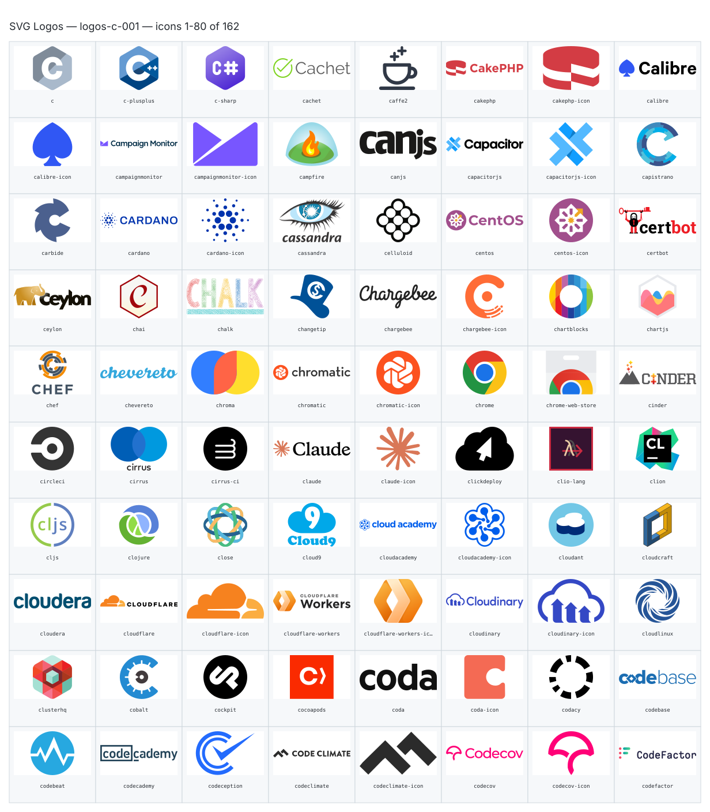
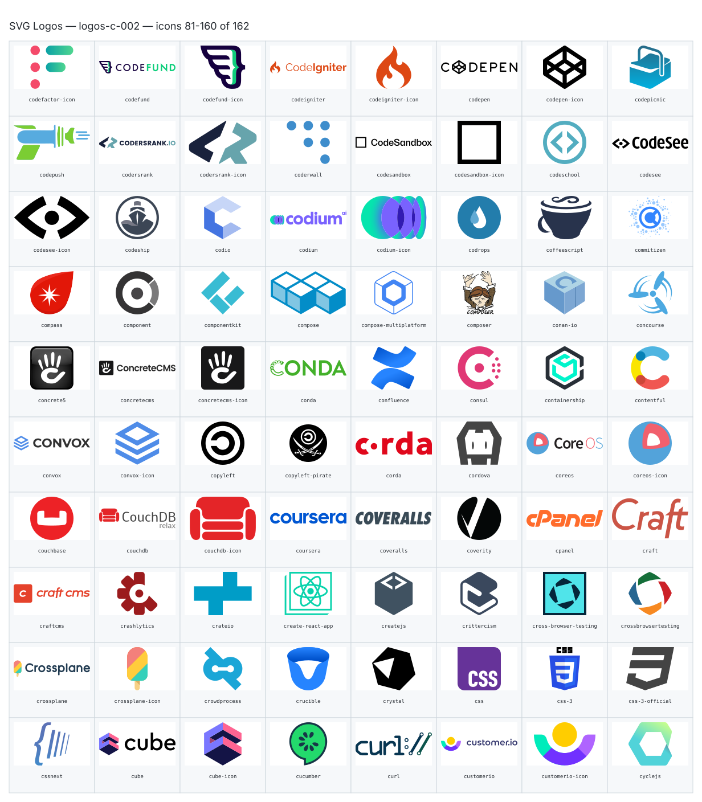
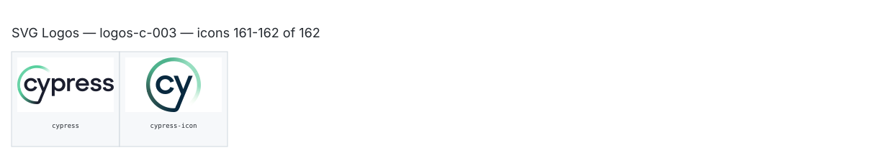

**Generated file — do not edit. Run `python scripts/portfolio.py icons generate`.**

# SVG Logos — `c`

[SVG Logos hub](../logos.md). 162 icons in group `c` across 3 sheets. Display names are approximate; copy the slug for Mermaid.

## logos-c-001

- `logos:c` — C — [logos-c-001.svg](../sheets/logos-c-001.svg) r0c0 — `service example(logos:c)[C]`
- `logos:c-plusplus` — C Plusplus — [logos-c-001.svg](../sheets/logos-c-001.svg) r0c1 — `service example(logos:c-plusplus)[C Plusplus]`
- `logos:c-sharp` — C Sharp — [logos-c-001.svg](../sheets/logos-c-001.svg) r0c2 — `service example(logos:c-sharp)[C Sharp]`
- `logos:cachet` — Cachet — [logos-c-001.svg](../sheets/logos-c-001.svg) r0c3 — `service example(logos:cachet)[Cachet]`
- `logos:caffe2` — Caffe2 — [logos-c-001.svg](../sheets/logos-c-001.svg) r0c4 — `service example(logos:caffe2)[Caffe2]`
- `logos:cakephp` — Cakephp — [logos-c-001.svg](../sheets/logos-c-001.svg) r0c5 — `service example(logos:cakephp)[Cakephp]`
- `logos:cakephp-icon` — Cakephp Icon — [logos-c-001.svg](../sheets/logos-c-001.svg) r0c6 — `service example(logos:cakephp-icon)[Cakephp Icon]`
- `logos:calibre` — Calibre — [logos-c-001.svg](../sheets/logos-c-001.svg) r0c7 — `service example(logos:calibre)[Calibre]`
- `logos:calibre-icon` — Calibre Icon — [logos-c-001.svg](../sheets/logos-c-001.svg) r1c0 — `service example(logos:calibre-icon)[Calibre Icon]`
- `logos:campaignmonitor` — Campaignmonitor — [logos-c-001.svg](../sheets/logos-c-001.svg) r1c1 — `service example(logos:campaignmonitor)[Campaignmonitor]`
- `logos:campaignmonitor-icon` — Campaignmonitor Icon — [logos-c-001.svg](../sheets/logos-c-001.svg) r1c2 — `service example(logos:campaignmonitor-icon)[Campaignmonitor Icon]`
- `logos:campfire` — Campfire — [logos-c-001.svg](../sheets/logos-c-001.svg) r1c3 — `service example(logos:campfire)[Campfire]`
- `logos:canjs` — Canjs — [logos-c-001.svg](../sheets/logos-c-001.svg) r1c4 — `service example(logos:canjs)[Canjs]`
- `logos:capacitorjs` — Capacitorjs — [logos-c-001.svg](../sheets/logos-c-001.svg) r1c5 — `service example(logos:capacitorjs)[Capacitorjs]`
- `logos:capacitorjs-icon` — Capacitorjs Icon — [logos-c-001.svg](../sheets/logos-c-001.svg) r1c6 — `service example(logos:capacitorjs-icon)[Capacitorjs Icon]`
- `logos:capistrano` — Capistrano — [logos-c-001.svg](../sheets/logos-c-001.svg) r1c7 — `service example(logos:capistrano)[Capistrano]`
- `logos:carbide` — Carbide — [logos-c-001.svg](../sheets/logos-c-001.svg) r2c0 — `service example(logos:carbide)[Carbide]`
- `logos:cardano` — Cardano — [logos-c-001.svg](../sheets/logos-c-001.svg) r2c1 — `service example(logos:cardano)[Cardano]`
- `logos:cardano-icon` — Cardano Icon — [logos-c-001.svg](../sheets/logos-c-001.svg) r2c2 — `service example(logos:cardano-icon)[Cardano Icon]`
- `logos:cassandra` — Cassandra — [logos-c-001.svg](../sheets/logos-c-001.svg) r2c3 — `service example(logos:cassandra)[Cassandra]`
- `logos:celluloid` — Celluloid — [logos-c-001.svg](../sheets/logos-c-001.svg) r2c4 — `service example(logos:celluloid)[Celluloid]`
- `logos:centos` — Centos — [logos-c-001.svg](../sheets/logos-c-001.svg) r2c5 — `service example(logos:centos)[Centos]`
- `logos:centos-icon` — Centos Icon — [logos-c-001.svg](../sheets/logos-c-001.svg) r2c6 — `service example(logos:centos-icon)[Centos Icon]`
- `logos:certbot` — Certbot — [logos-c-001.svg](../sheets/logos-c-001.svg) r2c7 — `service example(logos:certbot)[Certbot]`
- `logos:ceylon` — Ceylon — [logos-c-001.svg](../sheets/logos-c-001.svg) r3c0 — `service example(logos:ceylon)[Ceylon]`
- `logos:chai` — Chai — [logos-c-001.svg](../sheets/logos-c-001.svg) r3c1 — `service example(logos:chai)[Chai]`
- `logos:chalk` — Chalk — [logos-c-001.svg](../sheets/logos-c-001.svg) r3c2 — `service example(logos:chalk)[Chalk]`
- `logos:changetip` — Changetip — [logos-c-001.svg](../sheets/logos-c-001.svg) r3c3 — `service example(logos:changetip)[Changetip]`
- `logos:chargebee` — Chargebee — [logos-c-001.svg](../sheets/logos-c-001.svg) r3c4 — `service example(logos:chargebee)[Chargebee]`
- `logos:chargebee-icon` — Chargebee Icon — [logos-c-001.svg](../sheets/logos-c-001.svg) r3c5 — `service example(logos:chargebee-icon)[Chargebee Icon]`
- `logos:chartblocks` — Chartblocks — [logos-c-001.svg](../sheets/logos-c-001.svg) r3c6 — `service example(logos:chartblocks)[Chartblocks]`
- `logos:chartjs` — Chartjs — [logos-c-001.svg](../sheets/logos-c-001.svg) r3c7 — `service example(logos:chartjs)[Chartjs]`
- `logos:chef` — Chef — [logos-c-001.svg](../sheets/logos-c-001.svg) r4c0 — `service example(logos:chef)[Chef]`
- `logos:chevereto` — Chevereto — [logos-c-001.svg](../sheets/logos-c-001.svg) r4c1 — `service example(logos:chevereto)[Chevereto]`
- `logos:chroma` — Chroma — [logos-c-001.svg](../sheets/logos-c-001.svg) r4c2 — `service example(logos:chroma)[Chroma]`
- `logos:chromatic` — Chromatic — [logos-c-001.svg](../sheets/logos-c-001.svg) r4c3 — `service example(logos:chromatic)[Chromatic]`
- `logos:chromatic-icon` — Chromatic Icon — [logos-c-001.svg](../sheets/logos-c-001.svg) r4c4 — `service example(logos:chromatic-icon)[Chromatic Icon]`
- `logos:chrome` — Chrome — [logos-c-001.svg](../sheets/logos-c-001.svg) r4c5 — `service example(logos:chrome)[Chrome]`
- `logos:chrome-web-store` — Chrome Web Store — [logos-c-001.svg](../sheets/logos-c-001.svg) r4c6 — `service example(logos:chrome-web-store)[Chrome Web Store]`
- `logos:cinder` — Cinder — [logos-c-001.svg](../sheets/logos-c-001.svg) r4c7 — `service example(logos:cinder)[Cinder]`
- `logos:circleci` — Circleci — [logos-c-001.svg](../sheets/logos-c-001.svg) r5c0 — `service example(logos:circleci)[Circleci]`
- `logos:cirrus` — Cirrus — [logos-c-001.svg](../sheets/logos-c-001.svg) r5c1 — `service example(logos:cirrus)[Cirrus]`
- `logos:cirrus-ci` — Cirrus Ci — [logos-c-001.svg](../sheets/logos-c-001.svg) r5c2 — `service example(logos:cirrus-ci)[Cirrus Ci]`
- `logos:claude` — Claude — [logos-c-001.svg](../sheets/logos-c-001.svg) r5c3 — `service example(logos:claude)[Claude]`
- `logos:claude-icon` — Claude Icon — [logos-c-001.svg](../sheets/logos-c-001.svg) r5c4 — `service example(logos:claude-icon)[Claude Icon]`
- `logos:clickdeploy` — Clickdeploy — [logos-c-001.svg](../sheets/logos-c-001.svg) r5c5 — `service example(logos:clickdeploy)[Clickdeploy]`
- `logos:clio-lang` — Clio Lang — [logos-c-001.svg](../sheets/logos-c-001.svg) r5c6 — `service example(logos:clio-lang)[Clio Lang]`
- `logos:clion` — Clion — [logos-c-001.svg](../sheets/logos-c-001.svg) r5c7 — `service example(logos:clion)[Clion]`
- `logos:cljs` — Cljs — [logos-c-001.svg](../sheets/logos-c-001.svg) r6c0 — `service example(logos:cljs)[Cljs]`
- `logos:clojure` — Clojure — [logos-c-001.svg](../sheets/logos-c-001.svg) r6c1 — `service example(logos:clojure)[Clojure]`
- `logos:close` — Close — [logos-c-001.svg](../sheets/logos-c-001.svg) r6c2 — `service example(logos:close)[Close]`
- `logos:cloud9` — Cloud9 — [logos-c-001.svg](../sheets/logos-c-001.svg) r6c3 — `service example(logos:cloud9)[Cloud9]`
- `logos:cloudacademy` — Cloudacademy — [logos-c-001.svg](../sheets/logos-c-001.svg) r6c4 — `service example(logos:cloudacademy)[Cloudacademy]`
- `logos:cloudacademy-icon` — Cloudacademy Icon — [logos-c-001.svg](../sheets/logos-c-001.svg) r6c5 — `service example(logos:cloudacademy-icon)[Cloudacademy Icon]`
- `logos:cloudant` — Cloudant — [logos-c-001.svg](../sheets/logos-c-001.svg) r6c6 — `service example(logos:cloudant)[Cloudant]`
- `logos:cloudcraft` — Cloudcraft — [logos-c-001.svg](../sheets/logos-c-001.svg) r6c7 — `service example(logos:cloudcraft)[Cloudcraft]`
- `logos:cloudera` — Cloudera — [logos-c-001.svg](../sheets/logos-c-001.svg) r7c0 — `service example(logos:cloudera)[Cloudera]`
- `logos:cloudflare` — Cloudflare — [logos-c-001.svg](../sheets/logos-c-001.svg) r7c1 — `service example(logos:cloudflare)[Cloudflare]`
- `logos:cloudflare-icon` — Cloudflare Icon — [logos-c-001.svg](../sheets/logos-c-001.svg) r7c2 — `service example(logos:cloudflare-icon)[Cloudflare Icon]`
- `logos:cloudflare-workers` — Cloudflare Workers — [logos-c-001.svg](../sheets/logos-c-001.svg) r7c3 — `service example(logos:cloudflare-workers)[Cloudflare Workers]`
- `logos:cloudflare-workers-icon` — Cloudflare Workers Icon — [logos-c-001.svg](../sheets/logos-c-001.svg) r7c4 — `service example(logos:cloudflare-workers-icon)[Cloudflare Workers Icon]`
- `logos:cloudinary` — Cloudinary — [logos-c-001.svg](../sheets/logos-c-001.svg) r7c5 — `service example(logos:cloudinary)[Cloudinary]`
- `logos:cloudinary-icon` — Cloudinary Icon — [logos-c-001.svg](../sheets/logos-c-001.svg) r7c6 — `service example(logos:cloudinary-icon)[Cloudinary Icon]`
- `logos:cloudlinux` — Cloudlinux — [logos-c-001.svg](../sheets/logos-c-001.svg) r7c7 — `service example(logos:cloudlinux)[Cloudlinux]`
- `logos:clusterhq` — Clusterhq — [logos-c-001.svg](../sheets/logos-c-001.svg) r8c0 — `service example(logos:clusterhq)[Clusterhq]`
- `logos:cobalt` — Cobalt — [logos-c-001.svg](../sheets/logos-c-001.svg) r8c1 — `service example(logos:cobalt)[Cobalt]`
- `logos:cockpit` — Cockpit — [logos-c-001.svg](../sheets/logos-c-001.svg) r8c2 — `service example(logos:cockpit)[Cockpit]`
- `logos:cocoapods` — Cocoapods — [logos-c-001.svg](../sheets/logos-c-001.svg) r8c3 — `service example(logos:cocoapods)[Cocoapods]`
- `logos:coda` — Coda — [logos-c-001.svg](../sheets/logos-c-001.svg) r8c4 — `service example(logos:coda)[Coda]`
- `logos:coda-icon` — Coda Icon — [logos-c-001.svg](../sheets/logos-c-001.svg) r8c5 — `service example(logos:coda-icon)[Coda Icon]`
- `logos:codacy` — Codacy — [logos-c-001.svg](../sheets/logos-c-001.svg) r8c6 — `service example(logos:codacy)[Codacy]`
- `logos:codebase` — Codebase — [logos-c-001.svg](../sheets/logos-c-001.svg) r8c7 — `service example(logos:codebase)[Codebase]`
- `logos:codebeat` — Codebeat — [logos-c-001.svg](../sheets/logos-c-001.svg) r9c0 — `service example(logos:codebeat)[Codebeat]`
- `logos:codecademy` — Codecademy — [logos-c-001.svg](../sheets/logos-c-001.svg) r9c1 — `service example(logos:codecademy)[Codecademy]`
- `logos:codeception` — Codeception — [logos-c-001.svg](../sheets/logos-c-001.svg) r9c2 — `service example(logos:codeception)[Codeception]`
- `logos:codeclimate` — Codeclimate — [logos-c-001.svg](../sheets/logos-c-001.svg) r9c3 — `service example(logos:codeclimate)[Codeclimate]`
- `logos:codeclimate-icon` — Codeclimate Icon — [logos-c-001.svg](../sheets/logos-c-001.svg) r9c4 — `service example(logos:codeclimate-icon)[Codeclimate Icon]`
- `logos:codecov` — Codecov — [logos-c-001.svg](../sheets/logos-c-001.svg) r9c5 — `service example(logos:codecov)[Codecov]`
- `logos:codecov-icon` — Codecov Icon — [logos-c-001.svg](../sheets/logos-c-001.svg) r9c6 — `service example(logos:codecov-icon)[Codecov Icon]`
- `logos:codefactor` — Codefactor — [logos-c-001.svg](../sheets/logos-c-001.svg) r9c7 — `service example(logos:codefactor)[Codefactor]`

## logos-c-002

- `logos:codefactor-icon` — Codefactor Icon — [logos-c-002.svg](../sheets/logos-c-002.svg) r0c0 — `service example(logos:codefactor-icon)[Codefactor Icon]`
- `logos:codefund` — Codefund — [logos-c-002.svg](../sheets/logos-c-002.svg) r0c1 — `service example(logos:codefund)[Codefund]`
- `logos:codefund-icon` — Codefund Icon — [logos-c-002.svg](../sheets/logos-c-002.svg) r0c2 — `service example(logos:codefund-icon)[Codefund Icon]`
- `logos:codeigniter` — Codeigniter — [logos-c-002.svg](../sheets/logos-c-002.svg) r0c3 — `service example(logos:codeigniter)[Codeigniter]`
- `logos:codeigniter-icon` — Codeigniter Icon — [logos-c-002.svg](../sheets/logos-c-002.svg) r0c4 — `service example(logos:codeigniter-icon)[Codeigniter Icon]`
- `logos:codepen` — Codepen — [logos-c-002.svg](../sheets/logos-c-002.svg) r0c5 — `service example(logos:codepen)[Codepen]`
- `logos:codepen-icon` — Codepen Icon — [logos-c-002.svg](../sheets/logos-c-002.svg) r0c6 — `service example(logos:codepen-icon)[Codepen Icon]`
- `logos:codepicnic` — Codepicnic — [logos-c-002.svg](../sheets/logos-c-002.svg) r0c7 — `service example(logos:codepicnic)[Codepicnic]`
- `logos:codepush` — Codepush — [logos-c-002.svg](../sheets/logos-c-002.svg) r1c0 — `service example(logos:codepush)[Codepush]`
- `logos:codersrank` — Codersrank — [logos-c-002.svg](../sheets/logos-c-002.svg) r1c1 — `service example(logos:codersrank)[Codersrank]`
- `logos:codersrank-icon` — Codersrank Icon — [logos-c-002.svg](../sheets/logos-c-002.svg) r1c2 — `service example(logos:codersrank-icon)[Codersrank Icon]`
- `logos:coderwall` — Coderwall — [logos-c-002.svg](../sheets/logos-c-002.svg) r1c3 — `service example(logos:coderwall)[Coderwall]`
- `logos:codesandbox` — Codesandbox — [logos-c-002.svg](../sheets/logos-c-002.svg) r1c4 — `service example(logos:codesandbox)[Codesandbox]`
- `logos:codesandbox-icon` — Codesandbox Icon — [logos-c-002.svg](../sheets/logos-c-002.svg) r1c5 — `service example(logos:codesandbox-icon)[Codesandbox Icon]`
- `logos:codeschool` — Codeschool — [logos-c-002.svg](../sheets/logos-c-002.svg) r1c6 — `service example(logos:codeschool)[Codeschool]`
- `logos:codesee` — Codesee — [logos-c-002.svg](../sheets/logos-c-002.svg) r1c7 — `service example(logos:codesee)[Codesee]`
- `logos:codesee-icon` — Codesee Icon — [logos-c-002.svg](../sheets/logos-c-002.svg) r2c0 — `service example(logos:codesee-icon)[Codesee Icon]`
- `logos:codeship` — Codeship — [logos-c-002.svg](../sheets/logos-c-002.svg) r2c1 — `service example(logos:codeship)[Codeship]`
- `logos:codio` — Codio — [logos-c-002.svg](../sheets/logos-c-002.svg) r2c2 — `service example(logos:codio)[Codio]`
- `logos:codium` — Codium — [logos-c-002.svg](../sheets/logos-c-002.svg) r2c3 — `service example(logos:codium)[Codium]`
- `logos:codium-icon` — Codium Icon — [logos-c-002.svg](../sheets/logos-c-002.svg) r2c4 — `service example(logos:codium-icon)[Codium Icon]`
- `logos:codrops` — Codrops — [logos-c-002.svg](../sheets/logos-c-002.svg) r2c5 — `service example(logos:codrops)[Codrops]`
- `logos:coffeescript` — Coffeescript — [logos-c-002.svg](../sheets/logos-c-002.svg) r2c6 — `service example(logos:coffeescript)[Coffeescript]`
- `logos:commitizen` — Commitizen — [logos-c-002.svg](../sheets/logos-c-002.svg) r2c7 — `service example(logos:commitizen)[Commitizen]`
- `logos:compass` — Compass — [logos-c-002.svg](../sheets/logos-c-002.svg) r3c0 — `service example(logos:compass)[Compass]`
- `logos:component` — Component — [logos-c-002.svg](../sheets/logos-c-002.svg) r3c1 — `service example(logos:component)[Component]`
- `logos:componentkit` — Componentkit — [logos-c-002.svg](../sheets/logos-c-002.svg) r3c2 — `service example(logos:componentkit)[Componentkit]`
- `logos:compose` — Compose — [logos-c-002.svg](../sheets/logos-c-002.svg) r3c3 — `service example(logos:compose)[Compose]`
- `logos:compose-multiplatform` — Compose Multiplatform — [logos-c-002.svg](../sheets/logos-c-002.svg) r3c4 — `service example(logos:compose-multiplatform)[Compose Multiplatform]`
- `logos:composer` — Composer — [logos-c-002.svg](../sheets/logos-c-002.svg) r3c5 — `service example(logos:composer)[Composer]`
- `logos:conan-io` — Conan Io — [logos-c-002.svg](../sheets/logos-c-002.svg) r3c6 — `service example(logos:conan-io)[Conan Io]`
- `logos:concourse` — Concourse — [logos-c-002.svg](../sheets/logos-c-002.svg) r3c7 — `service example(logos:concourse)[Concourse]`
- `logos:concrete5` — Concrete5 — [logos-c-002.svg](../sheets/logos-c-002.svg) r4c0 — `service example(logos:concrete5)[Concrete5]`
- `logos:concretecms` — Concretecms — [logos-c-002.svg](../sheets/logos-c-002.svg) r4c1 — `service example(logos:concretecms)[Concretecms]`
- `logos:concretecms-icon` — Concretecms Icon — [logos-c-002.svg](../sheets/logos-c-002.svg) r4c2 — `service example(logos:concretecms-icon)[Concretecms Icon]`
- `logos:conda` — Conda — [logos-c-002.svg](../sheets/logos-c-002.svg) r4c3 — `service example(logos:conda)[Conda]`
- `logos:confluence` — Confluence — [logos-c-002.svg](../sheets/logos-c-002.svg) r4c4 — `service example(logos:confluence)[Confluence]`
- `logos:consul` — Consul — [logos-c-002.svg](../sheets/logos-c-002.svg) r4c5 — `service example(logos:consul)[Consul]`
- `logos:containership` — Containership — [logos-c-002.svg](../sheets/logos-c-002.svg) r4c6 — `service example(logos:containership)[Containership]`
- `logos:contentful` — Contentful — [logos-c-002.svg](../sheets/logos-c-002.svg) r4c7 — `service example(logos:contentful)[Contentful]`
- `logos:convox` — Convox — [logos-c-002.svg](../sheets/logos-c-002.svg) r5c0 — `service example(logos:convox)[Convox]`
- `logos:convox-icon` — Convox Icon — [logos-c-002.svg](../sheets/logos-c-002.svg) r5c1 — `service example(logos:convox-icon)[Convox Icon]`
- `logos:copyleft` — Copyleft — [logos-c-002.svg](../sheets/logos-c-002.svg) r5c2 — `service example(logos:copyleft)[Copyleft]`
- `logos:copyleft-pirate` — Copyleft Pirate — [logos-c-002.svg](../sheets/logos-c-002.svg) r5c3 — `service example(logos:copyleft-pirate)[Copyleft Pirate]`
- `logos:corda` — Corda — [logos-c-002.svg](../sheets/logos-c-002.svg) r5c4 — `service example(logos:corda)[Corda]`
- `logos:cordova` — Cordova — [logos-c-002.svg](../sheets/logos-c-002.svg) r5c5 — `service example(logos:cordova)[Cordova]`
- `logos:coreos` — Coreos — [logos-c-002.svg](../sheets/logos-c-002.svg) r5c6 — `service example(logos:coreos)[Coreos]`
- `logos:coreos-icon` — Coreos Icon — [logos-c-002.svg](../sheets/logos-c-002.svg) r5c7 — `service example(logos:coreos-icon)[Coreos Icon]`
- `logos:couchbase` — Couchbase — [logos-c-002.svg](../sheets/logos-c-002.svg) r6c0 — `service example(logos:couchbase)[Couchbase]`
- `logos:couchdb` — Couchdb — [logos-c-002.svg](../sheets/logos-c-002.svg) r6c1 — `service example(logos:couchdb)[Couchdb]`
- `logos:couchdb-icon` — Couchdb Icon — [logos-c-002.svg](../sheets/logos-c-002.svg) r6c2 — `service example(logos:couchdb-icon)[Couchdb Icon]`
- `logos:coursera` — Coursera — [logos-c-002.svg](../sheets/logos-c-002.svg) r6c3 — `service example(logos:coursera)[Coursera]`
- `logos:coveralls` — Coveralls — [logos-c-002.svg](../sheets/logos-c-002.svg) r6c4 — `service example(logos:coveralls)[Coveralls]`
- `logos:coverity` — Coverity — [logos-c-002.svg](../sheets/logos-c-002.svg) r6c5 — `service example(logos:coverity)[Coverity]`
- `logos:cpanel` — Cpanel — [logos-c-002.svg](../sheets/logos-c-002.svg) r6c6 — `service example(logos:cpanel)[Cpanel]`
- `logos:craft` — Craft — [logos-c-002.svg](../sheets/logos-c-002.svg) r6c7 — `service example(logos:craft)[Craft]`
- `logos:craftcms` — Craftcms — [logos-c-002.svg](../sheets/logos-c-002.svg) r7c0 — `service example(logos:craftcms)[Craftcms]`
- `logos:crashlytics` — Crashlytics — [logos-c-002.svg](../sheets/logos-c-002.svg) r7c1 — `service example(logos:crashlytics)[Crashlytics]`
- `logos:crateio` — Crateio — [logos-c-002.svg](../sheets/logos-c-002.svg) r7c2 — `service example(logos:crateio)[Crateio]`
- `logos:create-react-app` — Create React App — [logos-c-002.svg](../sheets/logos-c-002.svg) r7c3 — `service example(logos:create-react-app)[Create React App]`
- `logos:createjs` — Createjs — [logos-c-002.svg](../sheets/logos-c-002.svg) r7c4 — `service example(logos:createjs)[Createjs]`
- `logos:crittercism` — Crittercism — [logos-c-002.svg](../sheets/logos-c-002.svg) r7c5 — `service example(logos:crittercism)[Crittercism]`
- `logos:cross-browser-testing` — Cross Browser Testing — [logos-c-002.svg](../sheets/logos-c-002.svg) r7c6 — `service example(logos:cross-browser-testing)[Cross Browser Testing]`
- `logos:crossbrowsertesting` — Crossbrowsertesting — [logos-c-002.svg](../sheets/logos-c-002.svg) r7c7 — `service example(logos:crossbrowsertesting)[Crossbrowsertesting]`
- `logos:crossplane` — Crossplane — [logos-c-002.svg](../sheets/logos-c-002.svg) r8c0 — `service example(logos:crossplane)[Crossplane]`
- `logos:crossplane-icon` — Crossplane Icon — [logos-c-002.svg](../sheets/logos-c-002.svg) r8c1 — `service example(logos:crossplane-icon)[Crossplane Icon]`
- `logos:crowdprocess` — Crowdprocess — [logos-c-002.svg](../sheets/logos-c-002.svg) r8c2 — `service example(logos:crowdprocess)[Crowdprocess]`
- `logos:crucible` — Crucible — [logos-c-002.svg](../sheets/logos-c-002.svg) r8c3 — `service example(logos:crucible)[Crucible]`
- `logos:crystal` — Crystal — [logos-c-002.svg](../sheets/logos-c-002.svg) r8c4 — `service example(logos:crystal)[Crystal]`
- `logos:css` — Css — [logos-c-002.svg](../sheets/logos-c-002.svg) r8c5 — `service example(logos:css)[Css]`
- `logos:css-3` — Css 3 — [logos-c-002.svg](../sheets/logos-c-002.svg) r8c6 — `service example(logos:css-3)[Css 3]`
- `logos:css-3-official` — Css 3 Official — [logos-c-002.svg](../sheets/logos-c-002.svg) r8c7 — `service example(logos:css-3-official)[Css 3 Official]`
- `logos:cssnext` — Cssnext — [logos-c-002.svg](../sheets/logos-c-002.svg) r9c0 — `service example(logos:cssnext)[Cssnext]`
- `logos:cube` — Cube — [logos-c-002.svg](../sheets/logos-c-002.svg) r9c1 — `service example(logos:cube)[Cube]`
- `logos:cube-icon` — Cube Icon — [logos-c-002.svg](../sheets/logos-c-002.svg) r9c2 — `service example(logos:cube-icon)[Cube Icon]`
- `logos:cucumber` — Cucumber — [logos-c-002.svg](../sheets/logos-c-002.svg) r9c3 — `service example(logos:cucumber)[Cucumber]`
- `logos:curl` — Curl — [logos-c-002.svg](../sheets/logos-c-002.svg) r9c4 — `service example(logos:curl)[Curl]`
- `logos:customerio` — Customerio — [logos-c-002.svg](../sheets/logos-c-002.svg) r9c5 — `service example(logos:customerio)[Customerio]`
- `logos:customerio-icon` — Customerio Icon — [logos-c-002.svg](../sheets/logos-c-002.svg) r9c6 — `service example(logos:customerio-icon)[Customerio Icon]`
- `logos:cyclejs` — Cyclejs — [logos-c-002.svg](../sheets/logos-c-002.svg) r9c7 — `service example(logos:cyclejs)[Cyclejs]`

## logos-c-003

- `logos:cypress` — Cypress — [logos-c-003.svg](../sheets/logos-c-003.svg) r0c0 — `service example(logos:cypress)[Cypress]`
- `logos:cypress-icon` — Cypress Icon — [logos-c-003.svg](../sheets/logos-c-003.svg) r0c1 — `service example(logos:cypress-icon)[Cypress Icon]`
