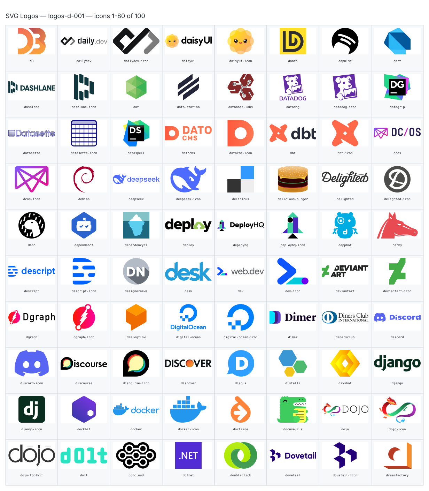
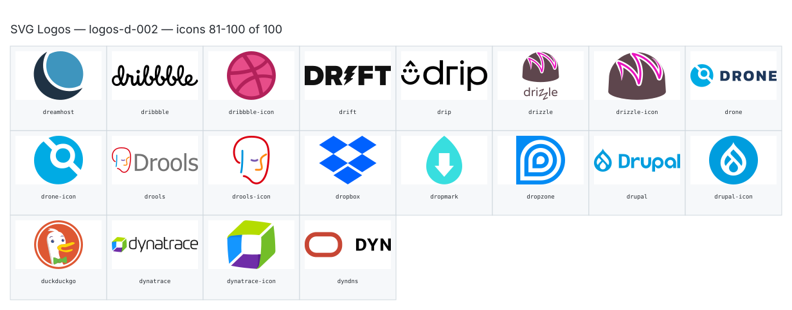

**Generated file — do not edit. Run `python scripts/portfolio.py icons generate`.**

# SVG Logos — `d`

[SVG Logos hub](../logos.md). 100 icons in group `d` across 2 sheets. Display names are approximate; copy the slug for Mermaid.

## logos-d-001

- `logos:d3` — D3 — [logos-d-001.svg](../sheets/logos-d-001.svg) r0c0 — `service example(logos:d3)[D3]`
- `logos:dailydev` — Dailydev — [logos-d-001.svg](../sheets/logos-d-001.svg) r0c1 — `service example(logos:dailydev)[Dailydev]`
- `logos:dailydev-icon` — Dailydev Icon — [logos-d-001.svg](../sheets/logos-d-001.svg) r0c2 — `service example(logos:dailydev-icon)[Dailydev Icon]`
- `logos:daisyui` — Daisyui — [logos-d-001.svg](../sheets/logos-d-001.svg) r0c3 — `service example(logos:daisyui)[Daisyui]`
- `logos:daisyui-icon` — Daisyui Icon — [logos-d-001.svg](../sheets/logos-d-001.svg) r0c4 — `service example(logos:daisyui-icon)[Daisyui Icon]`
- `logos:danfo` — Danfo — [logos-d-001.svg](../sheets/logos-d-001.svg) r0c5 — `service example(logos:danfo)[Danfo]`
- `logos:dapulse` — Dapulse — [logos-d-001.svg](../sheets/logos-d-001.svg) r0c6 — `service example(logos:dapulse)[Dapulse]`
- `logos:dart` — Dart — [logos-d-001.svg](../sheets/logos-d-001.svg) r0c7 — `service example(logos:dart)[Dart]`
- `logos:dashlane` — Dashlane — [logos-d-001.svg](../sheets/logos-d-001.svg) r1c0 — `service example(logos:dashlane)[Dashlane]`
- `logos:dashlane-icon` — Dashlane Icon — [logos-d-001.svg](../sheets/logos-d-001.svg) r1c1 — `service example(logos:dashlane-icon)[Dashlane Icon]`
- `logos:dat` — Dat — [logos-d-001.svg](../sheets/logos-d-001.svg) r1c2 — `service example(logos:dat)[Dat]`
- `logos:data-station` — Data Station — [logos-d-001.svg](../sheets/logos-d-001.svg) r1c3 — `service example(logos:data-station)[Data Station]`
- `logos:database-labs` — Database Labs — [logos-d-001.svg](../sheets/logos-d-001.svg) r1c4 — `service example(logos:database-labs)[Database Labs]`
- `logos:datadog` — Datadog — [logos-d-001.svg](../sheets/logos-d-001.svg) r1c5 — `service example(logos:datadog)[Datadog]`
- `logos:datadog-icon` — Datadog Icon — [logos-d-001.svg](../sheets/logos-d-001.svg) r1c6 — `service example(logos:datadog-icon)[Datadog Icon]`
- `logos:datagrip` — Datagrip — [logos-d-001.svg](../sheets/logos-d-001.svg) r1c7 — `service example(logos:datagrip)[Datagrip]`
- `logos:datasette` — Datasette — [logos-d-001.svg](../sheets/logos-d-001.svg) r2c0 — `service example(logos:datasette)[Datasette]`
- `logos:datasette-icon` — Datasette Icon — [logos-d-001.svg](../sheets/logos-d-001.svg) r2c1 — `service example(logos:datasette-icon)[Datasette Icon]`
- `logos:dataspell` — Dataspell — [logos-d-001.svg](../sheets/logos-d-001.svg) r2c2 — `service example(logos:dataspell)[Dataspell]`
- `logos:datocms` — Datocms — [logos-d-001.svg](../sheets/logos-d-001.svg) r2c3 — `service example(logos:datocms)[Datocms]`
- `logos:datocms-icon` — Datocms Icon — [logos-d-001.svg](../sheets/logos-d-001.svg) r2c4 — `service example(logos:datocms-icon)[Datocms Icon]`
- `logos:dbt` — Dbt — [logos-d-001.svg](../sheets/logos-d-001.svg) r2c5 — `service example(logos:dbt)[Dbt]`
- `logos:dbt-icon` — Dbt Icon — [logos-d-001.svg](../sheets/logos-d-001.svg) r2c6 — `service example(logos:dbt-icon)[Dbt Icon]`
- `logos:dcos` — Dcos — [logos-d-001.svg](../sheets/logos-d-001.svg) r2c7 — `service example(logos:dcos)[Dcos]`
- `logos:dcos-icon` — Dcos Icon — [logos-d-001.svg](../sheets/logos-d-001.svg) r3c0 — `service example(logos:dcos-icon)[Dcos Icon]`
- `logos:debian` — Debian — [logos-d-001.svg](../sheets/logos-d-001.svg) r3c1 — `service example(logos:debian)[Debian]`
- `logos:deepseek` — Deepseek — [logos-d-001.svg](../sheets/logos-d-001.svg) r3c2 — `service example(logos:deepseek)[Deepseek]`
- `logos:deepseek-icon` — Deepseek Icon — [logos-d-001.svg](../sheets/logos-d-001.svg) r3c3 — `service example(logos:deepseek-icon)[Deepseek Icon]`
- `logos:delicious` — Delicious — [logos-d-001.svg](../sheets/logos-d-001.svg) r3c4 — `service example(logos:delicious)[Delicious]`
- `logos:delicious-burger` — Delicious Burger — [logos-d-001.svg](../sheets/logos-d-001.svg) r3c5 — `service example(logos:delicious-burger)[Delicious Burger]`
- `logos:delighted` — Delighted — [logos-d-001.svg](../sheets/logos-d-001.svg) r3c6 — `service example(logos:delighted)[Delighted]`
- `logos:delighted-icon` — Delighted Icon — [logos-d-001.svg](../sheets/logos-d-001.svg) r3c7 — `service example(logos:delighted-icon)[Delighted Icon]`
- `logos:deno` — Deno — [logos-d-001.svg](../sheets/logos-d-001.svg) r4c0 — `service example(logos:deno)[Deno]`
- `logos:dependabot` — Dependabot — [logos-d-001.svg](../sheets/logos-d-001.svg) r4c1 — `service example(logos:dependabot)[Dependabot]`
- `logos:dependencyci` — Dependencyci — [logos-d-001.svg](../sheets/logos-d-001.svg) r4c2 — `service example(logos:dependencyci)[Dependencyci]`
- `logos:deploy` — Deploy — [logos-d-001.svg](../sheets/logos-d-001.svg) r4c3 — `service example(logos:deploy)[Deploy]`
- `logos:deployhq` — Deployhq — [logos-d-001.svg](../sheets/logos-d-001.svg) r4c4 — `service example(logos:deployhq)[Deployhq]`
- `logos:deployhq-icon` — Deployhq Icon — [logos-d-001.svg](../sheets/logos-d-001.svg) r4c5 — `service example(logos:deployhq-icon)[Deployhq Icon]`
- `logos:deppbot` — Deppbot — [logos-d-001.svg](../sheets/logos-d-001.svg) r4c6 — `service example(logos:deppbot)[Deppbot]`
- `logos:derby` — Derby — [logos-d-001.svg](../sheets/logos-d-001.svg) r4c7 — `service example(logos:derby)[Derby]`
- `logos:descript` — Descript — [logos-d-001.svg](../sheets/logos-d-001.svg) r5c0 — `service example(logos:descript)[Descript]`
- `logos:descript-icon` — Descript Icon — [logos-d-001.svg](../sheets/logos-d-001.svg) r5c1 — `service example(logos:descript-icon)[Descript Icon]`
- `logos:designernews` — Designernews — [logos-d-001.svg](../sheets/logos-d-001.svg) r5c2 — `service example(logos:designernews)[Designernews]`
- `logos:desk` — Desk — [logos-d-001.svg](../sheets/logos-d-001.svg) r5c3 — `service example(logos:desk)[Desk]`
- `logos:dev` — Dev — [logos-d-001.svg](../sheets/logos-d-001.svg) r5c4 — `service example(logos:dev)[Dev]`
- `logos:dev-icon` — Dev Icon — [logos-d-001.svg](../sheets/logos-d-001.svg) r5c5 — `service example(logos:dev-icon)[Dev Icon]`
- `logos:deviantart` — Deviantart — [logos-d-001.svg](../sheets/logos-d-001.svg) r5c6 — `service example(logos:deviantart)[Deviantart]`
- `logos:deviantart-icon` — Deviantart Icon — [logos-d-001.svg](../sheets/logos-d-001.svg) r5c7 — `service example(logos:deviantart-icon)[Deviantart Icon]`
- `logos:dgraph` — Dgraph — [logos-d-001.svg](../sheets/logos-d-001.svg) r6c0 — `service example(logos:dgraph)[Dgraph]`
- `logos:dgraph-icon` — Dgraph Icon — [logos-d-001.svg](../sheets/logos-d-001.svg) r6c1 — `service example(logos:dgraph-icon)[Dgraph Icon]`
- `logos:dialogflow` — Dialogflow — [logos-d-001.svg](../sheets/logos-d-001.svg) r6c2 — `service example(logos:dialogflow)[Dialogflow]`
- `logos:digital-ocean` — Digital Ocean — [logos-d-001.svg](../sheets/logos-d-001.svg) r6c3 — `service example(logos:digital-ocean)[Digital Ocean]`
- `logos:digital-ocean-icon` — Digital Ocean Icon — [logos-d-001.svg](../sheets/logos-d-001.svg) r6c4 — `service example(logos:digital-ocean-icon)[Digital Ocean Icon]`
- `logos:dimer` — Dimer — [logos-d-001.svg](../sheets/logos-d-001.svg) r6c5 — `service example(logos:dimer)[Dimer]`
- `logos:dinersclub` — Dinersclub — [logos-d-001.svg](../sheets/logos-d-001.svg) r6c6 — `service example(logos:dinersclub)[Dinersclub]`
- `logos:discord` — Discord — [logos-d-001.svg](../sheets/logos-d-001.svg) r6c7 — `service example(logos:discord)[Discord]`
- `logos:discord-icon` — Discord Icon — [logos-d-001.svg](../sheets/logos-d-001.svg) r7c0 — `service example(logos:discord-icon)[Discord Icon]`
- `logos:discourse` — Discourse — [logos-d-001.svg](../sheets/logos-d-001.svg) r7c1 — `service example(logos:discourse)[Discourse]`
- `logos:discourse-icon` — Discourse Icon — [logos-d-001.svg](../sheets/logos-d-001.svg) r7c2 — `service example(logos:discourse-icon)[Discourse Icon]`
- `logos:discover` — Discover — [logos-d-001.svg](../sheets/logos-d-001.svg) r7c3 — `service example(logos:discover)[Discover]`
- `logos:disqus` — Disqus — [logos-d-001.svg](../sheets/logos-d-001.svg) r7c4 — `service example(logos:disqus)[Disqus]`
- `logos:distelli` — Distelli — [logos-d-001.svg](../sheets/logos-d-001.svg) r7c5 — `service example(logos:distelli)[Distelli]`
- `logos:divshot` — Divshot — [logos-d-001.svg](../sheets/logos-d-001.svg) r7c6 — `service example(logos:divshot)[Divshot]`
- `logos:django` — Django — [logos-d-001.svg](../sheets/logos-d-001.svg) r7c7 — `service example(logos:django)[Django]`
- `logos:django-icon` — Django Icon — [logos-d-001.svg](../sheets/logos-d-001.svg) r8c0 — `service example(logos:django-icon)[Django Icon]`
- `logos:dockbit` — Dockbit — [logos-d-001.svg](../sheets/logos-d-001.svg) r8c1 — `service example(logos:dockbit)[Dockbit]`
- `logos:docker` — Docker — [logos-d-001.svg](../sheets/logos-d-001.svg) r8c2 — `service example(logos:docker)[Docker]`
- `logos:docker-icon` — Docker Icon — [logos-d-001.svg](../sheets/logos-d-001.svg) r8c3 — `service example(logos:docker-icon)[Docker Icon]`
- `logos:doctrine` — Doctrine — [logos-d-001.svg](../sheets/logos-d-001.svg) r8c4 — `service example(logos:doctrine)[Doctrine]`
- `logos:docusaurus` — Docusaurus — [logos-d-001.svg](../sheets/logos-d-001.svg) r8c5 — `service example(logos:docusaurus)[Docusaurus]`
- `logos:dojo` — Dojo — [logos-d-001.svg](../sheets/logos-d-001.svg) r8c6 — `service example(logos:dojo)[Dojo]`
- `logos:dojo-icon` — Dojo Icon — [logos-d-001.svg](../sheets/logos-d-001.svg) r8c7 — `service example(logos:dojo-icon)[Dojo Icon]`
- `logos:dojo-toolkit` — Dojo Toolkit — [logos-d-001.svg](../sheets/logos-d-001.svg) r9c0 — `service example(logos:dojo-toolkit)[Dojo Toolkit]`
- `logos:dolt` — Dolt — [logos-d-001.svg](../sheets/logos-d-001.svg) r9c1 — `service example(logos:dolt)[Dolt]`
- `logos:dotcloud` — Dotcloud — [logos-d-001.svg](../sheets/logos-d-001.svg) r9c2 — `service example(logos:dotcloud)[Dotcloud]`
- `logos:dotnet` — Dotnet — [logos-d-001.svg](../sheets/logos-d-001.svg) r9c3 — `service example(logos:dotnet)[Dotnet]`
- `logos:doubleclick` — Doubleclick — [logos-d-001.svg](../sheets/logos-d-001.svg) r9c4 — `service example(logos:doubleclick)[Doubleclick]`
- `logos:dovetail` — Dovetail — [logos-d-001.svg](../sheets/logos-d-001.svg) r9c5 — `service example(logos:dovetail)[Dovetail]`
- `logos:dovetail-icon` — Dovetail Icon — [logos-d-001.svg](../sheets/logos-d-001.svg) r9c6 — `service example(logos:dovetail-icon)[Dovetail Icon]`
- `logos:dreamfactory` — Dreamfactory — [logos-d-001.svg](../sheets/logos-d-001.svg) r9c7 — `service example(logos:dreamfactory)[Dreamfactory]`

## logos-d-002

- `logos:dreamhost` — Dreamhost — [logos-d-002.svg](../sheets/logos-d-002.svg) r0c0 — `service example(logos:dreamhost)[Dreamhost]`
- `logos:dribbble` — Dribbble — [logos-d-002.svg](../sheets/logos-d-002.svg) r0c1 — `service example(logos:dribbble)[Dribbble]`
- `logos:dribbble-icon` — Dribbble Icon — [logos-d-002.svg](../sheets/logos-d-002.svg) r0c2 — `service example(logos:dribbble-icon)[Dribbble Icon]`
- `logos:drift` — Drift — [logos-d-002.svg](../sheets/logos-d-002.svg) r0c3 — `service example(logos:drift)[Drift]`
- `logos:drip` — Drip — [logos-d-002.svg](../sheets/logos-d-002.svg) r0c4 — `service example(logos:drip)[Drip]`
- `logos:drizzle` — Drizzle — [logos-d-002.svg](../sheets/logos-d-002.svg) r0c5 — `service example(logos:drizzle)[Drizzle]`
- `logos:drizzle-icon` — Drizzle Icon — [logos-d-002.svg](../sheets/logos-d-002.svg) r0c6 — `service example(logos:drizzle-icon)[Drizzle Icon]`
- `logos:drone` — Drone — [logos-d-002.svg](../sheets/logos-d-002.svg) r0c7 — `service example(logos:drone)[Drone]`
- `logos:drone-icon` — Drone Icon — [logos-d-002.svg](../sheets/logos-d-002.svg) r1c0 — `service example(logos:drone-icon)[Drone Icon]`
- `logos:drools` — Drools — [logos-d-002.svg](../sheets/logos-d-002.svg) r1c1 — `service example(logos:drools)[Drools]`
- `logos:drools-icon` — Drools Icon — [logos-d-002.svg](../sheets/logos-d-002.svg) r1c2 — `service example(logos:drools-icon)[Drools Icon]`
- `logos:dropbox` — Dropbox — [logos-d-002.svg](../sheets/logos-d-002.svg) r1c3 — `service example(logos:dropbox)[Dropbox]`
- `logos:dropmark` — Dropmark — [logos-d-002.svg](../sheets/logos-d-002.svg) r1c4 — `service example(logos:dropmark)[Dropmark]`
- `logos:dropzone` — Dropzone — [logos-d-002.svg](../sheets/logos-d-002.svg) r1c5 — `service example(logos:dropzone)[Dropzone]`
- `logos:drupal` — Drupal — [logos-d-002.svg](../sheets/logos-d-002.svg) r1c6 — `service example(logos:drupal)[Drupal]`
- `logos:drupal-icon` — Drupal Icon — [logos-d-002.svg](../sheets/logos-d-002.svg) r1c7 — `service example(logos:drupal-icon)[Drupal Icon]`
- `logos:duckduckgo` — Duckduckgo — [logos-d-002.svg](../sheets/logos-d-002.svg) r2c0 — `service example(logos:duckduckgo)[Duckduckgo]`
- `logos:dynatrace` — Dynatrace — [logos-d-002.svg](../sheets/logos-d-002.svg) r2c1 — `service example(logos:dynatrace)[Dynatrace]`
- `logos:dynatrace-icon` — Dynatrace Icon — [logos-d-002.svg](../sheets/logos-d-002.svg) r2c2 — `service example(logos:dynatrace-icon)[Dynatrace Icon]`
- `logos:dyndns` — Dyndns — [logos-d-002.svg](../sheets/logos-d-002.svg) r2c3 — `service example(logos:dyndns)[Dyndns]`
