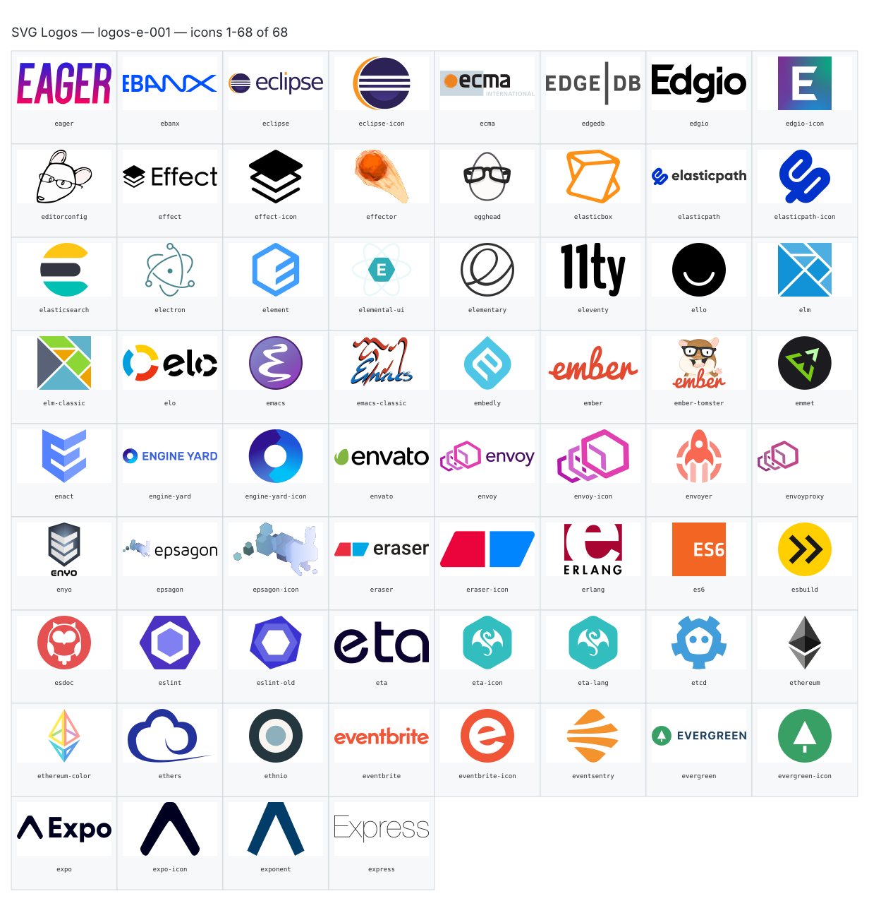

**Generated file — do not edit. Run `python scripts/portfolio.py icons generate`.**

# SVG Logos — `e`

[SVG Logos hub](../logos.md). 68 icons in group `e` across 1 sheet. Display names are approximate; copy the slug for Mermaid.

## logos-e-001

- `logos:eager` — Eager — [logos-e-001.svg](../sheets/logos-e-001.svg) r0c0 — `service example(logos:eager)[Eager]`
- `logos:ebanx` — Ebanx — [logos-e-001.svg](../sheets/logos-e-001.svg) r0c1 — `service example(logos:ebanx)[Ebanx]`
- `logos:eclipse` — Eclipse — [logos-e-001.svg](../sheets/logos-e-001.svg) r0c2 — `service example(logos:eclipse)[Eclipse]`
- `logos:eclipse-icon` — Eclipse Icon — [logos-e-001.svg](../sheets/logos-e-001.svg) r0c3 — `service example(logos:eclipse-icon)[Eclipse Icon]`
- `logos:ecma` — Ecma — [logos-e-001.svg](../sheets/logos-e-001.svg) r0c4 — `service example(logos:ecma)[Ecma]`
- `logos:edgedb` — Edgedb — [logos-e-001.svg](../sheets/logos-e-001.svg) r0c5 — `service example(logos:edgedb)[Edgedb]`
- `logos:edgio` — Edgio — [logos-e-001.svg](../sheets/logos-e-001.svg) r0c6 — `service example(logos:edgio)[Edgio]`
- `logos:edgio-icon` — Edgio Icon — [logos-e-001.svg](../sheets/logos-e-001.svg) r0c7 — `service example(logos:edgio-icon)[Edgio Icon]`
- `logos:editorconfig` — Editorconfig — [logos-e-001.svg](../sheets/logos-e-001.svg) r1c0 — `service example(logos:editorconfig)[Editorconfig]`
- `logos:effect` — Effect — [logos-e-001.svg](../sheets/logos-e-001.svg) r1c1 — `service example(logos:effect)[Effect]`
- `logos:effect-icon` — Effect Icon — [logos-e-001.svg](../sheets/logos-e-001.svg) r1c2 — `service example(logos:effect-icon)[Effect Icon]`
- `logos:effector` — Effector — [logos-e-001.svg](../sheets/logos-e-001.svg) r1c3 — `service example(logos:effector)[Effector]`
- `logos:egghead` — Egghead — [logos-e-001.svg](../sheets/logos-e-001.svg) r1c4 — `service example(logos:egghead)[Egghead]`
- `logos:elasticbox` — Elasticbox — [logos-e-001.svg](../sheets/logos-e-001.svg) r1c5 — `service example(logos:elasticbox)[Elasticbox]`
- `logos:elasticpath` — Elasticpath — [logos-e-001.svg](../sheets/logos-e-001.svg) r1c6 — `service example(logos:elasticpath)[Elasticpath]`
- `logos:elasticpath-icon` — Elasticpath Icon — [logos-e-001.svg](../sheets/logos-e-001.svg) r1c7 — `service example(logos:elasticpath-icon)[Elasticpath Icon]`
- `logos:elasticsearch` — Elasticsearch — [logos-e-001.svg](../sheets/logos-e-001.svg) r2c0 — `service example(logos:elasticsearch)[Elasticsearch]`
- `logos:electron` — Electron — [logos-e-001.svg](../sheets/logos-e-001.svg) r2c1 — `service example(logos:electron)[Electron]`
- `logos:element` — Element — [logos-e-001.svg](../sheets/logos-e-001.svg) r2c2 — `service example(logos:element)[Element]`
- `logos:elemental-ui` — Elemental Ui — [logos-e-001.svg](../sheets/logos-e-001.svg) r2c3 — `service example(logos:elemental-ui)[Elemental Ui]`
- `logos:elementary` — Elementary — [logos-e-001.svg](../sheets/logos-e-001.svg) r2c4 — `service example(logos:elementary)[Elementary]`
- `logos:eleventy` — Eleventy — [logos-e-001.svg](../sheets/logos-e-001.svg) r2c5 — `service example(logos:eleventy)[Eleventy]`
- `logos:ello` — Ello — [logos-e-001.svg](../sheets/logos-e-001.svg) r2c6 — `service example(logos:ello)[Ello]`
- `logos:elm` — Elm — [logos-e-001.svg](../sheets/logos-e-001.svg) r2c7 — `service example(logos:elm)[Elm]`
- `logos:elm-classic` — Elm Classic — [logos-e-001.svg](../sheets/logos-e-001.svg) r3c0 — `service example(logos:elm-classic)[Elm Classic]`
- `logos:elo` — Elo — [logos-e-001.svg](../sheets/logos-e-001.svg) r3c1 — `service example(logos:elo)[Elo]`
- `logos:emacs` — Emacs — [logos-e-001.svg](../sheets/logos-e-001.svg) r3c2 — `service example(logos:emacs)[Emacs]`
- `logos:emacs-classic` — Emacs Classic — [logos-e-001.svg](../sheets/logos-e-001.svg) r3c3 — `service example(logos:emacs-classic)[Emacs Classic]`
- `logos:embedly` — Embedly — [logos-e-001.svg](../sheets/logos-e-001.svg) r3c4 — `service example(logos:embedly)[Embedly]`
- `logos:ember` — Ember — [logos-e-001.svg](../sheets/logos-e-001.svg) r3c5 — `service example(logos:ember)[Ember]`
- `logos:ember-tomster` — Ember Tomster — [logos-e-001.svg](../sheets/logos-e-001.svg) r3c6 — `service example(logos:ember-tomster)[Ember Tomster]`
- `logos:emmet` — Emmet — [logos-e-001.svg](../sheets/logos-e-001.svg) r3c7 — `service example(logos:emmet)[Emmet]`
- `logos:enact` — Enact — [logos-e-001.svg](../sheets/logos-e-001.svg) r4c0 — `service example(logos:enact)[Enact]`
- `logos:engine-yard` — Engine Yard — [logos-e-001.svg](../sheets/logos-e-001.svg) r4c1 — `service example(logos:engine-yard)[Engine Yard]`
- `logos:engine-yard-icon` — Engine Yard Icon — [logos-e-001.svg](../sheets/logos-e-001.svg) r4c2 — `service example(logos:engine-yard-icon)[Engine Yard Icon]`
- `logos:envato` — Envato — [logos-e-001.svg](../sheets/logos-e-001.svg) r4c3 — `service example(logos:envato)[Envato]`
- `logos:envoy` — Envoy — [logos-e-001.svg](../sheets/logos-e-001.svg) r4c4 — `service example(logos:envoy)[Envoy]`
- `logos:envoy-icon` — Envoy Icon — [logos-e-001.svg](../sheets/logos-e-001.svg) r4c5 — `service example(logos:envoy-icon)[Envoy Icon]`
- `logos:envoyer` — Envoyer — [logos-e-001.svg](../sheets/logos-e-001.svg) r4c6 — `service example(logos:envoyer)[Envoyer]`
- `logos:envoyproxy` — Envoyproxy — [logos-e-001.svg](../sheets/logos-e-001.svg) r4c7 — `service example(logos:envoyproxy)[Envoyproxy]`
- `logos:enyo` — Enyo — [logos-e-001.svg](../sheets/logos-e-001.svg) r5c0 — `service example(logos:enyo)[Enyo]`
- `logos:epsagon` — Epsagon — [logos-e-001.svg](../sheets/logos-e-001.svg) r5c1 — `service example(logos:epsagon)[Epsagon]`
- `logos:epsagon-icon` — Epsagon Icon — [logos-e-001.svg](../sheets/logos-e-001.svg) r5c2 — `service example(logos:epsagon-icon)[Epsagon Icon]`
- `logos:eraser` — Eraser — [logos-e-001.svg](../sheets/logos-e-001.svg) r5c3 — `service example(logos:eraser)[Eraser]`
- `logos:eraser-icon` — Eraser Icon — [logos-e-001.svg](../sheets/logos-e-001.svg) r5c4 — `service example(logos:eraser-icon)[Eraser Icon]`
- `logos:erlang` — Erlang — [logos-e-001.svg](../sheets/logos-e-001.svg) r5c5 — `service example(logos:erlang)[Erlang]`
- `logos:es6` — Es6 — [logos-e-001.svg](../sheets/logos-e-001.svg) r5c6 — `service example(logos:es6)[Es6]`
- `logos:esbuild` — Esbuild — [logos-e-001.svg](../sheets/logos-e-001.svg) r5c7 — `service example(logos:esbuild)[Esbuild]`
- `logos:esdoc` — Esdoc — [logos-e-001.svg](../sheets/logos-e-001.svg) r6c0 — `service example(logos:esdoc)[Esdoc]`
- `logos:eslint` — Eslint — [logos-e-001.svg](../sheets/logos-e-001.svg) r6c1 — `service example(logos:eslint)[Eslint]`
- `logos:eslint-old` — Eslint Old — [logos-e-001.svg](../sheets/logos-e-001.svg) r6c2 — `service example(logos:eslint-old)[Eslint Old]`
- `logos:eta` — Eta — [logos-e-001.svg](../sheets/logos-e-001.svg) r6c3 — `service example(logos:eta)[Eta]`
- `logos:eta-icon` — Eta Icon — [logos-e-001.svg](../sheets/logos-e-001.svg) r6c4 — `service example(logos:eta-icon)[Eta Icon]`
- `logos:eta-lang` — Eta Lang — [logos-e-001.svg](../sheets/logos-e-001.svg) r6c5 — `service example(logos:eta-lang)[Eta Lang]`
- `logos:etcd` — Etcd — [logos-e-001.svg](../sheets/logos-e-001.svg) r6c6 — `service example(logos:etcd)[Etcd]`
- `logos:ethereum` — Ethereum — [logos-e-001.svg](../sheets/logos-e-001.svg) r6c7 — `service example(logos:ethereum)[Ethereum]`
- `logos:ethereum-color` — Ethereum Color — [logos-e-001.svg](../sheets/logos-e-001.svg) r7c0 — `service example(logos:ethereum-color)[Ethereum Color]`
- `logos:ethers` — Ethers — [logos-e-001.svg](../sheets/logos-e-001.svg) r7c1 — `service example(logos:ethers)[Ethers]`
- `logos:ethnio` — Ethnio — [logos-e-001.svg](../sheets/logos-e-001.svg) r7c2 — `service example(logos:ethnio)[Ethnio]`
- `logos:eventbrite` — Eventbrite — [logos-e-001.svg](../sheets/logos-e-001.svg) r7c3 — `service example(logos:eventbrite)[Eventbrite]`
- `logos:eventbrite-icon` — Eventbrite Icon — [logos-e-001.svg](../sheets/logos-e-001.svg) r7c4 — `service example(logos:eventbrite-icon)[Eventbrite Icon]`
- `logos:eventsentry` — Eventsentry — [logos-e-001.svg](../sheets/logos-e-001.svg) r7c5 — `service example(logos:eventsentry)[Eventsentry]`
- `logos:evergreen` — Evergreen — [logos-e-001.svg](../sheets/logos-e-001.svg) r7c6 — `service example(logos:evergreen)[Evergreen]`
- `logos:evergreen-icon` — Evergreen Icon — [logos-e-001.svg](../sheets/logos-e-001.svg) r7c7 — `service example(logos:evergreen-icon)[Evergreen Icon]`
- `logos:expo` — Expo — [logos-e-001.svg](../sheets/logos-e-001.svg) r8c0 — `service example(logos:expo)[Expo]`
- `logos:expo-icon` — Expo Icon — [logos-e-001.svg](../sheets/logos-e-001.svg) r8c1 — `service example(logos:expo-icon)[Expo Icon]`
- `logos:exponent` — Exponent — [logos-e-001.svg](../sheets/logos-e-001.svg) r8c2 — `service example(logos:exponent)[Exponent]`
- `logos:express` — Express — [logos-e-001.svg](../sheets/logos-e-001.svg) r8c3 — `service example(logos:express)[Express]`
