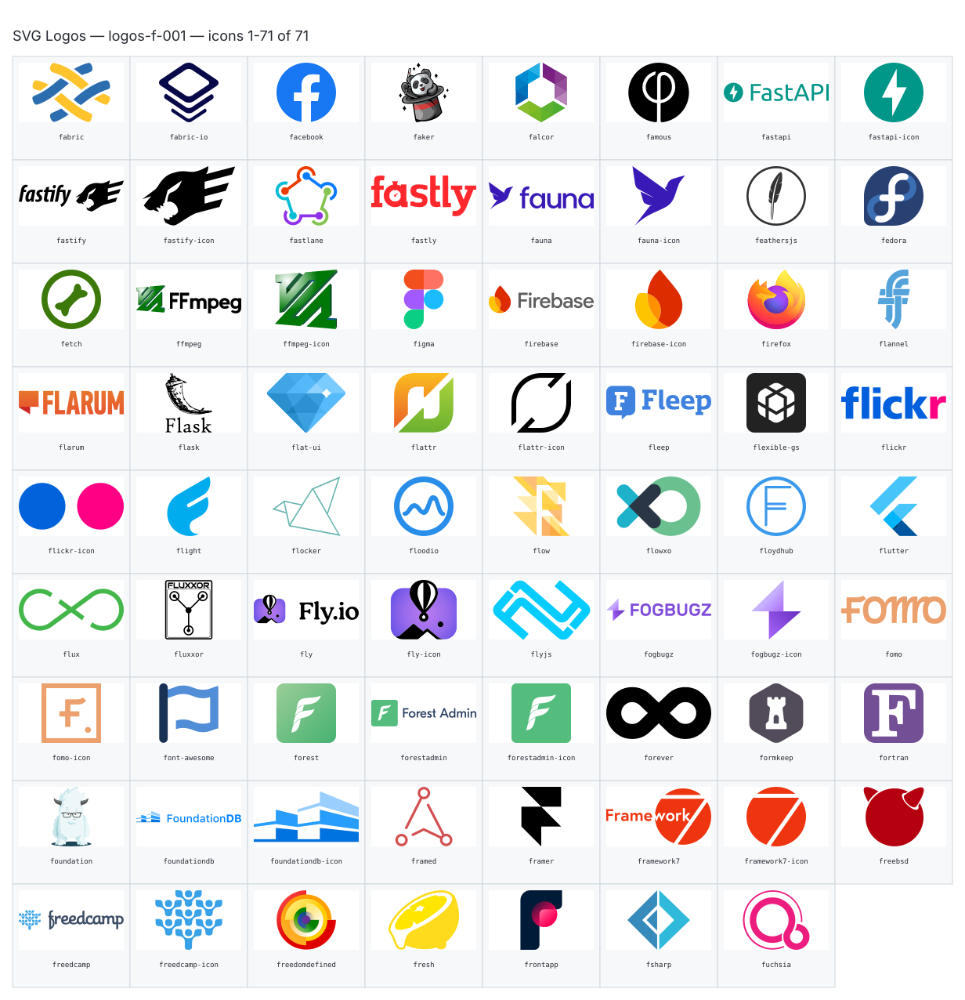

**Generated file — do not edit. Run `python scripts/portfolio.py icons generate`.**

# SVG Logos — `f`

[SVG Logos hub](../logos.md). 71 icons in group `f` across 1 sheet. Display names are approximate; copy the slug for Mermaid.

## logos-f-001

- `logos:fabric` — Fabric — [logos-f-001.svg](../sheets/logos-f-001.svg) r0c0 — `service example(logos:fabric)[Fabric]`
- `logos:fabric-io` — Fabric Io — [logos-f-001.svg](../sheets/logos-f-001.svg) r0c1 — `service example(logos:fabric-io)[Fabric Io]`
- `logos:facebook` — Facebook — [logos-f-001.svg](../sheets/logos-f-001.svg) r0c2 — `service example(logos:facebook)[Facebook]`
- `logos:faker` — Faker — [logos-f-001.svg](../sheets/logos-f-001.svg) r0c3 — `service example(logos:faker)[Faker]`
- `logos:falcor` — Falcor — [logos-f-001.svg](../sheets/logos-f-001.svg) r0c4 — `service example(logos:falcor)[Falcor]`
- `logos:famous` — Famous — [logos-f-001.svg](../sheets/logos-f-001.svg) r0c5 — `service example(logos:famous)[Famous]`
- `logos:fastapi` — Fastapi — [logos-f-001.svg](../sheets/logos-f-001.svg) r0c6 — `service example(logos:fastapi)[Fastapi]`
- `logos:fastapi-icon` — Fastapi Icon — [logos-f-001.svg](../sheets/logos-f-001.svg) r0c7 — `service example(logos:fastapi-icon)[Fastapi Icon]`
- `logos:fastify` — Fastify — [logos-f-001.svg](../sheets/logos-f-001.svg) r1c0 — `service example(logos:fastify)[Fastify]`
- `logos:fastify-icon` — Fastify Icon — [logos-f-001.svg](../sheets/logos-f-001.svg) r1c1 — `service example(logos:fastify-icon)[Fastify Icon]`
- `logos:fastlane` — Fastlane — [logos-f-001.svg](../sheets/logos-f-001.svg) r1c2 — `service example(logos:fastlane)[Fastlane]`
- `logos:fastly` — Fastly — [logos-f-001.svg](../sheets/logos-f-001.svg) r1c3 — `service example(logos:fastly)[Fastly]`
- `logos:fauna` — Fauna — [logos-f-001.svg](../sheets/logos-f-001.svg) r1c4 — `service example(logos:fauna)[Fauna]`
- `logos:fauna-icon` — Fauna Icon — [logos-f-001.svg](../sheets/logos-f-001.svg) r1c5 — `service example(logos:fauna-icon)[Fauna Icon]`
- `logos:feathersjs` — Feathersjs — [logos-f-001.svg](../sheets/logos-f-001.svg) r1c6 — `service example(logos:feathersjs)[Feathersjs]`
- `logos:fedora` — Fedora — [logos-f-001.svg](../sheets/logos-f-001.svg) r1c7 — `service example(logos:fedora)[Fedora]`
- `logos:fetch` — Fetch — [logos-f-001.svg](../sheets/logos-f-001.svg) r2c0 — `service example(logos:fetch)[Fetch]`
- `logos:ffmpeg` — Ffmpeg — [logos-f-001.svg](../sheets/logos-f-001.svg) r2c1 — `service example(logos:ffmpeg)[Ffmpeg]`
- `logos:ffmpeg-icon` — Ffmpeg Icon — [logos-f-001.svg](../sheets/logos-f-001.svg) r2c2 — `service example(logos:ffmpeg-icon)[Ffmpeg Icon]`
- `logos:figma` — Figma — [logos-f-001.svg](../sheets/logos-f-001.svg) r2c3 — `service example(logos:figma)[Figma]`
- `logos:firebase` — Firebase — [logos-f-001.svg](../sheets/logos-f-001.svg) r2c4 — `service example(logos:firebase)[Firebase]`
- `logos:firebase-icon` — Firebase Icon — [logos-f-001.svg](../sheets/logos-f-001.svg) r2c5 — `service example(logos:firebase-icon)[Firebase Icon]`
- `logos:firefox` — Firefox — [logos-f-001.svg](../sheets/logos-f-001.svg) r2c6 — `service example(logos:firefox)[Firefox]`
- `logos:flannel` — Flannel — [logos-f-001.svg](../sheets/logos-f-001.svg) r2c7 — `service example(logos:flannel)[Flannel]`
- `logos:flarum` — Flarum — [logos-f-001.svg](../sheets/logos-f-001.svg) r3c0 — `service example(logos:flarum)[Flarum]`
- `logos:flask` — Flask — [logos-f-001.svg](../sheets/logos-f-001.svg) r3c1 — `service example(logos:flask)[Flask]`
- `logos:flat-ui` — Flat Ui — [logos-f-001.svg](../sheets/logos-f-001.svg) r3c2 — `service example(logos:flat-ui)[Flat Ui]`
- `logos:flattr` — Flattr — [logos-f-001.svg](../sheets/logos-f-001.svg) r3c3 — `service example(logos:flattr)[Flattr]`
- `logos:flattr-icon` — Flattr Icon — [logos-f-001.svg](../sheets/logos-f-001.svg) r3c4 — `service example(logos:flattr-icon)[Flattr Icon]`
- `logos:fleep` — Fleep — [logos-f-001.svg](../sheets/logos-f-001.svg) r3c5 — `service example(logos:fleep)[Fleep]`
- `logos:flexible-gs` — Flexible Gs — [logos-f-001.svg](../sheets/logos-f-001.svg) r3c6 — `service example(logos:flexible-gs)[Flexible Gs]`
- `logos:flickr` — Flickr — [logos-f-001.svg](../sheets/logos-f-001.svg) r3c7 — `service example(logos:flickr)[Flickr]`
- `logos:flickr-icon` — Flickr Icon — [logos-f-001.svg](../sheets/logos-f-001.svg) r4c0 — `service example(logos:flickr-icon)[Flickr Icon]`
- `logos:flight` — Flight — [logos-f-001.svg](../sheets/logos-f-001.svg) r4c1 — `service example(logos:flight)[Flight]`
- `logos:flocker` — Flocker — [logos-f-001.svg](../sheets/logos-f-001.svg) r4c2 — `service example(logos:flocker)[Flocker]`
- `logos:floodio` — Floodio — [logos-f-001.svg](../sheets/logos-f-001.svg) r4c3 — `service example(logos:floodio)[Floodio]`
- `logos:flow` — Flow — [logos-f-001.svg](../sheets/logos-f-001.svg) r4c4 — `service example(logos:flow)[Flow]`
- `logos:flowxo` — Flowxo — [logos-f-001.svg](../sheets/logos-f-001.svg) r4c5 — `service example(logos:flowxo)[Flowxo]`
- `logos:floydhub` — Floydhub — [logos-f-001.svg](../sheets/logos-f-001.svg) r4c6 — `service example(logos:floydhub)[Floydhub]`
- `logos:flutter` — Flutter — [logos-f-001.svg](../sheets/logos-f-001.svg) r4c7 — `service example(logos:flutter)[Flutter]`
- `logos:flux` — Flux — [logos-f-001.svg](../sheets/logos-f-001.svg) r5c0 — `service example(logos:flux)[Flux]`
- `logos:fluxxor` — Fluxxor — [logos-f-001.svg](../sheets/logos-f-001.svg) r5c1 — `service example(logos:fluxxor)[Fluxxor]`
- `logos:fly` — Fly — [logos-f-001.svg](../sheets/logos-f-001.svg) r5c2 — `service example(logos:fly)[Fly]`
- `logos:fly-icon` — Fly Icon — [logos-f-001.svg](../sheets/logos-f-001.svg) r5c3 — `service example(logos:fly-icon)[Fly Icon]`
- `logos:flyjs` — Flyjs — [logos-f-001.svg](../sheets/logos-f-001.svg) r5c4 — `service example(logos:flyjs)[Flyjs]`
- `logos:fogbugz` — Fogbugz — [logos-f-001.svg](../sheets/logos-f-001.svg) r5c5 — `service example(logos:fogbugz)[Fogbugz]`
- `logos:fogbugz-icon` — Fogbugz Icon — [logos-f-001.svg](../sheets/logos-f-001.svg) r5c6 — `service example(logos:fogbugz-icon)[Fogbugz Icon]`
- `logos:fomo` — Fomo — [logos-f-001.svg](../sheets/logos-f-001.svg) r5c7 — `service example(logos:fomo)[Fomo]`
- `logos:fomo-icon` — Fomo Icon — [logos-f-001.svg](../sheets/logos-f-001.svg) r6c0 — `service example(logos:fomo-icon)[Fomo Icon]`
- `logos:font-awesome` — Font Awesome — [logos-f-001.svg](../sheets/logos-f-001.svg) r6c1 — `service example(logos:font-awesome)[Font Awesome]`
- `logos:forest` — Forest — [logos-f-001.svg](../sheets/logos-f-001.svg) r6c2 — `service example(logos:forest)[Forest]`
- `logos:forestadmin` — Forestadmin — [logos-f-001.svg](../sheets/logos-f-001.svg) r6c3 — `service example(logos:forestadmin)[Forestadmin]`
- `logos:forestadmin-icon` — Forestadmin Icon — [logos-f-001.svg](../sheets/logos-f-001.svg) r6c4 — `service example(logos:forestadmin-icon)[Forestadmin Icon]`
- `logos:forever` — Forever — [logos-f-001.svg](../sheets/logos-f-001.svg) r6c5 — `service example(logos:forever)[Forever]`
- `logos:formkeep` — Formkeep — [logos-f-001.svg](../sheets/logos-f-001.svg) r6c6 — `service example(logos:formkeep)[Formkeep]`
- `logos:fortran` — Fortran — [logos-f-001.svg](../sheets/logos-f-001.svg) r6c7 — `service example(logos:fortran)[Fortran]`
- `logos:foundation` — Foundation — [logos-f-001.svg](../sheets/logos-f-001.svg) r7c0 — `service example(logos:foundation)[Foundation]`
- `logos:foundationdb` — Foundationdb — [logos-f-001.svg](../sheets/logos-f-001.svg) r7c1 — `service example(logos:foundationdb)[Foundationdb]`
- `logos:foundationdb-icon` — Foundationdb Icon — [logos-f-001.svg](../sheets/logos-f-001.svg) r7c2 — `service example(logos:foundationdb-icon)[Foundationdb Icon]`
- `logos:framed` — Framed — [logos-f-001.svg](../sheets/logos-f-001.svg) r7c3 — `service example(logos:framed)[Framed]`
- `logos:framer` — Framer — [logos-f-001.svg](../sheets/logos-f-001.svg) r7c4 — `service example(logos:framer)[Framer]`
- `logos:framework7` — Framework7 — [logos-f-001.svg](../sheets/logos-f-001.svg) r7c5 — `service example(logos:framework7)[Framework7]`
- `logos:framework7-icon` — Framework7 Icon — [logos-f-001.svg](../sheets/logos-f-001.svg) r7c6 — `service example(logos:framework7-icon)[Framework7 Icon]`
- `logos:freebsd` — Freebsd — [logos-f-001.svg](../sheets/logos-f-001.svg) r7c7 — `service example(logos:freebsd)[Freebsd]`
- `logos:freedcamp` — Freedcamp — [logos-f-001.svg](../sheets/logos-f-001.svg) r8c0 — `service example(logos:freedcamp)[Freedcamp]`
- `logos:freedcamp-icon` — Freedcamp Icon — [logos-f-001.svg](../sheets/logos-f-001.svg) r8c1 — `service example(logos:freedcamp-icon)[Freedcamp Icon]`
- `logos:freedomdefined` — Freedomdefined — [logos-f-001.svg](../sheets/logos-f-001.svg) r8c2 — `service example(logos:freedomdefined)[Freedomdefined]`
- `logos:fresh` — Fresh — [logos-f-001.svg](../sheets/logos-f-001.svg) r8c3 — `service example(logos:fresh)[Fresh]`
- `logos:frontapp` — Frontapp — [logos-f-001.svg](../sheets/logos-f-001.svg) r8c4 — `service example(logos:frontapp)[Frontapp]`
- `logos:fsharp` — Fsharp — [logos-f-001.svg](../sheets/logos-f-001.svg) r8c5 — `service example(logos:fsharp)[Fsharp]`
- `logos:fuchsia` — Fuchsia — [logos-f-001.svg](../sheets/logos-f-001.svg) r8c6 — `service example(logos:fuchsia)[Fuchsia]`
