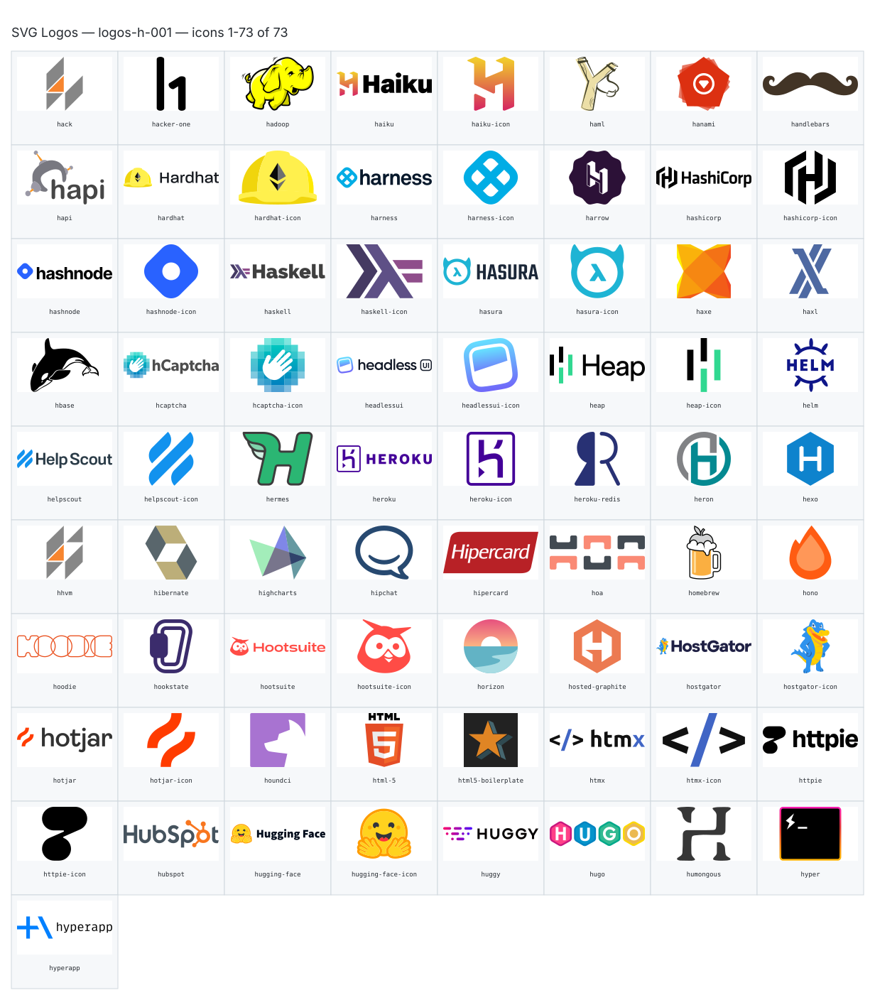

**Generated file — do not edit. Run `python scripts/portfolio.py icons generate`.**

# SVG Logos — `h`

[SVG Logos hub](../logos.md). 73 icons in group `h` across 1 sheet. Display names are approximate; copy the slug for Mermaid.

## logos-h-001

- `logos:hack` — Hack — [logos-h-001.svg](../sheets/logos-h-001.svg) r0c0 — `service example(logos:hack)[Hack]`
- `logos:hacker-one` — Hacker One — [logos-h-001.svg](../sheets/logos-h-001.svg) r0c1 — `service example(logos:hacker-one)[Hacker One]`
- `logos:hadoop` — Hadoop — [logos-h-001.svg](../sheets/logos-h-001.svg) r0c2 — `service example(logos:hadoop)[Hadoop]`
- `logos:haiku` — Haiku — [logos-h-001.svg](../sheets/logos-h-001.svg) r0c3 — `service example(logos:haiku)[Haiku]`
- `logos:haiku-icon` — Haiku Icon — [logos-h-001.svg](../sheets/logos-h-001.svg) r0c4 — `service example(logos:haiku-icon)[Haiku Icon]`
- `logos:haml` — Haml — [logos-h-001.svg](../sheets/logos-h-001.svg) r0c5 — `service example(logos:haml)[Haml]`
- `logos:hanami` — Hanami — [logos-h-001.svg](../sheets/logos-h-001.svg) r0c6 — `service example(logos:hanami)[Hanami]`
- `logos:handlebars` — Handlebars — [logos-h-001.svg](../sheets/logos-h-001.svg) r0c7 — `service example(logos:handlebars)[Handlebars]`
- `logos:hapi` — Hapi — [logos-h-001.svg](../sheets/logos-h-001.svg) r1c0 — `service example(logos:hapi)[Hapi]`
- `logos:hardhat` — Hardhat — [logos-h-001.svg](../sheets/logos-h-001.svg) r1c1 — `service example(logos:hardhat)[Hardhat]`
- `logos:hardhat-icon` — Hardhat Icon — [logos-h-001.svg](../sheets/logos-h-001.svg) r1c2 — `service example(logos:hardhat-icon)[Hardhat Icon]`
- `logos:harness` — Harness — [logos-h-001.svg](../sheets/logos-h-001.svg) r1c3 — `service example(logos:harness)[Harness]`
- `logos:harness-icon` — Harness Icon — [logos-h-001.svg](../sheets/logos-h-001.svg) r1c4 — `service example(logos:harness-icon)[Harness Icon]`
- `logos:harrow` — Harrow — [logos-h-001.svg](../sheets/logos-h-001.svg) r1c5 — `service example(logos:harrow)[Harrow]`
- `logos:hashicorp` — Hashicorp — [logos-h-001.svg](../sheets/logos-h-001.svg) r1c6 — `service example(logos:hashicorp)[Hashicorp]`
- `logos:hashicorp-icon` — Hashicorp Icon — [logos-h-001.svg](../sheets/logos-h-001.svg) r1c7 — `service example(logos:hashicorp-icon)[Hashicorp Icon]`
- `logos:hashnode` — Hashnode — [logos-h-001.svg](../sheets/logos-h-001.svg) r2c0 — `service example(logos:hashnode)[Hashnode]`
- `logos:hashnode-icon` — Hashnode Icon — [logos-h-001.svg](../sheets/logos-h-001.svg) r2c1 — `service example(logos:hashnode-icon)[Hashnode Icon]`
- `logos:haskell` — Haskell — [logos-h-001.svg](../sheets/logos-h-001.svg) r2c2 — `service example(logos:haskell)[Haskell]`
- `logos:haskell-icon` — Haskell Icon — [logos-h-001.svg](../sheets/logos-h-001.svg) r2c3 — `service example(logos:haskell-icon)[Haskell Icon]`
- `logos:hasura` — Hasura — [logos-h-001.svg](../sheets/logos-h-001.svg) r2c4 — `service example(logos:hasura)[Hasura]`
- `logos:hasura-icon` — Hasura Icon — [logos-h-001.svg](../sheets/logos-h-001.svg) r2c5 — `service example(logos:hasura-icon)[Hasura Icon]`
- `logos:haxe` — Haxe — [logos-h-001.svg](../sheets/logos-h-001.svg) r2c6 — `service example(logos:haxe)[Haxe]`
- `logos:haxl` — Haxl — [logos-h-001.svg](../sheets/logos-h-001.svg) r2c7 — `service example(logos:haxl)[Haxl]`
- `logos:hbase` — Hbase — [logos-h-001.svg](../sheets/logos-h-001.svg) r3c0 — `service example(logos:hbase)[Hbase]`
- `logos:hcaptcha` — Hcaptcha — [logos-h-001.svg](../sheets/logos-h-001.svg) r3c1 — `service example(logos:hcaptcha)[Hcaptcha]`
- `logos:hcaptcha-icon` — Hcaptcha Icon — [logos-h-001.svg](../sheets/logos-h-001.svg) r3c2 — `service example(logos:hcaptcha-icon)[Hcaptcha Icon]`
- `logos:headlessui` — Headlessui — [logos-h-001.svg](../sheets/logos-h-001.svg) r3c3 — `service example(logos:headlessui)[Headlessui]`
- `logos:headlessui-icon` — Headlessui Icon — [logos-h-001.svg](../sheets/logos-h-001.svg) r3c4 — `service example(logos:headlessui-icon)[Headlessui Icon]`
- `logos:heap` — Heap — [logos-h-001.svg](../sheets/logos-h-001.svg) r3c5 — `service example(logos:heap)[Heap]`
- `logos:heap-icon` — Heap Icon — [logos-h-001.svg](../sheets/logos-h-001.svg) r3c6 — `service example(logos:heap-icon)[Heap Icon]`
- `logos:helm` — Helm — [logos-h-001.svg](../sheets/logos-h-001.svg) r3c7 — `service example(logos:helm)[Helm]`
- `logos:helpscout` — Helpscout — [logos-h-001.svg](../sheets/logos-h-001.svg) r4c0 — `service example(logos:helpscout)[Helpscout]`
- `logos:helpscout-icon` — Helpscout Icon — [logos-h-001.svg](../sheets/logos-h-001.svg) r4c1 — `service example(logos:helpscout-icon)[Helpscout Icon]`
- `logos:hermes` — Hermes — [logos-h-001.svg](../sheets/logos-h-001.svg) r4c2 — `service example(logos:hermes)[Hermes]`
- `logos:heroku` — Heroku — [logos-h-001.svg](../sheets/logos-h-001.svg) r4c3 — `service example(logos:heroku)[Heroku]`
- `logos:heroku-icon` — Heroku Icon — [logos-h-001.svg](../sheets/logos-h-001.svg) r4c4 — `service example(logos:heroku-icon)[Heroku Icon]`
- `logos:heroku-redis` — Heroku Redis — [logos-h-001.svg](../sheets/logos-h-001.svg) r4c5 — `service example(logos:heroku-redis)[Heroku Redis]`
- `logos:heron` — Heron — [logos-h-001.svg](../sheets/logos-h-001.svg) r4c6 — `service example(logos:heron)[Heron]`
- `logos:hexo` — Hexo — [logos-h-001.svg](../sheets/logos-h-001.svg) r4c7 — `service example(logos:hexo)[Hexo]`
- `logos:hhvm` — Hhvm — [logos-h-001.svg](../sheets/logos-h-001.svg) r5c0 — `service example(logos:hhvm)[Hhvm]`
- `logos:hibernate` — Hibernate — [logos-h-001.svg](../sheets/logos-h-001.svg) r5c1 — `service example(logos:hibernate)[Hibernate]`
- `logos:highcharts` — Highcharts — [logos-h-001.svg](../sheets/logos-h-001.svg) r5c2 — `service example(logos:highcharts)[Highcharts]`
- `logos:hipchat` — Hipchat — [logos-h-001.svg](../sheets/logos-h-001.svg) r5c3 — `service example(logos:hipchat)[Hipchat]`
- `logos:hipercard` — Hipercard — [logos-h-001.svg](../sheets/logos-h-001.svg) r5c4 — `service example(logos:hipercard)[Hipercard]`
- `logos:hoa` — Hoa — [logos-h-001.svg](../sheets/logos-h-001.svg) r5c5 — `service example(logos:hoa)[Hoa]`
- `logos:homebrew` — Homebrew — [logos-h-001.svg](../sheets/logos-h-001.svg) r5c6 — `service example(logos:homebrew)[Homebrew]`
- `logos:hono` — Hono — [logos-h-001.svg](../sheets/logos-h-001.svg) r5c7 — `service example(logos:hono)[Hono]`
- `logos:hoodie` — Hoodie — [logos-h-001.svg](../sheets/logos-h-001.svg) r6c0 — `service example(logos:hoodie)[Hoodie]`
- `logos:hookstate` — Hookstate — [logos-h-001.svg](../sheets/logos-h-001.svg) r6c1 — `service example(logos:hookstate)[Hookstate]`
- `logos:hootsuite` — Hootsuite — [logos-h-001.svg](../sheets/logos-h-001.svg) r6c2 — `service example(logos:hootsuite)[Hootsuite]`
- `logos:hootsuite-icon` — Hootsuite Icon — [logos-h-001.svg](../sheets/logos-h-001.svg) r6c3 — `service example(logos:hootsuite-icon)[Hootsuite Icon]`
- `logos:horizon` — Horizon — [logos-h-001.svg](../sheets/logos-h-001.svg) r6c4 — `service example(logos:horizon)[Horizon]`
- `logos:hosted-graphite` — Hosted Graphite — [logos-h-001.svg](../sheets/logos-h-001.svg) r6c5 — `service example(logos:hosted-graphite)[Hosted Graphite]`
- `logos:hostgator` — Hostgator — [logos-h-001.svg](../sheets/logos-h-001.svg) r6c6 — `service example(logos:hostgator)[Hostgator]`
- `logos:hostgator-icon` — Hostgator Icon — [logos-h-001.svg](../sheets/logos-h-001.svg) r6c7 — `service example(logos:hostgator-icon)[Hostgator Icon]`
- `logos:hotjar` — Hotjar — [logos-h-001.svg](../sheets/logos-h-001.svg) r7c0 — `service example(logos:hotjar)[Hotjar]`
- `logos:hotjar-icon` — Hotjar Icon — [logos-h-001.svg](../sheets/logos-h-001.svg) r7c1 — `service example(logos:hotjar-icon)[Hotjar Icon]`
- `logos:houndci` — Houndci — [logos-h-001.svg](../sheets/logos-h-001.svg) r7c2 — `service example(logos:houndci)[Houndci]`
- `logos:html-5` — Html 5 — [logos-h-001.svg](../sheets/logos-h-001.svg) r7c3 — `service example(logos:html-5)[Html 5]`
- `logos:html5-boilerplate` — Html5 Boilerplate — [logos-h-001.svg](../sheets/logos-h-001.svg) r7c4 — `service example(logos:html5-boilerplate)[Html5 Boilerplate]`
- `logos:htmx` — Htmx — [logos-h-001.svg](../sheets/logos-h-001.svg) r7c5 — `service example(logos:htmx)[Htmx]`
- `logos:htmx-icon` — Htmx Icon — [logos-h-001.svg](../sheets/logos-h-001.svg) r7c6 — `service example(logos:htmx-icon)[Htmx Icon]`
- `logos:httpie` — Httpie — [logos-h-001.svg](../sheets/logos-h-001.svg) r7c7 — `service example(logos:httpie)[Httpie]`
- `logos:httpie-icon` — Httpie Icon — [logos-h-001.svg](../sheets/logos-h-001.svg) r8c0 — `service example(logos:httpie-icon)[Httpie Icon]`
- `logos:hubspot` — Hubspot — [logos-h-001.svg](../sheets/logos-h-001.svg) r8c1 — `service example(logos:hubspot)[Hubspot]`
- `logos:hugging-face` — Hugging Face — [logos-h-001.svg](../sheets/logos-h-001.svg) r8c2 — `service example(logos:hugging-face)[Hugging Face]`
- `logos:hugging-face-icon` — Hugging Face Icon — [logos-h-001.svg](../sheets/logos-h-001.svg) r8c3 — `service example(logos:hugging-face-icon)[Hugging Face Icon]`
- `logos:huggy` — Huggy — [logos-h-001.svg](../sheets/logos-h-001.svg) r8c4 — `service example(logos:huggy)[Huggy]`
- `logos:hugo` — Hugo — [logos-h-001.svg](../sheets/logos-h-001.svg) r8c5 — `service example(logos:hugo)[Hugo]`
- `logos:humongous` — Humongous — [logos-h-001.svg](../sheets/logos-h-001.svg) r8c6 — `service example(logos:humongous)[Humongous]`
- `logos:hyper` — Hyper — [logos-h-001.svg](../sheets/logos-h-001.svg) r8c7 — `service example(logos:hyper)[Hyper]`
- `logos:hyperapp` — Hyperapp — [logos-h-001.svg](../sheets/logos-h-001.svg) r9c0 — `service example(logos:hyperapp)[Hyperapp]`
