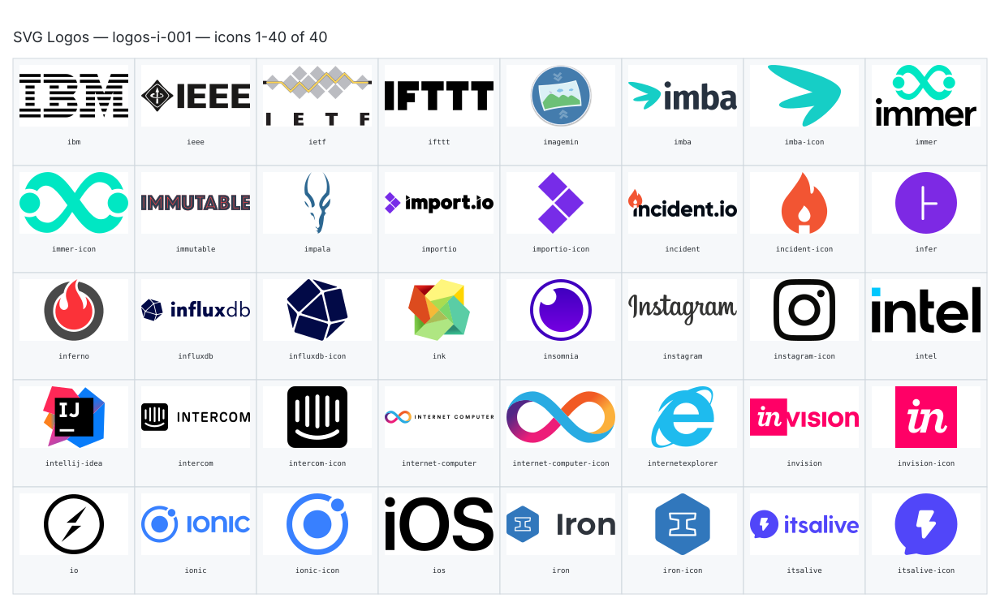

**Generated file — do not edit. Run `python scripts/portfolio.py icons generate`.**

# SVG Logos — `i`

[SVG Logos hub](../logos.md). 40 icons in group `i` across 1 sheet. Display names are approximate; copy the slug for Mermaid.

## logos-i-001

- `logos:ibm` — Ibm — [logos-i-001.svg](../sheets/logos-i-001.svg) r0c0 — `service example(logos:ibm)[Ibm]`
- `logos:ieee` — Ieee — [logos-i-001.svg](../sheets/logos-i-001.svg) r0c1 — `service example(logos:ieee)[Ieee]`
- `logos:ietf` — Ietf — [logos-i-001.svg](../sheets/logos-i-001.svg) r0c2 — `service example(logos:ietf)[Ietf]`
- `logos:ifttt` — Ifttt — [logos-i-001.svg](../sheets/logos-i-001.svg) r0c3 — `service example(logos:ifttt)[Ifttt]`
- `logos:imagemin` — Imagemin — [logos-i-001.svg](../sheets/logos-i-001.svg) r0c4 — `service example(logos:imagemin)[Imagemin]`
- `logos:imba` — Imba — [logos-i-001.svg](../sheets/logos-i-001.svg) r0c5 — `service example(logos:imba)[Imba]`
- `logos:imba-icon` — Imba Icon — [logos-i-001.svg](../sheets/logos-i-001.svg) r0c6 — `service example(logos:imba-icon)[Imba Icon]`
- `logos:immer` — Immer — [logos-i-001.svg](../sheets/logos-i-001.svg) r0c7 — `service example(logos:immer)[Immer]`
- `logos:immer-icon` — Immer Icon — [logos-i-001.svg](../sheets/logos-i-001.svg) r1c0 — `service example(logos:immer-icon)[Immer Icon]`
- `logos:immutable` — Immutable — [logos-i-001.svg](../sheets/logos-i-001.svg) r1c1 — `service example(logos:immutable)[Immutable]`
- `logos:impala` — Impala — [logos-i-001.svg](../sheets/logos-i-001.svg) r1c2 — `service example(logos:impala)[Impala]`
- `logos:importio` — Importio — [logos-i-001.svg](../sheets/logos-i-001.svg) r1c3 — `service example(logos:importio)[Importio]`
- `logos:importio-icon` — Importio Icon — [logos-i-001.svg](../sheets/logos-i-001.svg) r1c4 — `service example(logos:importio-icon)[Importio Icon]`
- `logos:incident` — Incident — [logos-i-001.svg](../sheets/logos-i-001.svg) r1c5 — `service example(logos:incident)[Incident]`
- `logos:incident-icon` — Incident Icon — [logos-i-001.svg](../sheets/logos-i-001.svg) r1c6 — `service example(logos:incident-icon)[Incident Icon]`
- `logos:infer` — Infer — [logos-i-001.svg](../sheets/logos-i-001.svg) r1c7 — `service example(logos:infer)[Infer]`
- `logos:inferno` — Inferno — [logos-i-001.svg](../sheets/logos-i-001.svg) r2c0 — `service example(logos:inferno)[Inferno]`
- `logos:influxdb` — Influxdb — [logos-i-001.svg](../sheets/logos-i-001.svg) r2c1 — `service example(logos:influxdb)[Influxdb]`
- `logos:influxdb-icon` — Influxdb Icon — [logos-i-001.svg](../sheets/logos-i-001.svg) r2c2 — `service example(logos:influxdb-icon)[Influxdb Icon]`
- `logos:ink` — Ink — [logos-i-001.svg](../sheets/logos-i-001.svg) r2c3 — `service example(logos:ink)[Ink]`
- `logos:insomnia` — Insomnia — [logos-i-001.svg](../sheets/logos-i-001.svg) r2c4 — `service example(logos:insomnia)[Insomnia]`
- `logos:instagram` — Instagram — [logos-i-001.svg](../sheets/logos-i-001.svg) r2c5 — `service example(logos:instagram)[Instagram]`
- `logos:instagram-icon` — Instagram Icon — [logos-i-001.svg](../sheets/logos-i-001.svg) r2c6 — `service example(logos:instagram-icon)[Instagram Icon]`
- `logos:intel` — Intel — [logos-i-001.svg](../sheets/logos-i-001.svg) r2c7 — `service example(logos:intel)[Intel]`
- `logos:intellij-idea` — Intellij Idea — [logos-i-001.svg](../sheets/logos-i-001.svg) r3c0 — `service example(logos:intellij-idea)[Intellij Idea]`
- `logos:intercom` — Intercom — [logos-i-001.svg](../sheets/logos-i-001.svg) r3c1 — `service example(logos:intercom)[Intercom]`
- `logos:intercom-icon` — Intercom Icon — [logos-i-001.svg](../sheets/logos-i-001.svg) r3c2 — `service example(logos:intercom-icon)[Intercom Icon]`
- `logos:internet-computer` — Internet Computer — [logos-i-001.svg](../sheets/logos-i-001.svg) r3c3 — `service example(logos:internet-computer)[Internet Computer]`
- `logos:internet-computer-icon` — Internet Computer Icon — [logos-i-001.svg](../sheets/logos-i-001.svg) r3c4 — `service example(logos:internet-computer-icon)[Internet Computer Icon]`
- `logos:internetexplorer` — Internetexplorer — [logos-i-001.svg](../sheets/logos-i-001.svg) r3c5 — `service example(logos:internetexplorer)[Internetexplorer]`
- `logos:invision` — Invision — [logos-i-001.svg](../sheets/logos-i-001.svg) r3c6 — `service example(logos:invision)[Invision]`
- `logos:invision-icon` — Invision Icon — [logos-i-001.svg](../sheets/logos-i-001.svg) r3c7 — `service example(logos:invision-icon)[Invision Icon]`
- `logos:io` — Io — [logos-i-001.svg](../sheets/logos-i-001.svg) r4c0 — `service example(logos:io)[Io]`
- `logos:ionic` — Ionic — [logos-i-001.svg](../sheets/logos-i-001.svg) r4c1 — `service example(logos:ionic)[Ionic]`
- `logos:ionic-icon` — Ionic Icon — [logos-i-001.svg](../sheets/logos-i-001.svg) r4c2 — `service example(logos:ionic-icon)[Ionic Icon]`
- `logos:ios` — Ios — [logos-i-001.svg](../sheets/logos-i-001.svg) r4c3 — `service example(logos:ios)[Ios]`
- `logos:iron` — Iron — [logos-i-001.svg](../sheets/logos-i-001.svg) r4c4 — `service example(logos:iron)[Iron]`
- `logos:iron-icon` — Iron Icon — [logos-i-001.svg](../sheets/logos-i-001.svg) r4c5 — `service example(logos:iron-icon)[Iron Icon]`
- `logos:itsalive` — Itsalive — [logos-i-001.svg](../sheets/logos-i-001.svg) r4c6 — `service example(logos:itsalive)[Itsalive]`
- `logos:itsalive-icon` — Itsalive Icon — [logos-i-001.svg](../sheets/logos-i-001.svg) r4c7 — `service example(logos:itsalive-icon)[Itsalive Icon]`
