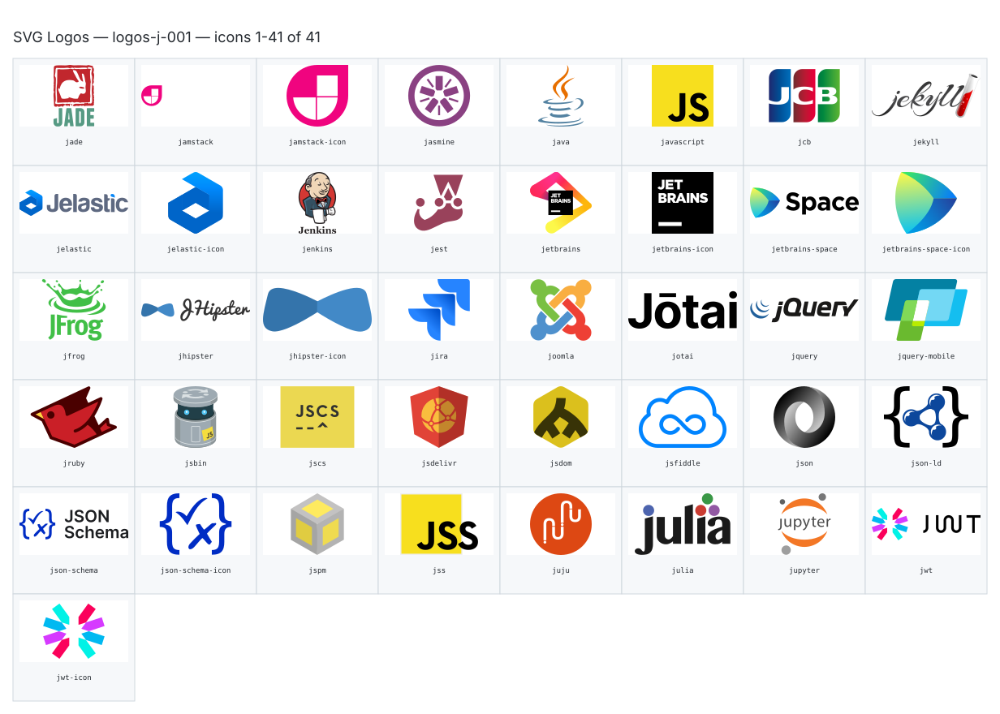

**Generated file — do not edit. Run `python scripts/portfolio.py icons generate`.**

# SVG Logos — `j`

[SVG Logos hub](../logos.md). 41 icons in group `j` across 1 sheet. Display names are approximate; copy the slug for Mermaid.

## logos-j-001

- `logos:jade` — Jade — [logos-j-001.svg](../sheets/logos-j-001.svg) r0c0 — `service example(logos:jade)[Jade]`
- `logos:jamstack` — Jamstack — [logos-j-001.svg](../sheets/logos-j-001.svg) r0c1 — `service example(logos:jamstack)[Jamstack]`
- `logos:jamstack-icon` — Jamstack Icon — [logos-j-001.svg](../sheets/logos-j-001.svg) r0c2 — `service example(logos:jamstack-icon)[Jamstack Icon]`
- `logos:jasmine` — Jasmine — [logos-j-001.svg](../sheets/logos-j-001.svg) r0c3 — `service example(logos:jasmine)[Jasmine]`
- `logos:java` — Java — [logos-j-001.svg](../sheets/logos-j-001.svg) r0c4 — `service example(logos:java)[Java]`
- `logos:javascript` — Javascript — [logos-j-001.svg](../sheets/logos-j-001.svg) r0c5 — `service example(logos:javascript)[Javascript]`
- `logos:jcb` — Jcb — [logos-j-001.svg](../sheets/logos-j-001.svg) r0c6 — `service example(logos:jcb)[Jcb]`
- `logos:jekyll` — Jekyll — [logos-j-001.svg](../sheets/logos-j-001.svg) r0c7 — `service example(logos:jekyll)[Jekyll]`
- `logos:jelastic` — Jelastic — [logos-j-001.svg](../sheets/logos-j-001.svg) r1c0 — `service example(logos:jelastic)[Jelastic]`
- `logos:jelastic-icon` — Jelastic Icon — [logos-j-001.svg](../sheets/logos-j-001.svg) r1c1 — `service example(logos:jelastic-icon)[Jelastic Icon]`
- `logos:jenkins` — Jenkins — [logos-j-001.svg](../sheets/logos-j-001.svg) r1c2 — `service example(logos:jenkins)[Jenkins]`
- `logos:jest` — Jest — [logos-j-001.svg](../sheets/logos-j-001.svg) r1c3 — `service example(logos:jest)[Jest]`
- `logos:jetbrains` — Jetbrains — [logos-j-001.svg](../sheets/logos-j-001.svg) r1c4 — `service example(logos:jetbrains)[Jetbrains]`
- `logos:jetbrains-icon` — Jetbrains Icon — [logos-j-001.svg](../sheets/logos-j-001.svg) r1c5 — `service example(logos:jetbrains-icon)[Jetbrains Icon]`
- `logos:jetbrains-space` — Jetbrains Space — [logos-j-001.svg](../sheets/logos-j-001.svg) r1c6 — `service example(logos:jetbrains-space)[Jetbrains Space]`
- `logos:jetbrains-space-icon` — Jetbrains Space Icon — [logos-j-001.svg](../sheets/logos-j-001.svg) r1c7 — `service example(logos:jetbrains-space-icon)[Jetbrains Space Icon]`
- `logos:jfrog` — Jfrog — [logos-j-001.svg](../sheets/logos-j-001.svg) r2c0 — `service example(logos:jfrog)[Jfrog]`
- `logos:jhipster` — Jhipster — [logos-j-001.svg](../sheets/logos-j-001.svg) r2c1 — `service example(logos:jhipster)[Jhipster]`
- `logos:jhipster-icon` — Jhipster Icon — [logos-j-001.svg](../sheets/logos-j-001.svg) r2c2 — `service example(logos:jhipster-icon)[Jhipster Icon]`
- `logos:jira` — Jira — [logos-j-001.svg](../sheets/logos-j-001.svg) r2c3 — `service example(logos:jira)[Jira]`
- `logos:joomla` — Joomla — [logos-j-001.svg](../sheets/logos-j-001.svg) r2c4 — `service example(logos:joomla)[Joomla]`
- `logos:jotai` — Jotai — [logos-j-001.svg](../sheets/logos-j-001.svg) r2c5 — `service example(logos:jotai)[Jotai]`
- `logos:jquery` — Jquery — [logos-j-001.svg](../sheets/logos-j-001.svg) r2c6 — `service example(logos:jquery)[Jquery]`
- `logos:jquery-mobile` — Jquery Mobile — [logos-j-001.svg](../sheets/logos-j-001.svg) r2c7 — `service example(logos:jquery-mobile)[Jquery Mobile]`
- `logos:jruby` — Jruby — [logos-j-001.svg](../sheets/logos-j-001.svg) r3c0 — `service example(logos:jruby)[Jruby]`
- `logos:jsbin` — Jsbin — [logos-j-001.svg](../sheets/logos-j-001.svg) r3c1 — `service example(logos:jsbin)[Jsbin]`
- `logos:jscs` — Jscs — [logos-j-001.svg](../sheets/logos-j-001.svg) r3c2 — `service example(logos:jscs)[Jscs]`
- `logos:jsdelivr` — Jsdelivr — [logos-j-001.svg](../sheets/logos-j-001.svg) r3c3 — `service example(logos:jsdelivr)[Jsdelivr]`
- `logos:jsdom` — Jsdom — [logos-j-001.svg](../sheets/logos-j-001.svg) r3c4 — `service example(logos:jsdom)[Jsdom]`
- `logos:jsfiddle` — Jsfiddle — [logos-j-001.svg](../sheets/logos-j-001.svg) r3c5 — `service example(logos:jsfiddle)[Jsfiddle]`
- `logos:json` — Json — [logos-j-001.svg](../sheets/logos-j-001.svg) r3c6 — `service example(logos:json)[Json]`
- `logos:json-ld` — Json Ld — [logos-j-001.svg](../sheets/logos-j-001.svg) r3c7 — `service example(logos:json-ld)[Json Ld]`
- `logos:json-schema` — Json Schema — [logos-j-001.svg](../sheets/logos-j-001.svg) r4c0 — `service example(logos:json-schema)[Json Schema]`
- `logos:json-schema-icon` — Json Schema Icon — [logos-j-001.svg](../sheets/logos-j-001.svg) r4c1 — `service example(logos:json-schema-icon)[Json Schema Icon]`
- `logos:jspm` — Jspm — [logos-j-001.svg](../sheets/logos-j-001.svg) r4c2 — `service example(logos:jspm)[Jspm]`
- `logos:jss` — Jss — [logos-j-001.svg](../sheets/logos-j-001.svg) r4c3 — `service example(logos:jss)[Jss]`
- `logos:juju` — Juju — [logos-j-001.svg](../sheets/logos-j-001.svg) r4c4 — `service example(logos:juju)[Juju]`
- `logos:julia` — Julia — [logos-j-001.svg](../sheets/logos-j-001.svg) r4c5 — `service example(logos:julia)[Julia]`
- `logos:jupyter` — Jupyter — [logos-j-001.svg](../sheets/logos-j-001.svg) r4c6 — `service example(logos:jupyter)[Jupyter]`
- `logos:jwt` — Jwt — [logos-j-001.svg](../sheets/logos-j-001.svg) r4c7 — `service example(logos:jwt)[Jwt]`
- `logos:jwt-icon` — Jwt Icon — [logos-j-001.svg](../sheets/logos-j-001.svg) r5c0 — `service example(logos:jwt-icon)[Jwt Icon]`
