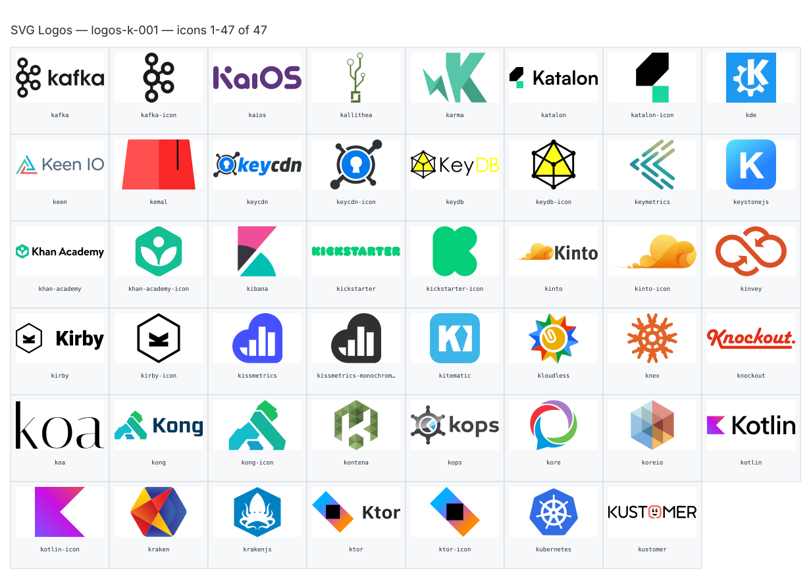

**Generated file — do not edit. Run `python scripts/portfolio.py icons generate`.**

# SVG Logos — `k`

[SVG Logos hub](../logos.md). 47 icons in group `k` across 1 sheet. Display names are approximate; copy the slug for Mermaid.

## logos-k-001

- `logos:kafka` — Kafka — [logos-k-001.svg](../sheets/logos-k-001.svg) r0c0 — `service example(logos:kafka)[Kafka]`
- `logos:kafka-icon` — Kafka Icon — [logos-k-001.svg](../sheets/logos-k-001.svg) r0c1 — `service example(logos:kafka-icon)[Kafka Icon]`
- `logos:kaios` — Kaios — [logos-k-001.svg](../sheets/logos-k-001.svg) r0c2 — `service example(logos:kaios)[Kaios]`
- `logos:kallithea` — Kallithea — [logos-k-001.svg](../sheets/logos-k-001.svg) r0c3 — `service example(logos:kallithea)[Kallithea]`
- `logos:karma` — Karma — [logos-k-001.svg](../sheets/logos-k-001.svg) r0c4 — `service example(logos:karma)[Karma]`
- `logos:katalon` — Katalon — [logos-k-001.svg](../sheets/logos-k-001.svg) r0c5 — `service example(logos:katalon)[Katalon]`
- `logos:katalon-icon` — Katalon Icon — [logos-k-001.svg](../sheets/logos-k-001.svg) r0c6 — `service example(logos:katalon-icon)[Katalon Icon]`
- `logos:kde` — Kde — [logos-k-001.svg](../sheets/logos-k-001.svg) r0c7 — `service example(logos:kde)[Kde]`
- `logos:keen` — Keen — [logos-k-001.svg](../sheets/logos-k-001.svg) r1c0 — `service example(logos:keen)[Keen]`
- `logos:kemal` — Kemal — [logos-k-001.svg](../sheets/logos-k-001.svg) r1c1 — `service example(logos:kemal)[Kemal]`
- `logos:keycdn` — Keycdn — [logos-k-001.svg](../sheets/logos-k-001.svg) r1c2 — `service example(logos:keycdn)[Keycdn]`
- `logos:keycdn-icon` — Keycdn Icon — [logos-k-001.svg](../sheets/logos-k-001.svg) r1c3 — `service example(logos:keycdn-icon)[Keycdn Icon]`
- `logos:keydb` — Keydb — [logos-k-001.svg](../sheets/logos-k-001.svg) r1c4 — `service example(logos:keydb)[Keydb]`
- `logos:keydb-icon` — Keydb Icon — [logos-k-001.svg](../sheets/logos-k-001.svg) r1c5 — `service example(logos:keydb-icon)[Keydb Icon]`
- `logos:keymetrics` — Keymetrics — [logos-k-001.svg](../sheets/logos-k-001.svg) r1c6 — `service example(logos:keymetrics)[Keymetrics]`
- `logos:keystonejs` — Keystonejs — [logos-k-001.svg](../sheets/logos-k-001.svg) r1c7 — `service example(logos:keystonejs)[Keystonejs]`
- `logos:khan-academy` — Khan Academy — [logos-k-001.svg](../sheets/logos-k-001.svg) r2c0 — `service example(logos:khan-academy)[Khan Academy]`
- `logos:khan-academy-icon` — Khan Academy Icon — [logos-k-001.svg](../sheets/logos-k-001.svg) r2c1 — `service example(logos:khan-academy-icon)[Khan Academy Icon]`
- `logos:kibana` — Kibana — [logos-k-001.svg](../sheets/logos-k-001.svg) r2c2 — `service example(logos:kibana)[Kibana]`
- `logos:kickstarter` — Kickstarter — [logos-k-001.svg](../sheets/logos-k-001.svg) r2c3 — `service example(logos:kickstarter)[Kickstarter]`
- `logos:kickstarter-icon` — Kickstarter Icon — [logos-k-001.svg](../sheets/logos-k-001.svg) r2c4 — `service example(logos:kickstarter-icon)[Kickstarter Icon]`
- `logos:kinto` — Kinto — [logos-k-001.svg](../sheets/logos-k-001.svg) r2c5 — `service example(logos:kinto)[Kinto]`
- `logos:kinto-icon` — Kinto Icon — [logos-k-001.svg](../sheets/logos-k-001.svg) r2c6 — `service example(logos:kinto-icon)[Kinto Icon]`
- `logos:kinvey` — Kinvey — [logos-k-001.svg](../sheets/logos-k-001.svg) r2c7 — `service example(logos:kinvey)[Kinvey]`
- `logos:kirby` — Kirby — [logos-k-001.svg](../sheets/logos-k-001.svg) r3c0 — `service example(logos:kirby)[Kirby]`
- `logos:kirby-icon` — Kirby Icon — [logos-k-001.svg](../sheets/logos-k-001.svg) r3c1 — `service example(logos:kirby-icon)[Kirby Icon]`
- `logos:kissmetrics` — Kissmetrics — [logos-k-001.svg](../sheets/logos-k-001.svg) r3c2 — `service example(logos:kissmetrics)[Kissmetrics]`
- `logos:kissmetrics-monochromatic` — Kissmetrics Monochromatic — [logos-k-001.svg](../sheets/logos-k-001.svg) r3c3 — `service example(logos:kissmetrics-monochromatic)[Kissmetrics Monochromatic]`
- `logos:kitematic` — Kitematic — [logos-k-001.svg](../sheets/logos-k-001.svg) r3c4 — `service example(logos:kitematic)[Kitematic]`
- `logos:kloudless` — Kloudless — [logos-k-001.svg](../sheets/logos-k-001.svg) r3c5 — `service example(logos:kloudless)[Kloudless]`
- `logos:knex` — Knex — [logos-k-001.svg](../sheets/logos-k-001.svg) r3c6 — `service example(logos:knex)[Knex]`
- `logos:knockout` — Knockout — [logos-k-001.svg](../sheets/logos-k-001.svg) r3c7 — `service example(logos:knockout)[Knockout]`
- `logos:koa` — Koa — [logos-k-001.svg](../sheets/logos-k-001.svg) r4c0 — `service example(logos:koa)[Koa]`
- `logos:kong` — Kong — [logos-k-001.svg](../sheets/logos-k-001.svg) r4c1 — `service example(logos:kong)[Kong]`
- `logos:kong-icon` — Kong Icon — [logos-k-001.svg](../sheets/logos-k-001.svg) r4c2 — `service example(logos:kong-icon)[Kong Icon]`
- `logos:kontena` — Kontena — [logos-k-001.svg](../sheets/logos-k-001.svg) r4c3 — `service example(logos:kontena)[Kontena]`
- `logos:kops` — Kops — [logos-k-001.svg](../sheets/logos-k-001.svg) r4c4 — `service example(logos:kops)[Kops]`
- `logos:kore` — Kore — [logos-k-001.svg](../sheets/logos-k-001.svg) r4c5 — `service example(logos:kore)[Kore]`
- `logos:koreio` — Koreio — [logos-k-001.svg](../sheets/logos-k-001.svg) r4c6 — `service example(logos:koreio)[Koreio]`
- `logos:kotlin` — Kotlin — [logos-k-001.svg](../sheets/logos-k-001.svg) r4c7 — `service example(logos:kotlin)[Kotlin]`
- `logos:kotlin-icon` — Kotlin Icon — [logos-k-001.svg](../sheets/logos-k-001.svg) r5c0 — `service example(logos:kotlin-icon)[Kotlin Icon]`
- `logos:kraken` — Kraken — [logos-k-001.svg](../sheets/logos-k-001.svg) r5c1 — `service example(logos:kraken)[Kraken]`
- `logos:krakenjs` — Krakenjs — [logos-k-001.svg](../sheets/logos-k-001.svg) r5c2 — `service example(logos:krakenjs)[Krakenjs]`
- `logos:ktor` — Ktor — [logos-k-001.svg](../sheets/logos-k-001.svg) r5c3 — `service example(logos:ktor)[Ktor]`
- `logos:ktor-icon` — Ktor Icon — [logos-k-001.svg](../sheets/logos-k-001.svg) r5c4 — `service example(logos:ktor-icon)[Ktor Icon]`
- `logos:kubernetes` — Kubernetes — [logos-k-001.svg](../sheets/logos-k-001.svg) r5c5 — `service example(logos:kubernetes)[Kubernetes]`
- `logos:kustomer` — Kustomer — [logos-k-001.svg](../sheets/logos-k-001.svg) r5c6 — `service example(logos:kustomer)[Kustomer]`
