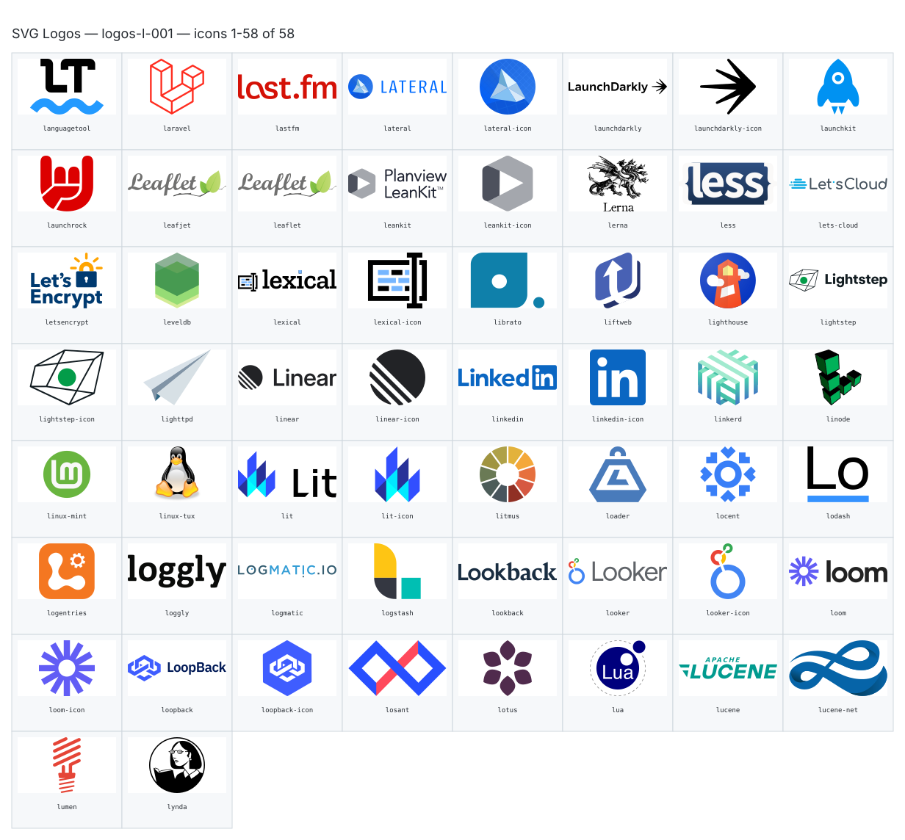

**Generated file — do not edit. Run `python scripts/portfolio.py icons generate`.**

# SVG Logos — `l`

[SVG Logos hub](../logos.md). 58 icons in group `l` across 1 sheet. Display names are approximate; copy the slug for Mermaid.

## logos-l-001

- `logos:languagetool` — Languagetool — [logos-l-001.svg](../sheets/logos-l-001.svg) r0c0 — `service example(logos:languagetool)[Languagetool]`
- `logos:laravel` — Laravel — [logos-l-001.svg](../sheets/logos-l-001.svg) r0c1 — `service example(logos:laravel)[Laravel]`
- `logos:lastfm` — Lastfm — [logos-l-001.svg](../sheets/logos-l-001.svg) r0c2 — `service example(logos:lastfm)[Lastfm]`
- `logos:lateral` — Lateral — [logos-l-001.svg](../sheets/logos-l-001.svg) r0c3 — `service example(logos:lateral)[Lateral]`
- `logos:lateral-icon` — Lateral Icon — [logos-l-001.svg](../sheets/logos-l-001.svg) r0c4 — `service example(logos:lateral-icon)[Lateral Icon]`
- `logos:launchdarkly` — Launchdarkly — [logos-l-001.svg](../sheets/logos-l-001.svg) r0c5 — `service example(logos:launchdarkly)[Launchdarkly]`
- `logos:launchdarkly-icon` — Launchdarkly Icon — [logos-l-001.svg](../sheets/logos-l-001.svg) r0c6 — `service example(logos:launchdarkly-icon)[Launchdarkly Icon]`
- `logos:launchkit` — Launchkit — [logos-l-001.svg](../sheets/logos-l-001.svg) r0c7 — `service example(logos:launchkit)[Launchkit]`
- `logos:launchrock` — Launchrock — [logos-l-001.svg](../sheets/logos-l-001.svg) r1c0 — `service example(logos:launchrock)[Launchrock]`
- `logos:leafjet` — Leafjet — [logos-l-001.svg](../sheets/logos-l-001.svg) r1c1 — `service example(logos:leafjet)[Leafjet]`
- `logos:leaflet` — Leaflet — [logos-l-001.svg](../sheets/logos-l-001.svg) r1c2 — `service example(logos:leaflet)[Leaflet]`
- `logos:leankit` — Leankit — [logos-l-001.svg](../sheets/logos-l-001.svg) r1c3 — `service example(logos:leankit)[Leankit]`
- `logos:leankit-icon` — Leankit Icon — [logos-l-001.svg](../sheets/logos-l-001.svg) r1c4 — `service example(logos:leankit-icon)[Leankit Icon]`
- `logos:lerna` — Lerna — [logos-l-001.svg](../sheets/logos-l-001.svg) r1c5 — `service example(logos:lerna)[Lerna]`
- `logos:less` — Less — [logos-l-001.svg](../sheets/logos-l-001.svg) r1c6 — `service example(logos:less)[Less]`
- `logos:lets-cloud` — Lets Cloud — [logos-l-001.svg](../sheets/logos-l-001.svg) r1c7 — `service example(logos:lets-cloud)[Lets Cloud]`
- `logos:letsencrypt` — Letsencrypt — [logos-l-001.svg](../sheets/logos-l-001.svg) r2c0 — `service example(logos:letsencrypt)[Letsencrypt]`
- `logos:leveldb` — Leveldb — [logos-l-001.svg](../sheets/logos-l-001.svg) r2c1 — `service example(logos:leveldb)[Leveldb]`
- `logos:lexical` — Lexical — [logos-l-001.svg](../sheets/logos-l-001.svg) r2c2 — `service example(logos:lexical)[Lexical]`
- `logos:lexical-icon` — Lexical Icon — [logos-l-001.svg](../sheets/logos-l-001.svg) r2c3 — `service example(logos:lexical-icon)[Lexical Icon]`
- `logos:librato` — Librato — [logos-l-001.svg](../sheets/logos-l-001.svg) r2c4 — `service example(logos:librato)[Librato]`
- `logos:liftweb` — Liftweb — [logos-l-001.svg](../sheets/logos-l-001.svg) r2c5 — `service example(logos:liftweb)[Liftweb]`
- `logos:lighthouse` — Lighthouse — [logos-l-001.svg](../sheets/logos-l-001.svg) r2c6 — `service example(logos:lighthouse)[Lighthouse]`
- `logos:lightstep` — Lightstep — [logos-l-001.svg](../sheets/logos-l-001.svg) r2c7 — `service example(logos:lightstep)[Lightstep]`
- `logos:lightstep-icon` — Lightstep Icon — [logos-l-001.svg](../sheets/logos-l-001.svg) r3c0 — `service example(logos:lightstep-icon)[Lightstep Icon]`
- `logos:lighttpd` — Lighttpd — [logos-l-001.svg](../sheets/logos-l-001.svg) r3c1 — `service example(logos:lighttpd)[Lighttpd]`
- `logos:linear` — Linear — [logos-l-001.svg](../sheets/logos-l-001.svg) r3c2 — `service example(logos:linear)[Linear]`
- `logos:linear-icon` — Linear Icon — [logos-l-001.svg](../sheets/logos-l-001.svg) r3c3 — `service example(logos:linear-icon)[Linear Icon]`
- `logos:linkedin` — Linkedin — [logos-l-001.svg](../sheets/logos-l-001.svg) r3c4 — `service example(logos:linkedin)[Linkedin]`
- `logos:linkedin-icon` — Linkedin Icon — [logos-l-001.svg](../sheets/logos-l-001.svg) r3c5 — `service example(logos:linkedin-icon)[Linkedin Icon]`
- `logos:linkerd` — Linkerd — [logos-l-001.svg](../sheets/logos-l-001.svg) r3c6 — `service example(logos:linkerd)[Linkerd]`
- `logos:linode` — Linode — [logos-l-001.svg](../sheets/logos-l-001.svg) r3c7 — `service example(logos:linode)[Linode]`
- `logos:linux-mint` — Linux Mint — [logos-l-001.svg](../sheets/logos-l-001.svg) r4c0 — `service example(logos:linux-mint)[Linux Mint]`
- `logos:linux-tux` — Linux Tux — [logos-l-001.svg](../sheets/logos-l-001.svg) r4c1 — `service example(logos:linux-tux)[Linux Tux]`
- `logos:lit` — Lit — [logos-l-001.svg](../sheets/logos-l-001.svg) r4c2 — `service example(logos:lit)[Lit]`
- `logos:lit-icon` — Lit Icon — [logos-l-001.svg](../sheets/logos-l-001.svg) r4c3 — `service example(logos:lit-icon)[Lit Icon]`
- `logos:litmus` — Litmus — [logos-l-001.svg](../sheets/logos-l-001.svg) r4c4 — `service example(logos:litmus)[Litmus]`
- `logos:loader` — Loader — [logos-l-001.svg](../sheets/logos-l-001.svg) r4c5 — `service example(logos:loader)[Loader]`
- `logos:locent` — Locent — [logos-l-001.svg](../sheets/logos-l-001.svg) r4c6 — `service example(logos:locent)[Locent]`
- `logos:lodash` — Lodash — [logos-l-001.svg](../sheets/logos-l-001.svg) r4c7 — `service example(logos:lodash)[Lodash]`
- `logos:logentries` — Logentries — [logos-l-001.svg](../sheets/logos-l-001.svg) r5c0 — `service example(logos:logentries)[Logentries]`
- `logos:loggly` — Loggly — [logos-l-001.svg](../sheets/logos-l-001.svg) r5c1 — `service example(logos:loggly)[Loggly]`
- `logos:logmatic` — Logmatic — [logos-l-001.svg](../sheets/logos-l-001.svg) r5c2 — `service example(logos:logmatic)[Logmatic]`
- `logos:logstash` — Logstash — [logos-l-001.svg](../sheets/logos-l-001.svg) r5c3 — `service example(logos:logstash)[Logstash]`
- `logos:lookback` — Lookback — [logos-l-001.svg](../sheets/logos-l-001.svg) r5c4 — `service example(logos:lookback)[Lookback]`
- `logos:looker` — Looker — [logos-l-001.svg](../sheets/logos-l-001.svg) r5c5 — `service example(logos:looker)[Looker]`
- `logos:looker-icon` — Looker Icon — [logos-l-001.svg](../sheets/logos-l-001.svg) r5c6 — `service example(logos:looker-icon)[Looker Icon]`
- `logos:loom` — Loom — [logos-l-001.svg](../sheets/logos-l-001.svg) r5c7 — `service example(logos:loom)[Loom]`
- `logos:loom-icon` — Loom Icon — [logos-l-001.svg](../sheets/logos-l-001.svg) r6c0 — `service example(logos:loom-icon)[Loom Icon]`
- `logos:loopback` — Loopback — [logos-l-001.svg](../sheets/logos-l-001.svg) r6c1 — `service example(logos:loopback)[Loopback]`
- `logos:loopback-icon` — Loopback Icon — [logos-l-001.svg](../sheets/logos-l-001.svg) r6c2 — `service example(logos:loopback-icon)[Loopback Icon]`
- `logos:losant` — Losant — [logos-l-001.svg](../sheets/logos-l-001.svg) r6c3 — `service example(logos:losant)[Losant]`
- `logos:lotus` — Lotus — [logos-l-001.svg](../sheets/logos-l-001.svg) r6c4 — `service example(logos:lotus)[Lotus]`
- `logos:lua` — Lua — [logos-l-001.svg](../sheets/logos-l-001.svg) r6c5 — `service example(logos:lua)[Lua]`
- `logos:lucene` — Lucene — [logos-l-001.svg](../sheets/logos-l-001.svg) r6c6 — `service example(logos:lucene)[Lucene]`
- `logos:lucene-net` — Lucene Net — [logos-l-001.svg](../sheets/logos-l-001.svg) r6c7 — `service example(logos:lucene-net)[Lucene Net]`
- `logos:lumen` — Lumen — [logos-l-001.svg](../sheets/logos-l-001.svg) r7c0 — `service example(logos:lumen)[Lumen]`
- `logos:lynda` — Lynda — [logos-l-001.svg](../sheets/logos-l-001.svg) r7c1 — `service example(logos:lynda)[Lynda]`
