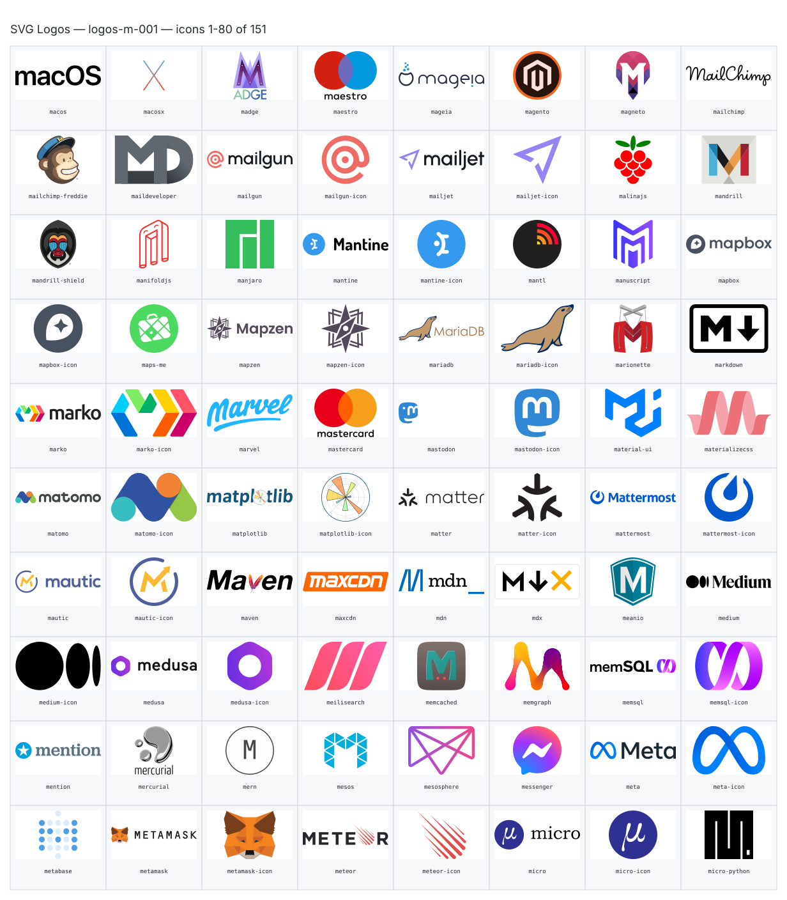
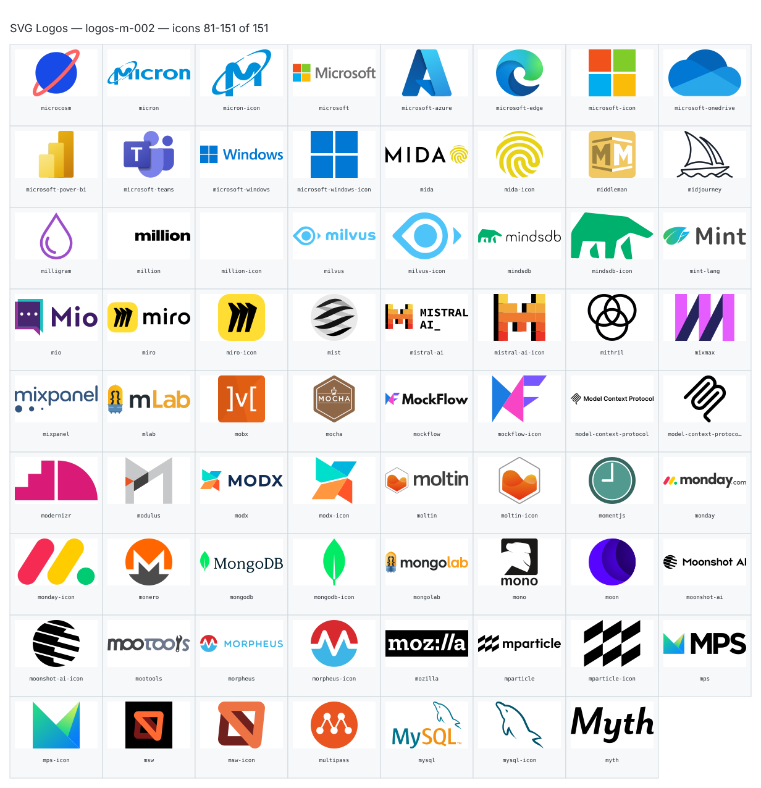

**Generated file — do not edit. Run `python scripts/portfolio.py icons generate`.**

# SVG Logos — `m`

[SVG Logos hub](../logos.md). 151 icons in group `m` across 2 sheets. Display names are approximate; copy the slug for Mermaid.

## logos-m-001

- `logos:macos` — Macos — [logos-m-001.svg](../sheets/logos-m-001.svg) r0c0 — `service example(logos:macos)[Macos]`
- `logos:macosx` — Macosx — [logos-m-001.svg](../sheets/logos-m-001.svg) r0c1 — `service example(logos:macosx)[Macosx]`
- `logos:madge` — Madge — [logos-m-001.svg](../sheets/logos-m-001.svg) r0c2 — `service example(logos:madge)[Madge]`
- `logos:maestro` — Maestro — [logos-m-001.svg](../sheets/logos-m-001.svg) r0c3 — `service example(logos:maestro)[Maestro]`
- `logos:mageia` — Mageia — [logos-m-001.svg](../sheets/logos-m-001.svg) r0c4 — `service example(logos:mageia)[Mageia]`
- `logos:magento` — Magento — [logos-m-001.svg](../sheets/logos-m-001.svg) r0c5 — `service example(logos:magento)[Magento]`
- `logos:magneto` — Magneto — [logos-m-001.svg](../sheets/logos-m-001.svg) r0c6 — `service example(logos:magneto)[Magneto]`
- `logos:mailchimp` — Mailchimp — [logos-m-001.svg](../sheets/logos-m-001.svg) r0c7 — `service example(logos:mailchimp)[Mailchimp]`
- `logos:mailchimp-freddie` — Mailchimp Freddie — [logos-m-001.svg](../sheets/logos-m-001.svg) r1c0 — `service example(logos:mailchimp-freddie)[Mailchimp Freddie]`
- `logos:maildeveloper` — Maildeveloper — [logos-m-001.svg](../sheets/logos-m-001.svg) r1c1 — `service example(logos:maildeveloper)[Maildeveloper]`
- `logos:mailgun` — Mailgun — [logos-m-001.svg](../sheets/logos-m-001.svg) r1c2 — `service example(logos:mailgun)[Mailgun]`
- `logos:mailgun-icon` — Mailgun Icon — [logos-m-001.svg](../sheets/logos-m-001.svg) r1c3 — `service example(logos:mailgun-icon)[Mailgun Icon]`
- `logos:mailjet` — Mailjet — [logos-m-001.svg](../sheets/logos-m-001.svg) r1c4 — `service example(logos:mailjet)[Mailjet]`
- `logos:mailjet-icon` — Mailjet Icon — [logos-m-001.svg](../sheets/logos-m-001.svg) r1c5 — `service example(logos:mailjet-icon)[Mailjet Icon]`
- `logos:malinajs` — Malinajs — [logos-m-001.svg](../sheets/logos-m-001.svg) r1c6 — `service example(logos:malinajs)[Malinajs]`
- `logos:mandrill` — Mandrill — [logos-m-001.svg](../sheets/logos-m-001.svg) r1c7 — `service example(logos:mandrill)[Mandrill]`
- `logos:mandrill-shield` — Mandrill Shield — [logos-m-001.svg](../sheets/logos-m-001.svg) r2c0 — `service example(logos:mandrill-shield)[Mandrill Shield]`
- `logos:manifoldjs` — Manifoldjs — [logos-m-001.svg](../sheets/logos-m-001.svg) r2c1 — `service example(logos:manifoldjs)[Manifoldjs]`
- `logos:manjaro` — Manjaro — [logos-m-001.svg](../sheets/logos-m-001.svg) r2c2 — `service example(logos:manjaro)[Manjaro]`
- `logos:mantine` — Mantine — [logos-m-001.svg](../sheets/logos-m-001.svg) r2c3 — `service example(logos:mantine)[Mantine]`
- `logos:mantine-icon` — Mantine Icon — [logos-m-001.svg](../sheets/logos-m-001.svg) r2c4 — `service example(logos:mantine-icon)[Mantine Icon]`
- `logos:mantl` — Mantl — [logos-m-001.svg](../sheets/logos-m-001.svg) r2c5 — `service example(logos:mantl)[Mantl]`
- `logos:manuscript` — Manuscript — [logos-m-001.svg](../sheets/logos-m-001.svg) r2c6 — `service example(logos:manuscript)[Manuscript]`
- `logos:mapbox` — Mapbox — [logos-m-001.svg](../sheets/logos-m-001.svg) r2c7 — `service example(logos:mapbox)[Mapbox]`
- `logos:mapbox-icon` — Mapbox Icon — [logos-m-001.svg](../sheets/logos-m-001.svg) r3c0 — `service example(logos:mapbox-icon)[Mapbox Icon]`
- `logos:maps-me` — Maps Me — [logos-m-001.svg](../sheets/logos-m-001.svg) r3c1 — `service example(logos:maps-me)[Maps Me]`
- `logos:mapzen` — Mapzen — [logos-m-001.svg](../sheets/logos-m-001.svg) r3c2 — `service example(logos:mapzen)[Mapzen]`
- `logos:mapzen-icon` — Mapzen Icon — [logos-m-001.svg](../sheets/logos-m-001.svg) r3c3 — `service example(logos:mapzen-icon)[Mapzen Icon]`
- `logos:mariadb` — Mariadb — [logos-m-001.svg](../sheets/logos-m-001.svg) r3c4 — `service example(logos:mariadb)[Mariadb]`
- `logos:mariadb-icon` — Mariadb Icon — [logos-m-001.svg](../sheets/logos-m-001.svg) r3c5 — `service example(logos:mariadb-icon)[Mariadb Icon]`
- `logos:marionette` — Marionette — [logos-m-001.svg](../sheets/logos-m-001.svg) r3c6 — `service example(logos:marionette)[Marionette]`
- `logos:markdown` — Markdown — [logos-m-001.svg](../sheets/logos-m-001.svg) r3c7 — `service example(logos:markdown)[Markdown]`
- `logos:marko` — Marko — [logos-m-001.svg](../sheets/logos-m-001.svg) r4c0 — `service example(logos:marko)[Marko]`
- `logos:marko-icon` — Marko Icon — [logos-m-001.svg](../sheets/logos-m-001.svg) r4c1 — `service example(logos:marko-icon)[Marko Icon]`
- `logos:marvel` — Marvel — [logos-m-001.svg](../sheets/logos-m-001.svg) r4c2 — `service example(logos:marvel)[Marvel]`
- `logos:mastercard` — Mastercard — [logos-m-001.svg](../sheets/logos-m-001.svg) r4c3 — `service example(logos:mastercard)[Mastercard]`
- `logos:mastodon` — Mastodon — [logos-m-001.svg](../sheets/logos-m-001.svg) r4c4 — `service example(logos:mastodon)[Mastodon]`
- `logos:mastodon-icon` — Mastodon Icon — [logos-m-001.svg](../sheets/logos-m-001.svg) r4c5 — `service example(logos:mastodon-icon)[Mastodon Icon]`
- `logos:material-ui` — Material Ui — [logos-m-001.svg](../sheets/logos-m-001.svg) r4c6 — `service example(logos:material-ui)[Material Ui]`
- `logos:materializecss` — Materializecss — [logos-m-001.svg](../sheets/logos-m-001.svg) r4c7 — `service example(logos:materializecss)[Materializecss]`
- `logos:matomo` — Matomo — [logos-m-001.svg](../sheets/logos-m-001.svg) r5c0 — `service example(logos:matomo)[Matomo]`
- `logos:matomo-icon` — Matomo Icon — [logos-m-001.svg](../sheets/logos-m-001.svg) r5c1 — `service example(logos:matomo-icon)[Matomo Icon]`
- `logos:matplotlib` — Matplotlib — [logos-m-001.svg](../sheets/logos-m-001.svg) r5c2 — `service example(logos:matplotlib)[Matplotlib]`
- `logos:matplotlib-icon` — Matplotlib Icon — [logos-m-001.svg](../sheets/logos-m-001.svg) r5c3 — `service example(logos:matplotlib-icon)[Matplotlib Icon]`
- `logos:matter` — Matter — [logos-m-001.svg](../sheets/logos-m-001.svg) r5c4 — `service example(logos:matter)[Matter]`
- `logos:matter-icon` — Matter Icon — [logos-m-001.svg](../sheets/logos-m-001.svg) r5c5 — `service example(logos:matter-icon)[Matter Icon]`
- `logos:mattermost` — Mattermost — [logos-m-001.svg](../sheets/logos-m-001.svg) r5c6 — `service example(logos:mattermost)[Mattermost]`
- `logos:mattermost-icon` — Mattermost Icon — [logos-m-001.svg](../sheets/logos-m-001.svg) r5c7 — `service example(logos:mattermost-icon)[Mattermost Icon]`
- `logos:mautic` — Mautic — [logos-m-001.svg](../sheets/logos-m-001.svg) r6c0 — `service example(logos:mautic)[Mautic]`
- `logos:mautic-icon` — Mautic Icon — [logos-m-001.svg](../sheets/logos-m-001.svg) r6c1 — `service example(logos:mautic-icon)[Mautic Icon]`
- `logos:maven` — Maven — [logos-m-001.svg](../sheets/logos-m-001.svg) r6c2 — `service example(logos:maven)[Maven]`
- `logos:maxcdn` — Maxcdn — [logos-m-001.svg](../sheets/logos-m-001.svg) r6c3 — `service example(logos:maxcdn)[Maxcdn]`
- `logos:mdn` — Mdn — [logos-m-001.svg](../sheets/logos-m-001.svg) r6c4 — `service example(logos:mdn)[Mdn]`
- `logos:mdx` — Mdx — [logos-m-001.svg](../sheets/logos-m-001.svg) r6c5 — `service example(logos:mdx)[Mdx]`
- `logos:meanio` — Meanio — [logos-m-001.svg](../sheets/logos-m-001.svg) r6c6 — `service example(logos:meanio)[Meanio]`
- `logos:medium` — Medium — [logos-m-001.svg](../sheets/logos-m-001.svg) r6c7 — `service example(logos:medium)[Medium]`
- `logos:medium-icon` — Medium Icon — [logos-m-001.svg](../sheets/logos-m-001.svg) r7c0 — `service example(logos:medium-icon)[Medium Icon]`
- `logos:medusa` — Medusa — [logos-m-001.svg](../sheets/logos-m-001.svg) r7c1 — `service example(logos:medusa)[Medusa]`
- `logos:medusa-icon` — Medusa Icon — [logos-m-001.svg](../sheets/logos-m-001.svg) r7c2 — `service example(logos:medusa-icon)[Medusa Icon]`
- `logos:meilisearch` — Meilisearch — [logos-m-001.svg](../sheets/logos-m-001.svg) r7c3 — `service example(logos:meilisearch)[Meilisearch]`
- `logos:memcached` — Memcached — [logos-m-001.svg](../sheets/logos-m-001.svg) r7c4 — `service example(logos:memcached)[Memcached]`
- `logos:memgraph` — Memgraph — [logos-m-001.svg](../sheets/logos-m-001.svg) r7c5 — `service example(logos:memgraph)[Memgraph]`
- `logos:memsql` — Memsql — [logos-m-001.svg](../sheets/logos-m-001.svg) r7c6 — `service example(logos:memsql)[Memsql]`
- `logos:memsql-icon` — Memsql Icon — [logos-m-001.svg](../sheets/logos-m-001.svg) r7c7 — `service example(logos:memsql-icon)[Memsql Icon]`
- `logos:mention` — Mention — [logos-m-001.svg](../sheets/logos-m-001.svg) r8c0 — `service example(logos:mention)[Mention]`
- `logos:mercurial` — Mercurial — [logos-m-001.svg](../sheets/logos-m-001.svg) r8c1 — `service example(logos:mercurial)[Mercurial]`
- `logos:mern` — Mern — [logos-m-001.svg](../sheets/logos-m-001.svg) r8c2 — `service example(logos:mern)[Mern]`
- `logos:mesos` — Mesos — [logos-m-001.svg](../sheets/logos-m-001.svg) r8c3 — `service example(logos:mesos)[Mesos]`
- `logos:mesosphere` — Mesosphere — [logos-m-001.svg](../sheets/logos-m-001.svg) r8c4 — `service example(logos:mesosphere)[Mesosphere]`
- `logos:messenger` — Messenger — [logos-m-001.svg](../sheets/logos-m-001.svg) r8c5 — `service example(logos:messenger)[Messenger]`
- `logos:meta` — Meta — [logos-m-001.svg](../sheets/logos-m-001.svg) r8c6 — `service example(logos:meta)[Meta]`
- `logos:meta-icon` — Meta Icon — [logos-m-001.svg](../sheets/logos-m-001.svg) r8c7 — `service example(logos:meta-icon)[Meta Icon]`
- `logos:metabase` — Metabase — [logos-m-001.svg](../sheets/logos-m-001.svg) r9c0 — `service example(logos:metabase)[Metabase]`
- `logos:metamask` — Metamask — [logos-m-001.svg](../sheets/logos-m-001.svg) r9c1 — `service example(logos:metamask)[Metamask]`
- `logos:metamask-icon` — Metamask Icon — [logos-m-001.svg](../sheets/logos-m-001.svg) r9c2 — `service example(logos:metamask-icon)[Metamask Icon]`
- `logos:meteor` — Meteor — [logos-m-001.svg](../sheets/logos-m-001.svg) r9c3 — `service example(logos:meteor)[Meteor]`
- `logos:meteor-icon` — Meteor Icon — [logos-m-001.svg](../sheets/logos-m-001.svg) r9c4 — `service example(logos:meteor-icon)[Meteor Icon]`
- `logos:micro` — Micro — [logos-m-001.svg](../sheets/logos-m-001.svg) r9c5 — `service example(logos:micro)[Micro]`
- `logos:micro-icon` — Micro Icon — [logos-m-001.svg](../sheets/logos-m-001.svg) r9c6 — `service example(logos:micro-icon)[Micro Icon]`
- `logos:micro-python` — Micro Python — [logos-m-001.svg](../sheets/logos-m-001.svg) r9c7 — `service example(logos:micro-python)[Micro Python]`

## logos-m-002

- `logos:microcosm` — Microcosm — [logos-m-002.svg](../sheets/logos-m-002.svg) r0c0 — `service example(logos:microcosm)[Microcosm]`
- `logos:micron` — Micron — [logos-m-002.svg](../sheets/logos-m-002.svg) r0c1 — `service example(logos:micron)[Micron]`
- `logos:micron-icon` — Micron Icon — [logos-m-002.svg](../sheets/logos-m-002.svg) r0c2 — `service example(logos:micron-icon)[Micron Icon]`
- `logos:microsoft` — Microsoft — [logos-m-002.svg](../sheets/logos-m-002.svg) r0c3 — `service example(logos:microsoft)[Microsoft]`
- `logos:microsoft-azure` — Microsoft Azure — [logos-m-002.svg](../sheets/logos-m-002.svg) r0c4 — `service example(logos:microsoft-azure)[Microsoft Azure]`
- `logos:microsoft-edge` — Microsoft Edge — [logos-m-002.svg](../sheets/logos-m-002.svg) r0c5 — `service example(logos:microsoft-edge)[Microsoft Edge]`
- `logos:microsoft-icon` — Microsoft Icon — [logos-m-002.svg](../sheets/logos-m-002.svg) r0c6 — `service example(logos:microsoft-icon)[Microsoft Icon]`
- `logos:microsoft-onedrive` — Microsoft Onedrive — [logos-m-002.svg](../sheets/logos-m-002.svg) r0c7 — `service example(logos:microsoft-onedrive)[Microsoft Onedrive]`
- `logos:microsoft-power-bi` — Microsoft Power Bi — [logos-m-002.svg](../sheets/logos-m-002.svg) r1c0 — `service example(logos:microsoft-power-bi)[Microsoft Power Bi]`
- `logos:microsoft-teams` — Microsoft Teams — [logos-m-002.svg](../sheets/logos-m-002.svg) r1c1 — `service example(logos:microsoft-teams)[Microsoft Teams]`
- `logos:microsoft-windows` — Microsoft Windows — [logos-m-002.svg](../sheets/logos-m-002.svg) r1c2 — `service example(logos:microsoft-windows)[Microsoft Windows]`
- `logos:microsoft-windows-icon` — Microsoft Windows Icon — [logos-m-002.svg](../sheets/logos-m-002.svg) r1c3 — `service example(logos:microsoft-windows-icon)[Microsoft Windows Icon]`
- `logos:mida` — Mida — [logos-m-002.svg](../sheets/logos-m-002.svg) r1c4 — `service example(logos:mida)[Mida]`
- `logos:mida-icon` — Mida Icon — [logos-m-002.svg](../sheets/logos-m-002.svg) r1c5 — `service example(logos:mida-icon)[Mida Icon]`
- `logos:middleman` — Middleman — [logos-m-002.svg](../sheets/logos-m-002.svg) r1c6 — `service example(logos:middleman)[Middleman]`
- `logos:midjourney` — Midjourney — [logos-m-002.svg](../sheets/logos-m-002.svg) r1c7 — `service example(logos:midjourney)[Midjourney]`
- `logos:milligram` — Milligram — [logos-m-002.svg](../sheets/logos-m-002.svg) r2c0 — `service example(logos:milligram)[Milligram]`
- `logos:million` — Million — [logos-m-002.svg](../sheets/logos-m-002.svg) r2c1 — `service example(logos:million)[Million]`
- `logos:million-icon` — Million Icon — [logos-m-002.svg](../sheets/logos-m-002.svg) r2c2 — `service example(logos:million-icon)[Million Icon]`
- `logos:milvus` — Milvus — [logos-m-002.svg](../sheets/logos-m-002.svg) r2c3 — `service example(logos:milvus)[Milvus]`
- `logos:milvus-icon` — Milvus Icon — [logos-m-002.svg](../sheets/logos-m-002.svg) r2c4 — `service example(logos:milvus-icon)[Milvus Icon]`
- `logos:mindsdb` — Mindsdb — [logos-m-002.svg](../sheets/logos-m-002.svg) r2c5 — `service example(logos:mindsdb)[Mindsdb]`
- `logos:mindsdb-icon` — Mindsdb Icon — [logos-m-002.svg](../sheets/logos-m-002.svg) r2c6 — `service example(logos:mindsdb-icon)[Mindsdb Icon]`
- `logos:mint-lang` — Mint Lang — [logos-m-002.svg](../sheets/logos-m-002.svg) r2c7 — `service example(logos:mint-lang)[Mint Lang]`
- `logos:mio` — Mio — [logos-m-002.svg](../sheets/logos-m-002.svg) r3c0 — `service example(logos:mio)[Mio]`
- `logos:miro` — Miro — [logos-m-002.svg](../sheets/logos-m-002.svg) r3c1 — `service example(logos:miro)[Miro]`
- `logos:miro-icon` — Miro Icon — [logos-m-002.svg](../sheets/logos-m-002.svg) r3c2 — `service example(logos:miro-icon)[Miro Icon]`
- `logos:mist` — Mist — [logos-m-002.svg](../sheets/logos-m-002.svg) r3c3 — `service example(logos:mist)[Mist]`
- `logos:mistral-ai` — Mistral Ai — [logos-m-002.svg](../sheets/logos-m-002.svg) r3c4 — `service example(logos:mistral-ai)[Mistral Ai]`
- `logos:mistral-ai-icon` — Mistral Ai Icon — [logos-m-002.svg](../sheets/logos-m-002.svg) r3c5 — `service example(logos:mistral-ai-icon)[Mistral Ai Icon]`
- `logos:mithril` — Mithril — [logos-m-002.svg](../sheets/logos-m-002.svg) r3c6 — `service example(logos:mithril)[Mithril]`
- `logos:mixmax` — Mixmax — [logos-m-002.svg](../sheets/logos-m-002.svg) r3c7 — `service example(logos:mixmax)[Mixmax]`
- `logos:mixpanel` — Mixpanel — [logos-m-002.svg](../sheets/logos-m-002.svg) r4c0 — `service example(logos:mixpanel)[Mixpanel]`
- `logos:mlab` — Mlab — [logos-m-002.svg](../sheets/logos-m-002.svg) r4c1 — `service example(logos:mlab)[Mlab]`
- `logos:mobx` — Mobx — [logos-m-002.svg](../sheets/logos-m-002.svg) r4c2 — `service example(logos:mobx)[Mobx]`
- `logos:mocha` — Mocha — [logos-m-002.svg](../sheets/logos-m-002.svg) r4c3 — `service example(logos:mocha)[Mocha]`
- `logos:mockflow` — Mockflow — [logos-m-002.svg](../sheets/logos-m-002.svg) r4c4 — `service example(logos:mockflow)[Mockflow]`
- `logos:mockflow-icon` — Mockflow Icon — [logos-m-002.svg](../sheets/logos-m-002.svg) r4c5 — `service example(logos:mockflow-icon)[Mockflow Icon]`
- `logos:model-context-protocol` — Model Context Protocol — [logos-m-002.svg](../sheets/logos-m-002.svg) r4c6 — `service example(logos:model-context-protocol)[Model Context Protocol]`
- `logos:model-context-protocol-icon` — Model Context Protocol Icon — [logos-m-002.svg](../sheets/logos-m-002.svg) r4c7 — `service example(logos:model-context-protocol-icon)[Model Context Protocol Icon]`
- `logos:modernizr` — Modernizr — [logos-m-002.svg](../sheets/logos-m-002.svg) r5c0 — `service example(logos:modernizr)[Modernizr]`
- `logos:modulus` — Modulus — [logos-m-002.svg](../sheets/logos-m-002.svg) r5c1 — `service example(logos:modulus)[Modulus]`
- `logos:modx` — Modx — [logos-m-002.svg](../sheets/logos-m-002.svg) r5c2 — `service example(logos:modx)[Modx]`
- `logos:modx-icon` — Modx Icon — [logos-m-002.svg](../sheets/logos-m-002.svg) r5c3 — `service example(logos:modx-icon)[Modx Icon]`
- `logos:moltin` — Moltin — [logos-m-002.svg](../sheets/logos-m-002.svg) r5c4 — `service example(logos:moltin)[Moltin]`
- `logos:moltin-icon` — Moltin Icon — [logos-m-002.svg](../sheets/logos-m-002.svg) r5c5 — `service example(logos:moltin-icon)[Moltin Icon]`
- `logos:momentjs` — Momentjs — [logos-m-002.svg](../sheets/logos-m-002.svg) r5c6 — `service example(logos:momentjs)[Momentjs]`
- `logos:monday` — Monday — [logos-m-002.svg](../sheets/logos-m-002.svg) r5c7 — `service example(logos:monday)[Monday]`
- `logos:monday-icon` — Monday Icon — [logos-m-002.svg](../sheets/logos-m-002.svg) r6c0 — `service example(logos:monday-icon)[Monday Icon]`
- `logos:monero` — Monero — [logos-m-002.svg](../sheets/logos-m-002.svg) r6c1 — `service example(logos:monero)[Monero]`
- `logos:mongodb` — Mongodb — [logos-m-002.svg](../sheets/logos-m-002.svg) r6c2 — `service example(logos:mongodb)[Mongodb]`
- `logos:mongodb-icon` — Mongodb Icon — [logos-m-002.svg](../sheets/logos-m-002.svg) r6c3 — `service example(logos:mongodb-icon)[Mongodb Icon]`
- `logos:mongolab` — Mongolab — [logos-m-002.svg](../sheets/logos-m-002.svg) r6c4 — `service example(logos:mongolab)[Mongolab]`
- `logos:mono` — Mono — [logos-m-002.svg](../sheets/logos-m-002.svg) r6c5 — `service example(logos:mono)[Mono]`
- `logos:moon` — Moon — [logos-m-002.svg](../sheets/logos-m-002.svg) r6c6 — `service example(logos:moon)[Moon]`
- `logos:moonshot-ai` — Moonshot Ai — [logos-m-002.svg](../sheets/logos-m-002.svg) r6c7 — `service example(logos:moonshot-ai)[Moonshot Ai]`
- `logos:moonshot-ai-icon` — Moonshot Ai Icon — [logos-m-002.svg](../sheets/logos-m-002.svg) r7c0 — `service example(logos:moonshot-ai-icon)[Moonshot Ai Icon]`
- `logos:mootools` — Mootools — [logos-m-002.svg](../sheets/logos-m-002.svg) r7c1 — `service example(logos:mootools)[Mootools]`
- `logos:morpheus` — Morpheus — [logos-m-002.svg](../sheets/logos-m-002.svg) r7c2 — `service example(logos:morpheus)[Morpheus]`
- `logos:morpheus-icon` — Morpheus Icon — [logos-m-002.svg](../sheets/logos-m-002.svg) r7c3 — `service example(logos:morpheus-icon)[Morpheus Icon]`
- `logos:mozilla` — Mozilla — [logos-m-002.svg](../sheets/logos-m-002.svg) r7c4 — `service example(logos:mozilla)[Mozilla]`
- `logos:mparticle` — Mparticle — [logos-m-002.svg](../sheets/logos-m-002.svg) r7c5 — `service example(logos:mparticle)[Mparticle]`
- `logos:mparticle-icon` — Mparticle Icon — [logos-m-002.svg](../sheets/logos-m-002.svg) r7c6 — `service example(logos:mparticle-icon)[Mparticle Icon]`
- `logos:mps` — Mps — [logos-m-002.svg](../sheets/logos-m-002.svg) r7c7 — `service example(logos:mps)[Mps]`
- `logos:mps-icon` — Mps Icon — [logos-m-002.svg](../sheets/logos-m-002.svg) r8c0 — `service example(logos:mps-icon)[Mps Icon]`
- `logos:msw` — Msw — [logos-m-002.svg](../sheets/logos-m-002.svg) r8c1 — `service example(logos:msw)[Msw]`
- `logos:msw-icon` — Msw Icon — [logos-m-002.svg](../sheets/logos-m-002.svg) r8c2 — `service example(logos:msw-icon)[Msw Icon]`
- `logos:multipass` — Multipass — [logos-m-002.svg](../sheets/logos-m-002.svg) r8c3 — `service example(logos:multipass)[Multipass]`
- `logos:mysql` — Mysql — [logos-m-002.svg](../sheets/logos-m-002.svg) r8c4 — `service example(logos:mysql)[Mysql]`
- `logos:mysql-icon` — Mysql Icon — [logos-m-002.svg](../sheets/logos-m-002.svg) r8c5 — `service example(logos:mysql-icon)[Mysql Icon]`
- `logos:myth` — Myth — [logos-m-002.svg](../sheets/logos-m-002.svg) r8c6 — `service example(logos:myth)[Myth]`
