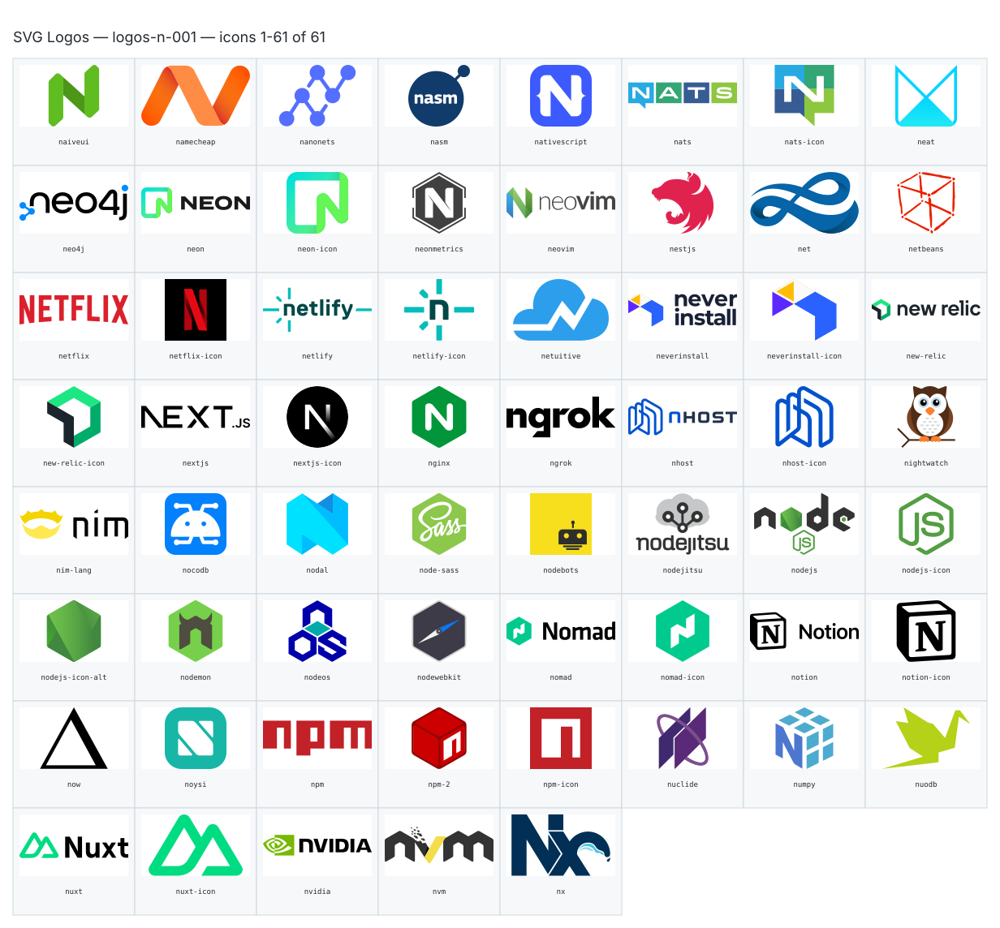

**Generated file — do not edit. Run `python scripts/portfolio.py icons generate`.**

# SVG Logos — `n`

[SVG Logos hub](../logos.md). 61 icons in group `n` across 1 sheet. Display names are approximate; copy the slug for Mermaid.

## logos-n-001

- `logos:naiveui` — Naiveui — [logos-n-001.svg](../sheets/logos-n-001.svg) r0c0 — `service example(logos:naiveui)[Naiveui]`
- `logos:namecheap` — Namecheap — [logos-n-001.svg](../sheets/logos-n-001.svg) r0c1 — `service example(logos:namecheap)[Namecheap]`
- `logos:nanonets` — Nanonets — [logos-n-001.svg](../sheets/logos-n-001.svg) r0c2 — `service example(logos:nanonets)[Nanonets]`
- `logos:nasm` — Nasm — [logos-n-001.svg](../sheets/logos-n-001.svg) r0c3 — `service example(logos:nasm)[Nasm]`
- `logos:nativescript` — Nativescript — [logos-n-001.svg](../sheets/logos-n-001.svg) r0c4 — `service example(logos:nativescript)[Nativescript]`
- `logos:nats` — Nats — [logos-n-001.svg](../sheets/logos-n-001.svg) r0c5 — `service example(logos:nats)[Nats]`
- `logos:nats-icon` — Nats Icon — [logos-n-001.svg](../sheets/logos-n-001.svg) r0c6 — `service example(logos:nats-icon)[Nats Icon]`
- `logos:neat` — Neat — [logos-n-001.svg](../sheets/logos-n-001.svg) r0c7 — `service example(logos:neat)[Neat]`
- `logos:neo4j` — Neo4j — [logos-n-001.svg](../sheets/logos-n-001.svg) r1c0 — `service example(logos:neo4j)[Neo4j]`
- `logos:neon` — Neon — [logos-n-001.svg](../sheets/logos-n-001.svg) r1c1 — `service example(logos:neon)[Neon]`
- `logos:neon-icon` — Neon Icon — [logos-n-001.svg](../sheets/logos-n-001.svg) r1c2 — `service example(logos:neon-icon)[Neon Icon]`
- `logos:neonmetrics` — Neonmetrics — [logos-n-001.svg](../sheets/logos-n-001.svg) r1c3 — `service example(logos:neonmetrics)[Neonmetrics]`
- `logos:neovim` — Neovim — [logos-n-001.svg](../sheets/logos-n-001.svg) r1c4 — `service example(logos:neovim)[Neovim]`
- `logos:nestjs` — Nestjs — [logos-n-001.svg](../sheets/logos-n-001.svg) r1c5 — `service example(logos:nestjs)[Nestjs]`
- `logos:net` — Net — [logos-n-001.svg](../sheets/logos-n-001.svg) r1c6 — `service example(logos:net)[Net]`
- `logos:netbeans` — Netbeans — [logos-n-001.svg](../sheets/logos-n-001.svg) r1c7 — `service example(logos:netbeans)[Netbeans]`
- `logos:netflix` — Netflix — [logos-n-001.svg](../sheets/logos-n-001.svg) r2c0 — `service example(logos:netflix)[Netflix]`
- `logos:netflix-icon` — Netflix Icon — [logos-n-001.svg](../sheets/logos-n-001.svg) r2c1 — `service example(logos:netflix-icon)[Netflix Icon]`
- `logos:netlify` — Netlify — [logos-n-001.svg](../sheets/logos-n-001.svg) r2c2 — `service example(logos:netlify)[Netlify]`
- `logos:netlify-icon` — Netlify Icon — [logos-n-001.svg](../sheets/logos-n-001.svg) r2c3 — `service example(logos:netlify-icon)[Netlify Icon]`
- `logos:netuitive` — Netuitive — [logos-n-001.svg](../sheets/logos-n-001.svg) r2c4 — `service example(logos:netuitive)[Netuitive]`
- `logos:neverinstall` — Neverinstall — [logos-n-001.svg](../sheets/logos-n-001.svg) r2c5 — `service example(logos:neverinstall)[Neverinstall]`
- `logos:neverinstall-icon` — Neverinstall Icon — [logos-n-001.svg](../sheets/logos-n-001.svg) r2c6 — `service example(logos:neverinstall-icon)[Neverinstall Icon]`
- `logos:new-relic` — New Relic — [logos-n-001.svg](../sheets/logos-n-001.svg) r2c7 — `service example(logos:new-relic)[New Relic]`
- `logos:new-relic-icon` — New Relic Icon — [logos-n-001.svg](../sheets/logos-n-001.svg) r3c0 — `service example(logos:new-relic-icon)[New Relic Icon]`
- `logos:nextjs` — Nextjs — [logos-n-001.svg](../sheets/logos-n-001.svg) r3c1 — `service example(logos:nextjs)[Nextjs]`
- `logos:nextjs-icon` — Nextjs Icon — [logos-n-001.svg](../sheets/logos-n-001.svg) r3c2 — `service example(logos:nextjs-icon)[Nextjs Icon]`
- `logos:nginx` — Nginx — [logos-n-001.svg](../sheets/logos-n-001.svg) r3c3 — `service example(logos:nginx)[Nginx]`
- `logos:ngrok` — Ngrok — [logos-n-001.svg](../sheets/logos-n-001.svg) r3c4 — `service example(logos:ngrok)[Ngrok]`
- `logos:nhost` — Nhost — [logos-n-001.svg](../sheets/logos-n-001.svg) r3c5 — `service example(logos:nhost)[Nhost]`
- `logos:nhost-icon` — Nhost Icon — [logos-n-001.svg](../sheets/logos-n-001.svg) r3c6 — `service example(logos:nhost-icon)[Nhost Icon]`
- `logos:nightwatch` — Nightwatch — [logos-n-001.svg](../sheets/logos-n-001.svg) r3c7 — `service example(logos:nightwatch)[Nightwatch]`
- `logos:nim-lang` — Nim Lang — [logos-n-001.svg](../sheets/logos-n-001.svg) r4c0 — `service example(logos:nim-lang)[Nim Lang]`
- `logos:nocodb` — Nocodb — [logos-n-001.svg](../sheets/logos-n-001.svg) r4c1 — `service example(logos:nocodb)[Nocodb]`
- `logos:nodal` — Nodal — [logos-n-001.svg](../sheets/logos-n-001.svg) r4c2 — `service example(logos:nodal)[Nodal]`
- `logos:node-sass` — Node Sass — [logos-n-001.svg](../sheets/logos-n-001.svg) r4c3 — `service example(logos:node-sass)[Node Sass]`
- `logos:nodebots` — Nodebots — [logos-n-001.svg](../sheets/logos-n-001.svg) r4c4 — `service example(logos:nodebots)[Nodebots]`
- `logos:nodejitsu` — Nodejitsu — [logos-n-001.svg](../sheets/logos-n-001.svg) r4c5 — `service example(logos:nodejitsu)[Nodejitsu]`
- `logos:nodejs` — Nodejs — [logos-n-001.svg](../sheets/logos-n-001.svg) r4c6 — `service example(logos:nodejs)[Nodejs]`
- `logos:nodejs-icon` — Nodejs Icon — [logos-n-001.svg](../sheets/logos-n-001.svg) r4c7 — `service example(logos:nodejs-icon)[Nodejs Icon]`
- `logos:nodejs-icon-alt` — Nodejs Icon Alt — [logos-n-001.svg](../sheets/logos-n-001.svg) r5c0 — `service example(logos:nodejs-icon-alt)[Nodejs Icon Alt]`
- `logos:nodemon` — Nodemon — [logos-n-001.svg](../sheets/logos-n-001.svg) r5c1 — `service example(logos:nodemon)[Nodemon]`
- `logos:nodeos` — Nodeos — [logos-n-001.svg](../sheets/logos-n-001.svg) r5c2 — `service example(logos:nodeos)[Nodeos]`
- `logos:nodewebkit` — Nodewebkit — [logos-n-001.svg](../sheets/logos-n-001.svg) r5c3 — `service example(logos:nodewebkit)[Nodewebkit]`
- `logos:nomad` — Nomad — [logos-n-001.svg](../sheets/logos-n-001.svg) r5c4 — `service example(logos:nomad)[Nomad]`
- `logos:nomad-icon` — Nomad Icon — [logos-n-001.svg](../sheets/logos-n-001.svg) r5c5 — `service example(logos:nomad-icon)[Nomad Icon]`
- `logos:notion` — Notion — [logos-n-001.svg](../sheets/logos-n-001.svg) r5c6 — `service example(logos:notion)[Notion]`
- `logos:notion-icon` — Notion Icon — [logos-n-001.svg](../sheets/logos-n-001.svg) r5c7 — `service example(logos:notion-icon)[Notion Icon]`
- `logos:now` — Now — [logos-n-001.svg](../sheets/logos-n-001.svg) r6c0 — `service example(logos:now)[Now]`
- `logos:noysi` — Noysi — [logos-n-001.svg](../sheets/logos-n-001.svg) r6c1 — `service example(logos:noysi)[Noysi]`
- `logos:npm` — Npm — [logos-n-001.svg](../sheets/logos-n-001.svg) r6c2 — `service example(logos:npm)[Npm]`
- `logos:npm-2` — Npm 2 — [logos-n-001.svg](../sheets/logos-n-001.svg) r6c3 — `service example(logos:npm-2)[Npm 2]`
- `logos:npm-icon` — Npm Icon — [logos-n-001.svg](../sheets/logos-n-001.svg) r6c4 — `service example(logos:npm-icon)[Npm Icon]`
- `logos:nuclide` — Nuclide — [logos-n-001.svg](../sheets/logos-n-001.svg) r6c5 — `service example(logos:nuclide)[Nuclide]`
- `logos:numpy` — Numpy — [logos-n-001.svg](../sheets/logos-n-001.svg) r6c6 — `service example(logos:numpy)[Numpy]`
- `logos:nuodb` — Nuodb — [logos-n-001.svg](../sheets/logos-n-001.svg) r6c7 — `service example(logos:nuodb)[Nuodb]`
- `logos:nuxt` — Nuxt — [logos-n-001.svg](../sheets/logos-n-001.svg) r7c0 — `service example(logos:nuxt)[Nuxt]`
- `logos:nuxt-icon` — Nuxt Icon — [logos-n-001.svg](../sheets/logos-n-001.svg) r7c1 — `service example(logos:nuxt-icon)[Nuxt Icon]`
- `logos:nvidia` — Nvidia — [logos-n-001.svg](../sheets/logos-n-001.svg) r7c2 — `service example(logos:nvidia)[Nvidia]`
- `logos:nvm` — Nvm — [logos-n-001.svg](../sheets/logos-n-001.svg) r7c3 — `service example(logos:nvm)[Nvm]`
- `logos:nx` — Nx — [logos-n-001.svg](../sheets/logos-n-001.svg) r7c4 — `service example(logos:nx)[Nx]`
