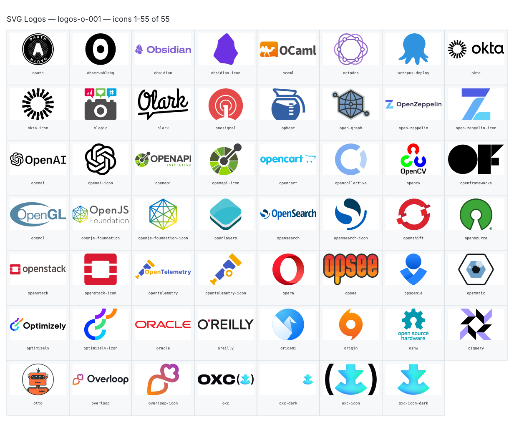

**Generated file — do not edit. Run `python scripts/portfolio.py icons generate`.**

# SVG Logos — `o`

[SVG Logos hub](../logos.md). 55 icons in group `o` across 1 sheet. Display names are approximate; copy the slug for Mermaid.

## logos-o-001

- `logos:oauth` — Oauth — [logos-o-001.svg](../sheets/logos-o-001.svg) r0c0 — `service example(logos:oauth)[Oauth]`
- `logos:observablehq` — Observablehq — [logos-o-001.svg](../sheets/logos-o-001.svg) r0c1 — `service example(logos:observablehq)[Observablehq]`
- `logos:obsidian` — Obsidian — [logos-o-001.svg](../sheets/logos-o-001.svg) r0c2 — `service example(logos:obsidian)[Obsidian]`
- `logos:obsidian-icon` — Obsidian Icon — [logos-o-001.svg](../sheets/logos-o-001.svg) r0c3 — `service example(logos:obsidian-icon)[Obsidian Icon]`
- `logos:ocaml` — Ocaml — [logos-o-001.svg](../sheets/logos-o-001.svg) r0c4 — `service example(logos:ocaml)[Ocaml]`
- `logos:octodns` — Octodns — [logos-o-001.svg](../sheets/logos-o-001.svg) r0c5 — `service example(logos:octodns)[Octodns]`
- `logos:octopus-deploy` — Octopus Deploy — [logos-o-001.svg](../sheets/logos-o-001.svg) r0c6 — `service example(logos:octopus-deploy)[Octopus Deploy]`
- `logos:okta` — Okta — [logos-o-001.svg](../sheets/logos-o-001.svg) r0c7 — `service example(logos:okta)[Okta]`
- `logos:okta-icon` — Okta Icon — [logos-o-001.svg](../sheets/logos-o-001.svg) r1c0 — `service example(logos:okta-icon)[Okta Icon]`
- `logos:olapic` — Olapic — [logos-o-001.svg](../sheets/logos-o-001.svg) r1c1 — `service example(logos:olapic)[Olapic]`
- `logos:olark` — Olark — [logos-o-001.svg](../sheets/logos-o-001.svg) r1c2 — `service example(logos:olark)[Olark]`
- `logos:onesignal` — Onesignal — [logos-o-001.svg](../sheets/logos-o-001.svg) r1c3 — `service example(logos:onesignal)[Onesignal]`
- `logos:opbeat` — Opbeat — [logos-o-001.svg](../sheets/logos-o-001.svg) r1c4 — `service example(logos:opbeat)[Opbeat]`
- `logos:open-graph` — Open Graph — [logos-o-001.svg](../sheets/logos-o-001.svg) r1c5 — `service example(logos:open-graph)[Open Graph]`
- `logos:open-zeppelin` — Open Zeppelin — [logos-o-001.svg](../sheets/logos-o-001.svg) r1c6 — `service example(logos:open-zeppelin)[Open Zeppelin]`
- `logos:open-zeppelin-icon` — Open Zeppelin Icon — [logos-o-001.svg](../sheets/logos-o-001.svg) r1c7 — `service example(logos:open-zeppelin-icon)[Open Zeppelin Icon]`
- `logos:openai` — Openai — [logos-o-001.svg](../sheets/logos-o-001.svg) r2c0 — `service example(logos:openai)[Openai]`
- `logos:openai-icon` — Openai Icon — [logos-o-001.svg](../sheets/logos-o-001.svg) r2c1 — `service example(logos:openai-icon)[Openai Icon]`
- `logos:openapi` — Openapi — [logos-o-001.svg](../sheets/logos-o-001.svg) r2c2 — `service example(logos:openapi)[Openapi]`
- `logos:openapi-icon` — Openapi Icon — [logos-o-001.svg](../sheets/logos-o-001.svg) r2c3 — `service example(logos:openapi-icon)[Openapi Icon]`
- `logos:opencart` — Opencart — [logos-o-001.svg](../sheets/logos-o-001.svg) r2c4 — `service example(logos:opencart)[Opencart]`
- `logos:opencollective` — Opencollective — [logos-o-001.svg](../sheets/logos-o-001.svg) r2c5 — `service example(logos:opencollective)[Opencollective]`
- `logos:opencv` — Opencv — [logos-o-001.svg](../sheets/logos-o-001.svg) r2c6 — `service example(logos:opencv)[Opencv]`
- `logos:openframeworks` — Openframeworks — [logos-o-001.svg](../sheets/logos-o-001.svg) r2c7 — `service example(logos:openframeworks)[Openframeworks]`
- `logos:opengl` — Opengl — [logos-o-001.svg](../sheets/logos-o-001.svg) r3c0 — `service example(logos:opengl)[Opengl]`
- `logos:openjs-foundation` — Openjs Foundation — [logos-o-001.svg](../sheets/logos-o-001.svg) r3c1 — `service example(logos:openjs-foundation)[Openjs Foundation]`
- `logos:openjs-foundation-icon` — Openjs Foundation Icon — [logos-o-001.svg](../sheets/logos-o-001.svg) r3c2 — `service example(logos:openjs-foundation-icon)[Openjs Foundation Icon]`
- `logos:openlayers` — Openlayers — [logos-o-001.svg](../sheets/logos-o-001.svg) r3c3 — `service example(logos:openlayers)[Openlayers]`
- `logos:opensearch` — Opensearch — [logos-o-001.svg](../sheets/logos-o-001.svg) r3c4 — `service example(logos:opensearch)[Opensearch]`
- `logos:opensearch-icon` — Opensearch Icon — [logos-o-001.svg](../sheets/logos-o-001.svg) r3c5 — `service example(logos:opensearch-icon)[Opensearch Icon]`
- `logos:openshift` — Openshift — [logos-o-001.svg](../sheets/logos-o-001.svg) r3c6 — `service example(logos:openshift)[Openshift]`
- `logos:opensource` — Opensource — [logos-o-001.svg](../sheets/logos-o-001.svg) r3c7 — `service example(logos:opensource)[Opensource]`
- `logos:openstack` — Openstack — [logos-o-001.svg](../sheets/logos-o-001.svg) r4c0 — `service example(logos:openstack)[Openstack]`
- `logos:openstack-icon` — Openstack Icon — [logos-o-001.svg](../sheets/logos-o-001.svg) r4c1 — `service example(logos:openstack-icon)[Openstack Icon]`
- `logos:opentelemetry` — Opentelemetry — [logos-o-001.svg](../sheets/logos-o-001.svg) r4c2 — `service example(logos:opentelemetry)[Opentelemetry]`
- `logos:opentelemetry-icon` — Opentelemetry Icon — [logos-o-001.svg](../sheets/logos-o-001.svg) r4c3 — `service example(logos:opentelemetry-icon)[Opentelemetry Icon]`
- `logos:opera` — Opera — [logos-o-001.svg](../sheets/logos-o-001.svg) r4c4 — `service example(logos:opera)[Opera]`
- `logos:opsee` — Opsee — [logos-o-001.svg](../sheets/logos-o-001.svg) r4c5 — `service example(logos:opsee)[Opsee]`
- `logos:opsgenie` — Opsgenie — [logos-o-001.svg](../sheets/logos-o-001.svg) r4c6 — `service example(logos:opsgenie)[Opsgenie]`
- `logos:opsmatic` — Opsmatic — [logos-o-001.svg](../sheets/logos-o-001.svg) r4c7 — `service example(logos:opsmatic)[Opsmatic]`
- `logos:optimizely` — Optimizely — [logos-o-001.svg](../sheets/logos-o-001.svg) r5c0 — `service example(logos:optimizely)[Optimizely]`
- `logos:optimizely-icon` — Optimizely Icon — [logos-o-001.svg](../sheets/logos-o-001.svg) r5c1 — `service example(logos:optimizely-icon)[Optimizely Icon]`
- `logos:oracle` — Oracle — [logos-o-001.svg](../sheets/logos-o-001.svg) r5c2 — `service example(logos:oracle)[Oracle]`
- `logos:oreilly` — Oreilly — [logos-o-001.svg](../sheets/logos-o-001.svg) r5c3 — `service example(logos:oreilly)[Oreilly]`
- `logos:origami` — Origami — [logos-o-001.svg](../sheets/logos-o-001.svg) r5c4 — `service example(logos:origami)[Origami]`
- `logos:origin` — Origin — [logos-o-001.svg](../sheets/logos-o-001.svg) r5c5 — `service example(logos:origin)[Origin]`
- `logos:oshw` — Oshw — [logos-o-001.svg](../sheets/logos-o-001.svg) r5c6 — `service example(logos:oshw)[Oshw]`
- `logos:osquery` — Osquery — [logos-o-001.svg](../sheets/logos-o-001.svg) r5c7 — `service example(logos:osquery)[Osquery]`
- `logos:otto` — Otto — [logos-o-001.svg](../sheets/logos-o-001.svg) r6c0 — `service example(logos:otto)[Otto]`
- `logos:overloop` — Overloop — [logos-o-001.svg](../sheets/logos-o-001.svg) r6c1 — `service example(logos:overloop)[Overloop]`
- `logos:overloop-icon` — Overloop Icon — [logos-o-001.svg](../sheets/logos-o-001.svg) r6c2 — `service example(logos:overloop-icon)[Overloop Icon]`
- `logos:oxc` — Oxc — [logos-o-001.svg](../sheets/logos-o-001.svg) r6c3 — `service example(logos:oxc)[Oxc]`
- `logos:oxc-dark` — Oxc Dark — [logos-o-001.svg](../sheets/logos-o-001.svg) r6c4 — `service example(logos:oxc-dark)[Oxc Dark]`
- `logos:oxc-icon` — Oxc Icon — [logos-o-001.svg](../sheets/logos-o-001.svg) r6c5 — `service example(logos:oxc-icon)[Oxc Icon]`
- `logos:oxc-icon-dark` — Oxc Icon Dark — [logos-o-001.svg](../sheets/logos-o-001.svg) r6c6 — `service example(logos:oxc-icon-dark)[Oxc Icon Dark]`
