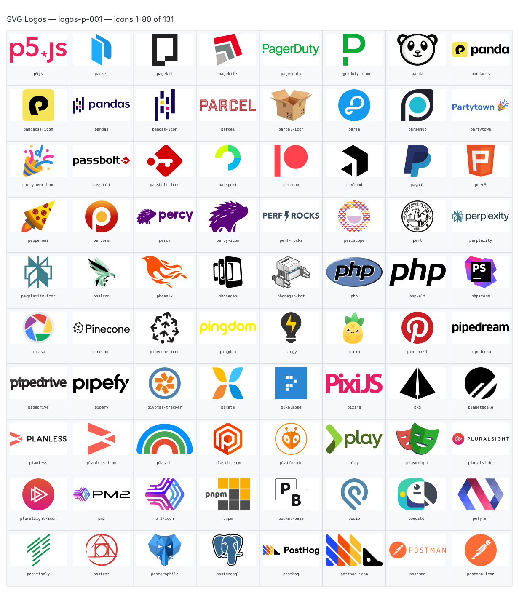
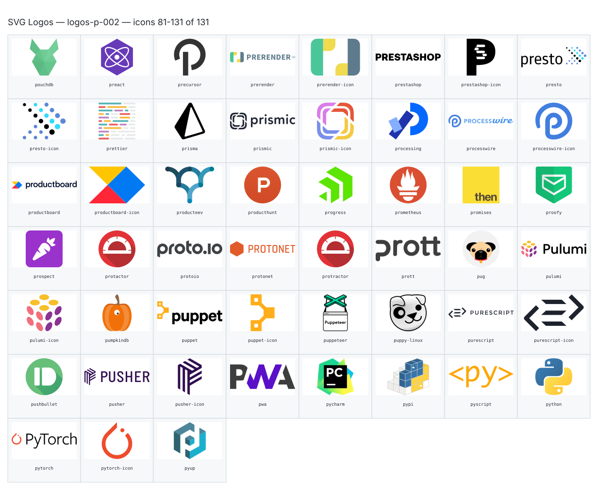

**Generated file — do not edit. Run `python scripts/portfolio.py icons generate`.**

# SVG Logos — `p`

[SVG Logos hub](../logos.md). 131 icons in group `p` across 2 sheets. Display names are approximate; copy the slug for Mermaid.

## logos-p-001

- `logos:p5js` — P5js — [logos-p-001.svg](../sheets/logos-p-001.svg) r0c0 — `service example(logos:p5js)[P5js]`
- `logos:packer` — Packer — [logos-p-001.svg](../sheets/logos-p-001.svg) r0c1 — `service example(logos:packer)[Packer]`
- `logos:pagekit` — Pagekit — [logos-p-001.svg](../sheets/logos-p-001.svg) r0c2 — `service example(logos:pagekit)[Pagekit]`
- `logos:pagekite` — Pagekite — [logos-p-001.svg](../sheets/logos-p-001.svg) r0c3 — `service example(logos:pagekite)[Pagekite]`
- `logos:pagerduty` — Pagerduty — [logos-p-001.svg](../sheets/logos-p-001.svg) r0c4 — `service example(logos:pagerduty)[Pagerduty]`
- `logos:pagerduty-icon` — Pagerduty Icon — [logos-p-001.svg](../sheets/logos-p-001.svg) r0c5 — `service example(logos:pagerduty-icon)[Pagerduty Icon]`
- `logos:panda` — Panda — [logos-p-001.svg](../sheets/logos-p-001.svg) r0c6 — `service example(logos:panda)[Panda]`
- `logos:pandacss` — Pandacss — [logos-p-001.svg](../sheets/logos-p-001.svg) r0c7 — `service example(logos:pandacss)[Pandacss]`
- `logos:pandacss-icon` — Pandacss Icon — [logos-p-001.svg](../sheets/logos-p-001.svg) r1c0 — `service example(logos:pandacss-icon)[Pandacss Icon]`
- `logos:pandas` — Pandas — [logos-p-001.svg](../sheets/logos-p-001.svg) r1c1 — `service example(logos:pandas)[Pandas]`
- `logos:pandas-icon` — Pandas Icon — [logos-p-001.svg](../sheets/logos-p-001.svg) r1c2 — `service example(logos:pandas-icon)[Pandas Icon]`
- `logos:parcel` — Parcel — [logos-p-001.svg](../sheets/logos-p-001.svg) r1c3 — `service example(logos:parcel)[Parcel]`
- `logos:parcel-icon` — Parcel Icon — [logos-p-001.svg](../sheets/logos-p-001.svg) r1c4 — `service example(logos:parcel-icon)[Parcel Icon]`
- `logos:parse` — Parse — [logos-p-001.svg](../sheets/logos-p-001.svg) r1c5 — `service example(logos:parse)[Parse]`
- `logos:parsehub` — Parsehub — [logos-p-001.svg](../sheets/logos-p-001.svg) r1c6 — `service example(logos:parsehub)[Parsehub]`
- `logos:partytown` — Partytown — [logos-p-001.svg](../sheets/logos-p-001.svg) r1c7 — `service example(logos:partytown)[Partytown]`
- `logos:partytown-icon` — Partytown Icon — [logos-p-001.svg](../sheets/logos-p-001.svg) r2c0 — `service example(logos:partytown-icon)[Partytown Icon]`
- `logos:passbolt` — Passbolt — [logos-p-001.svg](../sheets/logos-p-001.svg) r2c1 — `service example(logos:passbolt)[Passbolt]`
- `logos:passbolt-icon` — Passbolt Icon — [logos-p-001.svg](../sheets/logos-p-001.svg) r2c2 — `service example(logos:passbolt-icon)[Passbolt Icon]`
- `logos:passport` — Passport — [logos-p-001.svg](../sheets/logos-p-001.svg) r2c3 — `service example(logos:passport)[Passport]`
- `logos:patreon` — Patreon — [logos-p-001.svg](../sheets/logos-p-001.svg) r2c4 — `service example(logos:patreon)[Patreon]`
- `logos:payload` — Payload — [logos-p-001.svg](../sheets/logos-p-001.svg) r2c5 — `service example(logos:payload)[Payload]`
- `logos:paypal` — Paypal — [logos-p-001.svg](../sheets/logos-p-001.svg) r2c6 — `service example(logos:paypal)[Paypal]`
- `logos:peer5` — Peer5 — [logos-p-001.svg](../sheets/logos-p-001.svg) r2c7 — `service example(logos:peer5)[Peer5]`
- `logos:pepperoni` — Pepperoni — [logos-p-001.svg](../sheets/logos-p-001.svg) r3c0 — `service example(logos:pepperoni)[Pepperoni]`
- `logos:percona` — Percona — [logos-p-001.svg](../sheets/logos-p-001.svg) r3c1 — `service example(logos:percona)[Percona]`
- `logos:percy` — Percy — [logos-p-001.svg](../sheets/logos-p-001.svg) r3c2 — `service example(logos:percy)[Percy]`
- `logos:percy-icon` — Percy Icon — [logos-p-001.svg](../sheets/logos-p-001.svg) r3c3 — `service example(logos:percy-icon)[Percy Icon]`
- `logos:perf-rocks` — Perf Rocks — [logos-p-001.svg](../sheets/logos-p-001.svg) r3c4 — `service example(logos:perf-rocks)[Perf Rocks]`
- `logos:periscope` — Periscope — [logos-p-001.svg](../sheets/logos-p-001.svg) r3c5 — `service example(logos:periscope)[Periscope]`
- `logos:perl` — Perl — [logos-p-001.svg](../sheets/logos-p-001.svg) r3c6 — `service example(logos:perl)[Perl]`
- `logos:perplexity` — Perplexity — [logos-p-001.svg](../sheets/logos-p-001.svg) r3c7 — `service example(logos:perplexity)[Perplexity]`
- `logos:perplexity-icon` — Perplexity Icon — [logos-p-001.svg](../sheets/logos-p-001.svg) r4c0 — `service example(logos:perplexity-icon)[Perplexity Icon]`
- `logos:phalcon` — Phalcon — [logos-p-001.svg](../sheets/logos-p-001.svg) r4c1 — `service example(logos:phalcon)[Phalcon]`
- `logos:phoenix` — Phoenix — [logos-p-001.svg](../sheets/logos-p-001.svg) r4c2 — `service example(logos:phoenix)[Phoenix]`
- `logos:phonegap` — Phonegap — [logos-p-001.svg](../sheets/logos-p-001.svg) r4c3 — `service example(logos:phonegap)[Phonegap]`
- `logos:phonegap-bot` — Phonegap Bot — [logos-p-001.svg](../sheets/logos-p-001.svg) r4c4 — `service example(logos:phonegap-bot)[Phonegap Bot]`
- `logos:php` — Php — [logos-p-001.svg](../sheets/logos-p-001.svg) r4c5 — `service example(logos:php)[Php]`
- `logos:php-alt` — Php Alt — [logos-p-001.svg](../sheets/logos-p-001.svg) r4c6 — `service example(logos:php-alt)[Php Alt]`
- `logos:phpstorm` — Phpstorm — [logos-p-001.svg](../sheets/logos-p-001.svg) r4c7 — `service example(logos:phpstorm)[Phpstorm]`
- `logos:picasa` — Picasa — [logos-p-001.svg](../sheets/logos-p-001.svg) r5c0 — `service example(logos:picasa)[Picasa]`
- `logos:pinecone` — Pinecone — [logos-p-001.svg](../sheets/logos-p-001.svg) r5c1 — `service example(logos:pinecone)[Pinecone]`
- `logos:pinecone-icon` — Pinecone Icon — [logos-p-001.svg](../sheets/logos-p-001.svg) r5c2 — `service example(logos:pinecone-icon)[Pinecone Icon]`
- `logos:pingdom` — Pingdom — [logos-p-001.svg](../sheets/logos-p-001.svg) r5c3 — `service example(logos:pingdom)[Pingdom]`
- `logos:pingy` — Pingy — [logos-p-001.svg](../sheets/logos-p-001.svg) r5c4 — `service example(logos:pingy)[Pingy]`
- `logos:pinia` — Pinia — [logos-p-001.svg](../sheets/logos-p-001.svg) r5c5 — `service example(logos:pinia)[Pinia]`
- `logos:pinterest` — Pinterest — [logos-p-001.svg](../sheets/logos-p-001.svg) r5c6 — `service example(logos:pinterest)[Pinterest]`
- `logos:pipedream` — Pipedream — [logos-p-001.svg](../sheets/logos-p-001.svg) r5c7 — `service example(logos:pipedream)[Pipedream]`
- `logos:pipedrive` — Pipedrive — [logos-p-001.svg](../sheets/logos-p-001.svg) r6c0 — `service example(logos:pipedrive)[Pipedrive]`
- `logos:pipefy` — Pipefy — [logos-p-001.svg](../sheets/logos-p-001.svg) r6c1 — `service example(logos:pipefy)[Pipefy]`
- `logos:pivotal-tracker` — Pivotal Tracker — [logos-p-001.svg](../sheets/logos-p-001.svg) r6c2 — `service example(logos:pivotal-tracker)[Pivotal Tracker]`
- `logos:pixate` — Pixate — [logos-p-001.svg](../sheets/logos-p-001.svg) r6c3 — `service example(logos:pixate)[Pixate]`
- `logos:pixelapse` — Pixelapse — [logos-p-001.svg](../sheets/logos-p-001.svg) r6c4 — `service example(logos:pixelapse)[Pixelapse]`
- `logos:pixijs` — Pixijs — [logos-p-001.svg](../sheets/logos-p-001.svg) r6c5 — `service example(logos:pixijs)[Pixijs]`
- `logos:pkg` — Pkg — [logos-p-001.svg](../sheets/logos-p-001.svg) r6c6 — `service example(logos:pkg)[Pkg]`
- `logos:planetscale` — Planetscale — [logos-p-001.svg](../sheets/logos-p-001.svg) r6c7 — `service example(logos:planetscale)[Planetscale]`
- `logos:planless` — Planless — [logos-p-001.svg](../sheets/logos-p-001.svg) r7c0 — `service example(logos:planless)[Planless]`
- `logos:planless-icon` — Planless Icon — [logos-p-001.svg](../sheets/logos-p-001.svg) r7c1 — `service example(logos:planless-icon)[Planless Icon]`
- `logos:plasmic` — Plasmic — [logos-p-001.svg](../sheets/logos-p-001.svg) r7c2 — `service example(logos:plasmic)[Plasmic]`
- `logos:plastic-scm` — Plastic Scm — [logos-p-001.svg](../sheets/logos-p-001.svg) r7c3 — `service example(logos:plastic-scm)[Plastic Scm]`
- `logos:platformio` — Platformio — [logos-p-001.svg](../sheets/logos-p-001.svg) r7c4 — `service example(logos:platformio)[Platformio]`
- `logos:play` — Play — [logos-p-001.svg](../sheets/logos-p-001.svg) r7c5 — `service example(logos:play)[Play]`
- `logos:playwright` — Playwright — [logos-p-001.svg](../sheets/logos-p-001.svg) r7c6 — `service example(logos:playwright)[Playwright]`
- `logos:pluralsight` — Pluralsight — [logos-p-001.svg](../sheets/logos-p-001.svg) r7c7 — `service example(logos:pluralsight)[Pluralsight]`
- `logos:pluralsight-icon` — Pluralsight Icon — [logos-p-001.svg](../sheets/logos-p-001.svg) r8c0 — `service example(logos:pluralsight-icon)[Pluralsight Icon]`
- `logos:pm2` — Pm2 — [logos-p-001.svg](../sheets/logos-p-001.svg) r8c1 — `service example(logos:pm2)[Pm2]`
- `logos:pm2-icon` — Pm2 Icon — [logos-p-001.svg](../sheets/logos-p-001.svg) r8c2 — `service example(logos:pm2-icon)[Pm2 Icon]`
- `logos:pnpm` — Pnpm — [logos-p-001.svg](../sheets/logos-p-001.svg) r8c3 — `service example(logos:pnpm)[Pnpm]`
- `logos:pocket-base` — Pocket Base — [logos-p-001.svg](../sheets/logos-p-001.svg) r8c4 — `service example(logos:pocket-base)[Pocket Base]`
- `logos:podio` — Podio — [logos-p-001.svg](../sheets/logos-p-001.svg) r8c5 — `service example(logos:podio)[Podio]`
- `logos:poeditor` — Poeditor — [logos-p-001.svg](../sheets/logos-p-001.svg) r8c6 — `service example(logos:poeditor)[Poeditor]`
- `logos:polymer` — Polymer — [logos-p-001.svg](../sheets/logos-p-001.svg) r8c7 — `service example(logos:polymer)[Polymer]`
- `logos:positionly` — Positionly — [logos-p-001.svg](../sheets/logos-p-001.svg) r9c0 — `service example(logos:positionly)[Positionly]`
- `logos:postcss` — Postcss — [logos-p-001.svg](../sheets/logos-p-001.svg) r9c1 — `service example(logos:postcss)[Postcss]`
- `logos:postgraphile` — Postgraphile — [logos-p-001.svg](../sheets/logos-p-001.svg) r9c2 — `service example(logos:postgraphile)[Postgraphile]`
- `logos:postgresql` — Postgresql — [logos-p-001.svg](../sheets/logos-p-001.svg) r9c3 — `service example(logos:postgresql)[Postgresql]`
- `logos:posthog` — Posthog — [logos-p-001.svg](../sheets/logos-p-001.svg) r9c4 — `service example(logos:posthog)[Posthog]`
- `logos:posthog-icon` — Posthog Icon — [logos-p-001.svg](../sheets/logos-p-001.svg) r9c5 — `service example(logos:posthog-icon)[Posthog Icon]`
- `logos:postman` — Postman — [logos-p-001.svg](../sheets/logos-p-001.svg) r9c6 — `service example(logos:postman)[Postman]`
- `logos:postman-icon` — Postman Icon — [logos-p-001.svg](../sheets/logos-p-001.svg) r9c7 — `service example(logos:postman-icon)[Postman Icon]`

## logos-p-002

- `logos:pouchdb` — Pouchdb — [logos-p-002.svg](../sheets/logos-p-002.svg) r0c0 — `service example(logos:pouchdb)[Pouchdb]`
- `logos:preact` — Preact — [logos-p-002.svg](../sheets/logos-p-002.svg) r0c1 — `service example(logos:preact)[Preact]`
- `logos:precursor` — Precursor — [logos-p-002.svg](../sheets/logos-p-002.svg) r0c2 — `service example(logos:precursor)[Precursor]`
- `logos:prerender` — Prerender — [logos-p-002.svg](../sheets/logos-p-002.svg) r0c3 — `service example(logos:prerender)[Prerender]`
- `logos:prerender-icon` — Prerender Icon — [logos-p-002.svg](../sheets/logos-p-002.svg) r0c4 — `service example(logos:prerender-icon)[Prerender Icon]`
- `logos:prestashop` — Prestashop — [logos-p-002.svg](../sheets/logos-p-002.svg) r0c5 — `service example(logos:prestashop)[Prestashop]`
- `logos:prestashop-icon` — Prestashop Icon — [logos-p-002.svg](../sheets/logos-p-002.svg) r0c6 — `service example(logos:prestashop-icon)[Prestashop Icon]`
- `logos:presto` — Presto — [logos-p-002.svg](../sheets/logos-p-002.svg) r0c7 — `service example(logos:presto)[Presto]`
- `logos:presto-icon` — Presto Icon — [logos-p-002.svg](../sheets/logos-p-002.svg) r1c0 — `service example(logos:presto-icon)[Presto Icon]`
- `logos:prettier` — Prettier — [logos-p-002.svg](../sheets/logos-p-002.svg) r1c1 — `service example(logos:prettier)[Prettier]`
- `logos:prisma` — Prisma — [logos-p-002.svg](../sheets/logos-p-002.svg) r1c2 — `service example(logos:prisma)[Prisma]`
- `logos:prismic` — Prismic — [logos-p-002.svg](../sheets/logos-p-002.svg) r1c3 — `service example(logos:prismic)[Prismic]`
- `logos:prismic-icon` — Prismic Icon — [logos-p-002.svg](../sheets/logos-p-002.svg) r1c4 — `service example(logos:prismic-icon)[Prismic Icon]`
- `logos:processing` — Processing — [logos-p-002.svg](../sheets/logos-p-002.svg) r1c5 — `service example(logos:processing)[Processing]`
- `logos:processwire` — Processwire — [logos-p-002.svg](../sheets/logos-p-002.svg) r1c6 — `service example(logos:processwire)[Processwire]`
- `logos:processwire-icon` — Processwire Icon — [logos-p-002.svg](../sheets/logos-p-002.svg) r1c7 — `service example(logos:processwire-icon)[Processwire Icon]`
- `logos:productboard` — Productboard — [logos-p-002.svg](../sheets/logos-p-002.svg) r2c0 — `service example(logos:productboard)[Productboard]`
- `logos:productboard-icon` — Productboard Icon — [logos-p-002.svg](../sheets/logos-p-002.svg) r2c1 — `service example(logos:productboard-icon)[Productboard Icon]`
- `logos:producteev` — Producteev — [logos-p-002.svg](../sheets/logos-p-002.svg) r2c2 — `service example(logos:producteev)[Producteev]`
- `logos:producthunt` — Producthunt — [logos-p-002.svg](../sheets/logos-p-002.svg) r2c3 — `service example(logos:producthunt)[Producthunt]`
- `logos:progress` — Progress — [logos-p-002.svg](../sheets/logos-p-002.svg) r2c4 — `service example(logos:progress)[Progress]`
- `logos:prometheus` — Prometheus — [logos-p-002.svg](../sheets/logos-p-002.svg) r2c5 — `service example(logos:prometheus)[Prometheus]`
- `logos:promises` — Promises — [logos-p-002.svg](../sheets/logos-p-002.svg) r2c6 — `service example(logos:promises)[Promises]`
- `logos:proofy` — Proofy — [logos-p-002.svg](../sheets/logos-p-002.svg) r2c7 — `service example(logos:proofy)[Proofy]`
- `logos:prospect` — Prospect — [logos-p-002.svg](../sheets/logos-p-002.svg) r3c0 — `service example(logos:prospect)[Prospect]`
- `logos:protactor` — Protactor — [logos-p-002.svg](../sheets/logos-p-002.svg) r3c1 — `service example(logos:protactor)[Protactor]`
- `logos:protoio` — Protoio — [logos-p-002.svg](../sheets/logos-p-002.svg) r3c2 — `service example(logos:protoio)[Protoio]`
- `logos:protonet` — Protonet — [logos-p-002.svg](../sheets/logos-p-002.svg) r3c3 — `service example(logos:protonet)[Protonet]`
- `logos:protractor` — Protractor — [logos-p-002.svg](../sheets/logos-p-002.svg) r3c4 — `service example(logos:protractor)[Protractor]`
- `logos:prott` — Prott — [logos-p-002.svg](../sheets/logos-p-002.svg) r3c5 — `service example(logos:prott)[Prott]`
- `logos:pug` — Pug — [logos-p-002.svg](../sheets/logos-p-002.svg) r3c6 — `service example(logos:pug)[Pug]`
- `logos:pulumi` — Pulumi — [logos-p-002.svg](../sheets/logos-p-002.svg) r3c7 — `service example(logos:pulumi)[Pulumi]`
- `logos:pulumi-icon` — Pulumi Icon — [logos-p-002.svg](../sheets/logos-p-002.svg) r4c0 — `service example(logos:pulumi-icon)[Pulumi Icon]`
- `logos:pumpkindb` — Pumpkindb — [logos-p-002.svg](../sheets/logos-p-002.svg) r4c1 — `service example(logos:pumpkindb)[Pumpkindb]`
- `logos:puppet` — Puppet — [logos-p-002.svg](../sheets/logos-p-002.svg) r4c2 — `service example(logos:puppet)[Puppet]`
- `logos:puppet-icon` — Puppet Icon — [logos-p-002.svg](../sheets/logos-p-002.svg) r4c3 — `service example(logos:puppet-icon)[Puppet Icon]`
- `logos:puppeteer` — Puppeteer — [logos-p-002.svg](../sheets/logos-p-002.svg) r4c4 — `service example(logos:puppeteer)[Puppeteer]`
- `logos:puppy-linux` — Puppy Linux — [logos-p-002.svg](../sheets/logos-p-002.svg) r4c5 — `service example(logos:puppy-linux)[Puppy Linux]`
- `logos:purescript` — Purescript — [logos-p-002.svg](../sheets/logos-p-002.svg) r4c6 — `service example(logos:purescript)[Purescript]`
- `logos:purescript-icon` — Purescript Icon — [logos-p-002.svg](../sheets/logos-p-002.svg) r4c7 — `service example(logos:purescript-icon)[Purescript Icon]`
- `logos:pushbullet` — Pushbullet — [logos-p-002.svg](../sheets/logos-p-002.svg) r5c0 — `service example(logos:pushbullet)[Pushbullet]`
- `logos:pusher` — Pusher — [logos-p-002.svg](../sheets/logos-p-002.svg) r5c1 — `service example(logos:pusher)[Pusher]`
- `logos:pusher-icon` — Pusher Icon — [logos-p-002.svg](../sheets/logos-p-002.svg) r5c2 — `service example(logos:pusher-icon)[Pusher Icon]`
- `logos:pwa` — Pwa — [logos-p-002.svg](../sheets/logos-p-002.svg) r5c3 — `service example(logos:pwa)[Pwa]`
- `logos:pycharm` — Pycharm — [logos-p-002.svg](../sheets/logos-p-002.svg) r5c4 — `service example(logos:pycharm)[Pycharm]`
- `logos:pypi` — Pypi — [logos-p-002.svg](../sheets/logos-p-002.svg) r5c5 — `service example(logos:pypi)[Pypi]`
- `logos:pyscript` — Pyscript — [logos-p-002.svg](../sheets/logos-p-002.svg) r5c6 — `service example(logos:pyscript)[Pyscript]`
- `logos:python` — Python — [logos-p-002.svg](../sheets/logos-p-002.svg) r5c7 — `service example(logos:python)[Python]`
- `logos:pytorch` — Pytorch — [logos-p-002.svg](../sheets/logos-p-002.svg) r6c0 — `service example(logos:pytorch)[Pytorch]`
- `logos:pytorch-icon` — Pytorch Icon — [logos-p-002.svg](../sheets/logos-p-002.svg) r6c1 — `service example(logos:pytorch-icon)[Pytorch Icon]`
- `logos:pyup` — Pyup — [logos-p-002.svg](../sheets/logos-p-002.svg) r6c2 — `service example(logos:pyup)[Pyup]`
