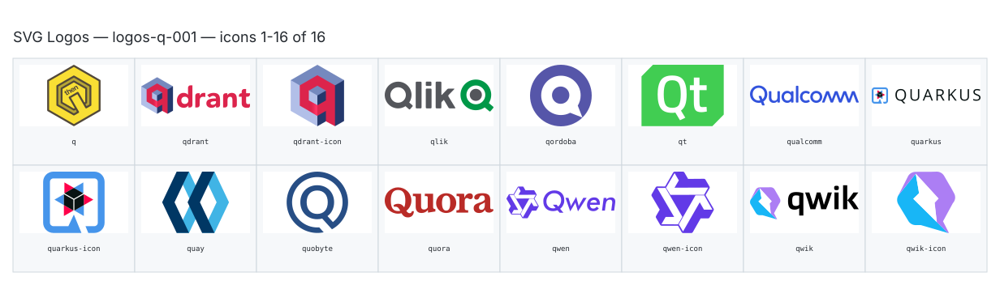

**Generated file — do not edit. Run `python scripts/portfolio.py icons generate`.**

# SVG Logos — `q`

[SVG Logos hub](../logos.md). 16 icons in group `q` across 1 sheet. Display names are approximate; copy the slug for Mermaid.

## logos-q-001

- `logos:q` — Q — [logos-q-001.svg](../sheets/logos-q-001.svg) r0c0 — `service example(logos:q)[Q]`
- `logos:qdrant` — Qdrant — [logos-q-001.svg](../sheets/logos-q-001.svg) r0c1 — `service example(logos:qdrant)[Qdrant]`
- `logos:qdrant-icon` — Qdrant Icon — [logos-q-001.svg](../sheets/logos-q-001.svg) r0c2 — `service example(logos:qdrant-icon)[Qdrant Icon]`
- `logos:qlik` — Qlik — [logos-q-001.svg](../sheets/logos-q-001.svg) r0c3 — `service example(logos:qlik)[Qlik]`
- `logos:qordoba` — Qordoba — [logos-q-001.svg](../sheets/logos-q-001.svg) r0c4 — `service example(logos:qordoba)[Qordoba]`
- `logos:qt` — Qt — [logos-q-001.svg](../sheets/logos-q-001.svg) r0c5 — `service example(logos:qt)[Qt]`
- `logos:qualcomm` — Qualcomm — [logos-q-001.svg](../sheets/logos-q-001.svg) r0c6 — `service example(logos:qualcomm)[Qualcomm]`
- `logos:quarkus` — Quarkus — [logos-q-001.svg](../sheets/logos-q-001.svg) r0c7 — `service example(logos:quarkus)[Quarkus]`
- `logos:quarkus-icon` — Quarkus Icon — [logos-q-001.svg](../sheets/logos-q-001.svg) r1c0 — `service example(logos:quarkus-icon)[Quarkus Icon]`
- `logos:quay` — Quay — [logos-q-001.svg](../sheets/logos-q-001.svg) r1c1 — `service example(logos:quay)[Quay]`
- `logos:quobyte` — Quobyte — [logos-q-001.svg](../sheets/logos-q-001.svg) r1c2 — `service example(logos:quobyte)[Quobyte]`
- `logos:quora` — Quora — [logos-q-001.svg](../sheets/logos-q-001.svg) r1c3 — `service example(logos:quora)[Quora]`
- `logos:qwen` — Qwen — [logos-q-001.svg](../sheets/logos-q-001.svg) r1c4 — `service example(logos:qwen)[Qwen]`
- `logos:qwen-icon` — Qwen Icon — [logos-q-001.svg](../sheets/logos-q-001.svg) r1c5 — `service example(logos:qwen-icon)[Qwen Icon]`
- `logos:qwik` — Qwik — [logos-q-001.svg](../sheets/logos-q-001.svg) r1c6 — `service example(logos:qwik)[Qwik]`
- `logos:qwik-icon` — Qwik Icon — [logos-q-001.svg](../sheets/logos-q-001.svg) r1c7 — `service example(logos:qwik-icon)[Qwik Icon]`
