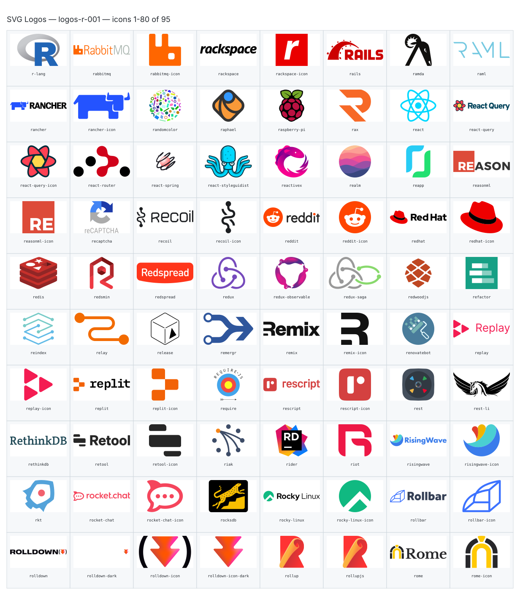
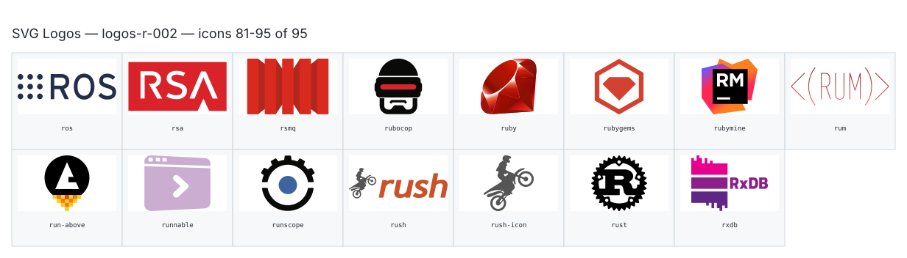

**Generated file — do not edit. Run `python scripts/portfolio.py icons generate`.**

# SVG Logos — `r`

[SVG Logos hub](../logos.md). 95 icons in group `r` across 2 sheets. Display names are approximate; copy the slug for Mermaid.

## logos-r-001

- `logos:r-lang` — R Lang — [logos-r-001.svg](../sheets/logos-r-001.svg) r0c0 — `service example(logos:r-lang)[R Lang]`
- `logos:rabbitmq` — Rabbitmq — [logos-r-001.svg](../sheets/logos-r-001.svg) r0c1 — `service example(logos:rabbitmq)[Rabbitmq]`
- `logos:rabbitmq-icon` — Rabbitmq Icon — [logos-r-001.svg](../sheets/logos-r-001.svg) r0c2 — `service example(logos:rabbitmq-icon)[Rabbitmq Icon]`
- `logos:rackspace` — Rackspace — [logos-r-001.svg](../sheets/logos-r-001.svg) r0c3 — `service example(logos:rackspace)[Rackspace]`
- `logos:rackspace-icon` — Rackspace Icon — [logos-r-001.svg](../sheets/logos-r-001.svg) r0c4 — `service example(logos:rackspace-icon)[Rackspace Icon]`
- `logos:rails` — Rails — [logos-r-001.svg](../sheets/logos-r-001.svg) r0c5 — `service example(logos:rails)[Rails]`
- `logos:ramda` — Ramda — [logos-r-001.svg](../sheets/logos-r-001.svg) r0c6 — `service example(logos:ramda)[Ramda]`
- `logos:raml` — Raml — [logos-r-001.svg](../sheets/logos-r-001.svg) r0c7 — `service example(logos:raml)[Raml]`
- `logos:rancher` — Rancher — [logos-r-001.svg](../sheets/logos-r-001.svg) r1c0 — `service example(logos:rancher)[Rancher]`
- `logos:rancher-icon` — Rancher Icon — [logos-r-001.svg](../sheets/logos-r-001.svg) r1c1 — `service example(logos:rancher-icon)[Rancher Icon]`
- `logos:randomcolor` — Randomcolor — [logos-r-001.svg](../sheets/logos-r-001.svg) r1c2 — `service example(logos:randomcolor)[Randomcolor]`
- `logos:raphael` — Raphael — [logos-r-001.svg](../sheets/logos-r-001.svg) r1c3 — `service example(logos:raphael)[Raphael]`
- `logos:raspberry-pi` — Raspberry Pi — [logos-r-001.svg](../sheets/logos-r-001.svg) r1c4 — `service example(logos:raspberry-pi)[Raspberry Pi]`
- `logos:rax` — Rax — [logos-r-001.svg](../sheets/logos-r-001.svg) r1c5 — `service example(logos:rax)[Rax]`
- `logos:react` — React — [logos-r-001.svg](../sheets/logos-r-001.svg) r1c6 — `service example(logos:react)[React]`
- `logos:react-query` — React Query — [logos-r-001.svg](../sheets/logos-r-001.svg) r1c7 — `service example(logos:react-query)[React Query]`
- `logos:react-query-icon` — React Query Icon — [logos-r-001.svg](../sheets/logos-r-001.svg) r2c0 — `service example(logos:react-query-icon)[React Query Icon]`
- `logos:react-router` — React Router — [logos-r-001.svg](../sheets/logos-r-001.svg) r2c1 — `service example(logos:react-router)[React Router]`
- `logos:react-spring` — React Spring — [logos-r-001.svg](../sheets/logos-r-001.svg) r2c2 — `service example(logos:react-spring)[React Spring]`
- `logos:react-styleguidist` — React Styleguidist — [logos-r-001.svg](../sheets/logos-r-001.svg) r2c3 — `service example(logos:react-styleguidist)[React Styleguidist]`
- `logos:reactivex` — Reactivex — [logos-r-001.svg](../sheets/logos-r-001.svg) r2c4 — `service example(logos:reactivex)[Reactivex]`
- `logos:realm` — Realm — [logos-r-001.svg](../sheets/logos-r-001.svg) r2c5 — `service example(logos:realm)[Realm]`
- `logos:reapp` — Reapp — [logos-r-001.svg](../sheets/logos-r-001.svg) r2c6 — `service example(logos:reapp)[Reapp]`
- `logos:reasonml` — Reasonml — [logos-r-001.svg](../sheets/logos-r-001.svg) r2c7 — `service example(logos:reasonml)[Reasonml]`
- `logos:reasonml-icon` — Reasonml Icon — [logos-r-001.svg](../sheets/logos-r-001.svg) r3c0 — `service example(logos:reasonml-icon)[Reasonml Icon]`
- `logos:recaptcha` — Recaptcha — [logos-r-001.svg](../sheets/logos-r-001.svg) r3c1 — `service example(logos:recaptcha)[Recaptcha]`
- `logos:recoil` — Recoil — [logos-r-001.svg](../sheets/logos-r-001.svg) r3c2 — `service example(logos:recoil)[Recoil]`
- `logos:recoil-icon` — Recoil Icon — [logos-r-001.svg](../sheets/logos-r-001.svg) r3c3 — `service example(logos:recoil-icon)[Recoil Icon]`
- `logos:reddit` — Reddit — [logos-r-001.svg](../sheets/logos-r-001.svg) r3c4 — `service example(logos:reddit)[Reddit]`
- `logos:reddit-icon` — Reddit Icon — [logos-r-001.svg](../sheets/logos-r-001.svg) r3c5 — `service example(logos:reddit-icon)[Reddit Icon]`
- `logos:redhat` — Redhat — [logos-r-001.svg](../sheets/logos-r-001.svg) r3c6 — `service example(logos:redhat)[Redhat]`
- `logos:redhat-icon` — Redhat Icon — [logos-r-001.svg](../sheets/logos-r-001.svg) r3c7 — `service example(logos:redhat-icon)[Redhat Icon]`
- `logos:redis` — Redis — [logos-r-001.svg](../sheets/logos-r-001.svg) r4c0 — `service example(logos:redis)[Redis]`
- `logos:redsmin` — Redsmin — [logos-r-001.svg](../sheets/logos-r-001.svg) r4c1 — `service example(logos:redsmin)[Redsmin]`
- `logos:redspread` — Redspread — [logos-r-001.svg](../sheets/logos-r-001.svg) r4c2 — `service example(logos:redspread)[Redspread]`
- `logos:redux` — Redux — [logos-r-001.svg](../sheets/logos-r-001.svg) r4c3 — `service example(logos:redux)[Redux]`
- `logos:redux-observable` — Redux Observable — [logos-r-001.svg](../sheets/logos-r-001.svg) r4c4 — `service example(logos:redux-observable)[Redux Observable]`
- `logos:redux-saga` — Redux Saga — [logos-r-001.svg](../sheets/logos-r-001.svg) r4c5 — `service example(logos:redux-saga)[Redux Saga]`
- `logos:redwoodjs` — Redwoodjs — [logos-r-001.svg](../sheets/logos-r-001.svg) r4c6 — `service example(logos:redwoodjs)[Redwoodjs]`
- `logos:refactor` — Refactor — [logos-r-001.svg](../sheets/logos-r-001.svg) r4c7 — `service example(logos:refactor)[Refactor]`
- `logos:reindex` — Reindex — [logos-r-001.svg](../sheets/logos-r-001.svg) r5c0 — `service example(logos:reindex)[Reindex]`
- `logos:relay` — Relay — [logos-r-001.svg](../sheets/logos-r-001.svg) r5c1 — `service example(logos:relay)[Relay]`
- `logos:release` — Release — [logos-r-001.svg](../sheets/logos-r-001.svg) r5c2 — `service example(logos:release)[Release]`
- `logos:remergr` — Remergr — [logos-r-001.svg](../sheets/logos-r-001.svg) r5c3 — `service example(logos:remergr)[Remergr]`
- `logos:remix` — Remix — [logos-r-001.svg](../sheets/logos-r-001.svg) r5c4 — `service example(logos:remix)[Remix]`
- `logos:remix-icon` — Remix Icon — [logos-r-001.svg](../sheets/logos-r-001.svg) r5c5 — `service example(logos:remix-icon)[Remix Icon]`
- `logos:renovatebot` — Renovatebot — [logos-r-001.svg](../sheets/logos-r-001.svg) r5c6 — `service example(logos:renovatebot)[Renovatebot]`
- `logos:replay` — Replay — [logos-r-001.svg](../sheets/logos-r-001.svg) r5c7 — `service example(logos:replay)[Replay]`
- `logos:replay-icon` — Replay Icon — [logos-r-001.svg](../sheets/logos-r-001.svg) r6c0 — `service example(logos:replay-icon)[Replay Icon]`
- `logos:replit` — Replit — [logos-r-001.svg](../sheets/logos-r-001.svg) r6c1 — `service example(logos:replit)[Replit]`
- `logos:replit-icon` — Replit Icon — [logos-r-001.svg](../sheets/logos-r-001.svg) r6c2 — `service example(logos:replit-icon)[Replit Icon]`
- `logos:require` — Require — [logos-r-001.svg](../sheets/logos-r-001.svg) r6c3 — `service example(logos:require)[Require]`
- `logos:rescript` — Rescript — [logos-r-001.svg](../sheets/logos-r-001.svg) r6c4 — `service example(logos:rescript)[Rescript]`
- `logos:rescript-icon` — Rescript Icon — [logos-r-001.svg](../sheets/logos-r-001.svg) r6c5 — `service example(logos:rescript-icon)[Rescript Icon]`
- `logos:rest` — Rest — [logos-r-001.svg](../sheets/logos-r-001.svg) r6c6 — `service example(logos:rest)[Rest]`
- `logos:rest-li` — Rest Li — [logos-r-001.svg](../sheets/logos-r-001.svg) r6c7 — `service example(logos:rest-li)[Rest Li]`
- `logos:rethinkdb` — Rethinkdb — [logos-r-001.svg](../sheets/logos-r-001.svg) r7c0 — `service example(logos:rethinkdb)[Rethinkdb]`
- `logos:retool` — Retool — [logos-r-001.svg](../sheets/logos-r-001.svg) r7c1 — `service example(logos:retool)[Retool]`
- `logos:retool-icon` — Retool Icon — [logos-r-001.svg](../sheets/logos-r-001.svg) r7c2 — `service example(logos:retool-icon)[Retool Icon]`
- `logos:riak` — Riak — [logos-r-001.svg](../sheets/logos-r-001.svg) r7c3 — `service example(logos:riak)[Riak]`
- `logos:rider` — Rider — [logos-r-001.svg](../sheets/logos-r-001.svg) r7c4 — `service example(logos:rider)[Rider]`
- `logos:riot` — Riot — [logos-r-001.svg](../sheets/logos-r-001.svg) r7c5 — `service example(logos:riot)[Riot]`
- `logos:risingwave` — Risingwave — [logos-r-001.svg](../sheets/logos-r-001.svg) r7c6 — `service example(logos:risingwave)[Risingwave]`
- `logos:risingwave-icon` — Risingwave Icon — [logos-r-001.svg](../sheets/logos-r-001.svg) r7c7 — `service example(logos:risingwave-icon)[Risingwave Icon]`
- `logos:rkt` — Rkt — [logos-r-001.svg](../sheets/logos-r-001.svg) r8c0 — `service example(logos:rkt)[Rkt]`
- `logos:rocket-chat` — Rocket Chat — [logos-r-001.svg](../sheets/logos-r-001.svg) r8c1 — `service example(logos:rocket-chat)[Rocket Chat]`
- `logos:rocket-chat-icon` — Rocket Chat Icon — [logos-r-001.svg](../sheets/logos-r-001.svg) r8c2 — `service example(logos:rocket-chat-icon)[Rocket Chat Icon]`
- `logos:rocksdb` — Rocksdb — [logos-r-001.svg](../sheets/logos-r-001.svg) r8c3 — `service example(logos:rocksdb)[Rocksdb]`
- `logos:rocky-linux` — Rocky Linux — [logos-r-001.svg](../sheets/logos-r-001.svg) r8c4 — `service example(logos:rocky-linux)[Rocky Linux]`
- `logos:rocky-linux-icon` — Rocky Linux Icon — [logos-r-001.svg](../sheets/logos-r-001.svg) r8c5 — `service example(logos:rocky-linux-icon)[Rocky Linux Icon]`
- `logos:rollbar` — Rollbar — [logos-r-001.svg](../sheets/logos-r-001.svg) r8c6 — `service example(logos:rollbar)[Rollbar]`
- `logos:rollbar-icon` — Rollbar Icon — [logos-r-001.svg](../sheets/logos-r-001.svg) r8c7 — `service example(logos:rollbar-icon)[Rollbar Icon]`
- `logos:rolldown` — Rolldown — [logos-r-001.svg](../sheets/logos-r-001.svg) r9c0 — `service example(logos:rolldown)[Rolldown]`
- `logos:rolldown-dark` — Rolldown Dark — [logos-r-001.svg](../sheets/logos-r-001.svg) r9c1 — `service example(logos:rolldown-dark)[Rolldown Dark]`
- `logos:rolldown-icon` — Rolldown Icon — [logos-r-001.svg](../sheets/logos-r-001.svg) r9c2 — `service example(logos:rolldown-icon)[Rolldown Icon]`
- `logos:rolldown-icon-dark` — Rolldown Icon Dark — [logos-r-001.svg](../sheets/logos-r-001.svg) r9c3 — `service example(logos:rolldown-icon-dark)[Rolldown Icon Dark]`
- `logos:rollup` — Rollup — [logos-r-001.svg](../sheets/logos-r-001.svg) r9c4 — `service example(logos:rollup)[Rollup]`
- `logos:rollupjs` — Rollupjs — [logos-r-001.svg](../sheets/logos-r-001.svg) r9c5 — `service example(logos:rollupjs)[Rollupjs]`
- `logos:rome` — Rome — [logos-r-001.svg](../sheets/logos-r-001.svg) r9c6 — `service example(logos:rome)[Rome]`
- `logos:rome-icon` — Rome Icon — [logos-r-001.svg](../sheets/logos-r-001.svg) r9c7 — `service example(logos:rome-icon)[Rome Icon]`

## logos-r-002

- `logos:ros` — Ros — [logos-r-002.svg](../sheets/logos-r-002.svg) r0c0 — `service example(logos:ros)[Ros]`
- `logos:rsa` — Rsa — [logos-r-002.svg](../sheets/logos-r-002.svg) r0c1 — `service example(logos:rsa)[Rsa]`
- `logos:rsmq` — Rsmq — [logos-r-002.svg](../sheets/logos-r-002.svg) r0c2 — `service example(logos:rsmq)[Rsmq]`
- `logos:rubocop` — Rubocop — [logos-r-002.svg](../sheets/logos-r-002.svg) r0c3 — `service example(logos:rubocop)[Rubocop]`
- `logos:ruby` — Ruby — [logos-r-002.svg](../sheets/logos-r-002.svg) r0c4 — `service example(logos:ruby)[Ruby]`
- `logos:rubygems` — Rubygems — [logos-r-002.svg](../sheets/logos-r-002.svg) r0c5 — `service example(logos:rubygems)[Rubygems]`
- `logos:rubymine` — Rubymine — [logos-r-002.svg](../sheets/logos-r-002.svg) r0c6 — `service example(logos:rubymine)[Rubymine]`
- `logos:rum` — Rum — [logos-r-002.svg](../sheets/logos-r-002.svg) r0c7 — `service example(logos:rum)[Rum]`
- `logos:run-above` — Run Above — [logos-r-002.svg](../sheets/logos-r-002.svg) r1c0 — `service example(logos:run-above)[Run Above]`
- `logos:runnable` — Runnable — [logos-r-002.svg](../sheets/logos-r-002.svg) r1c1 — `service example(logos:runnable)[Runnable]`
- `logos:runscope` — Runscope — [logos-r-002.svg](../sheets/logos-r-002.svg) r1c2 — `service example(logos:runscope)[Runscope]`
- `logos:rush` — Rush — [logos-r-002.svg](../sheets/logos-r-002.svg) r1c3 — `service example(logos:rush)[Rush]`
- `logos:rush-icon` — Rush Icon — [logos-r-002.svg](../sheets/logos-r-002.svg) r1c4 — `service example(logos:rush-icon)[Rush Icon]`
- `logos:rust` — Rust — [logos-r-002.svg](../sheets/logos-r-002.svg) r1c5 — `service example(logos:rust)[Rust]`
- `logos:rxdb` — Rxdb — [logos-r-002.svg](../sheets/logos-r-002.svg) r1c6 — `service example(logos:rxdb)[Rxdb]`
