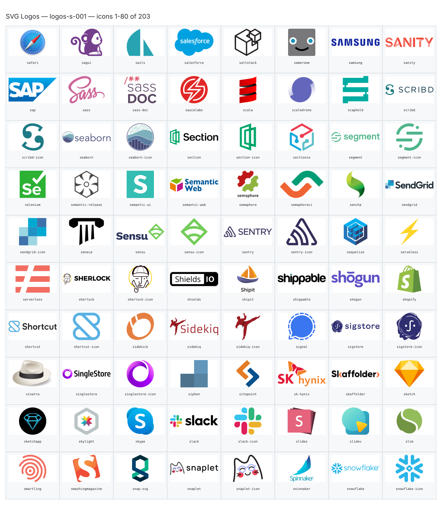
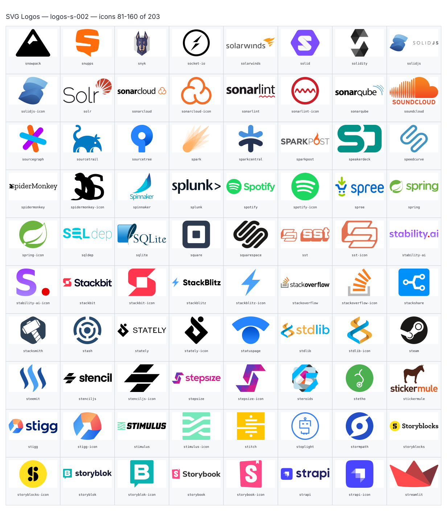
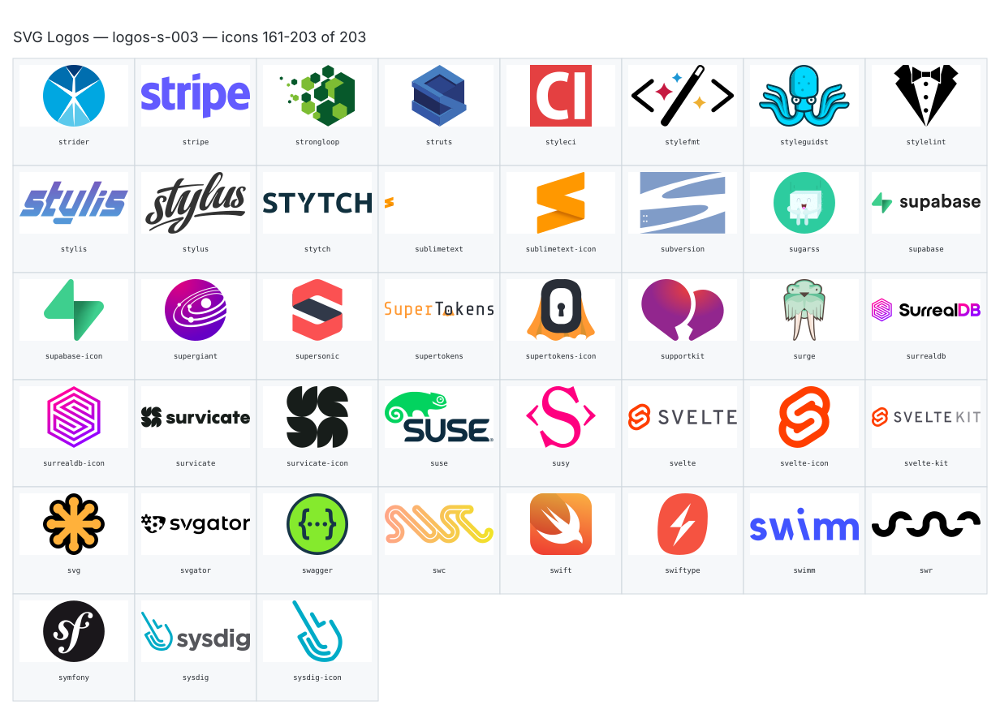

**Generated file — do not edit. Run `python scripts/portfolio.py icons generate`.**

# SVG Logos — `s`

[SVG Logos hub](../logos.md). 203 icons in group `s` across 3 sheets. Display names are approximate; copy the slug for Mermaid.

## logos-s-001

- `logos:safari` — Safari — [logos-s-001.svg](../sheets/logos-s-001.svg) r0c0 — `service example(logos:safari)[Safari]`
- `logos:sagui` — Sagui — [logos-s-001.svg](../sheets/logos-s-001.svg) r0c1 — `service example(logos:sagui)[Sagui]`
- `logos:sails` — Sails — [logos-s-001.svg](../sheets/logos-s-001.svg) r0c2 — `service example(logos:sails)[Sails]`
- `logos:salesforce` — Salesforce — [logos-s-001.svg](../sheets/logos-s-001.svg) r0c3 — `service example(logos:salesforce)[Salesforce]`
- `logos:saltstack` — Saltstack — [logos-s-001.svg](../sheets/logos-s-001.svg) r0c4 — `service example(logos:saltstack)[Saltstack]`
- `logos:sameroom` — Sameroom — [logos-s-001.svg](../sheets/logos-s-001.svg) r0c5 — `service example(logos:sameroom)[Sameroom]`
- `logos:samsung` — Samsung — [logos-s-001.svg](../sheets/logos-s-001.svg) r0c6 — `service example(logos:samsung)[Samsung]`
- `logos:sanity` — Sanity — [logos-s-001.svg](../sheets/logos-s-001.svg) r0c7 — `service example(logos:sanity)[Sanity]`
- `logos:sap` — Sap — [logos-s-001.svg](../sheets/logos-s-001.svg) r1c0 — `service example(logos:sap)[Sap]`
- `logos:sass` — Sass — [logos-s-001.svg](../sheets/logos-s-001.svg) r1c1 — `service example(logos:sass)[Sass]`
- `logos:sass-doc` — Sass Doc — [logos-s-001.svg](../sheets/logos-s-001.svg) r1c2 — `service example(logos:sass-doc)[Sass Doc]`
- `logos:saucelabs` — Saucelabs — [logos-s-001.svg](../sheets/logos-s-001.svg) r1c3 — `service example(logos:saucelabs)[Saucelabs]`
- `logos:scala` — Scala — [logos-s-001.svg](../sheets/logos-s-001.svg) r1c4 — `service example(logos:scala)[Scala]`
- `logos:scaledrone` — Scaledrone — [logos-s-001.svg](../sheets/logos-s-001.svg) r1c5 — `service example(logos:scaledrone)[Scaledrone]`
- `logos:scaphold` — Scaphold — [logos-s-001.svg](../sheets/logos-s-001.svg) r1c6 — `service example(logos:scaphold)[Scaphold]`
- `logos:scribd` — Scribd — [logos-s-001.svg](../sheets/logos-s-001.svg) r1c7 — `service example(logos:scribd)[Scribd]`
- `logos:scribd-icon` — Scribd Icon — [logos-s-001.svg](../sheets/logos-s-001.svg) r2c0 — `service example(logos:scribd-icon)[Scribd Icon]`
- `logos:seaborn` — Seaborn — [logos-s-001.svg](../sheets/logos-s-001.svg) r2c1 — `service example(logos:seaborn)[Seaborn]`
- `logos:seaborn-icon` — Seaborn Icon — [logos-s-001.svg](../sheets/logos-s-001.svg) r2c2 — `service example(logos:seaborn-icon)[Seaborn Icon]`
- `logos:section` — Section — [logos-s-001.svg](../sheets/logos-s-001.svg) r2c3 — `service example(logos:section)[Section]`
- `logos:section-icon` — Section Icon — [logos-s-001.svg](../sheets/logos-s-001.svg) r2c4 — `service example(logos:section-icon)[Section Icon]`
- `logos:sectionio` — Sectionio — [logos-s-001.svg](../sheets/logos-s-001.svg) r2c5 — `service example(logos:sectionio)[Sectionio]`
- `logos:segment` — Segment — [logos-s-001.svg](../sheets/logos-s-001.svg) r2c6 — `service example(logos:segment)[Segment]`
- `logos:segment-icon` — Segment Icon — [logos-s-001.svg](../sheets/logos-s-001.svg) r2c7 — `service example(logos:segment-icon)[Segment Icon]`
- `logos:selenium` — Selenium — [logos-s-001.svg](../sheets/logos-s-001.svg) r3c0 — `service example(logos:selenium)[Selenium]`
- `logos:semantic-release` — Semantic Release — [logos-s-001.svg](../sheets/logos-s-001.svg) r3c1 — `service example(logos:semantic-release)[Semantic Release]`
- `logos:semantic-ui` — Semantic Ui — [logos-s-001.svg](../sheets/logos-s-001.svg) r3c2 — `service example(logos:semantic-ui)[Semantic Ui]`
- `logos:semantic-web` — Semantic Web — [logos-s-001.svg](../sheets/logos-s-001.svg) r3c3 — `service example(logos:semantic-web)[Semantic Web]`
- `logos:semaphore` — Semaphore — [logos-s-001.svg](../sheets/logos-s-001.svg) r3c4 — `service example(logos:semaphore)[Semaphore]`
- `logos:semaphoreci` — Semaphoreci — [logos-s-001.svg](../sheets/logos-s-001.svg) r3c5 — `service example(logos:semaphoreci)[Semaphoreci]`
- `logos:sencha` — Sencha — [logos-s-001.svg](../sheets/logos-s-001.svg) r3c6 — `service example(logos:sencha)[Sencha]`
- `logos:sendgrid` — Sendgrid — [logos-s-001.svg](../sheets/logos-s-001.svg) r3c7 — `service example(logos:sendgrid)[Sendgrid]`
- `logos:sendgrid-icon` — Sendgrid Icon — [logos-s-001.svg](../sheets/logos-s-001.svg) r4c0 — `service example(logos:sendgrid-icon)[Sendgrid Icon]`
- `logos:seneca` — Seneca — [logos-s-001.svg](../sheets/logos-s-001.svg) r4c1 — `service example(logos:seneca)[Seneca]`
- `logos:sensu` — Sensu — [logos-s-001.svg](../sheets/logos-s-001.svg) r4c2 — `service example(logos:sensu)[Sensu]`
- `logos:sensu-icon` — Sensu Icon — [logos-s-001.svg](../sheets/logos-s-001.svg) r4c3 — `service example(logos:sensu-icon)[Sensu Icon]`
- `logos:sentry` — Sentry — [logos-s-001.svg](../sheets/logos-s-001.svg) r4c4 — `service example(logos:sentry)[Sentry]`
- `logos:sentry-icon` — Sentry Icon — [logos-s-001.svg](../sheets/logos-s-001.svg) r4c5 — `service example(logos:sentry-icon)[Sentry Icon]`
- `logos:sequelize` — Sequelize — [logos-s-001.svg](../sheets/logos-s-001.svg) r4c6 — `service example(logos:sequelize)[Sequelize]`
- `logos:serveless` — Serveless — [logos-s-001.svg](../sheets/logos-s-001.svg) r4c7 — `service example(logos:serveless)[Serveless]`
- `logos:serverless` — Serverless — [logos-s-001.svg](../sheets/logos-s-001.svg) r5c0 — `service example(logos:serverless)[Serverless]`
- `logos:sherlock` — Sherlock — [logos-s-001.svg](../sheets/logos-s-001.svg) r5c1 — `service example(logos:sherlock)[Sherlock]`
- `logos:sherlock-icon` — Sherlock Icon — [logos-s-001.svg](../sheets/logos-s-001.svg) r5c2 — `service example(logos:sherlock-icon)[Sherlock Icon]`
- `logos:shields` — Shields — [logos-s-001.svg](../sheets/logos-s-001.svg) r5c3 — `service example(logos:shields)[Shields]`
- `logos:shipit` — Shipit — [logos-s-001.svg](../sheets/logos-s-001.svg) r5c4 — `service example(logos:shipit)[Shipit]`
- `logos:shippable` — Shippable — [logos-s-001.svg](../sheets/logos-s-001.svg) r5c5 — `service example(logos:shippable)[Shippable]`
- `logos:shogun` — Shogun — [logos-s-001.svg](../sheets/logos-s-001.svg) r5c6 — `service example(logos:shogun)[Shogun]`
- `logos:shopify` — Shopify — [logos-s-001.svg](../sheets/logos-s-001.svg) r5c7 — `service example(logos:shopify)[Shopify]`
- `logos:shortcut` — Shortcut — [logos-s-001.svg](../sheets/logos-s-001.svg) r6c0 — `service example(logos:shortcut)[Shortcut]`
- `logos:shortcut-icon` — Shortcut Icon — [logos-s-001.svg](../sheets/logos-s-001.svg) r6c1 — `service example(logos:shortcut-icon)[Shortcut Icon]`
- `logos:sidekick` — Sidekick — [logos-s-001.svg](../sheets/logos-s-001.svg) r6c2 — `service example(logos:sidekick)[Sidekick]`
- `logos:sidekiq` — Sidekiq — [logos-s-001.svg](../sheets/logos-s-001.svg) r6c3 — `service example(logos:sidekiq)[Sidekiq]`
- `logos:sidekiq-icon` — Sidekiq Icon — [logos-s-001.svg](../sheets/logos-s-001.svg) r6c4 — `service example(logos:sidekiq-icon)[Sidekiq Icon]`
- `logos:signal` — Signal — [logos-s-001.svg](../sheets/logos-s-001.svg) r6c5 — `service example(logos:signal)[Signal]`
- `logos:sigstore` — Sigstore — [logos-s-001.svg](../sheets/logos-s-001.svg) r6c6 — `service example(logos:sigstore)[Sigstore]`
- `logos:sigstore-icon` — Sigstore Icon — [logos-s-001.svg](../sheets/logos-s-001.svg) r6c7 — `service example(logos:sigstore-icon)[Sigstore Icon]`
- `logos:sinatra` — Sinatra — [logos-s-001.svg](../sheets/logos-s-001.svg) r7c0 — `service example(logos:sinatra)[Sinatra]`
- `logos:singlestore` — Singlestore — [logos-s-001.svg](../sheets/logos-s-001.svg) r7c1 — `service example(logos:singlestore)[Singlestore]`
- `logos:singlestore-icon` — Singlestore Icon — [logos-s-001.svg](../sheets/logos-s-001.svg) r7c2 — `service example(logos:singlestore-icon)[Singlestore Icon]`
- `logos:siphon` — Siphon — [logos-s-001.svg](../sheets/logos-s-001.svg) r7c3 — `service example(logos:siphon)[Siphon]`
- `logos:sitepoint` — Sitepoint — [logos-s-001.svg](../sheets/logos-s-001.svg) r7c4 — `service example(logos:sitepoint)[Sitepoint]`
- `logos:sk-hynix` — Sk Hynix — [logos-s-001.svg](../sheets/logos-s-001.svg) r7c5 — `service example(logos:sk-hynix)[Sk Hynix]`
- `logos:skaffolder` — Skaffolder — [logos-s-001.svg](../sheets/logos-s-001.svg) r7c6 — `service example(logos:skaffolder)[Skaffolder]`
- `logos:sketch` — Sketch — [logos-s-001.svg](../sheets/logos-s-001.svg) r7c7 — `service example(logos:sketch)[Sketch]`
- `logos:sketchapp` — Sketchapp — [logos-s-001.svg](../sheets/logos-s-001.svg) r8c0 — `service example(logos:sketchapp)[Sketchapp]`
- `logos:skylight` — Skylight — [logos-s-001.svg](../sheets/logos-s-001.svg) r8c1 — `service example(logos:skylight)[Skylight]`
- `logos:skype` — Skype — [logos-s-001.svg](../sheets/logos-s-001.svg) r8c2 — `service example(logos:skype)[Skype]`
- `logos:slack` — Slack — [logos-s-001.svg](../sheets/logos-s-001.svg) r8c3 — `service example(logos:slack)[Slack]`
- `logos:slack-icon` — Slack Icon — [logos-s-001.svg](../sheets/logos-s-001.svg) r8c4 — `service example(logos:slack-icon)[Slack Icon]`
- `logos:slides` — Slides — [logos-s-001.svg](../sheets/logos-s-001.svg) r8c5 — `service example(logos:slides)[Slides]`
- `logos:slidev` — Slidev — [logos-s-001.svg](../sheets/logos-s-001.svg) r8c6 — `service example(logos:slidev)[Slidev]`
- `logos:slim` — Slim — [logos-s-001.svg](../sheets/logos-s-001.svg) r8c7 — `service example(logos:slim)[Slim]`
- `logos:smartling` — Smartling — [logos-s-001.svg](../sheets/logos-s-001.svg) r9c0 — `service example(logos:smartling)[Smartling]`
- `logos:smashingmagazine` — Smashingmagazine — [logos-s-001.svg](../sheets/logos-s-001.svg) r9c1 — `service example(logos:smashingmagazine)[Smashingmagazine]`
- `logos:snap-svg` — Snap Svg — [logos-s-001.svg](../sheets/logos-s-001.svg) r9c2 — `service example(logos:snap-svg)[Snap Svg]`
- `logos:snaplet` — Snaplet — [logos-s-001.svg](../sheets/logos-s-001.svg) r9c3 — `service example(logos:snaplet)[Snaplet]`
- `logos:snaplet-icon` — Snaplet Icon — [logos-s-001.svg](../sheets/logos-s-001.svg) r9c4 — `service example(logos:snaplet-icon)[Snaplet Icon]`
- `logos:sninnaker` — Sninnaker — [logos-s-001.svg](../sheets/logos-s-001.svg) r9c5 — `service example(logos:sninnaker)[Sninnaker]`
- `logos:snowflake` — Snowflake — [logos-s-001.svg](../sheets/logos-s-001.svg) r9c6 — `service example(logos:snowflake)[Snowflake]`
- `logos:snowflake-icon` — Snowflake Icon — [logos-s-001.svg](../sheets/logos-s-001.svg) r9c7 — `service example(logos:snowflake-icon)[Snowflake Icon]`

## logos-s-002

- `logos:snowpack` — Snowpack — [logos-s-002.svg](../sheets/logos-s-002.svg) r0c0 — `service example(logos:snowpack)[Snowpack]`
- `logos:snupps` — Snupps — [logos-s-002.svg](../sheets/logos-s-002.svg) r0c1 — `service example(logos:snupps)[Snupps]`
- `logos:snyk` — Snyk — [logos-s-002.svg](../sheets/logos-s-002.svg) r0c2 — `service example(logos:snyk)[Snyk]`
- `logos:socket-io` — Socket Io — [logos-s-002.svg](../sheets/logos-s-002.svg) r0c3 — `service example(logos:socket-io)[Socket Io]`
- `logos:solarwinds` — Solarwinds — [logos-s-002.svg](../sheets/logos-s-002.svg) r0c4 — `service example(logos:solarwinds)[Solarwinds]`
- `logos:solid` — Solid — [logos-s-002.svg](../sheets/logos-s-002.svg) r0c5 — `service example(logos:solid)[Solid]`
- `logos:solidity` — Solidity — [logos-s-002.svg](../sheets/logos-s-002.svg) r0c6 — `service example(logos:solidity)[Solidity]`
- `logos:solidjs` — Solidjs — [logos-s-002.svg](../sheets/logos-s-002.svg) r0c7 — `service example(logos:solidjs)[Solidjs]`
- `logos:solidjs-icon` — Solidjs Icon — [logos-s-002.svg](../sheets/logos-s-002.svg) r1c0 — `service example(logos:solidjs-icon)[Solidjs Icon]`
- `logos:solr` — Solr — [logos-s-002.svg](../sheets/logos-s-002.svg) r1c1 — `service example(logos:solr)[Solr]`
- `logos:sonarcloud` — Sonarcloud — [logos-s-002.svg](../sheets/logos-s-002.svg) r1c2 — `service example(logos:sonarcloud)[Sonarcloud]`
- `logos:sonarcloud-icon` — Sonarcloud Icon — [logos-s-002.svg](../sheets/logos-s-002.svg) r1c3 — `service example(logos:sonarcloud-icon)[Sonarcloud Icon]`
- `logos:sonarlint` — Sonarlint — [logos-s-002.svg](../sheets/logos-s-002.svg) r1c4 — `service example(logos:sonarlint)[Sonarlint]`
- `logos:sonarlint-icon` — Sonarlint Icon — [logos-s-002.svg](../sheets/logos-s-002.svg) r1c5 — `service example(logos:sonarlint-icon)[Sonarlint Icon]`
- `logos:sonarqube` — Sonarqube — [logos-s-002.svg](../sheets/logos-s-002.svg) r1c6 — `service example(logos:sonarqube)[Sonarqube]`
- `logos:soundcloud` — Soundcloud — [logos-s-002.svg](../sheets/logos-s-002.svg) r1c7 — `service example(logos:soundcloud)[Soundcloud]`
- `logos:sourcegraph` — Sourcegraph — [logos-s-002.svg](../sheets/logos-s-002.svg) r2c0 — `service example(logos:sourcegraph)[Sourcegraph]`
- `logos:sourcetrail` — Sourcetrail — [logos-s-002.svg](../sheets/logos-s-002.svg) r2c1 — `service example(logos:sourcetrail)[Sourcetrail]`
- `logos:sourcetree` — Sourcetree — [logos-s-002.svg](../sheets/logos-s-002.svg) r2c2 — `service example(logos:sourcetree)[Sourcetree]`
- `logos:spark` — Spark — [logos-s-002.svg](../sheets/logos-s-002.svg) r2c3 — `service example(logos:spark)[Spark]`
- `logos:sparkcentral` — Sparkcentral — [logos-s-002.svg](../sheets/logos-s-002.svg) r2c4 — `service example(logos:sparkcentral)[Sparkcentral]`
- `logos:sparkpost` — Sparkpost — [logos-s-002.svg](../sheets/logos-s-002.svg) r2c5 — `service example(logos:sparkpost)[Sparkpost]`
- `logos:speakerdeck` — Speakerdeck — [logos-s-002.svg](../sheets/logos-s-002.svg) r2c6 — `service example(logos:speakerdeck)[Speakerdeck]`
- `logos:speedcurve` — Speedcurve — [logos-s-002.svg](../sheets/logos-s-002.svg) r2c7 — `service example(logos:speedcurve)[Speedcurve]`
- `logos:spidermonkey` — Spidermonkey — [logos-s-002.svg](../sheets/logos-s-002.svg) r3c0 — `service example(logos:spidermonkey)[Spidermonkey]`
- `logos:spidermonkey-icon` — Spidermonkey Icon — [logos-s-002.svg](../sheets/logos-s-002.svg) r3c1 — `service example(logos:spidermonkey-icon)[Spidermonkey Icon]`
- `logos:spinnaker` — Spinnaker — [logos-s-002.svg](../sheets/logos-s-002.svg) r3c2 — `service example(logos:spinnaker)[Spinnaker]`
- `logos:splunk` — Splunk — [logos-s-002.svg](../sheets/logos-s-002.svg) r3c3 — `service example(logos:splunk)[Splunk]`
- `logos:spotify` — Spotify — [logos-s-002.svg](../sheets/logos-s-002.svg) r3c4 — `service example(logos:spotify)[Spotify]`
- `logos:spotify-icon` — Spotify Icon — [logos-s-002.svg](../sheets/logos-s-002.svg) r3c5 — `service example(logos:spotify-icon)[Spotify Icon]`
- `logos:spree` — Spree — [logos-s-002.svg](../sheets/logos-s-002.svg) r3c6 — `service example(logos:spree)[Spree]`
- `logos:spring` — Spring — [logos-s-002.svg](../sheets/logos-s-002.svg) r3c7 — `service example(logos:spring)[Spring]`
- `logos:spring-icon` — Spring Icon — [logos-s-002.svg](../sheets/logos-s-002.svg) r4c0 — `service example(logos:spring-icon)[Spring Icon]`
- `logos:sqldep` — Sqldep — [logos-s-002.svg](../sheets/logos-s-002.svg) r4c1 — `service example(logos:sqldep)[Sqldep]`
- `logos:sqlite` — Sqlite — [logos-s-002.svg](../sheets/logos-s-002.svg) r4c2 — `service example(logos:sqlite)[Sqlite]`
- `logos:square` — Square — [logos-s-002.svg](../sheets/logos-s-002.svg) r4c3 — `service example(logos:square)[Square]`
- `logos:squarespace` — Squarespace — [logos-s-002.svg](../sheets/logos-s-002.svg) r4c4 — `service example(logos:squarespace)[Squarespace]`
- `logos:sst` — Sst — [logos-s-002.svg](../sheets/logos-s-002.svg) r4c5 — `service example(logos:sst)[Sst]`
- `logos:sst-icon` — Sst Icon — [logos-s-002.svg](../sheets/logos-s-002.svg) r4c6 — `service example(logos:sst-icon)[Sst Icon]`
- `logos:stability-ai` — Stability Ai — [logos-s-002.svg](../sheets/logos-s-002.svg) r4c7 — `service example(logos:stability-ai)[Stability Ai]`
- `logos:stability-ai-icon` — Stability Ai Icon — [logos-s-002.svg](../sheets/logos-s-002.svg) r5c0 — `service example(logos:stability-ai-icon)[Stability Ai Icon]`
- `logos:stackbit` — Stackbit — [logos-s-002.svg](../sheets/logos-s-002.svg) r5c1 — `service example(logos:stackbit)[Stackbit]`
- `logos:stackbit-icon` — Stackbit Icon — [logos-s-002.svg](../sheets/logos-s-002.svg) r5c2 — `service example(logos:stackbit-icon)[Stackbit Icon]`
- `logos:stackblitz` — Stackblitz — [logos-s-002.svg](../sheets/logos-s-002.svg) r5c3 — `service example(logos:stackblitz)[Stackblitz]`
- `logos:stackblitz-icon` — Stackblitz Icon — [logos-s-002.svg](../sheets/logos-s-002.svg) r5c4 — `service example(logos:stackblitz-icon)[Stackblitz Icon]`
- `logos:stackoverflow` — Stackoverflow — [logos-s-002.svg](../sheets/logos-s-002.svg) r5c5 — `service example(logos:stackoverflow)[Stackoverflow]`
- `logos:stackoverflow-icon` — Stackoverflow Icon — [logos-s-002.svg](../sheets/logos-s-002.svg) r5c6 — `service example(logos:stackoverflow-icon)[Stackoverflow Icon]`
- `logos:stackshare` — Stackshare — [logos-s-002.svg](../sheets/logos-s-002.svg) r5c7 — `service example(logos:stackshare)[Stackshare]`
- `logos:stacksmith` — Stacksmith — [logos-s-002.svg](../sheets/logos-s-002.svg) r6c0 — `service example(logos:stacksmith)[Stacksmith]`
- `logos:stash` — Stash — [logos-s-002.svg](../sheets/logos-s-002.svg) r6c1 — `service example(logos:stash)[Stash]`
- `logos:stately` — Stately — [logos-s-002.svg](../sheets/logos-s-002.svg) r6c2 — `service example(logos:stately)[Stately]`
- `logos:stately-icon` — Stately Icon — [logos-s-002.svg](../sheets/logos-s-002.svg) r6c3 — `service example(logos:stately-icon)[Stately Icon]`
- `logos:statuspage` — Statuspage — [logos-s-002.svg](../sheets/logos-s-002.svg) r6c4 — `service example(logos:statuspage)[Statuspage]`
- `logos:stdlib` — Stdlib — [logos-s-002.svg](../sheets/logos-s-002.svg) r6c5 — `service example(logos:stdlib)[Stdlib]`
- `logos:stdlib-icon` — Stdlib Icon — [logos-s-002.svg](../sheets/logos-s-002.svg) r6c6 — `service example(logos:stdlib-icon)[Stdlib Icon]`
- `logos:steam` — Steam — [logos-s-002.svg](../sheets/logos-s-002.svg) r6c7 — `service example(logos:steam)[Steam]`
- `logos:steemit` — Steemit — [logos-s-002.svg](../sheets/logos-s-002.svg) r7c0 — `service example(logos:steemit)[Steemit]`
- `logos:stenciljs` — Stenciljs — [logos-s-002.svg](../sheets/logos-s-002.svg) r7c1 — `service example(logos:stenciljs)[Stenciljs]`
- `logos:stenciljs-icon` — Stenciljs Icon — [logos-s-002.svg](../sheets/logos-s-002.svg) r7c2 — `service example(logos:stenciljs-icon)[Stenciljs Icon]`
- `logos:stepsize` — Stepsize — [logos-s-002.svg](../sheets/logos-s-002.svg) r7c3 — `service example(logos:stepsize)[Stepsize]`
- `logos:stepsize-icon` — Stepsize Icon — [logos-s-002.svg](../sheets/logos-s-002.svg) r7c4 — `service example(logos:stepsize-icon)[Stepsize Icon]`
- `logos:steroids` — Steroids — [logos-s-002.svg](../sheets/logos-s-002.svg) r7c5 — `service example(logos:steroids)[Steroids]`
- `logos:stetho` — Stetho — [logos-s-002.svg](../sheets/logos-s-002.svg) r7c6 — `service example(logos:stetho)[Stetho]`
- `logos:stickermule` — Stickermule — [logos-s-002.svg](../sheets/logos-s-002.svg) r7c7 — `service example(logos:stickermule)[Stickermule]`
- `logos:stigg` — Stigg — [logos-s-002.svg](../sheets/logos-s-002.svg) r8c0 — `service example(logos:stigg)[Stigg]`
- `logos:stigg-icon` — Stigg Icon — [logos-s-002.svg](../sheets/logos-s-002.svg) r8c1 — `service example(logos:stigg-icon)[Stigg Icon]`
- `logos:stimulus` — Stimulus — [logos-s-002.svg](../sheets/logos-s-002.svg) r8c2 — `service example(logos:stimulus)[Stimulus]`
- `logos:stimulus-icon` — Stimulus Icon — [logos-s-002.svg](../sheets/logos-s-002.svg) r8c3 — `service example(logos:stimulus-icon)[Stimulus Icon]`
- `logos:stitch` — Stitch — [logos-s-002.svg](../sheets/logos-s-002.svg) r8c4 — `service example(logos:stitch)[Stitch]`
- `logos:stoplight` — Stoplight — [logos-s-002.svg](../sheets/logos-s-002.svg) r8c5 — `service example(logos:stoplight)[Stoplight]`
- `logos:stormpath` — Stormpath — [logos-s-002.svg](../sheets/logos-s-002.svg) r8c6 — `service example(logos:stormpath)[Stormpath]`
- `logos:storyblocks` — Storyblocks — [logos-s-002.svg](../sheets/logos-s-002.svg) r8c7 — `service example(logos:storyblocks)[Storyblocks]`
- `logos:storyblocks-icon` — Storyblocks Icon — [logos-s-002.svg](../sheets/logos-s-002.svg) r9c0 — `service example(logos:storyblocks-icon)[Storyblocks Icon]`
- `logos:storyblok` — Storyblok — [logos-s-002.svg](../sheets/logos-s-002.svg) r9c1 — `service example(logos:storyblok)[Storyblok]`
- `logos:storyblok-icon` — Storyblok Icon — [logos-s-002.svg](../sheets/logos-s-002.svg) r9c2 — `service example(logos:storyblok-icon)[Storyblok Icon]`
- `logos:storybook` — Storybook — [logos-s-002.svg](../sheets/logos-s-002.svg) r9c3 — `service example(logos:storybook)[Storybook]`
- `logos:storybook-icon` — Storybook Icon — [logos-s-002.svg](../sheets/logos-s-002.svg) r9c4 — `service example(logos:storybook-icon)[Storybook Icon]`
- `logos:strapi` — Strapi — [logos-s-002.svg](../sheets/logos-s-002.svg) r9c5 — `service example(logos:strapi)[Strapi]`
- `logos:strapi-icon` — Strapi Icon — [logos-s-002.svg](../sheets/logos-s-002.svg) r9c6 — `service example(logos:strapi-icon)[Strapi Icon]`
- `logos:streamlit` — Streamlit — [logos-s-002.svg](../sheets/logos-s-002.svg) r9c7 — `service example(logos:streamlit)[Streamlit]`

## logos-s-003

- `logos:strider` — Strider — [logos-s-003.svg](../sheets/logos-s-003.svg) r0c0 — `service example(logos:strider)[Strider]`
- `logos:stripe` — Stripe — [logos-s-003.svg](../sheets/logos-s-003.svg) r0c1 — `service example(logos:stripe)[Stripe]`
- `logos:strongloop` — Strongloop — [logos-s-003.svg](../sheets/logos-s-003.svg) r0c2 — `service example(logos:strongloop)[Strongloop]`
- `logos:struts` — Struts — [logos-s-003.svg](../sheets/logos-s-003.svg) r0c3 — `service example(logos:struts)[Struts]`
- `logos:styleci` — Styleci — [logos-s-003.svg](../sheets/logos-s-003.svg) r0c4 — `service example(logos:styleci)[Styleci]`
- `logos:stylefmt` — Stylefmt — [logos-s-003.svg](../sheets/logos-s-003.svg) r0c5 — `service example(logos:stylefmt)[Stylefmt]`
- `logos:styleguidst` — Styleguidst — [logos-s-003.svg](../sheets/logos-s-003.svg) r0c6 — `service example(logos:styleguidst)[Styleguidst]`
- `logos:stylelint` — Stylelint — [logos-s-003.svg](../sheets/logos-s-003.svg) r0c7 — `service example(logos:stylelint)[Stylelint]`
- `logos:stylis` — Stylis — [logos-s-003.svg](../sheets/logos-s-003.svg) r1c0 — `service example(logos:stylis)[Stylis]`
- `logos:stylus` — Stylus — [logos-s-003.svg](../sheets/logos-s-003.svg) r1c1 — `service example(logos:stylus)[Stylus]`
- `logos:stytch` — Stytch — [logos-s-003.svg](../sheets/logos-s-003.svg) r1c2 — `service example(logos:stytch)[Stytch]`
- `logos:sublimetext` — Sublimetext — [logos-s-003.svg](../sheets/logos-s-003.svg) r1c3 — `service example(logos:sublimetext)[Sublimetext]`
- `logos:sublimetext-icon` — Sublimetext Icon — [logos-s-003.svg](../sheets/logos-s-003.svg) r1c4 — `service example(logos:sublimetext-icon)[Sublimetext Icon]`
- `logos:subversion` — Subversion — [logos-s-003.svg](../sheets/logos-s-003.svg) r1c5 — `service example(logos:subversion)[Subversion]`
- `logos:sugarss` — Sugarss — [logos-s-003.svg](../sheets/logos-s-003.svg) r1c6 — `service example(logos:sugarss)[Sugarss]`
- `logos:supabase` — Supabase — [logos-s-003.svg](../sheets/logos-s-003.svg) r1c7 — `service example(logos:supabase)[Supabase]`
- `logos:supabase-icon` — Supabase Icon — [logos-s-003.svg](../sheets/logos-s-003.svg) r2c0 — `service example(logos:supabase-icon)[Supabase Icon]`
- `logos:supergiant` — Supergiant — [logos-s-003.svg](../sheets/logos-s-003.svg) r2c1 — `service example(logos:supergiant)[Supergiant]`
- `logos:supersonic` — Supersonic — [logos-s-003.svg](../sheets/logos-s-003.svg) r2c2 — `service example(logos:supersonic)[Supersonic]`
- `logos:supertokens` — Supertokens — [logos-s-003.svg](../sheets/logos-s-003.svg) r2c3 — `service example(logos:supertokens)[Supertokens]`
- `logos:supertokens-icon` — Supertokens Icon — [logos-s-003.svg](../sheets/logos-s-003.svg) r2c4 — `service example(logos:supertokens-icon)[Supertokens Icon]`
- `logos:supportkit` — Supportkit — [logos-s-003.svg](../sheets/logos-s-003.svg) r2c5 — `service example(logos:supportkit)[Supportkit]`
- `logos:surge` — Surge — [logos-s-003.svg](../sheets/logos-s-003.svg) r2c6 — `service example(logos:surge)[Surge]`
- `logos:surrealdb` — Surrealdb — [logos-s-003.svg](../sheets/logos-s-003.svg) r2c7 — `service example(logos:surrealdb)[Surrealdb]`
- `logos:surrealdb-icon` — Surrealdb Icon — [logos-s-003.svg](../sheets/logos-s-003.svg) r3c0 — `service example(logos:surrealdb-icon)[Surrealdb Icon]`
- `logos:survicate` — Survicate — [logos-s-003.svg](../sheets/logos-s-003.svg) r3c1 — `service example(logos:survicate)[Survicate]`
- `logos:survicate-icon` — Survicate Icon — [logos-s-003.svg](../sheets/logos-s-003.svg) r3c2 — `service example(logos:survicate-icon)[Survicate Icon]`
- `logos:suse` — Suse — [logos-s-003.svg](../sheets/logos-s-003.svg) r3c3 — `service example(logos:suse)[Suse]`
- `logos:susy` — Susy — [logos-s-003.svg](../sheets/logos-s-003.svg) r3c4 — `service example(logos:susy)[Susy]`
- `logos:svelte` — Svelte — [logos-s-003.svg](../sheets/logos-s-003.svg) r3c5 — `service example(logos:svelte)[Svelte]`
- `logos:svelte-icon` — Svelte Icon — [logos-s-003.svg](../sheets/logos-s-003.svg) r3c6 — `service example(logos:svelte-icon)[Svelte Icon]`
- `logos:svelte-kit` — Svelte Kit — [logos-s-003.svg](../sheets/logos-s-003.svg) r3c7 — `service example(logos:svelte-kit)[Svelte Kit]`
- `logos:svg` — Svg — [logos-s-003.svg](../sheets/logos-s-003.svg) r4c0 — `service example(logos:svg)[Svg]`
- `logos:svgator` — Svgator — [logos-s-003.svg](../sheets/logos-s-003.svg) r4c1 — `service example(logos:svgator)[Svgator]`
- `logos:swagger` — Swagger — [logos-s-003.svg](../sheets/logos-s-003.svg) r4c2 — `service example(logos:swagger)[Swagger]`
- `logos:swc` — Swc — [logos-s-003.svg](../sheets/logos-s-003.svg) r4c3 — `service example(logos:swc)[Swc]`
- `logos:swift` — Swift — [logos-s-003.svg](../sheets/logos-s-003.svg) r4c4 — `service example(logos:swift)[Swift]`
- `logos:swiftype` — Swiftype — [logos-s-003.svg](../sheets/logos-s-003.svg) r4c5 — `service example(logos:swiftype)[Swiftype]`
- `logos:swimm` — Swimm — [logos-s-003.svg](../sheets/logos-s-003.svg) r4c6 — `service example(logos:swimm)[Swimm]`
- `logos:swr` — Swr — [logos-s-003.svg](../sheets/logos-s-003.svg) r4c7 — `service example(logos:swr)[Swr]`
- `logos:symfony` — Symfony — [logos-s-003.svg](../sheets/logos-s-003.svg) r5c0 — `service example(logos:symfony)[Symfony]`
- `logos:sysdig` — Sysdig — [logos-s-003.svg](../sheets/logos-s-003.svg) r5c1 — `service example(logos:sysdig)[Sysdig]`
- `logos:sysdig-icon` — Sysdig Icon — [logos-s-003.svg](../sheets/logos-s-003.svg) r5c2 — `service example(logos:sysdig-icon)[Sysdig Icon]`
