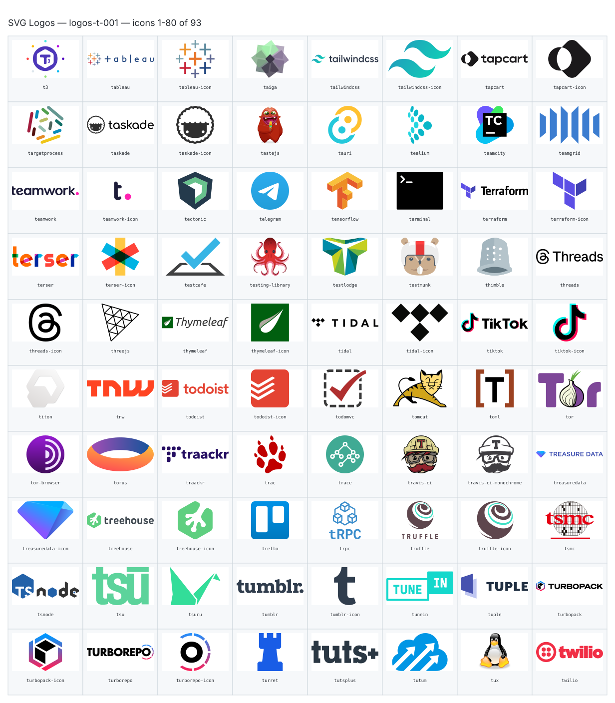
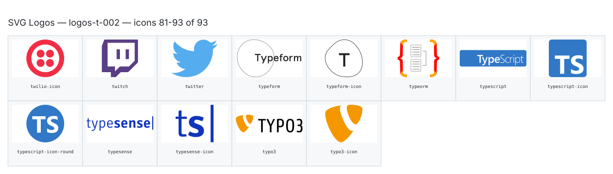

**Generated file — do not edit. Run `python scripts/portfolio.py icons generate`.**

# SVG Logos — `t`

[SVG Logos hub](../logos.md). 93 icons in group `t` across 2 sheets. Display names are approximate; copy the slug for Mermaid.

## logos-t-001

- `logos:t3` — T3 — [logos-t-001.svg](../sheets/logos-t-001.svg) r0c0 — `service example(logos:t3)[T3]`
- `logos:tableau` — Tableau — [logos-t-001.svg](../sheets/logos-t-001.svg) r0c1 — `service example(logos:tableau)[Tableau]`
- `logos:tableau-icon` — Tableau Icon — [logos-t-001.svg](../sheets/logos-t-001.svg) r0c2 — `service example(logos:tableau-icon)[Tableau Icon]`
- `logos:taiga` — Taiga — [logos-t-001.svg](../sheets/logos-t-001.svg) r0c3 — `service example(logos:taiga)[Taiga]`
- `logos:tailwindcss` — Tailwindcss — [logos-t-001.svg](../sheets/logos-t-001.svg) r0c4 — `service example(logos:tailwindcss)[Tailwindcss]`
- `logos:tailwindcss-icon` — Tailwindcss Icon — [logos-t-001.svg](../sheets/logos-t-001.svg) r0c5 — `service example(logos:tailwindcss-icon)[Tailwindcss Icon]`
- `logos:tapcart` — Tapcart — [logos-t-001.svg](../sheets/logos-t-001.svg) r0c6 — `service example(logos:tapcart)[Tapcart]`
- `logos:tapcart-icon` — Tapcart Icon — [logos-t-001.svg](../sheets/logos-t-001.svg) r0c7 — `service example(logos:tapcart-icon)[Tapcart Icon]`
- `logos:targetprocess` — Targetprocess — [logos-t-001.svg](../sheets/logos-t-001.svg) r1c0 — `service example(logos:targetprocess)[Targetprocess]`
- `logos:taskade` — Taskade — [logos-t-001.svg](../sheets/logos-t-001.svg) r1c1 — `service example(logos:taskade)[Taskade]`
- `logos:taskade-icon` — Taskade Icon — [logos-t-001.svg](../sheets/logos-t-001.svg) r1c2 — `service example(logos:taskade-icon)[Taskade Icon]`
- `logos:tastejs` — Tastejs — [logos-t-001.svg](../sheets/logos-t-001.svg) r1c3 — `service example(logos:tastejs)[Tastejs]`
- `logos:tauri` — Tauri — [logos-t-001.svg](../sheets/logos-t-001.svg) r1c4 — `service example(logos:tauri)[Tauri]`
- `logos:tealium` — Tealium — [logos-t-001.svg](../sheets/logos-t-001.svg) r1c5 — `service example(logos:tealium)[Tealium]`
- `logos:teamcity` — Teamcity — [logos-t-001.svg](../sheets/logos-t-001.svg) r1c6 — `service example(logos:teamcity)[Teamcity]`
- `logos:teamgrid` — Teamgrid — [logos-t-001.svg](../sheets/logos-t-001.svg) r1c7 — `service example(logos:teamgrid)[Teamgrid]`
- `logos:teamwork` — Teamwork — [logos-t-001.svg](../sheets/logos-t-001.svg) r2c0 — `service example(logos:teamwork)[Teamwork]`
- `logos:teamwork-icon` — Teamwork Icon — [logos-t-001.svg](../sheets/logos-t-001.svg) r2c1 — `service example(logos:teamwork-icon)[Teamwork Icon]`
- `logos:tectonic` — Tectonic — [logos-t-001.svg](../sheets/logos-t-001.svg) r2c2 — `service example(logos:tectonic)[Tectonic]`
- `logos:telegram` — Telegram — [logos-t-001.svg](../sheets/logos-t-001.svg) r2c3 — `service example(logos:telegram)[Telegram]`
- `logos:tensorflow` — Tensorflow — [logos-t-001.svg](../sheets/logos-t-001.svg) r2c4 — `service example(logos:tensorflow)[Tensorflow]`
- `logos:terminal` — Terminal — [logos-t-001.svg](../sheets/logos-t-001.svg) r2c5 — `service example(logos:terminal)[Terminal]`
- `logos:terraform` — Terraform — [logos-t-001.svg](../sheets/logos-t-001.svg) r2c6 — `service example(logos:terraform)[Terraform]`
- `logos:terraform-icon` — Terraform Icon — [logos-t-001.svg](../sheets/logos-t-001.svg) r2c7 — `service example(logos:terraform-icon)[Terraform Icon]`
- `logos:terser` — Terser — [logos-t-001.svg](../sheets/logos-t-001.svg) r3c0 — `service example(logos:terser)[Terser]`
- `logos:terser-icon` — Terser Icon — [logos-t-001.svg](../sheets/logos-t-001.svg) r3c1 — `service example(logos:terser-icon)[Terser Icon]`
- `logos:testcafe` — Testcafe — [logos-t-001.svg](../sheets/logos-t-001.svg) r3c2 — `service example(logos:testcafe)[Testcafe]`
- `logos:testing-library` — Testing Library — [logos-t-001.svg](../sheets/logos-t-001.svg) r3c3 — `service example(logos:testing-library)[Testing Library]`
- `logos:testlodge` — Testlodge — [logos-t-001.svg](../sheets/logos-t-001.svg) r3c4 — `service example(logos:testlodge)[Testlodge]`
- `logos:testmunk` — Testmunk — [logos-t-001.svg](../sheets/logos-t-001.svg) r3c5 — `service example(logos:testmunk)[Testmunk]`
- `logos:thimble` — Thimble — [logos-t-001.svg](../sheets/logos-t-001.svg) r3c6 — `service example(logos:thimble)[Thimble]`
- `logos:threads` — Threads — [logos-t-001.svg](../sheets/logos-t-001.svg) r3c7 — `service example(logos:threads)[Threads]`
- `logos:threads-icon` — Threads Icon — [logos-t-001.svg](../sheets/logos-t-001.svg) r4c0 — `service example(logos:threads-icon)[Threads Icon]`
- `logos:threejs` — Threejs — [logos-t-001.svg](../sheets/logos-t-001.svg) r4c1 — `service example(logos:threejs)[Threejs]`
- `logos:thymeleaf` — Thymeleaf — [logos-t-001.svg](../sheets/logos-t-001.svg) r4c2 — `service example(logos:thymeleaf)[Thymeleaf]`
- `logos:thymeleaf-icon` — Thymeleaf Icon — [logos-t-001.svg](../sheets/logos-t-001.svg) r4c3 — `service example(logos:thymeleaf-icon)[Thymeleaf Icon]`
- `logos:tidal` — Tidal — [logos-t-001.svg](../sheets/logos-t-001.svg) r4c4 — `service example(logos:tidal)[Tidal]`
- `logos:tidal-icon` — Tidal Icon — [logos-t-001.svg](../sheets/logos-t-001.svg) r4c5 — `service example(logos:tidal-icon)[Tidal Icon]`
- `logos:tiktok` — Tiktok — [logos-t-001.svg](../sheets/logos-t-001.svg) r4c6 — `service example(logos:tiktok)[Tiktok]`
- `logos:tiktok-icon` — Tiktok Icon — [logos-t-001.svg](../sheets/logos-t-001.svg) r4c7 — `service example(logos:tiktok-icon)[Tiktok Icon]`
- `logos:titon` — Titon — [logos-t-001.svg](../sheets/logos-t-001.svg) r5c0 — `service example(logos:titon)[Titon]`
- `logos:tnw` — Tnw — [logos-t-001.svg](../sheets/logos-t-001.svg) r5c1 — `service example(logos:tnw)[Tnw]`
- `logos:todoist` — Todoist — [logos-t-001.svg](../sheets/logos-t-001.svg) r5c2 — `service example(logos:todoist)[Todoist]`
- `logos:todoist-icon` — Todoist Icon — [logos-t-001.svg](../sheets/logos-t-001.svg) r5c3 — `service example(logos:todoist-icon)[Todoist Icon]`
- `logos:todomvc` — Todomvc — [logos-t-001.svg](../sheets/logos-t-001.svg) r5c4 — `service example(logos:todomvc)[Todomvc]`
- `logos:tomcat` — Tomcat — [logos-t-001.svg](../sheets/logos-t-001.svg) r5c5 — `service example(logos:tomcat)[Tomcat]`
- `logos:toml` — Toml — [logos-t-001.svg](../sheets/logos-t-001.svg) r5c6 — `service example(logos:toml)[Toml]`
- `logos:tor` — Tor — [logos-t-001.svg](../sheets/logos-t-001.svg) r5c7 — `service example(logos:tor)[Tor]`
- `logos:tor-browser` — Tor Browser — [logos-t-001.svg](../sheets/logos-t-001.svg) r6c0 — `service example(logos:tor-browser)[Tor Browser]`
- `logos:torus` — Torus — [logos-t-001.svg](../sheets/logos-t-001.svg) r6c1 — `service example(logos:torus)[Torus]`
- `logos:traackr` — Traackr — [logos-t-001.svg](../sheets/logos-t-001.svg) r6c2 — `service example(logos:traackr)[Traackr]`
- `logos:trac` — Trac — [logos-t-001.svg](../sheets/logos-t-001.svg) r6c3 — `service example(logos:trac)[Trac]`
- `logos:trace` — Trace — [logos-t-001.svg](../sheets/logos-t-001.svg) r6c4 — `service example(logos:trace)[Trace]`
- `logos:travis-ci` — Travis Ci — [logos-t-001.svg](../sheets/logos-t-001.svg) r6c5 — `service example(logos:travis-ci)[Travis Ci]`
- `logos:travis-ci-monochrome` — Travis Ci Monochrome — [logos-t-001.svg](../sheets/logos-t-001.svg) r6c6 — `service example(logos:travis-ci-monochrome)[Travis Ci Monochrome]`
- `logos:treasuredata` — Treasuredata — [logos-t-001.svg](../sheets/logos-t-001.svg) r6c7 — `service example(logos:treasuredata)[Treasuredata]`
- `logos:treasuredata-icon` — Treasuredata Icon — [logos-t-001.svg](../sheets/logos-t-001.svg) r7c0 — `service example(logos:treasuredata-icon)[Treasuredata Icon]`
- `logos:treehouse` — Treehouse — [logos-t-001.svg](../sheets/logos-t-001.svg) r7c1 — `service example(logos:treehouse)[Treehouse]`
- `logos:treehouse-icon` — Treehouse Icon — [logos-t-001.svg](../sheets/logos-t-001.svg) r7c2 — `service example(logos:treehouse-icon)[Treehouse Icon]`
- `logos:trello` — Trello — [logos-t-001.svg](../sheets/logos-t-001.svg) r7c3 — `service example(logos:trello)[Trello]`
- `logos:trpc` — Trpc — [logos-t-001.svg](../sheets/logos-t-001.svg) r7c4 — `service example(logos:trpc)[Trpc]`
- `logos:truffle` — Truffle — [logos-t-001.svg](../sheets/logos-t-001.svg) r7c5 — `service example(logos:truffle)[Truffle]`
- `logos:truffle-icon` — Truffle Icon — [logos-t-001.svg](../sheets/logos-t-001.svg) r7c6 — `service example(logos:truffle-icon)[Truffle Icon]`
- `logos:tsmc` — Tsmc — [logos-t-001.svg](../sheets/logos-t-001.svg) r7c7 — `service example(logos:tsmc)[Tsmc]`
- `logos:tsnode` — Tsnode — [logos-t-001.svg](../sheets/logos-t-001.svg) r8c0 — `service example(logos:tsnode)[Tsnode]`
- `logos:tsu` — Tsu — [logos-t-001.svg](../sheets/logos-t-001.svg) r8c1 — `service example(logos:tsu)[Tsu]`
- `logos:tsuru` — Tsuru — [logos-t-001.svg](../sheets/logos-t-001.svg) r8c2 — `service example(logos:tsuru)[Tsuru]`
- `logos:tumblr` — Tumblr — [logos-t-001.svg](../sheets/logos-t-001.svg) r8c3 — `service example(logos:tumblr)[Tumblr]`
- `logos:tumblr-icon` — Tumblr Icon — [logos-t-001.svg](../sheets/logos-t-001.svg) r8c4 — `service example(logos:tumblr-icon)[Tumblr Icon]`
- `logos:tunein` — Tunein — [logos-t-001.svg](../sheets/logos-t-001.svg) r8c5 — `service example(logos:tunein)[Tunein]`
- `logos:tuple` — Tuple — [logos-t-001.svg](../sheets/logos-t-001.svg) r8c6 — `service example(logos:tuple)[Tuple]`
- `logos:turbopack` — Turbopack — [logos-t-001.svg](../sheets/logos-t-001.svg) r8c7 — `service example(logos:turbopack)[Turbopack]`
- `logos:turbopack-icon` — Turbopack Icon — [logos-t-001.svg](../sheets/logos-t-001.svg) r9c0 — `service example(logos:turbopack-icon)[Turbopack Icon]`
- `logos:turborepo` — Turborepo — [logos-t-001.svg](../sheets/logos-t-001.svg) r9c1 — `service example(logos:turborepo)[Turborepo]`
- `logos:turborepo-icon` — Turborepo Icon — [logos-t-001.svg](../sheets/logos-t-001.svg) r9c2 — `service example(logos:turborepo-icon)[Turborepo Icon]`
- `logos:turret` — Turret — [logos-t-001.svg](../sheets/logos-t-001.svg) r9c3 — `service example(logos:turret)[Turret]`
- `logos:tutsplus` — Tutsplus — [logos-t-001.svg](../sheets/logos-t-001.svg) r9c4 — `service example(logos:tutsplus)[Tutsplus]`
- `logos:tutum` — Tutum — [logos-t-001.svg](../sheets/logos-t-001.svg) r9c5 — `service example(logos:tutum)[Tutum]`
- `logos:tux` — Tux — [logos-t-001.svg](../sheets/logos-t-001.svg) r9c6 — `service example(logos:tux)[Tux]`
- `logos:twilio` — Twilio — [logos-t-001.svg](../sheets/logos-t-001.svg) r9c7 — `service example(logos:twilio)[Twilio]`

## logos-t-002

- `logos:twilio-icon` — Twilio Icon — [logos-t-002.svg](../sheets/logos-t-002.svg) r0c0 — `service example(logos:twilio-icon)[Twilio Icon]`
- `logos:twitch` — Twitch — [logos-t-002.svg](../sheets/logos-t-002.svg) r0c1 — `service example(logos:twitch)[Twitch]`
- `logos:twitter` — Twitter — [logos-t-002.svg](../sheets/logos-t-002.svg) r0c2 — `service example(logos:twitter)[Twitter]`
- `logos:typeform` — Typeform — [logos-t-002.svg](../sheets/logos-t-002.svg) r0c3 — `service example(logos:typeform)[Typeform]`
- `logos:typeform-icon` — Typeform Icon — [logos-t-002.svg](../sheets/logos-t-002.svg) r0c4 — `service example(logos:typeform-icon)[Typeform Icon]`
- `logos:typeorm` — Typeorm — [logos-t-002.svg](../sheets/logos-t-002.svg) r0c5 — `service example(logos:typeorm)[Typeorm]`
- `logos:typescript` — Typescript — [logos-t-002.svg](../sheets/logos-t-002.svg) r0c6 — `service example(logos:typescript)[Typescript]`
- `logos:typescript-icon` — Typescript Icon — [logos-t-002.svg](../sheets/logos-t-002.svg) r0c7 — `service example(logos:typescript-icon)[Typescript Icon]`
- `logos:typescript-icon-round` — Typescript Icon Round — [logos-t-002.svg](../sheets/logos-t-002.svg) r1c0 — `service example(logos:typescript-icon-round)[Typescript Icon Round]`
- `logos:typesense` — Typesense — [logos-t-002.svg](../sheets/logos-t-002.svg) r1c1 — `service example(logos:typesense)[Typesense]`
- `logos:typesense-icon` — Typesense Icon — [logos-t-002.svg](../sheets/logos-t-002.svg) r1c2 — `service example(logos:typesense-icon)[Typesense Icon]`
- `logos:typo3` — Typo3 — [logos-t-002.svg](../sheets/logos-t-002.svg) r1c3 — `service example(logos:typo3)[Typo3]`
- `logos:typo3-icon` — Typo3 Icon — [logos-t-002.svg](../sheets/logos-t-002.svg) r1c4 — `service example(logos:typo3-icon)[Typo3 Icon]`
