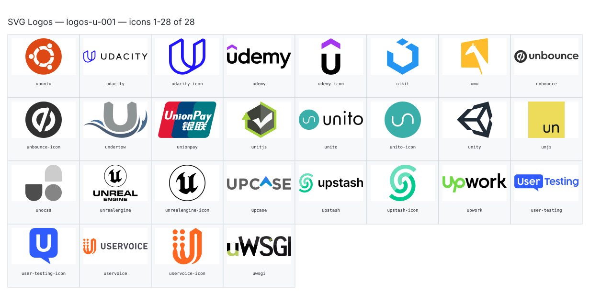

**Generated file — do not edit. Run `python scripts/portfolio.py icons generate`.**

# SVG Logos — `u`

[SVG Logos hub](../logos.md). 28 icons in group `u` across 1 sheet. Display names are approximate; copy the slug for Mermaid.

## logos-u-001

- `logos:ubuntu` — Ubuntu — [logos-u-001.svg](../sheets/logos-u-001.svg) r0c0 — `service example(logos:ubuntu)[Ubuntu]`
- `logos:udacity` — Udacity — [logos-u-001.svg](../sheets/logos-u-001.svg) r0c1 — `service example(logos:udacity)[Udacity]`
- `logos:udacity-icon` — Udacity Icon — [logos-u-001.svg](../sheets/logos-u-001.svg) r0c2 — `service example(logos:udacity-icon)[Udacity Icon]`
- `logos:udemy` — Udemy — [logos-u-001.svg](../sheets/logos-u-001.svg) r0c3 — `service example(logos:udemy)[Udemy]`
- `logos:udemy-icon` — Udemy Icon — [logos-u-001.svg](../sheets/logos-u-001.svg) r0c4 — `service example(logos:udemy-icon)[Udemy Icon]`
- `logos:uikit` — Uikit — [logos-u-001.svg](../sheets/logos-u-001.svg) r0c5 — `service example(logos:uikit)[Uikit]`
- `logos:umu` — Umu — [logos-u-001.svg](../sheets/logos-u-001.svg) r0c6 — `service example(logos:umu)[Umu]`
- `logos:unbounce` — Unbounce — [logos-u-001.svg](../sheets/logos-u-001.svg) r0c7 — `service example(logos:unbounce)[Unbounce]`
- `logos:unbounce-icon` — Unbounce Icon — [logos-u-001.svg](../sheets/logos-u-001.svg) r1c0 — `service example(logos:unbounce-icon)[Unbounce Icon]`
- `logos:undertow` — Undertow — [logos-u-001.svg](../sheets/logos-u-001.svg) r1c1 — `service example(logos:undertow)[Undertow]`
- `logos:unionpay` — Unionpay — [logos-u-001.svg](../sheets/logos-u-001.svg) r1c2 — `service example(logos:unionpay)[Unionpay]`
- `logos:unitjs` — Unitjs — [logos-u-001.svg](../sheets/logos-u-001.svg) r1c3 — `service example(logos:unitjs)[Unitjs]`
- `logos:unito` — Unito — [logos-u-001.svg](../sheets/logos-u-001.svg) r1c4 — `service example(logos:unito)[Unito]`
- `logos:unito-icon` — Unito Icon — [logos-u-001.svg](../sheets/logos-u-001.svg) r1c5 — `service example(logos:unito-icon)[Unito Icon]`
- `logos:unity` — Unity — [logos-u-001.svg](../sheets/logos-u-001.svg) r1c6 — `service example(logos:unity)[Unity]`
- `logos:unjs` — Unjs — [logos-u-001.svg](../sheets/logos-u-001.svg) r1c7 — `service example(logos:unjs)[Unjs]`
- `logos:unocss` — Unocss — [logos-u-001.svg](../sheets/logos-u-001.svg) r2c0 — `service example(logos:unocss)[Unocss]`
- `logos:unrealengine` — Unrealengine — [logos-u-001.svg](../sheets/logos-u-001.svg) r2c1 — `service example(logos:unrealengine)[Unrealengine]`
- `logos:unrealengine-icon` — Unrealengine Icon — [logos-u-001.svg](../sheets/logos-u-001.svg) r2c2 — `service example(logos:unrealengine-icon)[Unrealengine Icon]`
- `logos:upcase` — Upcase — [logos-u-001.svg](../sheets/logos-u-001.svg) r2c3 — `service example(logos:upcase)[Upcase]`
- `logos:upstash` — Upstash — [logos-u-001.svg](../sheets/logos-u-001.svg) r2c4 — `service example(logos:upstash)[Upstash]`
- `logos:upstash-icon` — Upstash Icon — [logos-u-001.svg](../sheets/logos-u-001.svg) r2c5 — `service example(logos:upstash-icon)[Upstash Icon]`
- `logos:upwork` — Upwork — [logos-u-001.svg](../sheets/logos-u-001.svg) r2c6 — `service example(logos:upwork)[Upwork]`
- `logos:user-testing` — User Testing — [logos-u-001.svg](../sheets/logos-u-001.svg) r2c7 — `service example(logos:user-testing)[User Testing]`
- `logos:user-testing-icon` — User Testing Icon — [logos-u-001.svg](../sheets/logos-u-001.svg) r3c0 — `service example(logos:user-testing-icon)[User Testing Icon]`
- `logos:uservoice` — Uservoice — [logos-u-001.svg](../sheets/logos-u-001.svg) r3c1 — `service example(logos:uservoice)[Uservoice]`
- `logos:uservoice-icon` — Uservoice Icon — [logos-u-001.svg](../sheets/logos-u-001.svg) r3c2 — `service example(logos:uservoice-icon)[Uservoice Icon]`
- `logos:uwsgi` — Uwsgi — [logos-u-001.svg](../sheets/logos-u-001.svg) r3c3 — `service example(logos:uwsgi)[Uwsgi]`
