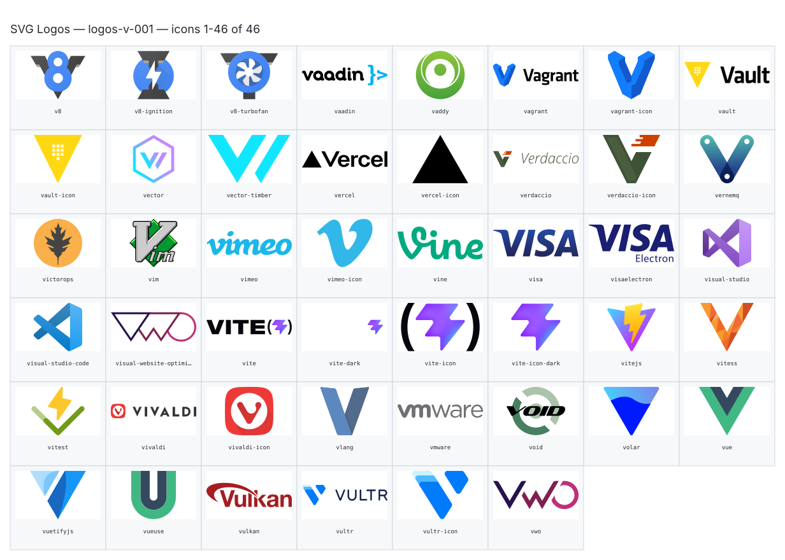

**Generated file — do not edit. Run `python scripts/portfolio.py icons generate`.**

# SVG Logos — `v`

[SVG Logos hub](../logos.md). 46 icons in group `v` across 1 sheet. Display names are approximate; copy the slug for Mermaid.

## logos-v-001

- `logos:v8` — V8 — [logos-v-001.svg](../sheets/logos-v-001.svg) r0c0 — `service example(logos:v8)[V8]`
- `logos:v8-ignition` — V8 Ignition — [logos-v-001.svg](../sheets/logos-v-001.svg) r0c1 — `service example(logos:v8-ignition)[V8 Ignition]`
- `logos:v8-turbofan` — V8 Turbofan — [logos-v-001.svg](../sheets/logos-v-001.svg) r0c2 — `service example(logos:v8-turbofan)[V8 Turbofan]`
- `logos:vaadin` — Vaadin — [logos-v-001.svg](../sheets/logos-v-001.svg) r0c3 — `service example(logos:vaadin)[Vaadin]`
- `logos:vaddy` — Vaddy — [logos-v-001.svg](../sheets/logos-v-001.svg) r0c4 — `service example(logos:vaddy)[Vaddy]`
- `logos:vagrant` — Vagrant — [logos-v-001.svg](../sheets/logos-v-001.svg) r0c5 — `service example(logos:vagrant)[Vagrant]`
- `logos:vagrant-icon` — Vagrant Icon — [logos-v-001.svg](../sheets/logos-v-001.svg) r0c6 — `service example(logos:vagrant-icon)[Vagrant Icon]`
- `logos:vault` — Vault — [logos-v-001.svg](../sheets/logos-v-001.svg) r0c7 — `service example(logos:vault)[Vault]`
- `logos:vault-icon` — Vault Icon — [logos-v-001.svg](../sheets/logos-v-001.svg) r1c0 — `service example(logos:vault-icon)[Vault Icon]`
- `logos:vector` — Vector — [logos-v-001.svg](../sheets/logos-v-001.svg) r1c1 — `service example(logos:vector)[Vector]`
- `logos:vector-timber` — Vector Timber — [logos-v-001.svg](../sheets/logos-v-001.svg) r1c2 — `service example(logos:vector-timber)[Vector Timber]`
- `logos:vercel` — Vercel — [logos-v-001.svg](../sheets/logos-v-001.svg) r1c3 — `service example(logos:vercel)[Vercel]`
- `logos:vercel-icon` — Vercel Icon — [logos-v-001.svg](../sheets/logos-v-001.svg) r1c4 — `service example(logos:vercel-icon)[Vercel Icon]`
- `logos:verdaccio` — Verdaccio — [logos-v-001.svg](../sheets/logos-v-001.svg) r1c5 — `service example(logos:verdaccio)[Verdaccio]`
- `logos:verdaccio-icon` — Verdaccio Icon — [logos-v-001.svg](../sheets/logos-v-001.svg) r1c6 — `service example(logos:verdaccio-icon)[Verdaccio Icon]`
- `logos:vernemq` — Vernemq — [logos-v-001.svg](../sheets/logos-v-001.svg) r1c7 — `service example(logos:vernemq)[Vernemq]`
- `logos:victorops` — Victorops — [logos-v-001.svg](../sheets/logos-v-001.svg) r2c0 — `service example(logos:victorops)[Victorops]`
- `logos:vim` — Vim — [logos-v-001.svg](../sheets/logos-v-001.svg) r2c1 — `service example(logos:vim)[Vim]`
- `logos:vimeo` — Vimeo — [logos-v-001.svg](../sheets/logos-v-001.svg) r2c2 — `service example(logos:vimeo)[Vimeo]`
- `logos:vimeo-icon` — Vimeo Icon — [logos-v-001.svg](../sheets/logos-v-001.svg) r2c3 — `service example(logos:vimeo-icon)[Vimeo Icon]`
- `logos:vine` — Vine — [logos-v-001.svg](../sheets/logos-v-001.svg) r2c4 — `service example(logos:vine)[Vine]`
- `logos:visa` — Visa — [logos-v-001.svg](../sheets/logos-v-001.svg) r2c5 — `service example(logos:visa)[Visa]`
- `logos:visaelectron` — Visaelectron — [logos-v-001.svg](../sheets/logos-v-001.svg) r2c6 — `service example(logos:visaelectron)[Visaelectron]`
- `logos:visual-studio` — Visual Studio — [logos-v-001.svg](../sheets/logos-v-001.svg) r2c7 — `service example(logos:visual-studio)[Visual Studio]`
- `logos:visual-studio-code` — Visual Studio Code — [logos-v-001.svg](../sheets/logos-v-001.svg) r3c0 — `service example(logos:visual-studio-code)[Visual Studio Code]`
- `logos:visual-website-optimizer` — Visual Website Optimizer — [logos-v-001.svg](../sheets/logos-v-001.svg) r3c1 — `service example(logos:visual-website-optimizer)[Visual Website Optimizer]`
- `logos:vite` — Vite — [logos-v-001.svg](../sheets/logos-v-001.svg) r3c2 — `service example(logos:vite)[Vite]`
- `logos:vite-dark` — Vite Dark — [logos-v-001.svg](../sheets/logos-v-001.svg) r3c3 — `service example(logos:vite-dark)[Vite Dark]`
- `logos:vite-icon` — Vite Icon — [logos-v-001.svg](../sheets/logos-v-001.svg) r3c4 — `service example(logos:vite-icon)[Vite Icon]`
- `logos:vite-icon-dark` — Vite Icon Dark — [logos-v-001.svg](../sheets/logos-v-001.svg) r3c5 — `service example(logos:vite-icon-dark)[Vite Icon Dark]`
- `logos:vitejs` — Vitejs — [logos-v-001.svg](../sheets/logos-v-001.svg) r3c6 — `service example(logos:vitejs)[Vitejs]`
- `logos:vitess` — Vitess — [logos-v-001.svg](../sheets/logos-v-001.svg) r3c7 — `service example(logos:vitess)[Vitess]`
- `logos:vitest` — Vitest — [logos-v-001.svg](../sheets/logos-v-001.svg) r4c0 — `service example(logos:vitest)[Vitest]`
- `logos:vivaldi` — Vivaldi — [logos-v-001.svg](../sheets/logos-v-001.svg) r4c1 — `service example(logos:vivaldi)[Vivaldi]`
- `logos:vivaldi-icon` — Vivaldi Icon — [logos-v-001.svg](../sheets/logos-v-001.svg) r4c2 — `service example(logos:vivaldi-icon)[Vivaldi Icon]`
- `logos:vlang` — Vlang — [logos-v-001.svg](../sheets/logos-v-001.svg) r4c3 — `service example(logos:vlang)[Vlang]`
- `logos:vmware` — Vmware — [logos-v-001.svg](../sheets/logos-v-001.svg) r4c4 — `service example(logos:vmware)[Vmware]`
- `logos:void` — Void — [logos-v-001.svg](../sheets/logos-v-001.svg) r4c5 — `service example(logos:void)[Void]`
- `logos:volar` — Volar — [logos-v-001.svg](../sheets/logos-v-001.svg) r4c6 — `service example(logos:volar)[Volar]`
- `logos:vue` — Vue — [logos-v-001.svg](../sheets/logos-v-001.svg) r4c7 — `service example(logos:vue)[Vue]`
- `logos:vuetifyjs` — Vuetifyjs — [logos-v-001.svg](../sheets/logos-v-001.svg) r5c0 — `service example(logos:vuetifyjs)[Vuetifyjs]`
- `logos:vueuse` — Vueuse — [logos-v-001.svg](../sheets/logos-v-001.svg) r5c1 — `service example(logos:vueuse)[Vueuse]`
- `logos:vulkan` — Vulkan — [logos-v-001.svg](../sheets/logos-v-001.svg) r5c2 — `service example(logos:vulkan)[Vulkan]`
- `logos:vultr` — Vultr — [logos-v-001.svg](../sheets/logos-v-001.svg) r5c3 — `service example(logos:vultr)[Vultr]`
- `logos:vultr-icon` — Vultr Icon — [logos-v-001.svg](../sheets/logos-v-001.svg) r5c4 — `service example(logos:vultr-icon)[Vultr Icon]`
- `logos:vwo` — Vwo — [logos-v-001.svg](../sheets/logos-v-001.svg) r5c5 — `service example(logos:vwo)[Vwo]`
