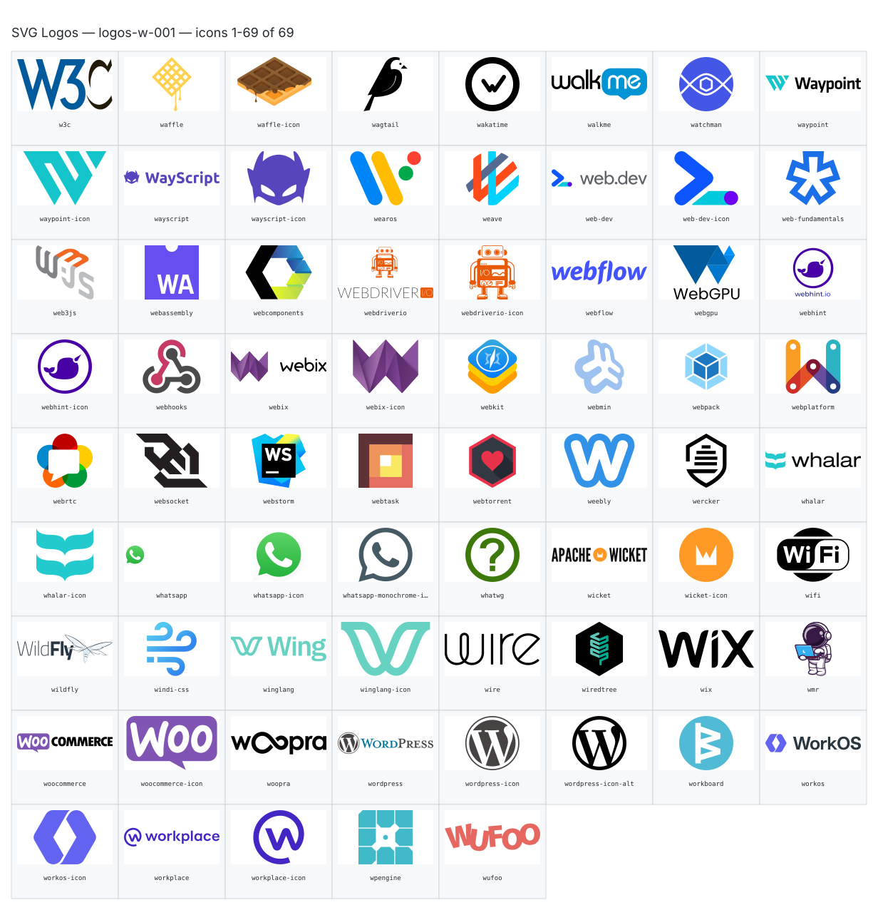

**Generated file — do not edit. Run `python scripts/portfolio.py icons generate`.**

# SVG Logos — `w`

[SVG Logos hub](../logos.md). 69 icons in group `w` across 1 sheet. Display names are approximate; copy the slug for Mermaid.

## logos-w-001

- `logos:w3c` — W3c — [logos-w-001.svg](../sheets/logos-w-001.svg) r0c0 — `service example(logos:w3c)[W3c]`
- `logos:waffle` — Waffle — [logos-w-001.svg](../sheets/logos-w-001.svg) r0c1 — `service example(logos:waffle)[Waffle]`
- `logos:waffle-icon` — Waffle Icon — [logos-w-001.svg](../sheets/logos-w-001.svg) r0c2 — `service example(logos:waffle-icon)[Waffle Icon]`
- `logos:wagtail` — Wagtail — [logos-w-001.svg](../sheets/logos-w-001.svg) r0c3 — `service example(logos:wagtail)[Wagtail]`
- `logos:wakatime` — Wakatime — [logos-w-001.svg](../sheets/logos-w-001.svg) r0c4 — `service example(logos:wakatime)[Wakatime]`
- `logos:walkme` — Walkme — [logos-w-001.svg](../sheets/logos-w-001.svg) r0c5 — `service example(logos:walkme)[Walkme]`
- `logos:watchman` — Watchman — [logos-w-001.svg](../sheets/logos-w-001.svg) r0c6 — `service example(logos:watchman)[Watchman]`
- `logos:waypoint` — Waypoint — [logos-w-001.svg](../sheets/logos-w-001.svg) r0c7 — `service example(logos:waypoint)[Waypoint]`
- `logos:waypoint-icon` — Waypoint Icon — [logos-w-001.svg](../sheets/logos-w-001.svg) r1c0 — `service example(logos:waypoint-icon)[Waypoint Icon]`
- `logos:wayscript` — Wayscript — [logos-w-001.svg](../sheets/logos-w-001.svg) r1c1 — `service example(logos:wayscript)[Wayscript]`
- `logos:wayscript-icon` — Wayscript Icon — [logos-w-001.svg](../sheets/logos-w-001.svg) r1c2 — `service example(logos:wayscript-icon)[Wayscript Icon]`
- `logos:wearos` — Wearos — [logos-w-001.svg](../sheets/logos-w-001.svg) r1c3 — `service example(logos:wearos)[Wearos]`
- `logos:weave` — Weave — [logos-w-001.svg](../sheets/logos-w-001.svg) r1c4 — `service example(logos:weave)[Weave]`
- `logos:web-dev` — Web Dev — [logos-w-001.svg](../sheets/logos-w-001.svg) r1c5 — `service example(logos:web-dev)[Web Dev]`
- `logos:web-dev-icon` — Web Dev Icon — [logos-w-001.svg](../sheets/logos-w-001.svg) r1c6 — `service example(logos:web-dev-icon)[Web Dev Icon]`
- `logos:web-fundamentals` — Web Fundamentals — [logos-w-001.svg](../sheets/logos-w-001.svg) r1c7 — `service example(logos:web-fundamentals)[Web Fundamentals]`
- `logos:web3js` — Web3js — [logos-w-001.svg](../sheets/logos-w-001.svg) r2c0 — `service example(logos:web3js)[Web3js]`
- `logos:webassembly` — Webassembly — [logos-w-001.svg](../sheets/logos-w-001.svg) r2c1 — `service example(logos:webassembly)[Webassembly]`
- `logos:webcomponents` — Webcomponents — [logos-w-001.svg](../sheets/logos-w-001.svg) r2c2 — `service example(logos:webcomponents)[Webcomponents]`
- `logos:webdriverio` — Webdriverio — [logos-w-001.svg](../sheets/logos-w-001.svg) r2c3 — `service example(logos:webdriverio)[Webdriverio]`
- `logos:webdriverio-icon` — Webdriverio Icon — [logos-w-001.svg](../sheets/logos-w-001.svg) r2c4 — `service example(logos:webdriverio-icon)[Webdriverio Icon]`
- `logos:webflow` — Webflow — [logos-w-001.svg](../sheets/logos-w-001.svg) r2c5 — `service example(logos:webflow)[Webflow]`
- `logos:webgpu` — Webgpu — [logos-w-001.svg](../sheets/logos-w-001.svg) r2c6 — `service example(logos:webgpu)[Webgpu]`
- `logos:webhint` — Webhint — [logos-w-001.svg](../sheets/logos-w-001.svg) r2c7 — `service example(logos:webhint)[Webhint]`
- `logos:webhint-icon` — Webhint Icon — [logos-w-001.svg](../sheets/logos-w-001.svg) r3c0 — `service example(logos:webhint-icon)[Webhint Icon]`
- `logos:webhooks` — Webhooks — [logos-w-001.svg](../sheets/logos-w-001.svg) r3c1 — `service example(logos:webhooks)[Webhooks]`
- `logos:webix` — Webix — [logos-w-001.svg](../sheets/logos-w-001.svg) r3c2 — `service example(logos:webix)[Webix]`
- `logos:webix-icon` — Webix Icon — [logos-w-001.svg](../sheets/logos-w-001.svg) r3c3 — `service example(logos:webix-icon)[Webix Icon]`
- `logos:webkit` — Webkit — [logos-w-001.svg](../sheets/logos-w-001.svg) r3c4 — `service example(logos:webkit)[Webkit]`
- `logos:webmin` — Webmin — [logos-w-001.svg](../sheets/logos-w-001.svg) r3c5 — `service example(logos:webmin)[Webmin]`
- `logos:webpack` — Webpack — [logos-w-001.svg](../sheets/logos-w-001.svg) r3c6 — `service example(logos:webpack)[Webpack]`
- `logos:webplatform` — Webplatform — [logos-w-001.svg](../sheets/logos-w-001.svg) r3c7 — `service example(logos:webplatform)[Webplatform]`
- `logos:webrtc` — Webrtc — [logos-w-001.svg](../sheets/logos-w-001.svg) r4c0 — `service example(logos:webrtc)[Webrtc]`
- `logos:websocket` — Websocket — [logos-w-001.svg](../sheets/logos-w-001.svg) r4c1 — `service example(logos:websocket)[Websocket]`
- `logos:webstorm` — Webstorm — [logos-w-001.svg](../sheets/logos-w-001.svg) r4c2 — `service example(logos:webstorm)[Webstorm]`
- `logos:webtask` — Webtask — [logos-w-001.svg](../sheets/logos-w-001.svg) r4c3 — `service example(logos:webtask)[Webtask]`
- `logos:webtorrent` — Webtorrent — [logos-w-001.svg](../sheets/logos-w-001.svg) r4c4 — `service example(logos:webtorrent)[Webtorrent]`
- `logos:weebly` — Weebly — [logos-w-001.svg](../sheets/logos-w-001.svg) r4c5 — `service example(logos:weebly)[Weebly]`
- `logos:wercker` — Wercker — [logos-w-001.svg](../sheets/logos-w-001.svg) r4c6 — `service example(logos:wercker)[Wercker]`
- `logos:whalar` — Whalar — [logos-w-001.svg](../sheets/logos-w-001.svg) r4c7 — `service example(logos:whalar)[Whalar]`
- `logos:whalar-icon` — Whalar Icon — [logos-w-001.svg](../sheets/logos-w-001.svg) r5c0 — `service example(logos:whalar-icon)[Whalar Icon]`
- `logos:whatsapp` — Whatsapp — [logos-w-001.svg](../sheets/logos-w-001.svg) r5c1 — `service example(logos:whatsapp)[Whatsapp]`
- `logos:whatsapp-icon` — Whatsapp Icon — [logos-w-001.svg](../sheets/logos-w-001.svg) r5c2 — `service example(logos:whatsapp-icon)[Whatsapp Icon]`
- `logos:whatsapp-monochrome-icon` — Whatsapp Monochrome Icon — [logos-w-001.svg](../sheets/logos-w-001.svg) r5c3 — `service example(logos:whatsapp-monochrome-icon)[Whatsapp Monochrome Icon]`
- `logos:whatwg` — Whatwg — [logos-w-001.svg](../sheets/logos-w-001.svg) r5c4 — `service example(logos:whatwg)[Whatwg]`
- `logos:wicket` — Wicket — [logos-w-001.svg](../sheets/logos-w-001.svg) r5c5 — `service example(logos:wicket)[Wicket]`
- `logos:wicket-icon` — Wicket Icon — [logos-w-001.svg](../sheets/logos-w-001.svg) r5c6 — `service example(logos:wicket-icon)[Wicket Icon]`
- `logos:wifi` — Wifi — [logos-w-001.svg](../sheets/logos-w-001.svg) r5c7 — `service example(logos:wifi)[Wifi]`
- `logos:wildfly` — Wildfly — [logos-w-001.svg](../sheets/logos-w-001.svg) r6c0 — `service example(logos:wildfly)[Wildfly]`
- `logos:windi-css` — Windi Css — [logos-w-001.svg](../sheets/logos-w-001.svg) r6c1 — `service example(logos:windi-css)[Windi Css]`
- `logos:winglang` — Winglang — [logos-w-001.svg](../sheets/logos-w-001.svg) r6c2 — `service example(logos:winglang)[Winglang]`
- `logos:winglang-icon` — Winglang Icon — [logos-w-001.svg](../sheets/logos-w-001.svg) r6c3 — `service example(logos:winglang-icon)[Winglang Icon]`
- `logos:wire` — Wire — [logos-w-001.svg](../sheets/logos-w-001.svg) r6c4 — `service example(logos:wire)[Wire]`
- `logos:wiredtree` — Wiredtree — [logos-w-001.svg](../sheets/logos-w-001.svg) r6c5 — `service example(logos:wiredtree)[Wiredtree]`
- `logos:wix` — Wix — [logos-w-001.svg](../sheets/logos-w-001.svg) r6c6 — `service example(logos:wix)[Wix]`
- `logos:wmr` — Wmr — [logos-w-001.svg](../sheets/logos-w-001.svg) r6c7 — `service example(logos:wmr)[Wmr]`
- `logos:woocommerce` — Woocommerce — [logos-w-001.svg](../sheets/logos-w-001.svg) r7c0 — `service example(logos:woocommerce)[Woocommerce]`
- `logos:woocommerce-icon` — Woocommerce Icon — [logos-w-001.svg](../sheets/logos-w-001.svg) r7c1 — `service example(logos:woocommerce-icon)[Woocommerce Icon]`
- `logos:woopra` — Woopra — [logos-w-001.svg](../sheets/logos-w-001.svg) r7c2 — `service example(logos:woopra)[Woopra]`
- `logos:wordpress` — Wordpress — [logos-w-001.svg](../sheets/logos-w-001.svg) r7c3 — `service example(logos:wordpress)[Wordpress]`
- `logos:wordpress-icon` — Wordpress Icon — [logos-w-001.svg](../sheets/logos-w-001.svg) r7c4 — `service example(logos:wordpress-icon)[Wordpress Icon]`
- `logos:wordpress-icon-alt` — Wordpress Icon Alt — [logos-w-001.svg](../sheets/logos-w-001.svg) r7c5 — `service example(logos:wordpress-icon-alt)[Wordpress Icon Alt]`
- `logos:workboard` — Workboard — [logos-w-001.svg](../sheets/logos-w-001.svg) r7c6 — `service example(logos:workboard)[Workboard]`
- `logos:workos` — Workos — [logos-w-001.svg](../sheets/logos-w-001.svg) r7c7 — `service example(logos:workos)[Workos]`
- `logos:workos-icon` — Workos Icon — [logos-w-001.svg](../sheets/logos-w-001.svg) r8c0 — `service example(logos:workos-icon)[Workos Icon]`
- `logos:workplace` — Workplace — [logos-w-001.svg](../sheets/logos-w-001.svg) r8c1 — `service example(logos:workplace)[Workplace]`
- `logos:workplace-icon` — Workplace Icon — [logos-w-001.svg](../sheets/logos-w-001.svg) r8c2 — `service example(logos:workplace-icon)[Workplace Icon]`
- `logos:wpengine` — Wpengine — [logos-w-001.svg](../sheets/logos-w-001.svg) r8c3 — `service example(logos:wpengine)[Wpengine]`
- `logos:wufoo` — Wufoo — [logos-w-001.svg](../sheets/logos-w-001.svg) r8c4 — `service example(logos:wufoo)[Wufoo]`
