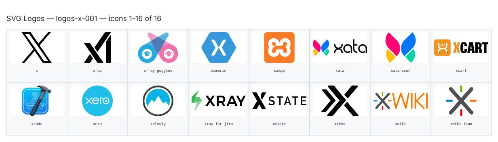

**Generated file — do not edit. Run `python scripts/portfolio.py icons generate`.**

# SVG Logos — `x`

[SVG Logos hub](../logos.md). 16 icons in group `x` across 1 sheet. Display names are approximate; copy the slug for Mermaid.

## logos-x-001

- `logos:x` — X — [logos-x-001.svg](../sheets/logos-x-001.svg) r0c0 — `service example(logos:x)[X]`
- `logos:x-ai` — X Ai — [logos-x-001.svg](../sheets/logos-x-001.svg) r0c1 — `service example(logos:x-ai)[X Ai]`
- `logos:x-ray-goggles` — X Ray Goggles — [logos-x-001.svg](../sheets/logos-x-001.svg) r0c2 — `service example(logos:x-ray-goggles)[X Ray Goggles]`
- `logos:xamarin` — Xamarin — [logos-x-001.svg](../sheets/logos-x-001.svg) r0c3 — `service example(logos:xamarin)[Xamarin]`
- `logos:xampp` — Xampp — [logos-x-001.svg](../sheets/logos-x-001.svg) r0c4 — `service example(logos:xampp)[Xampp]`
- `logos:xata` — Xata — [logos-x-001.svg](../sheets/logos-x-001.svg) r0c5 — `service example(logos:xata)[Xata]`
- `logos:xata-icon` — Xata Icon — [logos-x-001.svg](../sheets/logos-x-001.svg) r0c6 — `service example(logos:xata-icon)[Xata Icon]`
- `logos:xcart` — Xcart — [logos-x-001.svg](../sheets/logos-x-001.svg) r0c7 — `service example(logos:xcart)[Xcart]`
- `logos:xcode` — Xcode — [logos-x-001.svg](../sheets/logos-x-001.svg) r1c0 — `service example(logos:xcode)[Xcode]`
- `logos:xero` — Xero — [logos-x-001.svg](../sheets/logos-x-001.svg) r1c1 — `service example(logos:xero)[Xero]`
- `logos:xplenty` — Xplenty — [logos-x-001.svg](../sheets/logos-x-001.svg) r1c2 — `service example(logos:xplenty)[Xplenty]`
- `logos:xray-for-jira` — Xray For Jira — [logos-x-001.svg](../sheets/logos-x-001.svg) r1c3 — `service example(logos:xray-for-jira)[Xray For Jira]`
- `logos:xstate` — Xstate — [logos-x-001.svg](../sheets/logos-x-001.svg) r1c4 — `service example(logos:xstate)[Xstate]`
- `logos:xtend` — Xtend — [logos-x-001.svg](../sheets/logos-x-001.svg) r1c5 — `service example(logos:xtend)[Xtend]`
- `logos:xwiki` — Xwiki — [logos-x-001.svg](../sheets/logos-x-001.svg) r1c6 — `service example(logos:xwiki)[Xwiki]`
- `logos:xwiki-icon` — Xwiki Icon — [logos-x-001.svg](../sheets/logos-x-001.svg) r1c7 — `service example(logos:xwiki-icon)[Xwiki Icon]`
