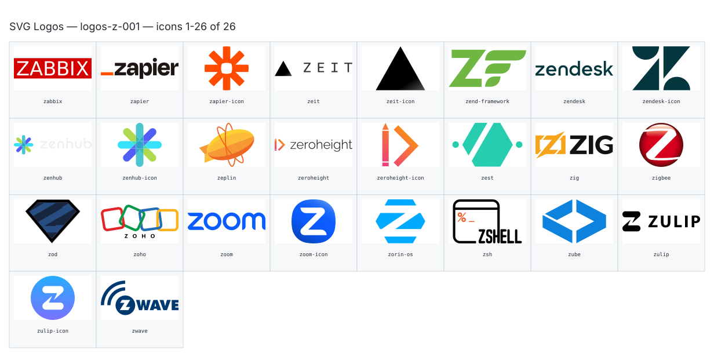

**Generated file — do not edit. Run `python scripts/portfolio.py icons generate`.**

# SVG Logos — `z`

[SVG Logos hub](../logos.md). 26 icons in group `z` across 1 sheet. Display names are approximate; copy the slug for Mermaid.

## logos-z-001

- `logos:zabbix` — Zabbix — [logos-z-001.svg](../sheets/logos-z-001.svg) r0c0 — `service example(logos:zabbix)[Zabbix]`
- `logos:zapier` — Zapier — [logos-z-001.svg](../sheets/logos-z-001.svg) r0c1 — `service example(logos:zapier)[Zapier]`
- `logos:zapier-icon` — Zapier Icon — [logos-z-001.svg](../sheets/logos-z-001.svg) r0c2 — `service example(logos:zapier-icon)[Zapier Icon]`
- `logos:zeit` — Zeit — [logos-z-001.svg](../sheets/logos-z-001.svg) r0c3 — `service example(logos:zeit)[Zeit]`
- `logos:zeit-icon` — Zeit Icon — [logos-z-001.svg](../sheets/logos-z-001.svg) r0c4 — `service example(logos:zeit-icon)[Zeit Icon]`
- `logos:zend-framework` — Zend Framework — [logos-z-001.svg](../sheets/logos-z-001.svg) r0c5 — `service example(logos:zend-framework)[Zend Framework]`
- `logos:zendesk` — Zendesk — [logos-z-001.svg](../sheets/logos-z-001.svg) r0c6 — `service example(logos:zendesk)[Zendesk]`
- `logos:zendesk-icon` — Zendesk Icon — [logos-z-001.svg](../sheets/logos-z-001.svg) r0c7 — `service example(logos:zendesk-icon)[Zendesk Icon]`
- `logos:zenhub` — Zenhub — [logos-z-001.svg](../sheets/logos-z-001.svg) r1c0 — `service example(logos:zenhub)[Zenhub]`
- `logos:zenhub-icon` — Zenhub Icon — [logos-z-001.svg](../sheets/logos-z-001.svg) r1c1 — `service example(logos:zenhub-icon)[Zenhub Icon]`
- `logos:zeplin` — Zeplin — [logos-z-001.svg](../sheets/logos-z-001.svg) r1c2 — `service example(logos:zeplin)[Zeplin]`
- `logos:zeroheight` — Zeroheight — [logos-z-001.svg](../sheets/logos-z-001.svg) r1c3 — `service example(logos:zeroheight)[Zeroheight]`
- `logos:zeroheight-icon` — Zeroheight Icon — [logos-z-001.svg](../sheets/logos-z-001.svg) r1c4 — `service example(logos:zeroheight-icon)[Zeroheight Icon]`
- `logos:zest` — Zest — [logos-z-001.svg](../sheets/logos-z-001.svg) r1c5 — `service example(logos:zest)[Zest]`
- `logos:zig` — Zig — [logos-z-001.svg](../sheets/logos-z-001.svg) r1c6 — `service example(logos:zig)[Zig]`
- `logos:zigbee` — Zigbee — [logos-z-001.svg](../sheets/logos-z-001.svg) r1c7 — `service example(logos:zigbee)[Zigbee]`
- `logos:zod` — Zod — [logos-z-001.svg](../sheets/logos-z-001.svg) r2c0 — `service example(logos:zod)[Zod]`
- `logos:zoho` — Zoho — [logos-z-001.svg](../sheets/logos-z-001.svg) r2c1 — `service example(logos:zoho)[Zoho]`
- `logos:zoom` — Zoom — [logos-z-001.svg](../sheets/logos-z-001.svg) r2c2 — `service example(logos:zoom)[Zoom]`
- `logos:zoom-icon` — Zoom Icon — [logos-z-001.svg](../sheets/logos-z-001.svg) r2c3 — `service example(logos:zoom-icon)[Zoom Icon]`
- `logos:zorin-os` — Zorin Os — [logos-z-001.svg](../sheets/logos-z-001.svg) r2c4 — `service example(logos:zorin-os)[Zorin Os]`
- `logos:zsh` — Zsh — [logos-z-001.svg](../sheets/logos-z-001.svg) r2c5 — `service example(logos:zsh)[Zsh]`
- `logos:zube` — Zube — [logos-z-001.svg](../sheets/logos-z-001.svg) r2c6 — `service example(logos:zube)[Zube]`
- `logos:zulip` — Zulip — [logos-z-001.svg](../sheets/logos-z-001.svg) r2c7 — `service example(logos:zulip)[Zulip]`
- `logos:zulip-icon` — Zulip Icon — [logos-z-001.svg](../sheets/logos-z-001.svg) r3c0 — `service example(logos:zulip-icon)[Zulip Icon]`
- `logos:zwave` — Zwave — [logos-z-001.svg](../sheets/logos-z-001.svg) r3c1 — `service example(logos:zwave)[Zwave]`
